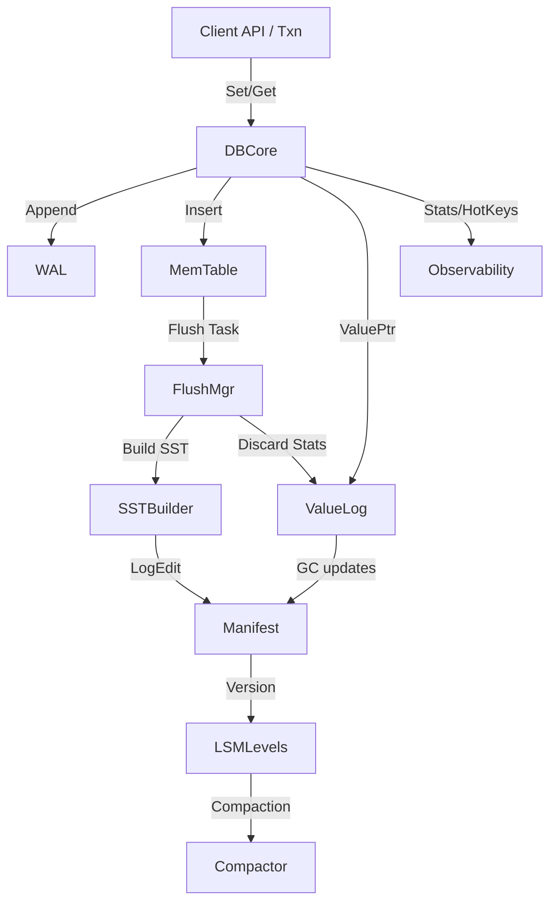

# 🚀 NoKV – High-Performance Distributed KV Engine

<div align="center">
  
  <p>
    <a href="https://github.com/feichai0017/NoKV/actions">
      
    </a>
    
    
  </p>
  <p><strong>LSM Tree • ValueLog • MVCC • Multi-Raft Regions</strong></p>
</div>

NoKV is a Go-native distributed storage engine that blends the manifest discipline of RocksDB with the value-log design popularised by Badger. The result is an embeddable KV store featuring MVCC transactions, multi-Raft region management, structured observability, and ready-to-use CLI tooling.

---

## 🌐 Table of Contents

- [Highlights](#-highlights)
- [Quick Start](#-quick-start)
- [Architecture Overview](#-architecture-overview)
- [Module Breakdown](#-module-breakdown)
- [Example Flow](#-example-flow)
- [Observability & CLI](#-observability--cli)
- [Comparison: RocksDB vs Badger vs NoKV](#-comparison-rocksdb-vs-badger-vs-nokv)
- [Testing & Benchmarks](#-testing--benchmarks)
- [Documentation](#-documentation)
- [License](#-license)

---

## ✨ Highlights

- 🔁 **Hybrid LSM + ValueLog** – WAL + MemTable durability like RocksDB, large values separated into vlog segments like Badger.
- ⚡ **MVCC transactions** – snapshot isolation with conflict detection via `oracle`, iterator snapshots, and managed/unmanaged modes.
- 🧠 **Multi-Raft regions** – `raftstore` manages Region lifecycle, shared WAL storage, hooks, and metrics; CLI/Stats make Region state observable by default.
- 🔥 **Hot-key analytics** – `hotring` surfaces frequently accessed keys, powering prefetchers and CLI visibility.
- ♻️ **Robust recovery** – manifest + WAL checkpoints + vlog GC metadata guarantee restart determinism.
- 🛠️ **First-class tooling** – `nokv` CLI and `expvar` snapshots expose internals without extra dependencies.

---

## 🚀 Quick Start

1. **Install & smoke-test**

   ```bash
   go get github.com/feichai0017/NoKV

   ```

2. **Embedded usage example (simple Set/Get)**

   ```go
   package main

   import (
   	"fmt"
   	"log"

   	NoKV "github.com/feichai0017/NoKV"
   	"github.com/feichai0017/NoKV/utils"
   )

   func main() {
   	opt := NoKV.NewDefaultOptions()
   	opt.WorkDir = "./workdir-demo"

   	db := NoKV.Open(opt)
   	defer func() { _ = db.Close() }()

   	key := []byte("hello")
   	val := []byte("world")

   	if err := db.SetCF(utils.CFDefault, key, val); err != nil {
   		log.Fatalf("set failed: %v", err)
   	}

   	entry, err := db.Get(key)
   	if err != nil {
   		log.Fatalf("get failed: %v", err)
   	}
   	fmt.Printf("value=%s\n", entry.Value)
   	entry.DecrRef()
   }
   ```

   Save the snippet as `main.go` (or any Go module entry point) and run:

   ```bash
   go run main.go
   ```

3. **Inspect with the CLI**

   ```bash
   go run ./cmd/nokv stats --workdir ./workdir-demo
   go run ./cmd/nokv manifest --workdir ./workdir-demo
   ```

   `nokv stats` renders flush/WAL/backlog metrics so you can confirm compaction, watchdog, and GC health at a glance.

---

## 🧱 Architecture Overview



Key ideas:
- **Durability path** – WAL first, memtable second. ValueLog writes occur before WAL append so crash replay can fully rebuild state.
- **Metadata** – manifest stores SST topology, WAL checkpoints, and vlog head/deletion metadata.
- **Background workers** – flush manager handles `Prepare → Build → Install → Release`, compaction reduces level overlap, and value log GC rewrites segments based on discard stats.
- **Transactions** – MVCC timestamps ensure consistent reads; commit reuses the same write pipeline as standalone writes.

Dive deeper in [docs/architecture.md](docs/architecture.md).

---

## 🧩 Module Breakdown

| Module | Responsibilities | Source | Docs |
| --- | --- | --- | --- |
| WAL | Append-only segments with CRC, rotation, replay (`wal.Manager`). | [`wal/`](./wal) | [WAL internals](docs/wal.md) |
| LSM | MemTable, flush pipeline, leveled compactions, iterator merging. | [`lsm/`](./lsm) | [Memtable](docs/memtable.md)<br>[Flush pipeline](docs/flush.md)<br>[Cache](docs/cache.md) |
| Manifest | VersionEdit log + CURRENT handling, WAL/vlog checkpoints, Region metadata. | [`manifest/`](./manifest) | [Manifest semantics](docs/manifest.md) |
| ValueLog | Large value storage, GC, discard stats integration. | [`vlog.go`](./vlog.go), [`vlog/`](./vlog) | [Value log design](docs/vlog.md) |
| Transactions | MVCC `oracle`, managed/unmanaged transactions, iterator snapshots. | [`txn.go`](./txn.go) | [Transactions & MVCC](docs/txn.md) |
| RaftStore | Multi-Raft Region management, hooks, metrics, transport. | [`raftstore/`](./raftstore) | [RaftStore overview](docs/raftstore.md) |
| HotRing | Hot key tracking, throttling helpers. | [`hotring/`](./hotring) | [HotRing overview](docs/hotring.md) |
| Observability | Periodic stats, hot key tracking, CLI integration. | [`stats.go`](./stats.go), [`cmd/nokv`](./cmd/nokv) | [Stats & observability](docs/stats.md)<br>[CLI reference](docs/cli.md) |
| Filesystem | mmap-backed file helpers shared by WAL/SST/vlog. | [`file/`](./file) | [File abstractions](docs/file.md) |

Each module has a dedicated document under `docs/` describing APIs, diagrams, and recovery notes.

---

## 🔄 Example Flow

### Batched Write + Flush
1. `DB.doWrites` batches incoming sets (default 64 entries or 1 MiB).
2. Large values go into ValueLog via `processValueLogBatches`, returning `ValuePtr` metadata.
3. `wal.Manager.Append` persists the batch; offsets embed value pointers for replay.
4. MemTable applies the batch. Once full, it freezes and enters the flush queue.
5. `flush.Manager` builds an SST, logs `EditAddFile` + `EditLogPointer`, and releases WAL segments.
6. Discard stats push into ValueLog GC so stale vlog entries can be reclaimed.

### Crash Mid-Flush
- On restart, manifest replay ensures only fully installed SSTs remain referenced.
- WAL replay rebuilds the memtable for any incomplete flush.
- ValueLog recovery trims partial records and resumes at the recorded head pointer.

More scenarios (including transaction recovery) are covered in [docs/architecture.md](docs/architecture.md#9-example-scenarios) and [docs/recovery.md](docs/recovery.md).

---

## 📡 Observability & CLI

- `Stats.StartStats` publishes metrics via `expvar` (flush backlog, WAL segments, vlog GC stats, txn counters).
- `cmd/nokv` offers:
- `nokv stats --workdir <dir> [--json] [--no-region-metrics]`
- `nokv manifest --workdir <dir>`
- `nokv vlog --workdir <dir>`
- `nokv regions --workdir <dir> [--json]`
- Hot keys tracked by `hotring` appear in both expvar and CLI output, enabling cache warmup strategies.

Details in [docs/cli.md](docs/cli.md) and [docs/testing.md](docs/testing.md#4-observability-in-tests).

---

## ⚖️ Comparison: RocksDB vs Badger vs NoKV

| Aspect | RocksDB | BadgerDB | NoKV |
| --- | --- | --- | --- |
| Language | C++ | Go | Go (no CGO dependencies) |
| Durability path | WAL → MemTable → SST | ValueLog doubles as WAL | WAL → MemTable + ValueLog (hybrid) |
| Manifest | VersionEdit + CURRENT | Minimal (tables only) | VersionEdit + vlog metadata + WAL checkpoints |
| Transactions | WriteBatch / optional txn library | Managed optimistic transactions | Built-in MVCC with oracle & iterators |
| Value separation | Optional blob DB | Core design | Core design with manifest-backed head |
| Observability | PerfContext, `ldb` | Prometheus metrics | expvar + `nokv` CLI + recovery traces |
| Region management | External tooling | Single-node only | Built-in multi-Raft catalog + metrics + `nokv regions` |
| Hot key analytics | External | Limited | Built-in hotring with prefetch hook |

NoKV takes the structure of RocksDB, the value-log efficiency of Badger, and adds MVCC/observability tailored for Go services.

---

## 📚 Documentation

| Topic | Document |
| --- | --- |
| Architecture deep dive | [docs/architecture.md](docs/architecture.md) |
| WAL internals | [docs/wal.md](docs/wal.md) |
| Flush pipeline | [docs/flush.md](docs/flush.md) |
| Memtable lifecycle | [docs/memtable.md](docs/memtable.md) |
| Transactions & MVCC | [docs/txn.md](docs/txn.md) |
| Manifest semantics | [docs/manifest.md](docs/manifest.md) |
| ValueLog manager | [docs/vlog.md](docs/vlog.md) |
| Cache & bloom filters | [docs/cache.md](docs/cache.md) |
| Hot key analytics | [docs/hotring.md](docs/hotring.md) |
| Stats & observability | [docs/stats.md](docs/stats.md) |
| File abstractions | [docs/file.md](docs/file.md) |
| Crash recovery playbook | [docs/recovery.md](docs/recovery.md) |
| Testing matrix | [docs/testing.md](docs/testing.md) |
| CLI reference | [docs/cli.md](docs/cli.md) |
| RaftStore overview | [docs/raftstore.md](docs/raftstore.md) |

---

## 📄 License

Apache-2.0. See [LICENSE](LICENSE).
