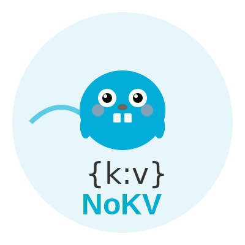

# NoKV

<div align="center">
  
</div>


A high-performance embedded key-value storage engine based on LSM Tree with MVCC transaction support.

## 目录 / Table of Contents
- [Overview](#overview)
- [Quick Start](#quick-start)
- [Architecture](#architecture)
  - [Data Path](#data-path)
  - [Transactions](#transactions)
  - [Compaction & Storage](#compaction--storage)
- [Reliability & Recovery](#reliability--recovery)
- [Tooling](#tooling)
- [Benchmarking](#benchmarking)
- [Development](#development)
- [Documentation](#documentation)
- [License](#license)

## Overview

NoKV 是一款基于 LSM-Tree 的嵌入式 KV 引擎，提供：
- **高吞吐写入路径**：WAL 追加 + MemTable 缓冲 + 分层 SST 持久化。
- **Whiskey 风格 ValueLog**：大 Value 单独落盘，降低写放大。
- **MVCC 事务**：乐观并发控制、快照级读视图和冲突检测。
- **可观测性与恢复**：Manifest/WAL/ValueLog 三管齐下，支持细粒度恢复脚本。

目标是向 RocksDB / Badger 的工业化质量靠拢，同时保持 Go 项目的易用性。

## Quick Start

```bash
go get github.com/feichai0017/NoKV

go test ./...                   # 运行单元测试
./scripts/recovery_scenarios.sh # 一键验证崩溃恢复矩阵
```

默认脚本会把 `go test` 指标缓存到 `artifacts/recovery/`，并启用 `RECOVERY_TRACE_METRICS=1`
输出结构化恢复日志，方便排查与归档。

## Architecture

系统结构详见 [docs/architecture.md](docs/architecture.md)，下列为核心模块概览。

### Data Path
- **Write-Ahead Log (WAL)**：顺序写磁盘，提供崩溃后重放能力。
- **MemTable**：基于 SkipList 的内存排序表，支持快照迭代。
- **SSTable**：多层级 LSM 文件，包含 Bloom Filter、Index 与数据块。
- **Manifest / CURRENT**：记录版本状态与 ValueLog 元信息，保障元数据一致性。

### Transactions
- **MVCC Engine**：基于时间戳的快照读 + 乐观写，冲突时回滚。
- **Snapshot Iterators**：事务可跨 MemTable、Immutable MemTable 与 SST 层遍历。
- **Conflict Detection**：轻量级冲突表，定位写写冲突与读写冲突。

### Compaction & Storage
- **Flush Pipeline**：后台异步将 MemTable 刷至 L0，并记录 VersionEdit。
- **Compaction Manager**：基于 backlog 的调度器，带写入限流与优先级。
- **ValueLog Manager**：管理大 Value 的段轮换、GC 与 head 指针持久化。
- **Hot Ring Cache**：常驻热点读缓存，减少跨层读取。

## Reliability & Recovery

恢复流程遵循 `CURRENT → Manifest → WAL/ValueLog` 的顺序，并在单测中覆盖以下场景：
- WAL 重放恢复未 flush 写入。
- ValueLog GC 遗留段清理。
- 缺失 `.sst` 的 Manifest 回滚。
- Manifest rewrite 崩溃时沿用旧 CURRENT。

运行 `./scripts/recovery_scenarios.sh` 可串行覆盖上述用例，测试默认启用
`RECOVERY_TRACE_METRICS`，输出如：

```
RECOVERY_METRIC wal_replay={"key":"wal-crash-key","recovered_len":15,...}
```

日志文件位于 `artifacts/recovery/<TestName>.log`，便于接入 CI 构建产物或自定义分析。
更多细节与扩展计划详见 [docs/recovery.md](docs/recovery.md)。

## Tooling

- `cmd/nokv`: 提供 `stats`、`manifest`、`vlog` 等调试命令。
- `scripts/recovery_scenarios.sh`: 恢复矩阵的一键执行脚本。
- `utils/cache`, `utils/mmap`: 基础设施组件，可单独复用。
- 指标导出：通过 `expvar` 暴露 `NoKV.*` 统计，配合后台任务/GC 状态监控。

## Benchmarking

- 运行 `GOCACHE=$(pwd)/.gocache go test ./benchmark -run TestBenchmarkResults -count=1`
  可生成 NoKV vs Badger 的写入、读取、批量写与范围扫描对比，并把概要表格输出到终端。
- 明细会写入 `benchmark_results/benchmark_results_<timestamp>.txt`，包含各项延迟、吞吐与内存指标。
- 需要与 RocksDB 对比时，先安装 `librocksdb` 与 gorocksdb 绑定：
  1. `go env -w CGO_ENABLED=1`, `go get github.com/tecbot/gorocksdb`；
  2. 本地 RocksDB headers/libs 可通过包管理器或源码编译安装；
  3. 运行 `GOCACHE=$(pwd)/.gocache GOMODCACHE=$(pwd)/.gomodcache go test -tags benchmark_rocksdb ./benchmark -run TestBenchmarkResults -count=1`。
- 未启用 `benchmark_rocksdb` 标签时，RocksDB 基准会自动跳过。

## Development

- 语言版本：Go 1.23+
- 测试规范：提交前确保 `go test ./...` 通过，并在相关模块补充针对性单元测试。
- 性能基准：`benchmark/` 下提供基础压测，后续将结合恢复脚本扩展压力测试矩阵。
- 贡献流程：详见 [CONTRIBUTING.md](CONTRIBUTING.md)。

## Documentation

- [Architecture & Design Overview](docs/architecture.md)
- [Crash Recovery Verification Plan](docs/recovery.md)
- [MemTable Flush Pipeline](docs/flush.md)
- [Manifest & VersionEdit](docs/manifest.md)

## License

This project is licensed under the MIT License - see the [LICENSE](LICENSE) file for details.
