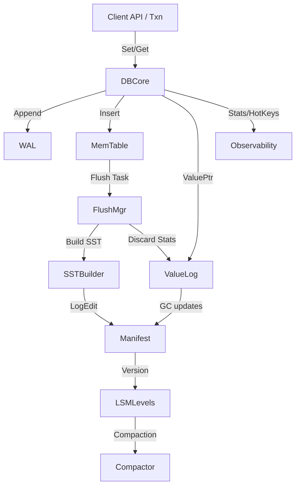

# 🚀 NoKV – High-Performance Distributed KV Engine

<div align="center">
  

  <p>
    <!-- Build / Quality -->
    <a href="https://github.com/feichai0017/NoKV/actions">
      
    </a>
    <a href="https://codecov.io/gh/feichai0017/NoKV">
      
    </a>
    <a href="https://goreportcard.com/report/github.com/feichai0017/NoKV">
      
    </a>
    <a href="https://pkg.go.dev/github.com/feichai0017/NoKV">
      
    </a>
    <a href="https://github.com/avelino/awesome-go#databases-implemented-in-go">
      
    </a>
  </p>

  <p>
    <!-- Meta -->
    
    
    <a href="https://deepwiki.com/feichai0017/NoKV">
      
    </a>
  </p>

  <p><strong>LSM Tree • ValueLog • MVCC • Multi-Raft Regions • Redis-Compatible</strong></p>
</div>


NoKV is a Go-native storage engine that mixes RocksDB-style manifest discipline with Badger-inspired value separation. You can embed it locally, drive it via multi-Raft regions, or front it with a Redis protocol gateway—all from a single topology file.

---

## ✨ Feature Highlights

- 🚀 **Dual runtime modes** – call `NoKV.Open` inside your process or launch `nokv serve` for a distributed deployment, no code changes required.
- 🔁 **Hybrid LSM + ValueLog** – WAL → MemTable → SST pipeline for latency, with a ValueLog to keep large payloads off the hot path.
- ⚡ **MVCC-native transactions** – snapshot isolation, conflict detection, TTL, and iterators built into the core (no external locks).
- 🧠 **Multi-Raft regions** – `raftstore` manages per-region raft groups, WAL/manifest pointers, and tick-driven leader elections.
- 🛰️ **Redis gateway** – `cmd/nokv-redis` exposes RESP commands (SET/GET/MGET/NX/XX/TTL/INCR...) on top of raft-backed storage.
- 🔍 **Observability first** – `nokv stats`, expvar endpoints, hot key tracking, RECOVERY/TRANSPORT metrics, and ready-to-use recovery scripts.
- 🧰 **Single-source config** – `raft_config.json` feeds local scripts, Docker Compose, Redis gateway, and CI so there’s zero drift.

---

## 🚦 Quick Start

Start an end-to-end playground with either the local script or Docker Compose. Both spin up a three-node Raft cluster (plus the optional TSO) and expose the Redis-compatible gateway.

```bash
# Option A: local processes
./scripts/run_local_cluster.sh --config ./raft_config.example.json
# In another shell: launch the Redis gateway on top of the running cluster
go run ./cmd/nokv-redis --addr 127.0.0.1:6380 --raft-config raft_config.example.json

# Option B: Docker Compose (cluster + gateway + TSO)
docker compose up --build
# Tear down
docker compose down -v
```

Once the cluster is running you can point any Redis client at `127.0.0.1:6380` (or the address exposed by Compose).

For quick CLI checks:

```bash
# Inspect stats from an existing workdir
go run ./cmd/nokv stats --workdir ./artifacts/cluster/store-1
```

Minimal embedded snippet:

```go
package main

import (
	"fmt"
	"log"

	NoKV "github.com/feichai0017/NoKV"
)

func main() {
	opt := NoKV.NewDefaultOptions()
	opt.WorkDir = "./workdir-demo"

	db := NoKV.Open(opt)
	defer db.Close()

	key := []byte("hello")
	if err := db.Set(key, []byte("world")); err != nil {
		log.Fatalf("set failed: %v", err)
	}

	entry, err := db.Get(key)
	if err != nil {
		log.Fatalf("get failed: %v", err)
	}
	fmt.Printf("value=%s\n", entry.Value)
	entry.DecrRef()
}
```

> ℹ️ `run_local_cluster.sh` rebuilds `nokv`, `nokv-config`, `nokv-tso`, seeds manifests via `nokv-config manifest`, and parks logs under `artifacts/cluster/store-<id>/server.log`. Use `Ctrl+C` to exit cleanly; if the process crashes, wipe the workdir (`rm -rf ./artifacts/cluster`) before restarting to avoid WAL replay errors.

---

## 🧭 Topology & Configuration

Everything hangs off a single file: [`raft_config.example.json`](./raft_config.example.json).

```jsonc
"stores": [
  { "store_id": 1, "listen_addr": "127.0.0.1:20170", ... },
  { "store_id": 2, "listen_addr": "127.0.0.1:20171", ... },
  { "store_id": 3, "listen_addr": "127.0.0.1:20172", ... }
],
"regions": [
  { "id": 1, "range": [-inf,"m"), peers: 101/201/301, leader: store 1 },
  { "id": 2, "range": ["m",+inf), peers: 102/202/302, leader: store 2 }
]
```

- **Local scripts** (`run_local_cluster.sh`, `serve_from_config.sh`, `bootstrap_from_config.sh`) ingest the same JSON, so local runs match production layouts.
- **Docker Compose** mounts the file into each container; manifests, transports, and Redis gateway all stay in sync.
- Need more stores or regions? Update the JSON and re-run the script/Compose—no code changes required.
- Programmatic access: import `github.com/feichai0017/NoKV/config` and call `config.LoadFile` / `Validate` for a single source of truth across tools.

### 🧬 Tech Stack Snapshot

| Layer | Tech/Package | Why it matters |
| --- | --- | --- |
| Storage Core | `lsm/`, `wal/`, `vlog/` | Hybrid log-structured design with manifest-backed durability and value separation. |
| Concurrency | `mvcc/`, `txn.go`, `oracle` | Timestamp oracle + lock manager for MVCC transactions and TTL-aware reads. |
| Replication | `raftstore/*` | Multi-Raft orchestration (regions, peers, router, schedulers, gRPC transport). |
| Tooling | `cmd/nokv`, `cmd/nokv-config`, `cmd/nokv-redis` | CLI, config helper, Redis-compatible gateway share the same topology file. |
| Observability | `stats`, `hotring`, expvar | Built-in metrics, hot-key analytics, and crash recovery traces. |

---

## 🧱 Architecture Overview



Key ideas:
- **Durability path** – WAL first, memtable second. ValueLog writes occur before WAL append so crash replay can fully rebuild state.
- **Metadata** – manifest stores SST topology, WAL checkpoints, and vlog head/deletion metadata.
- **Background workers** – flush manager handles `Prepare → Build → Install → Release`, compaction reduces level overlap, and value log GC rewrites segments based on discard stats.
- **Transactions** – MVCC timestamps ensure consistent reads; commit reuses the same write pipeline as standalone writes.

Dive deeper in [docs/architecture.md](docs/architecture.md).

---

## 🧩 Module Breakdown

| Module | Responsibilities | Source | Docs |
| --- | --- | --- | --- |
| WAL | Append-only segments with CRC, rotation, replay (`wal.Manager`). | [`wal/`](./wal) | [WAL internals](docs/wal.md) |
| LSM | MemTable, flush pipeline, leveled compactions, iterator merging. | [`lsm/`](./lsm) | [Memtable](docs/memtable.md)<br>[Flush pipeline](docs/flush.md)<br>[Cache](docs/cache.md) |
| Manifest | VersionEdit log + CURRENT handling, WAL/vlog checkpoints, Region metadata. | [`manifest/`](./manifest) | [Manifest semantics](docs/manifest.md) |
| ValueLog | Large value storage, GC, discard stats integration. | [`vlog.go`](./vlog.go), [`vlog/`](./vlog) | [Value log design](docs/vlog.md) |
| Transactions | MVCC `oracle`, managed/unmanaged transactions, iterator snapshots. | [`txn.go`](./txn.go) | [Transactions & MVCC](docs/txn.md) |
| RaftStore | Multi-Raft Region management, hooks, metrics, transport. | [`raftstore/`](./raftstore) | [RaftStore overview](docs/raftstore.md) |
| HotRing | Hot key tracking, throttling helpers. | [`hotring/`](./hotring) | [HotRing overview](docs/hotring.md) |
| Observability | Periodic stats, hot key tracking, CLI integration. | [`stats.go`](./stats.go), [`cmd/nokv`](./cmd/nokv) | [Stats & observability](docs/stats.md)<br>[CLI reference](docs/cli.md) |
| Filesystem | mmap-backed file helpers shared by SST/vlog. | [`file/`](./file) | [File abstractions](docs/file.md) |

Each module has a dedicated document under `docs/` describing APIs, diagrams, and recovery notes.

---


## 📡 Observability & CLI

- `Stats.StartStats` publishes metrics via `expvar` (flush backlog, WAL segments, value log GC stats, txn counters).
- `cmd/nokv` gives you:
  - `nokv stats --workdir <dir> [--json] [--no-region-metrics]`
  - `nokv manifest --workdir <dir>`
  - `nokv regions --workdir <dir> [--json]`
  - `nokv vlog --workdir <dir>`
- `hotring` continuously surfaces hot keys in stats + CLI so you can pre-warm caches or debug skewed workloads.

More in [docs/cli.md](docs/cli.md) and [docs/testing.md](docs/testing.md#4-observability-in-tests).

---

## 🔌 Redis Gateway

- `cmd/nokv-redis` exposes a RESP-compatible endpoint. In embedded mode (`--workdir`) every command runs inside local MVCC transactions; in distributed mode (`--raft-config`) calls are routed through `raftstore/client` and committed with TwoPhaseCommit so NX/XX, TTL, arithmetic and multi-key writes match the single-node semantics.
- TTL metadata is stored under `!redis:ttl!<key>` and is automatically cleaned up when reads detect expiration.
- `--metrics-addr` publishes `NoKV.Redis` statistics via expvar and `--tso-url` can point to an external TSO service (otherwise a local oracle is used).
- A ready-to-use cluster configuration is available at `raft_config.example.json`, matching both `scripts/run_local_cluster.sh` and the Docker Compose setup.

> For the complete command matrix, configuration and deployment guides, see [docs/nokv-redis.md](docs/nokv-redis.md).

---

## 📄 License

Apache-2.0. See [LICENSE](LICENSE).
