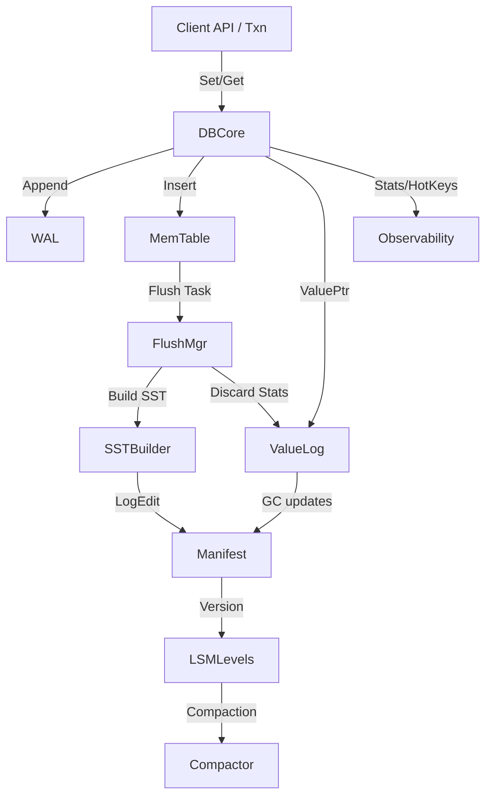

# 🚀 NoKV – High-Performance Distributed KV Engine

<div align="center">
  
  <p>
    <a href="https://github.com/feichai0017/NoKV/actions">
      
    </a>
    <a href="https://pkg.go.dev/github.com/feichai0017/NoKV">
      
    </a>
    
    
  </p>
  <p><strong>LSM Tree • ValueLog • MVCC • Multi-Raft Regions</strong></p>
</div>

NoKV is a Go-native distributed storage engine that blends the manifest discipline of RocksDB with the value-log design popularised by Badger. The result is an embeddable KV store featuring MVCC transactions, multi-Raft region management, structured observability, and ready-to-use CLI tooling.

---

## 🌐 Table of Contents

- [Highlights](#-highlights)
- [Quick Start](#-quick-start)
- [Topology & Configuration](#-topology--configuration)
- [Architecture Overview](#-architecture-overview)
- [Module Breakdown](#-module-breakdown)
- [Example Flow](#-example-flow)
- [Observability & CLI](#-observability--cli)
- [Redis Gateway](#-redis-gateway)
- [Comparison: RocksDB vs Badger vs NoKV](#-comparison-rocksdb-vs-badger-vs-nokv)
- [Testing & Benchmarks](#-testing--benchmarks)
- [Documentation](#-documentation)
- [License](#-license)

---

## ✨ Highlights at a Glance

| Theme | What it unlocks |
| --- | --- |
| 🔁 **Hybrid LSM + ValueLog** | WAL → MemTable → SST pipeline keeps latency low while ValueLog stores hefty payloads; think RocksDB discipline with Badger’s separation trick. |
| ⚡ **MVCC-native transactions** | Snapshot isolation, conflict detection, iterator snapshots, TTL semantics—no bolt-on layer, it’s all baked in. |
| 🧠 **Multi-Raft Regions** | `raftstore` spins a Raft group per Region, reuses shared WAL/vlog, and exposes hooks/metrics for schedulers and tooling. |
| 🛰️ **Dual-mode runtime** | Embed NoKV via `NoKV.Open` or toggle to the distributed service (`nokv serve` / gRPC) without changing data structures. |
| 🔍 **Observability-first** | `nokv stats`, expvar/pprof, manifest tooling, and hotring heatmaps keep the internals transparent. |
| 🧰 **Single source of truth** | `raft_config.json` feeds local scripts, Docker Compose, Redis gateway, and CI—no config drift, ever. |

---

## 🚀 Quick Start

| Scenario | Command | Notes |
| --- | --- | --- |
| Embedded Set/Get | <pre>go run main.go</pre> | See minimal example below—great for embedding or unit tests. |
| Inspect internals | <pre>go run ./cmd/nokv stats --workdir ./workdir-demo</pre> | Surfaces compaction queues, WAL checkpoints, hot keys. |
| Run 3-store/2-region cluster | <pre>./scripts/run_local_cluster.sh --config ./raft_config.example.json</pre> | Starts three `nokv serve` processes (plus TSO). Existing store directories are detected and reused (skip manifest reseeding). Always stop with `Ctrl+C`; if the process crashes, wipe `./artifacts/cluster` and restart. |
| Docker Compose | <pre>docker compose up --build</pre> | Builds the image, bootstraps manifests, launches stores + TSO + Redis gateway. |
| Redis API | <pre>go run ./cmd/nokv-redis --addr 127.0.0.1:6380 --raft-config raft_config.example.json</pre> | Auto-discovers TSO/regions from the JSON; add `--addr-scope docker` when running inside containers. |

Minimal embedded snippet:

```go
package main

import (
	"fmt"
	"log"

	NoKV "github.com/feichai0017/NoKV"
	"github.com/feichai0017/NoKV/utils"
)

func main() {
	opt := NoKV.NewDefaultOptions()
	opt.WorkDir = "./workdir-demo"

	db := NoKV.Open(opt)
	defer db.Close()

	key := []byte("hello")
	if err := db.SetCF(utils.CFDefault, key, []byte("world")); err != nil {
		log.Fatalf("set failed: %v", err)
	}

	entry, err := db.Get(key)
	if err != nil {
		log.Fatalf("get failed: %v", err)
	}
	fmt.Printf("value=%s\n", entry.Value)
	entry.DecrRef()
}
```

> ℹ️ `run_local_cluster.sh` rebuilds `nokv`, `nokv-config`, `nokv-tso`, seeds manifests via `nokv-config manifest`, and parks logs under `artifacts/cluster/store-<id>/server.log`. Use `Ctrl+C` to exit cleanly; if the process crashes, wipe the workdir (`rm -rf ./artifacts/cluster`) before restarting to avoid WAL replay errors.

---

## 🧭 Topology & Configuration

Everything hangs off a single file: [`raft_config.example.json`](./raft_config.example.json).

```jsonc
"stores": [
  { "store_id": 1, "listen_addr": "127.0.0.1:20170", ... },
  { "store_id": 2, "listen_addr": "127.0.0.1:20171", ... },
  { "store_id": 3, "listen_addr": "127.0.0.1:20172", ... }
],
"regions": [
  { "id": 1, "range": [-inf,"m"), peers: 101/201/301, leader: store 1 },
  { "id": 2, "range": ["m",+inf), peers: 102/202/302, leader: store 2 }
]
```

- **Local scripts** (`run_local_cluster.sh`, `serve_from_config.sh`, `bootstrap_from_config.sh`) ingest the same JSON, so local runs match production layouts.
- **Docker Compose** mounts the file into each container; manifests, transports, and Redis gateway all stay in sync.
- Need more stores or regions? Update the JSON and re-run the script/Compose—no code changes required.

### 🧬 Tech Stack Snapshot

| Layer | Tech/Package | Why it matters |
| --- | --- | --- |
| Storage Core | `lsm/`, `wal/`, `vlog/` | Hybrid log-structured design with manifest-backed durability and value separation. |
| Concurrency | `mvcc/`, `txn.go`, `oracle` | Timestamp oracle + lock manager for MVCC transactions and TTL-aware reads. |
| Replication | `raftstore/*` | Multi-Raft orchestration (regions, peers, router, schedulers, gRPC transport). |
| Tooling | `cmd/nokv`, `cmd/nokv-config`, `cmd/nokv-redis` | CLI, config helper, Redis-compatible gateway share the same topology file. |
| Observability | `stats`, `hotring`, expvar | Built-in metrics, hot-key analytics, and crash recovery traces. |

---

## 🧱 Architecture Overview



Key ideas:
- **Durability path** – WAL first, memtable second. ValueLog writes occur before WAL append so crash replay can fully rebuild state.
- **Metadata** – manifest stores SST topology, WAL checkpoints, and vlog head/deletion metadata.
- **Background workers** – flush manager handles `Prepare → Build → Install → Release`, compaction reduces level overlap, and value log GC rewrites segments based on discard stats.
- **Transactions** – MVCC timestamps ensure consistent reads; commit reuses the same write pipeline as standalone writes.

Dive deeper in [docs/architecture.md](docs/architecture.md).

---

## 🧩 Module Breakdown

| Module | Responsibilities | Source | Docs |
| --- | --- | --- | --- |
| WAL | Append-only segments with CRC, rotation, replay (`wal.Manager`). | [`wal/`](./wal) | [WAL internals](docs/wal.md) |
| LSM | MemTable, flush pipeline, leveled compactions, iterator merging. | [`lsm/`](./lsm) | [Memtable](docs/memtable.md)<br>[Flush pipeline](docs/flush.md)<br>[Cache](docs/cache.md) |
| Manifest | VersionEdit log + CURRENT handling, WAL/vlog checkpoints, Region metadata. | [`manifest/`](./manifest) | [Manifest semantics](docs/manifest.md) |
| ValueLog | Large value storage, GC, discard stats integration. | [`vlog.go`](./vlog.go), [`vlog/`](./vlog) | [Value log design](docs/vlog.md) |
| Transactions | MVCC `oracle`, managed/unmanaged transactions, iterator snapshots. | [`txn.go`](./txn.go) | [Transactions & MVCC](docs/txn.md) |
| RaftStore | Multi-Raft Region management, hooks, metrics, transport. | [`raftstore/`](./raftstore) | [RaftStore overview](docs/raftstore.md) |
| HotRing | Hot key tracking, throttling helpers. | [`hotring/`](./hotring) | [HotRing overview](docs/hotring.md) |
| Observability | Periodic stats, hot key tracking, CLI integration. | [`stats.go`](./stats.go), [`cmd/nokv`](./cmd/nokv) | [Stats & observability](docs/stats.md)<br>[CLI reference](docs/cli.md) |
| Filesystem | mmap-backed file helpers shared by WAL/SST/vlog. | [`file/`](./file) | [File abstractions](docs/file.md) |

Each module has a dedicated document under `docs/` describing APIs, diagrams, and recovery notes.

---

## 🔄 Example Flow

### Batched Write + Flush
1. `DB.doWrites` batches incoming sets (default 64 entries or 1 MiB).
2. Large values go into ValueLog via `processValueLogBatches`, returning `ValuePtr` metadata.
3. `wal.Manager.Append` persists the batch; offsets embed value pointers for replay.
4. MemTable applies the batch. Once full, it freezes and enters the flush queue.
5. `flush.Manager` builds an SST, logs `EditAddFile` + `EditLogPointer`, and releases WAL segments.
6. Discard stats push into ValueLog GC so stale vlog entries can be reclaimed.

### Crash Mid-Flush
- On restart, manifest replay ensures only fully installed SSTs remain referenced.
- WAL replay rebuilds the memtable for any incomplete flush.
- ValueLog recovery trims partial records and resumes at the recorded head pointer.

### 2PC Across Regions (Distributed)
1. The client initializes the Region cache with `raftstore/client` (example: Region① `[a,m)`, Region② `[m,+∞)`).
2. Call `Client.Mutate(ctx, primary="alfa", mutations, startTS, commitTS, lockTTL)`:
   - Run `KvPrewrite` → `KvCommit` on the primary Region first.
   - Other Regions prewrite in parallel, then commit sequentially; on a NotLeader error the client refreshes the leader and retries automatically.
3. Reads use `Client.Get/Scan`; if a Region has moved leaders, TinyKV returns `RegionError.NotLeader`, prompting the client to update the cache and retry.
4. A complete example lives in `raftstore/server/server_client_integration_test.go`, where real nodes plus the gRPC transport perform the Put → Get/Scan → Delete loop.

### Client Snippet

Use the distributed client against the local cluster (default ports `20170-20172`). Fetch timestamps from the TSO (`http://127.0.0.1:9494/tso`) or increment them yourself when experimenting:

```go
cli, err := client.New(client.Config{
    Stores: []client.StoreEndpoint{
        {StoreID: 1, Addr: "127.0.0.1:20170"},
        {StoreID: 2, Addr: "127.0.0.1:20171"},
        {StoreID: 3, Addr: "127.0.0.1:20172"},
    },
    Regions: []client.RegionConfig{
        {Meta: metaForRegion1, LeaderStoreID: 1}, // metaForRegion1 come from `nokv regions` output
    },
})
if err != nil {
    log.Fatal(err)
}
defer cli.Close()

startTS := fetchTSO("http://127.0.0.1:9494/tso")  // helper: HTTP GET /tso and return resp.Timestamp
commitTS := fetchTSO("http://127.0.0.1:9494/tso")

mutations := []*pb.Mutation{{
    Op:   pb.Mutation_Put,
    Key:  []byte("alpha"),
    Value: []byte("value"),
}}
if err := cli.Mutate(ctx, []byte("alpha"), mutations, startTS, commitTS, 3000); err != nil {
    log.Fatal(err)
}

resp, err := cli.Get(ctx, []byte("alpha"), commitTS)
```

See `raftstore/client/client_test.go` for a full setup that wires Region metadata and handles `NotLeader` responses.

More scenarios (including transaction recovery) are covered in [docs/architecture.md](docs/architecture.md#9-example-scenarios) and [docs/recovery.md](docs/recovery.md).

---

## 📡 Observability & CLI

- `Stats.StartStats` publishes metrics via `expvar` (flush backlog, WAL segments, value log GC stats, txn counters).
- `cmd/nokv` gives you:
  - `nokv stats --workdir <dir> [--json] [--no-region-metrics]`
  - `nokv manifest --workdir <dir>`
  - `nokv regions --workdir <dir> [--json]`
  - `nokv vlog --workdir <dir>`
- `hotring` continuously surfaces hot keys in stats + CLI so you can pre-warm caches or debug skewed workloads.

More in [docs/cli.md](docs/cli.md) and [docs/testing.md](docs/testing.md#4-observability-in-tests).

---

## 🔌 Redis Gateway

- `cmd/nokv-redis` exposes a RESP-compatible endpoint. In embedded mode (`--workdir`) every command runs inside local MVCC transactions; in distributed mode (`--raft-config`) calls are routed through `raftstore/client` and committed with TwoPhaseCommit so NX/XX, TTL, arithmetic and multi-key writes match the single-node semantics.
- TTL metadata is stored under `!redis:ttl!<key>` and is automatically cleaned up when reads detect expiration.
- `--metrics-addr` publishes `NoKV.Redis` statistics via expvar and `--tso-url` can point to an external TSO service (otherwise a local oracle is used).
- A ready-to-use cluster configuration is available at `cmd/nokv-redis/raft_config.example.json`, matching both `scripts/run_local_cluster.sh` and the Docker Compose setup.

> For the complete command matrix, configuration and deployment guides, see [docs/redis.md](docs/redis.md).

---

## ⚖️ Comparison: RocksDB vs Badger vs NoKV

| Aspect | RocksDB | BadgerDB | NoKV |
| --- | --- | --- | --- |
| Language | C++ | Go | Go (no CGO dependencies) |
| Durability path | WAL → MemTable → SST | ValueLog doubles as WAL | WAL → MemTable + ValueLog (hybrid) |
| Manifest | VersionEdit + CURRENT | Minimal (tables only) | VersionEdit + vlog metadata + WAL checkpoints |
| Transactions | WriteBatch / optional txn library | Managed optimistic transactions | Built-in MVCC with oracle & iterators |
| Value separation | Optional blob DB | Core design | Core design with manifest-backed head |
| Observability | PerfContext, `ldb` | Prometheus metrics | expvar + `nokv` CLI + recovery traces |
| Region management | External tooling | Single-node only | Built-in multi-Raft catalog + metrics + `nokv regions` |
| Hot key analytics | External | Limited | Built-in hotring with prefetch hook |

NoKV takes the structure of RocksDB, the value-log efficiency of Badger, and adds MVCC/observability tailored for Go services.

---

## 🧪 Testing & Benchmarks

- Unit/integration sweep: `GOCACHE=$PWD/.gocache GOMODCACHE=$PWD/.gomodcache go test ./...`
- Crash recovery matrix: `RECOVERY_TRACE_METRICS=1 ./scripts/recovery_scenarios.sh`
- Microbenchmarks: `go test ./benchmark -run TestBenchmarkResults -count=1`
- Compose smoke test: `docker compose up --build` (Redis gateway automatically targets the same config).

Results and guidance live in [docs/testing.md](docs/testing.md).

---

## 📚 Documentation

| Topic | Document |
| --- | --- |
| Architecture deep dive | [docs/architecture.md](docs/architecture.md) |
| WAL internals | [docs/wal.md](docs/wal.md) |
| Flush pipeline | [docs/flush.md](docs/flush.md) |
| Memtable lifecycle | [docs/memtable.md](docs/memtable.md) |
| Transactions & MVCC | [docs/txn.md](docs/txn.md) |
| Manifest semantics | [docs/manifest.md](docs/manifest.md) |
| ValueLog manager | [docs/vlog.md](docs/vlog.md) |
| Cache & bloom filters | [docs/cache.md](docs/cache.md) |
| Hot key analytics | [docs/hotring.md](docs/hotring.md) |
| Stats & observability | [docs/stats.md](docs/stats.md) |
| File abstractions | [docs/file.md](docs/file.md) |
| Crash recovery playbook | [docs/recovery.md](docs/recovery.md) |
| Testing matrix | [docs/testing.md](docs/testing.md) |
| CLI reference | [docs/cli.md](docs/cli.md) |
| RaftStore overview | [docs/raftstore.md](docs/raftstore.md) |
| Redis gateway | [docs/nokv-redis.md](docs/nokv-redis.md) |

---

## 📄 License

Apache-2.0. See [LICENSE](LICENSE).
