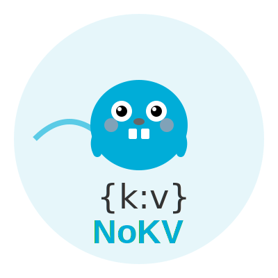
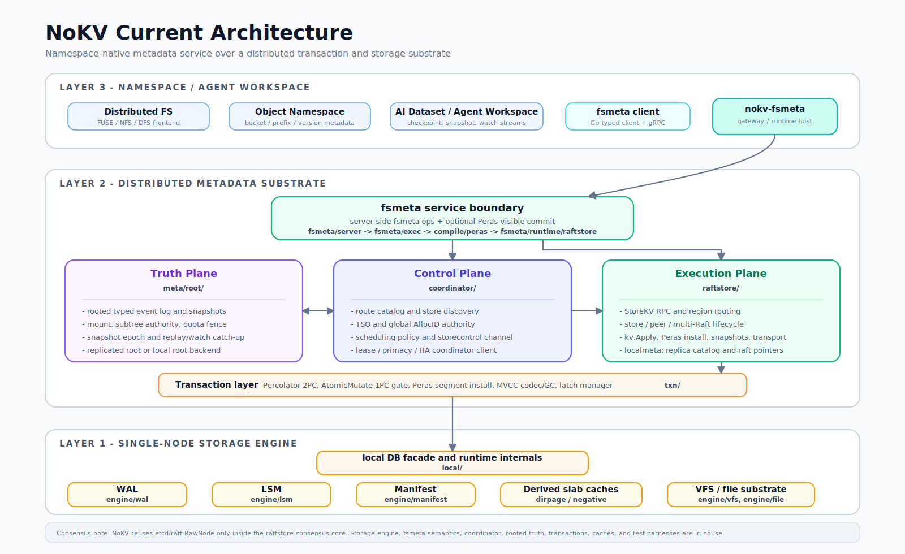
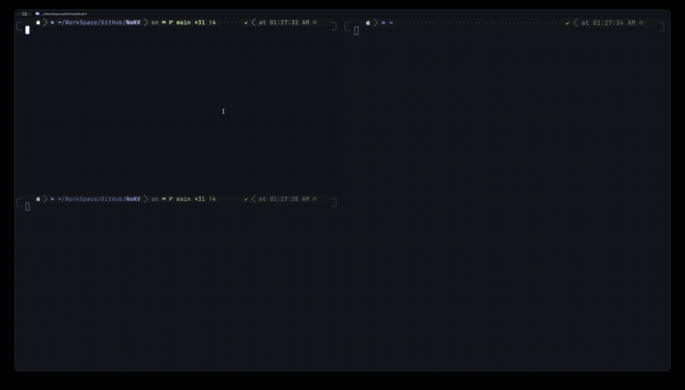

<div align="center">
  

  <p>
    <strong>An open-source namespace metadata substrate for distributed filesystems, object storage, and AI dataset metadata.</strong>
  </p>

  <p>
    <a href="https://github.com/feichai0017/NoKV/actions"></a>
    <a href="https://codecov.io/gh/feichai0017/NoKV"></a>
    <a href="https://goreportcard.com/report/github.com/feichai0017/NoKV"></a>
    <a href="https://pkg.go.dev/github.com/feichai0017/NoKV"></a>
    <a href="https://github.com/avelino/awesome-go#databases-implemented-in-go"></a>
    <a href="https://landscape.cncf.io/?group=projects-and-products&item=runtime--cloud-native-storage--nokv"></a>
  </p>

  <p>
    
    
    <a href="https://deepwiki.com/feichai0017/NoKV"></a>
  </p>

</div>

<br/>

## What is NoKV?

**NoKV is the metadata substrate that filesystems, object storage, and AI dataset layers shouldn't have to build themselves.**

Meta Tectonic uses ZippyDB. Google Colossus uses Spanner. DeepSeek 3FS uses FoundationDB. Each big-tech system extracted a **separate metadata layer** from its data layer — because grafting namespace semantics onto a generic KV is the part that breaks under scale.

NoKV is that layer, open-sourced and namespace-native: server-side `ReadDirPlus` / `WatchSubtree` / `SnapshotSubtree` / `RenameSubtree`, formally-verified authority handoff, sub-second prefix-scoped change feeds. **You bring the data plane** (FUSE driver, S3 frontend, dataset SDK); **NoKV owns namespace truth.**

> Where it sits: NoKV is the layer **above** generic KV (FoundationDB / TiKV / etcd) and **below** filesystem-shaped consumers (CephFS / JuiceFS / S3 gateways / AI training pipelines). Apache-2.0.

**Why namespace metadata is its own layer, not a feature you bolt onto generic KV:**

1. **Server-side namespace primitives.** `ReadDirPlus` returns one directory + N child stats in one round-trip; client-side stitching on a generic KV does 1+N round-trips with a **42×** end-to-end latency penalty (measured on the same NoKV cluster — see Headline Evidence). `WatchSubtree` ships a prefix-scoped change feed at **178 ms p50**, vs. client-side prefix scans on key-range watches.

2. **Namespace correctness is its own class.** Subtree authority handoff, mount lifecycle, snapshot epoch, and quota fence have a formal correctness model that generic KV doesn't speak. NoKV's **Eunomia** protocol is TLC-model-checked under finite bounds for handoff legality — a property no general-purpose KV provides because it isn't a general-purpose KV property.

3. **Bring your own data plane.** NoKV does **not** store object bytes, chunk data, or POSIX file content. You wire it under a FUSE driver, an S3 gateway, or a dataset SDK; NoKV is the namespace truth those frontends consume. This is the layer split Meta / Google / DeepSeek already chose internally — extracted, packaged, and Apache-2.0.

**Three audiences that all sit on the same substrate:**

- 🗂️ **Distributed filesystems** — DFS frontends (FUSE / NFS / SMB drivers, JuiceFS / CubeFS-style services) consume `fsmeta` for inode / dentry / mount / subtree authority instead of writing their own metadata layer on top of Redis / TiKV / FoundationDB
- 🪣 **Object storage namespace layers** — S3-compatible gateways consume the same `fsmeta` for bucket / prefix / version metadata, getting fast `LIST` (server-side `ReadDirPlus`) and prefix-scoped event streams without client-side stitching
- 🧪 **AI dataset metadata** — checkpoint storms (atomic multi-key `AssertionNotExist`), dataset versioning (`SnapshotSubtree`), prefix-scoped change feeds for training pipelines (`WatchSubtree`) — without retrofitting them onto a generic KV

> NoKV does for namespace metadata what etcd did for cluster state: a purpose-built coordination layer instead of forcing engineers to re-derive namespace semantics on every project.

<br/>

## 📊 Headline Evidence

### Underlying KV layer (YCSB single-node, NoKV vs Badger / Pebble)

Apple M3 Pro · `records=1M` · `ops=1M` · `value_size=1000` · `conc=16`

| Workload | Description | **NoKV** | Badger | Pebble |
|---|---|---:|---:|---:|
| **YCSB-A** | 50/50 read/update | **175,905** | 108,232 | 169,792 |
| **YCSB-B** | 95/5 read/update | **525,631** | 188,893 | 137,483 |
| **YCSB-C** | 100% read | **409,136** | 242,463 | 90,474 |
| **YCSB-D** | 95% read, 5% insert (latest) | **632,031** | 284,205 | 198,139 |
| **YCSB-E** | 95% scan, 5% insert | **45,620** | 15,027 | 40,793 |
| **YCSB-F** | read-modify-write | **157,732** | 84,601 | 122,192 |

> Units: ops/sec. Full latency in [`benchmark/README.md`](./benchmark/README.md). Single-node localhost, not multi-host production.

<br/>

## 🧭 Why NoKV vs X?

| If you need… | You should probably use… | Where NoKV fits |
|---|---|---|
| A **complete distributed filesystem** (FUSE-mountable, full POSIX) | **CephFS, JuiceFS** | NoKV is **not** an FS — but JuiceFS-style systems default to Redis / TiKV for their metadata backend, which breaks at scale. **NoKV can be JuiceFS's metadata backend.** |
| A **production object store** | **MinIO, Ceph RGW** | NoKV is **not** an object store — object body I/O isn't its job. NoKV provides the namespace layer above the object backend (bucket / prefix / version) |
| **A custom metadata service you're writing on top of FoundationDB / TiKV / etcd** | **NoKV** | **This is exactly what NoKV replaces.** `ReadDirPlus` / `WatchSubtree` / `SnapshotSubtree` are server-side primitives — you don't have to stitch them client-side. Apache-2.0. |
| A **production distributed KV** | **TiKV, FoundationDB, CockroachDB** | NoKV **does not compete** with them — they own the generic-KV market. NoKV is a metadata-native layer that can run **on top of** them (or, today, on its own engine) |
| Production distributed SQL | **CockroachDB, TiDB** | Different scope (relational, not namespace) |
| Just an embedded LSM | **Pebble, Badger** | NoKV's engine is not a drop-in library |
| A Raft library | **etcd/raft, dragonboat** | NoKV's raftstore (per-region runtime, transport, membership, snapshot install, apply observer) is built **on top of** `etcd/raft` `RawNode`. Owned: the integration. Reused: the consensus algorithm. |

NoKV's value comes from being **metadata-native, not generic-KV-with-metadata-glued-on**. The same architectural slice big-tech filesystems already extract internally — `ReadDirPlus`, prefix-scoped event streams, formally-verified authority handoff — packaged as a layer you can drop in instead of writing yourself.

<br/>

## 🏗️ Architecture

<p align="center">
  
</p>

<br/>

## 🗂️ `fsmeta` — Namespace Metadata Service

Native API surface (gRPC at `nokv-fsmeta:8090`, also embedded Go via `fsmeta/exec.OpenWithRaftstore`):

| Primitive | Semantics |
|---|---|
| `ReadDirPlus` | Fused directory scan + batch inode fetch under one snapshot, avoiding client-side N+1 metadata reads |
| `WatchSubtree` | Prefix-scoped live change feed with ready signal, cursor replay, and flow-control acks |
| `SnapshotSubtree` | MVCC read-version token for stable dataset / bucket / directory views |
| `RenameSubtree` | Cross-region atomic namespace move backed by Percolator 2PC |
| Basic namespace ops | `Create`, `Lookup`, `ReadDir`, `Link`, `Unlink`, quota usage, and mount lifecycle |

Authority lifecycle (rooted in `meta/root`, managed via `nokv mount` / `nokv quota` CLI):

| Domain | Rooted truth | Runtime view |
|---|---|---|
| **Mount** | `MountRegistered` / `MountRetired` (auto-declares era=0 SubtreeAuthority) | Mount admission cache |
| **Subtree authority** | `SubtreeAuthorityDeclared` / `SubtreeHandoffStarted` / `SubtreeHandoffCompleted` | RenameSubtree era frontier |
| **Snapshot epoch** | `SnapshotEpochPublished` / `SnapshotEpochRetired` | Read-version cache |
| **Quota fence** | `QuotaFenceUpdated` (mount + subtree level, bytes + inodes) | Usage in raftstore (transactional, not in-memory) |

Documentation: [`docs/fsmeta.md`](docs/fsmeta.md)

<br/>

## 🚦 Quick Start

### Run a full cluster

```bash
# Local processes — meta-root + coordinator + 3-store cluster + fsmeta gateway
./scripts/dev/cluster.sh --config ./raft_config.example.json

# Or: Docker Compose (cluster + fsmeta gateway, with mount-init bootstrap)
docker compose up -d

# Local Docker development build
docker compose up -d --build

# Return to the published image after a local build when available
make docker-up
```



### Use `fsmeta` from Go (embedded — same Executor as the gRPC server)

```go
package main

import (
    "context"

    "github.com/feichai0017/NoKV/fsmeta"
    fsmetaexec "github.com/feichai0017/NoKV/fsmeta/exec"
)

func main() {
    ctx := context.Background()
    rt, err := fsmetaexec.OpenWithRaftstore(ctx, fsmetaexec.Options{
        CoordinatorAddr: "127.0.0.1:2379",
    })
    if err != nil {
        panic(err)
    }
    defer rt.Close()

    // mount must be registered first (see `nokv mount register`)
    err = rt.Executor.Create(ctx, fsmeta.CreateRequest{
        Mount: "default", Parent: 1, Name: "hello.txt", Inode: 100,
    }, fsmeta.InodeRecord{Type: fsmeta.InodeTypeFile, LinkCount: 1, Size: 13})
    if err != nil {
        panic(err)
    }

    page, _ := rt.Executor.ReadDirPlus(ctx, fsmeta.ReadDirRequest{
        Mount: "default", Parent: 1, Limit: 100,
    })
    for _, e := range page {
        println(e.Dentry.Name, e.Inode.Size)
    }
}
```

### Use `fsmeta` from any language (gRPC)

```bash
# Bootstrap a mount (required before first write)
nokv mount register --coordinator-addr 127.0.0.1:2379 \
  --mount default --root-inode 1 --schema-version 1

# Set a quota fence (mount-level)
nokv quota set --coordinator-addr 127.0.0.1:2379 \
  --mount default --limit-bytes 1073741824 --limit-inodes 1000000

# Run the standalone fsmeta gRPC gateway with metrics
nokv-fsmeta --addr 127.0.0.1:8090 --coordinator-addr 127.0.0.1:2379 \
  --metrics-addr 127.0.0.1:9101
```

Then use any gRPC client against `fsmeta.proto` (Go typed client at `fsmeta/client/`).

### Inspect runtime state

```bash
# Live, via expvar (executor / watch / quota / mount metrics)
curl http://127.0.0.1:9101/debug/vars | jq '.nokv_fsmeta_executor, .nokv_fsmeta_watch, .nokv_fsmeta_quota, .nokv_fsmeta_mount'

# Offline forensics from a stopped node's workdir
nokv stats --workdir ./artifacts/cluster/store-1
nokv manifest --workdir ./artifacts/cluster/store-1
nokv regions --workdir ./artifacts/cluster/store-1 --json

```

Full guide: [`docs/getting_started.md`](docs/getting_started.md) · CLI reference: [`docs/cli.md`](docs/cli.md)

<br/>

## 🧩 Modules

| Module | Responsibility | Docs |
|---|---|---|
| **[`fsmeta/`](./fsmeta)** | **Namespace metadata schema, executor, gRPC service, embedded API** | **[fsmeta](docs/fsmeta.md)** |
| [`fsmeta/exec/watch/`](./fsmeta/exec/watch) | WatchSubtree router + RemoteSource + catch-up replay | [fsmeta](docs/fsmeta.md) |
| [`meta/root/`](./meta/root) | Typed rooted truth kernel (Delos-lite) | [Rooted Truth](docs/rooted_truth.md) |
| [`coordinator/`](./coordinator) | Routing, TSO, store discovery, root-event publish, streaming subscribe | [Coordinator](docs/coordinator.md) |
| [`raftstore/`](./raftstore) | Multi-Raft, transport, membership, SST snapshot install, apply observer | [RaftStore](docs/raftstore.md) |
| [`percolator/`](./percolator) | Distributed MVCC 2PC + AssertionNotExist | [Percolator](docs/percolator.md) |
| [`engine/lsm/`](./engine/lsm) | MemTable, flush, leveled compaction, SST | [LSM](docs/memtable.md) · [flush](docs/flush.md) · [compaction](docs/compaction.md) |
| [`engine/wal/`](./engine/wal) | WAL segments, CRC, rotation, replay | [WAL](docs/wal.md) |
| [`engine/slab/`](./engine/slab) | Append-only mmap segment substrate for derived sidecar caches | [VFS](docs/vfs.md) |
| [`engine/manifest/`](./engine/manifest) | VersionEdit log, atomic CURRENT | [Manifest](docs/manifest.md) |
| [`engine/vfs/`](./engine/vfs) | VFS abstraction, FaultFS, cross-platform atomic rename | [VFS](docs/vfs.md) |
| [`thermos/`](./thermos) | Hot-key observer | [Thermos](docs/thermos.md) |
| [`cmd/nokv/`](./cmd/nokv) | CLI: stats, manifest, regions, migrate, mount, quota | [CLI](docs/cli.md) |
| [`cmd/nokv-fsmeta/`](./cmd/nokv-fsmeta) | Standalone fsmeta gRPC gateway | [fsmeta](docs/fsmeta.md) |

<br/>

## 📡 Observability

Four independent expvar metric namespaces (per-domain admission visibility):

| Endpoint | Metric namespace | Fields |
|---|---|---|
| `nokv-fsmeta --metrics-addr :PORT/debug/vars` | `nokv_fsmeta_executor` | `txn_retries_total`, `txn_retry_exhausted_total` |
| | `nokv_fsmeta_watch` | `subscribers`, `events_total`, `delivered_total`, `dropped_total`, `overflow_total` |
| | `nokv_fsmeta_quota` | `checks_total`, `rejects_total`, `cache_hits_total`, `cache_misses_total`, `fence_updates_total`, `usage_mutations_total` |
| | `nokv_fsmeta_mount` | `cache_hits`, `cache_misses`, `admission_rejects_total` |

Plus structured logs from coordinator and each store. More: [`docs/stats.md`](docs/stats.md) · [`docs/cli.md`](docs/cli.md) · [`docs/testing.md`](docs/testing.md).

<br/>

## 🧭 Topology & Configuration

All deployment shapes share one configuration file: [`raft_config.example.json`](./raft_config.example.json).

```jsonc
{
  "coordinator": { "addr": "127.0.0.1:2379", ... },
  "stores": [
    { "store_id": 1, "listen_addr": "127.0.0.1:20170", ... },
    { "store_id": 2, "listen_addr": "127.0.0.1:20171", ... },
    { "store_id": 3, "listen_addr": "127.0.0.1:20172", ... }
  ],
  "regions": [
    { "id": 1, "range": [-inf, "m"), "leader": 1, ... },
    { "id": 2, "range": ["m", +inf), "leader": 2, ... }
  ]
}
```

Local scripts, Docker Compose, and all CLI tools consume the same file. Programmatic access: `import "github.com/feichai0017/NoKV/config"` and call `config.LoadFile` / `Validate`.

<br/>

## 🤝 Community

- [Contributing Guide](./CONTRIBUTING.md)
- [Code of Conduct](./CODE_OF_CONDUCT.md)
- [Security Policy](./SECURITY.md)

<br/>


## 📄 License

[Apache-2.0](./LICENSE)

---

<div align="center">
<sub><strong>Open-source namespace metadata substrate for DFS, OSS, and AI dataset metadata.</strong></sub><br/>
<sub>Built from scratch — own storage engine, own raftstore on top of <code>etcd/raft</code> <code>RawNode</code>, own coordinator.</sub>
</div>
