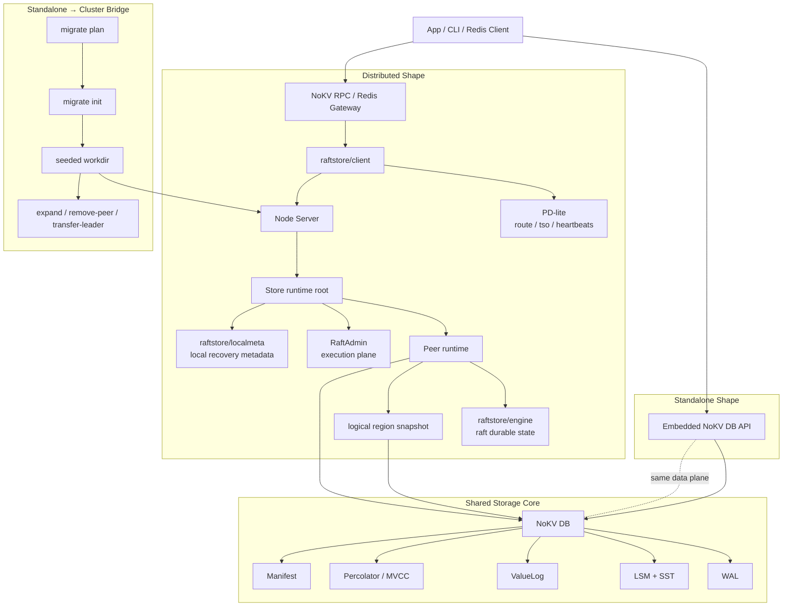

# 🚀 NoKV – One Storage Core, Two Deployment Shapes

<div align="center">
  

  <p>
    <!-- Build / Quality -->
    <a href="https://github.com/feichai0017/NoKV/actions">
      
    </a>
    <a href="https://codecov.io/gh/feichai0017/NoKV">
      
    </a>
    <a href="https://goreportcard.com/report/github.com/feichai0017/NoKV">
      
    </a>
    <a href="https://pkg.go.dev/github.com/feichai0017/NoKV">
      
    </a>
    <a href="https://github.com/avelino/awesome-go#databases-implemented-in-go">
      
    </a>
    <a href="https://dbdb.io/db/nokv">
      
    </a>
  </p>

  <p>
    <!-- Meta -->
    
    
    <a href="https://deepwiki.com/feichai0017/NoKV">
      
    </a>
  </p>

  <p><strong>LSM Tree • ValueLog • MVCC • Multi-Raft Regions • Redis-Compatible</strong></p>
</div>


NoKV is a Go-native storage system that starts as a serious standalone engine and grows into a multi-Raft distributed KV cluster without changing its underlying data plane.

The interesting part is not just that it has WAL, LSM, MVCC, Redis compatibility, or Raft. The interesting part is that these pieces are built as one system: a single storage substrate that can be embedded locally, migrated into a seeded distributed node, and then expanded into a replicated cluster with an explicit protocol.

> NoKV is not trying to be "yet another KV". It is trying to make the path from standalone storage to distributed replication coherent, inspectable, and testable.

## ✨ Why NoKV

- **Standalone to Cluster**  
  Start with an embedded engine, keep the same workdir, then migrate into a distributed seed and expand into a replicated region.

- **Correctness First**  
  Mode gates, logical region snapshots, local recovery metadata, and a clean split between execution plane and control plane keep lifecycle semantics explicit.

- **Tested as a System**  
  The project is validated with migration flow tests, restart recovery, PD degradation, transport chaos, context propagation, and publish-boundary failpoints.

## 🚦 Quick Start

Start an end-to-end playground with either the local script or Docker Compose. Both spin up a three-node Raft cluster with a PD-lite service and expose the Redis-compatible gateway.


```bash
# Option A: local processes
./scripts/dev/cluster.sh --config ./raft_config.example.json
# In another shell: launch the Redis gateway on top of the running cluster
go run ./cmd/nokv-redis \
  --addr 127.0.0.1:6380 \
  --raft-config ./raft_config.example.json \
  --metrics-addr 127.0.0.1:9100

# Option B: Docker Compose (cluster + gateway + PD)
docker compose up --build
# Tear down
docker compose down -v
```

Once the cluster is running you can point any Redis client at `127.0.0.1:6380` (or the address exposed by Compose).

For quick CLI checks:

```bash
# Online stats from a running node
go run ./cmd/nokv stats --expvar http://127.0.0.1:9100

# Offline forensics from a stopped node workdir
go run ./cmd/nokv stats --workdir ./artifacts/cluster/store-1
```

Minimal embedded snippet:

```go
package main

import (
	"fmt"
	"log"

	NoKV "github.com/feichai0017/NoKV"
)

func main() {
	opt := NoKV.NewDefaultOptions()
	opt.WorkDir = "./workdir-demo"

	db, err := NoKV.Open(opt)
	if err != nil {
		log.Fatalf("open failed: %v", err)
	}
	defer db.Close()

	key := []byte("hello")
	if err := db.Set(key, []byte("world")); err != nil {
		log.Fatalf("set failed: %v", err)
	}

	entry, err := db.Get(key)
	if err != nil {
		log.Fatalf("get failed: %v", err)
	}
	fmt.Printf("value=%s\n", entry.Value)
}
```

> Note:
> - `DB.Get` returns detached entries (do not call `DecrRef`).
> - `DB.GetInternalEntry` returns borrowed entries and callers must call `DecrRef` exactly once.
> - `DB.SetWithTTL` accepts `time.Duration` (relative TTL). `DB.Set`/`DB.SetBatch`/`DB.SetWithTTL` reject `nil` values; use `DB.Del` or `DB.DeleteRange(start,end)` for deletes.
> - `DB.NewIterator` exposes user-facing entries, while `DB.NewInternalIterator` scans raw internal keys (`cf+user_key+ts`).

> ℹ️ `scripts/dev/cluster.sh` rebuilds `nokv` and `nokv-config`, seeds local peer catalogs via `nokv-config catalog`, starts PD-lite (`nokv pd`), streams PD/store logs to the current terminal, and also writes them under `artifacts/cluster/store-<id>/server.log` and `artifacts/cluster/pd.log`. Use `Ctrl+C` to exit cleanly; if the process crashes, wipe the workdir (`rm -rf ./artifacts/cluster`) before restarting to avoid WAL replay errors.

---

## 🧭 Topology & Configuration

Everything hangs off a single file: [`raft_config.example.json`](./raft_config.example.json).

```jsonc
"pd": { "addr": "127.0.0.1:2379", "docker_addr": "nokv-pd:2379" },
"stores": [
  { "store_id": 1, "listen_addr": "127.0.0.1:20170", ... },
  { "store_id": 2, "listen_addr": "127.0.0.1:20171", ... },
  { "store_id": 3, "listen_addr": "127.0.0.1:20172", ... }
],
"regions": [
  { "id": 1, "range": [-inf,"m"), peers: 101/201/301, leader: store 1 },
  { "id": 2, "range": ["m",+inf), peers: 102/202/302, leader: store 2 }
]
```

- **Local scripts** (`scripts/dev/cluster.sh`, `scripts/dev/serve-store.sh`, `scripts/dev/bootstrap.sh`) ingest the same JSON, so local runs match production layouts.
- **Docker Compose** mounts the file into each container; manifests, transports, and Redis gateway all stay in sync.
- Need more stores or regions? Update the JSON and re-run the script/Compose—no code changes required.
- Programmatic access: import `github.com/feichai0017/NoKV/config` and call `config.LoadFile` / `Validate` for a single source of truth across tools.

### 🧬 Tech Stack Snapshot

| Layer | Tech/Package | Why it matters |
| --- | --- | --- |
| Storage Core | `lsm/`, `wal/`, `vlog/` | Hybrid log-structured design with manifest-backed durability and value separation. |
| Concurrency | `percolator/`, `raftstore/client` | Distributed 2PC, lock management, and MVCC version semantics in raft mode. |
| Replication | `raftstore/*` + `pd/*` | Multi-Raft data plane plus PD-backed control plane (routing, TSO, heartbeats). |
| Tooling | `cmd/nokv`, `cmd/nokv-config`, `cmd/nokv-redis` | CLI, config helper, Redis-compatible gateway share the same topology file. |
| Observability | `stats`, `hotring`, expvar | Built-in metrics, hot-key analytics, and crash recovery traces. |

---

## 🧱 Architecture Overview


```mermaid
%%{init: {
  "themeVariables": { "fontSize": "17px" },
  "flowchart": { "nodeSpacing": 42, "rankSpacing": 58, "curve": "basis" }
}}%%
flowchart TD
    App["App / CLI / Redis Client"]

    subgraph Standalone["Standalone Shape"]
        Embedded["Embedded NoKV DB API"]
    end

    subgraph Distributed["Distributed Shape"]
        Gateway["NoKV RPC / Redis Gateway"]
        Client["raftstore/client"]
        PD["PD-lite<br/>route / tso / heartbeats"]
        Server["Node Server"]
        Store["Store runtime root"]
        Peer["Peer runtime"]
        Admin["RaftAdmin<br/>execution plane"]
        Meta["raftstore/localmeta<br/>local recovery metadata"]
        RaftEngine["raftstore/engine<br/>raft durable state"]
        Snap["logical region snapshot"]
    end

    subgraph DataPlane["Shared Storage Core"]
        DB["NoKV DB"]
        WAL["WAL"]
        LSM["LSM + SST"]
        VLog["ValueLog"]
        MVCC["Percolator / MVCC"]
        Manifest["Manifest"]
    end

    subgraph Migration["Standalone → Cluster Bridge"]
        Plan["migrate plan"]
        Init["migrate init"]
        Seed["seeded workdir"]
        Expand["expand / remove-peer / transfer-leader"]
    end

    App --> Embedded
    App --> Gateway
    Gateway --> Client
    Client --> PD
    Client --> Server
    Server --> Store
    Store --> Peer
    Store --> Admin
    Store --> Meta
    Peer --> RaftEngine
    Peer --> Snap
    Embedded --> DB
    Peer --> DB
    Snap --> DB
    DB --> WAL
    DB --> LSM
    DB --> VLog
    DB --> MVCC
    DB --> Manifest
    Embedded -.same data plane.- DB
    Plan --> Init
    Init --> Seed
    Seed --> Server
    Seed --> Expand
```

What makes this layout distinctive:
- **One storage core, two deployment shapes** – embedded mode and raft mode both sit on the same `DB` substrate instead of splitting into separate engines.
- **Migration is a protocol, not a dump/import hack** – `plan → init → seeded → expand` turns an existing standalone workdir into a replicated cluster path with explicit lifecycle state.
- **Execution plane and control plane are split on purpose** – `RaftAdmin` executes leader-side membership changes, while `PD-lite` stays responsible for routing, allocation, timestamps, and cluster view.
- **Recovery metadata is not mixed with engine metadata** – manifest, local recovery catalog, raft durable state, and logical region snapshots each have distinct ownership.

Key ideas:
- **Durability path** – WAL first, memtable second. ValueLog writes occur before WAL append so crash replay can fully rebuild state.
- **Metadata** – manifest stores SST topology, WAL checkpoints, and vlog head/deletion metadata.
- **Background workers** – flush manager handles `Prepare → Build → Install → Release`, compaction reduces level overlap, and value log GC rewrites segments based on discard stats.
- **Distributed transactions** – Percolator 2PC runs in raft mode; embedded mode exposes non-transactional DB APIs.

Dive deeper in [docs/architecture.md](docs/architecture.md).

---

## 📊 CI Benchmark Snapshot

Benchmarks matter here, but they are not the whole story. NoKV is trying to be fast **and** structurally coherent: durability, migration, control-plane separation, and recovery semantics come first.

Latest public benchmark snapshot currently checked into the repository, taken
from the latest successful `main` CI YCSB run available at the time of update
([run #23701742757](https://github.com/feichai0017/NoKV/actions/runs/23701742757)).
This snapshot used the then-current benchmark profile:
`A-F`, `records=1,000,000`, `ops=1,000,000`, `value_size=1000`,
`value_threshold=2048`, `conc=16`.

Methodology and harness details live in [`benchmark/README.md`](./benchmark/README.md).

| Engine | Workload | Mode | Ops/s | Avg Latency | P95 | P99 |
| --- | --- | --- | ---: | ---: | ---: | ---: |
| NoKV | YCSB-A | 50/50 read/update | 175,905 | 5.684µs | 204.039µs | 307.851µs |
| NoKV | YCSB-B | 95/5 read/update | 525,631 | 1.902µs | 24.115µs | 750.413µs |
| NoKV | YCSB-C | 100% read | 409,136 | 2.444µs | 15.077µs | 25.658µs |
| NoKV | YCSB-D | 95% read, 5% insert (latest) | 632,031 | 1.582µs | 21.811µs | 638.457µs |
| NoKV | YCSB-E | 95% scan, 5% insert | 45,620 | 21.92µs | 139.449µs | 9.203945ms |
| NoKV | YCSB-F | read-modify-write | 157,732 | 6.339µs | 232.743µs | 371.209µs |
| Badger | YCSB-A | 50/50 read/update | 108,232 | 9.239µs | 285.74µs | 483.139µs |
| Badger | YCSB-B | 95/5 read/update | 188,893 | 5.294µs | 274.549µs | 566.042µs |
| Badger | YCSB-C | 100% read | 242,463 | 4.124µs | 36.549µs | 1.862803ms |
| Badger | YCSB-D | 95% read, 5% insert (latest) | 284,205 | 3.518µs | 233.414µs | 479.801µs |
| Badger | YCSB-E | 95% scan, 5% insert | 15,027 | 66.547µs | 4.064653ms | 7.534558ms |
| Badger | YCSB-F | read-modify-write | 84,601 | 11.82µs | 407.624µs | 645.491µs |
| Pebble | YCSB-A | 50/50 read/update | 169,792 | 5.889µs | 491.322µs | 1.65907ms |
| Pebble | YCSB-B | 95/5 read/update | 137,483 | 7.273µs | 658.763µs | 1.415039ms |
| Pebble | YCSB-C | 100% read | 90,474 | 11.052µs | 878.733µs | 1.817526ms |
| Pebble | YCSB-D | 95% read, 5% insert (latest) | 198,139 | 5.046µs | 491.515µs | 1.282231ms |
| Pebble | YCSB-E | 95% scan, 5% insert | 40,793 | 24.513µs | 1.332974ms | 2.301008ms |
| Pebble | YCSB-F | read-modify-write | 122,192 | 8.183µs | 760.934µs | 1.71655ms |

---

## 🧩 Module Breakdown

| Module | Responsibilities | Source | Docs |
| --- | --- | --- | --- |
| WAL | Append-only segments with CRC, rotation, replay (`wal.Manager`). | [`wal/`](./wal) | [WAL internals](docs/wal.md) |
| LSM | MemTable, flush pipeline, leveled compactions, iterator merging. | [`lsm/`](./lsm) | [Memtable](docs/memtable.md)<br>[Flush pipeline](docs/flush.md)<br>[Cache](docs/cache.md)<br>[Range filter](docs/range_filter.md) |
| Manifest | VersionEdit log + CURRENT handling, WAL/vlog checkpoints, value-log metadata. | [`manifest/`](./manifest) | [Manifest semantics](docs/manifest.md) |
| ValueLog | Large value storage, GC, discard stats integration. | [`vlog.go`](./vlog.go), [`vlog/`](./vlog) | [Value log design](docs/vlog.md) |
| Percolator | Distributed MVCC 2PC primitives (prewrite/commit/rollback/resolve/status). | [`percolator/`](./percolator) | [Percolator transactions](docs/percolator.md) |
| RaftStore | Multi-Raft Region management, hooks, metrics, transport. | [`raftstore/`](./raftstore) | [RaftStore overview](docs/raftstore.md) |
| HotRing | Hot key tracking, throttling helpers. | [`hotring/`](./hotring) | [HotRing overview](docs/hotring.md) |
| Observability | Periodic stats, hot key tracking, CLI integration. | [`stats.go`](./stats.go), [`cmd/nokv`](./cmd/nokv) | [Stats & observability](docs/stats.md)<br>[CLI reference](docs/cli.md) |
| Filesystem | Pebble-inspired `vfs` abstraction + mmap-backed file helpers shared by SST/vlog, WAL, and manifest. | [`vfs/`](./vfs), [`file/`](./file) | [VFS](docs/vfs.md)<br>[File abstractions](docs/file.md) |

Each module has a dedicated document under `docs/` describing APIs, diagrams, and recovery notes.

---


## 📡 Observability & CLI

- `Stats.StartStats` publishes metrics via `expvar` (flush backlog, WAL segments, value log GC stats, raft/region/cache/hot metrics).
- `cmd/nokv` gives you:
  - `nokv stats --workdir <dir> [--json] [--no-region-metrics]`
  - `nokv manifest --workdir <dir>`
  - `nokv regions --workdir <dir> [--json]`
  - `nokv vlog --workdir <dir>`
- `hotring` continuously surfaces hot keys in stats + CLI so you can pre-warm caches or debug skewed workloads.

More in [docs/cli.md](docs/cli.md) and [docs/testing.md](docs/testing.md#4-observability-in-tests).

---

## 🔌 Redis Gateway

- `cmd/nokv-redis` exposes a RESP-compatible endpoint. In embedded mode (`--workdir`) commands execute through regular DB APIs; in distributed mode (`--raft-config`) calls are routed through `raftstore/client` and committed with TwoPhaseCommit.
- In raft mode, TTL is persisted directly in each value entry (`expires_at`) through the same 2PC write path as the value payload.
- `--metrics-addr` exposes Redis gateway metrics under `NoKV.Stats.redis` via expvar. In raft mode, `--pd-addr` can override `config.pd` when you need a non-default PD endpoint.
- A ready-to-use cluster configuration is available at `raft_config.example.json`, matching both `scripts/dev/cluster.sh` and the Docker Compose setup.

> For the complete command matrix, configuration and deployment guides, see [docs/nokv-redis.md](docs/nokv-redis.md).

---

## 📄 License

Apache-2.0. See [LICENSE](LICENSE).
