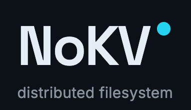

<!--
Copyright 2024-2026 The NoKV Authors.
SPDX-License-Identifier: Apache-2.0
-->

<div align="center">
  

  <p>
    <strong>Metadata control plane for object-backed agent artifacts.</strong>
  </p>

  <p>
    <a href="https://github.com/feichai0017/NoKV/actions"></a>
    <a href="https://crates.io/crates/nokv"></a>
    <a href="https://docs.rs/nokv"></a>
    
  </p>

  <p>
    
    <a href="https://landscape.cncf.io/?group=projects-and-products&item=runtime--cloud-native-storage--nokv"></a>
    <a href="https://dbdb.io/db/nokv"></a>
    <a href="https://deepwiki.com/feichai0017/NoKV"></a>
  </p>

  <p>
    <a href="https://nokv.io/architecture">Docs</a> ·
    <a href="https://nokv.io/blog/agents-want-filesystems">Why Filesystems</a> ·
    <a href="#-quick-start">Quick Start</a> ·
    <a href="#-measured-evidence">Benchmarks</a> ·
    <a href="https://github.com/feichai0017/NoKV/discussions">Discussions</a>
  </p>

  <h3>Listed In The AI-Native Storage Ecosystem</h3>

  <table>
    <tr>
      <td align="center" width="360">
        <a href="https://landscape.cncf.io/?group=projects-and-products&item=runtime--cloud-native-storage--nokv">
          
        </a>
        <br />
        <strong>Linux Foundation CNCF Landscape</strong>
        <br />
        <sub>Listed in AI Native Infra / Storage and Cloud Native Storage.</sub>
      </td>
      <td align="center" width="360">
        <a href="https://dbdb.io/db/nokv">
          
        </a>
        <br />
        <strong>DBDB.io Database of Databases</strong>
        <br />
        <sub>Historical database profile; current NoKV is the Rust filesystem product line.</sub>
      </td>
    </tr>
  </table>
</div>

<br/>

## What Is NoKV?

NoKV is a metadata control plane for object-backed agent artifacts: run
outputs, log files, checkpoints, reports, and citable evidence in one
filesystem-shaped namespace. For the longer interface argument, see
[Agents Want Filesystems](https://nokv.io/blog/agents-want-filesystems).

It is not a trace database. Keep JSONL, SQLite, or Postgres as the source of
truth for runtime events; use NoKV as the agent-facing namespace over the
artifacts and evidence those systems produce.

NoKV keeps namespace metadata in its own path-native engine
([Holt](https://crates.io/crates/holt)) and stores file bodies as immutable
blocks in S3-compatible object storage such as RustFS, MinIO, Ceph RGW, or AWS
S3.

```text
FUSE / SDK / CLI
  -> NoKV metadata service     (self-contained; no separate metadata DB to run)
  -> Holt inode/dentry metadata
  -> S3-compatible object store for file bodies
```

NoKV owns namespace truth, metadata transactions, snapshots, watches, and
object-reference GC. The object store owns byte durability and replication. The
metadata engine is built in, so local deployments operate a filesystem rather
than a filesystem plus a separate Redis, MySQL, or TiKV cluster.

## Why NoKV

Agent workflows are artifact-heavy; their workspaces aren't. Every run leaves
behind configs, metrics, logs, checkpoints — and that state scatters across
folders, JSON files, object-store keys, and database rows. Agents pay a
navigation tax in tokens every time they go looking. NoKV gives that state one
address, with the metadata guarantees the workload actually needs:

- **Checkpoints publish atomically.** Readers see the complete new checkpoint
  or the previous one — never a half-written file, even across a crash.
- **Snapshots are time travel.** Pin a frozen view of any subtree and keep
  reading it while jobs write; GC never deletes what a snapshot still needs.
- **Changes are events, not polls.** Every create, rename, and publish lands as
  a typed, replayable event with a cursor.
- **Artifacts carry body references and digests**, with cleanup of failed
  staged uploads.
- **Bodies are immutable, versioned blocks.** Replacement publishes a new
  generation, so node-local caches never invalidate object bytes after publish.

The primary write model is write-once publish, matching how datasets,
checkpoints, and artifacts are commonly written.

## 🤖 The Agent Interface

`ls` · `stat` · `catalog` · `find` · `aggregate` · `read` · `grep`

Seven verbs, one progressive-disclosure surface: an agent discovers what
exists, learns what is queryable, and pays to read only what it needs.
Predicates, sort, and projection are pushed into the engine, so a "top-5 runs
by val_loss" report costs two calls — one `catalog`, one `find`. `grep` sweeps
a subtree and returns line-numbered matches with citable evidence URIs
(`nokv-native://path@generation:N#L3`).

The verbs are defined in [`nokv-client`](crates/nokv-client/src/agent.rs): the
tool definitions are LLM-ready JSON schemas, and `execute_agent_tool` routes
calls over the same `AgentNamespace` trait whether the namespace is remote
(metadata RPC) or embedded.

**Today** the agent verbs ship in the Rust SDK; filesystem operations ship in
the `nokv` CLI and FUSE mount. An **MCP server is in development** — follow
[#354](https://github.com/feichai0017/NoKV/issues/354).

## 📊 Measured Evidence

**Agent interface.** We gave the same agent (`gpt-5.4-mini`) the same 875-run
experiment corpus through two surfaces — raw SQL over SQLite, and the NoKV
namespace — across five tasks, 10 repeats per arm and task (100 fully stateless
runs), judged against deterministic gold facts neither arm can see:

| Set mean (per 5-task pass) | Raw SQLite | NoKV namespace |
| --- | --- | --- |
| Tasks solved correctly | 4.40 / 5 | **4.50 / 5** |
| Prompt tokens (incl. cached) | 151,572 | **82,827 (−45%)** |
| Cost (USD, list rates) | $0.0708 | **$0.0433 (−39%)** |

In this 10-repeat sample, the token gap widens to ~2.4× on the
compound-exploration subset, and SQL won the single-shot analytics task —
per-task results, wins and losses both, are in the report. Harness, tasks,
judge, and the raw telemetry of all 100 runs are committed, so every published
number is recomputable: see
[`bench/agent-interface/`](bench/agent-interface/BENCHMARK_REPORT.md).

**Storage engine.** Local engineering baselines, not official MLPerf results.
Single-node service numbers are release builds through the NoKV server and Holt
metadata path. FUSE comparison numbers depend on kernel/FUSE, object backend,
cache settings, and workload shape.

| Workload | Result |
| --- | --- |
| Metadata create (`mdtest`, 65k records) | **~127K ops/s** (single-writer, batched service path) |
| Same, one directory of 65k entries | Same order of throughput; path-native ART does not degrade on large directories |
| Checkpoint publish (1 MiB blocks, concurrency 16) | **~1.1 GiB/s** in the service/object benchmark |
| Dataset read (16 KiB samples, concurrency 16) | **~3,000 samples/s** in the service/object benchmark |
| Resident metadata | **~1.5 KiB / file** in the measured shape |
| Atomic checkpoint | Object bytes land first; metadata publishes a new generation atomically |

Same-machine FUSE-vs-FUSE smoke against one RustFS endpoint currently shows
NoKV behind JuiceFS on the end-to-end mounted path. That gap is expected to come
from FUSE/RPC fixed costs and data-plane cache/writeback maturity, not from the
Holt metadata engine alone.

## NoKV vs JuiceFS

NoKV follows the same high-level separation used by systems like JuiceFS and
3FS: metadata is separate from file body storage. The difference is that NoKV
ships its metadata engine as part of the filesystem and optimizes for
agent-workspace and artifact publish/read patterns first.

| | JuiceFS | NoKV |
| --- | --- | --- |
| Metadata engine | External DB such as Redis, MySQL, or TiKV | Built-in, path-native Holt engine |
| Atomic checkpoint publish | POSIX rename/write semantics over the metadata engine | First-class publish-by-generation primitive |
| Block model | Slice/block model supporting broad POSIX behavior | Immutable object blocks plus new-generation manifests |
| Workspace-native primitives | Layered on top of the filesystem | Snapshots, typed watch, body descriptors, and GC floors are core metadata concepts |
| Agent query surface | None | `ls`/`stat`/`catalog`/`find`/`aggregate`/`read`/`grep` with push-down and line-numbered evidence |
| POSIX completeness | Mature production filesystem | P0 subset implemented; still hardening compatibility gates |
| Maturity | Production, large deployments | Young Rust implementation; single-node local mode is usable, replication is roadmap |

NoKV is an object-backed filesystem with a sharded Holt metadata plane: multiple
metadata shards (one Holt engine each) behind long-running metadata servers,
routed through an etcd control plane, with cross-shard grafts presenting a single
FUSE namespace across shards. Metadata HA today is single-writer-per-shard with
checkpoint-image + shared-log, epoch-fenced failover — not yet consensus
replication — so it is not yet a JuiceFS/3FS class production-HA distributed
filesystem.

## 🏗️ Architecture

```text
crates/
  nokv-types     storage-neutral namespace model types
  nokv-protocol  framed metadata RPC DTOs and binary codec
  nokv-meta      schema, MetadataCommand, Holt store, service core
  nokv-control   shard ownership, epochs, and failover coordination
  nokv-object    S3-compatible object body storage helpers
  nokv-client    Rust SDK over metadata service and object backend
  nokv-fuse      low-level FUSE frontend
  nokv-server    long-running metad process and framed RPC service
  nokv           CLI binary

bench/             system workload benchmark harness
docs/              product, architecture, layout, RustFS, and benchmark docs
```

For artifact and checkpoint publish, object bytes are uploaded first, then the
metadata commit publishes the dentry, inode projection, and body manifest
atomically. A crash between the two leaves orphan objects for GC, never a
corrupt namespace. See [Architecture](https://nokv.io/architecture).

## 🚦 Quick Start

Build and test:

```bash
cargo test --workspace
cargo build --release -p nokv --bin nokv
```

Start a local RustFS-compatible S3 endpoint and create the default bucket:

```bash
mkdir -p /tmp/rustfs-data
RUSTFS_ACCESS_KEY=rustfsadmin \
RUSTFS_SECRET_KEY=rustfsadmin \
rustfs server --address 127.0.0.1:9000 /tmp/rustfs-data &

AWS_ACCESS_KEY_ID=rustfsadmin \
AWS_SECRET_ACCESS_KEY=rustfsadmin \
aws --endpoint-url http://127.0.0.1:9000 \
  s3api create-bucket --bucket nokv
```

By default NoKV expects bucket `nokv` at `http://127.0.0.1:9000` with
development credentials `rustfsadmin` / `rustfsadmin`. See
[docs/rustfs.md](docs/rustfs.md) for other deployment modes.

Start the metadata server, then initialize the namespace. Every other command
talks to the server on `127.0.0.1:7777`, so keep it running:

```bash
cargo run --release -p nokv --bin nokv -- serve &

cargo run --release -p nokv --bin nokv -- init
```

Publish and read an artifact:

```bash
cargo run --release -p nokv --bin nokv -- \
  put-artifact /runs/1/checkpoint.bin ./checkpoint.bin

cargo run --release -p nokv --bin nokv -- \
  cat /runs/1/checkpoint.bin > restored.bin
```

Mount with FUSE:

```bash
mkdir -p /tmp/nokv-mount

cargo run --release -p nokv --bin nokv -- \
  mount /tmp/nokv-mount
```

On macOS this requires macFUSE. NoKV passes the `noappledouble` mount option to
avoid Finder/resource-fork AppleDouble sidecars; user xattr roundtrip is
covered by the FUSE smoke test.

## 🧩 Crates

| Crate | Role |
| --- | --- |
| [`nokv-types`](https://crates.io/crates/nokv-types) | Storage-neutral namespace model |
| [`nokv-protocol`](https://crates.io/crates/nokv-protocol) | Framed metadata RPC DTOs and binary codec |
| [`nokv-object`](https://crates.io/crates/nokv-object) | S3-compatible object body storage |
| [`nokv-meta`](https://crates.io/crates/nokv-meta) | Schema, `MetadataCommand`, Holt store, service core |
| [`nokv-control`](https://crates.io/crates/nokv-control) | Shard ownership, epochs, and failover coordination |
| [`nokv-client`](https://crates.io/crates/nokv-client) | Rust SDK over the metadata service |
| [`nokv-fuse`](https://crates.io/crates/nokv-fuse) | Low-level FUSE frontend |
| [`nokv-server`](https://crates.io/crates/nokv-server) | Long-running metad process and framed RPC |
| [`nokv`](https://crates.io/crates/nokv) | `nokv` CLI binary |

## ✅ Current Status

Implemented today:

- low-level FUSE frontend for lookup, getattr, readdir, readdirplus, create,
  mkdir, symlink/readlink, rename, unlink, rmdir, read, write, flush, release,
  fsync, setattr/truncate, hardlink, xattr, advisory locks, special files,
  `statfs`, `lseek`, `fallocate`, and `copy_file_range`;
- Holt-backed local metadata service with inode/dentry canonical metadata,
  dentry projection, command predicates, command dedupe, and history records;
- chunked object data path where file bodies are split into immutable object
  blocks and published by metadata manifest;
- S3-compatible object backend, with RustFS as the local development default;
- Rust SDK and `nokv` CLI for namespace operations, artifact publish,
  metadata server access, and object range reads;
- the seven-verb agent query surface (`ls`/`stat`/`catalog`/`find`/
  `aggregate`/`read`/`grep`) in the Rust SDK, with LLM-ready tool definitions;
- long-running `nokv-server` with health, readiness, stats, manual GC, and
  framed binary metadata RPC;
- `nokv-control` shard ownership store (in-memory plus optional etcd-backed
  session leases behind the `etcd` feature) and a server shard-owner guard that
  installs and renews lease epochs into the metadata commit fence;
- multi-shard distributed metadata: subtree/path-prefix sharding (one Holt engine
  per shard), high-bit shard-tagged global inodes, etcd control-plane routing with
  client re-resolve on owner handoff, and cross-shard grafts that present a single
  FUSE namespace across shards;
- logical metadata log segment codec/archive/replay foundation, plus controlled
  server sync shared-log ACK mode that publishes `LogRef` before successful RPC
  ACKs, including grouped independent-batch log segments;
- controlled metadata failover smoke that restores a checkpoint, replays the
  shared log, starts the bumped-epoch owner, and accepts a new metadata write;
- local multi-process metadata HA + multi-shard fleet smoke scripts that exercise
  etcd ownership, RustFS-backed checkpoint/log archive, owner death, epoch
  failover, post-failover replay, and a SIGSTOP/SIGCONT stale-owner fence mode;
- a Python SDK (PyO3) and fsspec filesystem with reads, writes, namespace ops,
  snapshots, atomic checkpoint publish/resolve, and a torch DataLoader + DCP
  backend;
- read-only snapshot mounts, snapshot-version reads, typed watch replay, and
  FUSE cache invalidation from watch events;
- pending-object GC and metadata history GC tied to snapshot retention.

Not implemented yet:

- consensus-replicated metadata (Raft/Paxos) — HA today is single-writer-per-shard
  with checkpoint + shared-log failover, not replicated;
- intra-subtree sharding (a single hot subtree is capped at one shard), learner
  read scaling, and chaos-tested failover timing;
- an MCP server for the agent verbs — in development, tracked in
  [#354](https://github.com/feichai0017/NoKV/issues/354);
- Kubernetes CSI packages;
- full POSIX hardening such as ACL enforcement, broad external compatibility
  gate coverage, and mature multi-client cache coherence.

## Benchmarks

The root `bench/` package contains all benchmark entry points. System workload
runs use `nokv-bench`:

```bash
cargo run --release -p nokv-bench --bin nokv-bench -- \
  --profile smoke \
  --workload all
```

Key workloads:

- `mdtest-easy` and `mdtest-hard` metadata smoke workloads;
- `metadata-negative-lookup`, `artifact-index-lookup`, and
  `metadata-concurrent-read` Holt metadata read-path workloads;
- `metadata-durability-batch` batch metadata create workload with comparable
  `local-only` and `sync-shared-log` ACK phases;
- `checkpoint-publish` object-backed checkpoint publish/read;
- `training-read` dataset-shaped object reads;
- `mlperf-dlio` generated MLPerf Storage/DLIO-style training and checkpoint
  shape;
- metadata HA smoke through `scripts/run-metadata-ha-smoke.sh` for owner leases,
  epoch fencing, checkpoint restore, shared-log replay, failover RTO timing, and
  stale-owner write rejection.

All workloads are single-node service runs; see
[docs/benchmarks.md](docs/benchmarks.md) for the full workload list, profiles,
and gates.

The agent-interface benchmark — harness, tasks, judge, report, and the raw
telemetry behind the numbers above — lives under
[`bench/agent-interface/`](bench/agent-interface/README.md) and runs through
the same package:

```bash
cargo run --release -p nokv-bench --bin yanex-agent-bench -- list-tasks
```

For the fast AI-training product gate, run:

```bash
scripts/run-ai-training-smoke.sh
```

The default gate covers Holt metadata read concurrency, checkpoint publish, and
DLIO-style object reads/writes. Most benchmark workloads are still single-node
service runs. Training-cluster claims need separate runs that report
replication, cache, object-store, and durability settings.

Run `scripts/run-ai-training-smoke.sh fuse-smoke` when the local machine has a
working FUSE installation and you want the mounted POSIX smoke in the same
workflow.

For the local metadata HA gate, run:

```bash
scripts/run-metadata-ha-smoke.sh
```

It requires RustFS, AWS CLI, curl, and either a local `etcd` binary or
`NOKV_HA_ETCD_ENDPOINTS` pointing at an external etcd cluster.
Set `NOKV_HA_METRICS_JSON=/tmp/nokv-ha.json` to keep the emitted
`HA_SMOKE_METRICS` JSON for CI or benchmark reports.
Set `NOKV_HA_STALE_OWNER_CHAOS=1` to run the local stale-owner fence mode; that
mode uses `NOKV_HA_OWNER_B_BIND` for the replacement owner.

## 📚 Documentation

- [Architecture](docs/architecture.md)
- [Product Design](docs/product-design.md)
- [AI-Native Metadata HA And Fast Path](docs/metadata-ha-fast-path.md)
- [Metadata Schema](docs/metadata-schema.md)
- [Object Layout](docs/object-layout.md)
- [Checkpointing](docs/checkpointing.md)
- [RustFS Backend](docs/rustfs.md)
- [Benchmarks](docs/benchmarks.md)

## 📄 License

Apache-2.0. See [LICENSE](LICENSE).
