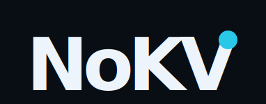
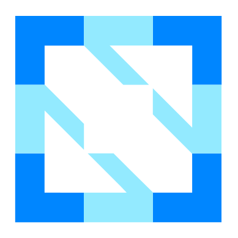
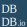

<!--
Copyright 2024-2026 The NoKV Authors.
SPDX-License-Identifier: Apache-2.0
-->

<div align="center">
  

  <p>
    <strong>A metadata control plane for AI, ML, and agent workloads.</strong>
  </p>

  <h3>Recognized In The AI-Native Storage Ecosystem</h3>

  <table>
    <tr>
      <td align="center" width="360">
        <a href="https://landscape.cncf.io/?group=projects-and-products&item=runtime--cloud-native-storage--nokv">
          
        </a>
        <br />
        <strong>Linux Foundation CNCF Landscape</strong>
        <br />
        <sub>Listed in AI Native Infra / Storage and Cloud Native Storage.</sub>
      </td>
      <td align="center" width="360">
        <a href="https://dbdb.io/db/nokv">
          
        </a>
        <br />
        <strong>DBDB.io Database of Databases</strong>
        <br />
        <sub>Profiled by the CMU Database Group catalog as a Go-native log-structured key/value DBMS.</sub>
      </td>
    </tr>
  </table>

  <p>
    <a href="https://github.com/avelino/awesome-go#databases-implemented-in-go"></a>
    <a href="https://pkg.go.dev/github.com/feichai0017/NoKV"></a>
    <a href="https://goreportcard.com/report/github.com/feichai0017/NoKV"></a>
    <a href="https://landscape.cncf.io/?group=projects-and-products&item=runtime--cloud-native-storage--nokv"></a>
    <a href="https://dbdb.io/db/nokv"></a>
  </p>

  <p>
    <a href="https://github.com/feichai0017/NoKV/actions"></a>
    <a href="https://codecov.io/gh/feichai0017/NoKV"></a>
    
    
    <a href="https://deepwiki.com/feichai0017/NoKV"></a>
  </p>
</div>

<br/>

## Goal

NoKV provides a shared metadata control plane for AI, ML, and agent workloads.

The target workload is not generic key/value storage. It is the metadata around
artifacts, workspaces, runs, checkpoints, traces, datasets, model outputs, and
derived files. These records need durable namespace truth, point-in-time reads,
watchable updates, and atomic publish semantics even when the actual bytes live
outside NoKV.

NoKV's stable product core is `fsmeta`: a filesystem-shaped workspace metadata
service backed by a local embedded KV engine today, with a distributed raftstore
runtime for scale-out deployments.

NoKV does not own object bodies, model weights, or POSIX file data. Those remain
in object stores, local filesystems, model stores, or application-defined body
stores. NoKV owns the metadata truth, namespace commit point, compact body
references, and lifecycle coordination.

## Why

AI infrastructure has a metadata control-plane gap.

A single run or agent session can produce prompts, tool outputs, model
responses, checkpoints, logs, traces, evaluation artifacts, and derived
datasets. Today those records are often split across:

- object store prefixes for artifact bytes;
- SQL tables for run metadata;
- local files for checkpoints;
- observability systems for traces;
- framework-specific tracking stores;
- custom glue code for workspace state.

That split creates predictable pain:

- no common metadata publish point for external artifact bodies;
- partial writes and stale staged entries after crashes or retries;
- expensive client-side directory reconstruction from generic KV scans;
- duplicated indexing, lifecycle, and GC code across every AI stack;
- weak workspace change feeds for collaborative or multi-agent systems;
- framework lock-in around artifact layout and run metadata;
- growing maintenance cost from stitching SQL, object-store listing, and
  coordination logic into each new product.

NoKV makes that metadata layer explicit.

## Why NoKV?

NoKV is purpose-built for metadata semantics, not generic storage wrapped in
conventions.

### Native metadata operations

`fsmeta` exposes namespace operations directly: create, lookup, fused directory
listing, atomic rename, overwrite publish, subtree move, snapshot, watch, writer
sessions, quota, and remove. Applications do not have to rediscover those
protocols with ad hoc `Get` / `Put` / `Scan` sequences.

### Local-first metadata runtime

NoKV ships with a local fsmeta runtime, NoKV MVCC encoding, transaction path,
watch plumbing, and a default Pebble-backed raw ordered-KV backend. The default
development path is local and self-contained:

```text
application / SDK
  -> fsmeta
  -> fsmeta/runtime/local
  -> local MVCC KV
```

That keeps early integration work light: no SQL schema migration layer, no
separate coordination service, no object-store prefix polling loop, and less
application glue around every metadata operation.

### Distributed path when needed

The same metadata contract can run on the distributed runtime:

```text
application / SDK
  -> fsmeta client/server
  -> fsmeta/runtime/raftstore
  -> coordinator + meta/root + TSO + raftstore + transactions
```

This path is for larger agent platforms, distributed workspace services, and
DFS-scale namespace metadata. The local runtime remains the default product path
for development and small deployments.

### Bring your own data plane

NoKV stores metadata and compact references. Artifact bytes stay outside NoKV.

Examples:

- local file body stores for tests and development;
- S3/R2/GCS-style body stores for production;
- model registry or dataset storage owned by another system;
- application-defined checkpoint payload stores.

The boundary is deliberate: NoKV owns namespace truth, body references, metadata
versions, watches, and lifecycle coordination.

## `fsmeta` - Workspace Namespace Metadata Service

`fsmeta` is the stable NoKV product contract.

It provides a durable, versioned, watchable namespace shaped like filesystem
metadata. It is not a FUSE frontend, not a POSIX filesystem, and not an object
store. It is the metadata kernel consumed by AI workload stores, artifact SDKs,
workspace services, distributed filesystem frontends, and object namespace
layers.

Native API surface is available through embedded Go via
`fsmeta/runtime/local.Open` and through the distributed gRPC gateway
`nokv-fsmeta`.

| Primitive | Semantics |
|---|---|
| `Create` | Atomically creates a dentry and inode. |
| `Lookup` | Reads a dentry by `(mount, parent_inode, name)`. |
| `LookupPlus` | Reads a dentry and inode attributes together. |
| `ReadDir` | Scans one directory page by dentry prefix. |
| `ReadDirPlus` | Scans dentries and batch-reads inode attrs under one snapshot version. |
| `UpdateInode` | Updates size, mode, updated timestamp, and bounded opaque attrs. |
| `Rename` | Moves one namespace entry when the destination does not exist. |
| `RenameReplace` | Atomically publishes or overwrites a file entry, useful for artifact replacement. |
| `RenameSubtree` | Moves a subtree root with rooted authority handoff. |
| `Remove` | Removes one non-directory namespace entry and returns removed inode metadata. |
| `RemoveDirectory` | Removes one empty directory after child-count verification. |
| `Link` / `Unlink` | Non-directory hard-link semantics with link-count updates. |
| `SnapshotSubtree` | Publishes an MVCC read-version token for point-in-time namespace reads. |
| `WatchSubtree` | Prefix-scoped change feed with ready cursor, ack, replay, and overflow handling. |
| Writer sessions | `OpenWriteSession`, `HeartbeatWriteSession`, `CloseWriteSession`, `ExpireWriteSessions`. |
| Quota usage | Persistent quota counters plus rooted quota fences. |

`InodeRecord.OpaqueAttrs` is application-owned metadata capped at 16 KiB. It is
for compact body references, checksums, media types, or small descriptors. It is
not for storing artifact bodies or large trace payloads.

### Artifact publish model

Large bodies are written outside `fsmeta`. The metadata commit happens in
`fsmeta`.

Typical flow:

1. Write the body to a `BodyStore`.
2. Encode the resulting body reference into inode opaque attrs.
3. Create a hidden staged namespace entry.
4. Publish it to the final path with `RenameReplace`.

Readers observe either the old body reference or the new one, never a
half-published artifact path.

### Authority lifecycle

Some metadata facts are rooted truth, while high-frequency inode and dentry
updates remain data-plane writes.

| Domain | Rooted truth | Runtime view |
|---|---|---|
| Mount | `MountRegistered` / `MountRetired` | Mount admission cache. |
| Subtree authority | `SubtreeAuthorityDeclared` / `SubtreeHandoffStarted` / `SubtreeHandoffCompleted` | RenameSubtree era frontier and pending handoff repair. |
| Snapshot epoch | `SnapshotEpochPublished` / `SnapshotEpochRetired` | Snapshot-version reads and MVCC-GC retention. |
| Quota fence | `QuotaFenceUpdated` | Quota fence cache plus persisted usage counters. |
| WatchSubtree | Not rooted truth | Raftstore apply observer plus fsmeta watch router. |

Documentation: [`docs/guide/fsmeta.md`](docs/guide/fsmeta.md)

## SDK Status

| SDK | State |
|---|---|
| [`sdk/artifact/`](./sdk/artifact) | Go artifact namespace SDK over `fsmeta`, with a local file body store. |
| [`sdk/artifact/python`](./sdk/artifact/python) | Python adapter for artifact-repository-style integrations and local tests. |
| [`sdk/runmetadata/python`](./sdk/runmetadata/python) | In-memory prototype for run lifecycle, artifact refs, lineage, and recent artifact listing. |
| [`sdk/runmetadata/typescript`](./sdk/runmetadata/typescript) | In-memory TypeScript prototype with the same run metadata direction. |
| [`sdk/workspace`](./sdk/workspace) | Planned surface; directory exists but no implementation yet. |

Current known gaps:

- production Python NoKV/fsmeta client;
- object-store-backed `BodyStore`;
- body garbage collection and reference ownership policy;
- staged-entry recovery policy;
- durable run metadata backend;
- workspace SDK;
- full tracking/search/index plane for runs, metrics, traces, datasets, and
  evaluations.

## Headline Evidence

### Underlying KV layer

Apple M3 Pro - `records=1M` - `ops=1M` - `value_size=1000` - `conc=16`

| Workload | Description | **NoKV** | Badger | Pebble |
|---|---|---:|---:|---:|
| **YCSB-A** | 50/50 read/update | **175,905** | 108,232 | 169,792 |
| **YCSB-B** | 95/5 read/update | **525,631** | 188,893 | 137,483 |
| **YCSB-C** | 100% read | **409,136** | 242,463 | 90,474 |
| **YCSB-D** | 95% read, 5% insert latest | **632,031** | 284,205 | 198,139 |
| **YCSB-E** | 95% scan, 5% insert | **45,620** | 15,027 | 40,793 |
| **YCSB-F** | read-modify-write | **157,732** | 84,601 | 122,192 |

Units: ops/sec. Full latency details live in
[`benchmark/README.md`](./benchmark/README.md). Single-node localhost, not
multi-host production.

## Why NoKV vs X?

| If you need... | You should probably use... | Where NoKV fits |
|---|---|---|
| A complete distributed filesystem | CephFS, JuiceFS | NoKV is not a filesystem. It can provide the metadata substrate a filesystem-shaped frontend consumes. |
| A production object store | MinIO, Ceph RGW, S3-compatible storage | NoKV is not an object store. It provides namespace metadata and body references above an object backend. |
| A custom AI workload metadata service | NoKV | NoKV gives you namespace, watch, snapshot, atomic publish, and local-first metadata execution without rebuilding the control plane. |
| A production distributed KV | TiKV, FoundationDB, CockroachDB | NoKV does not compete with generic KV systems. It is metadata-native and can run on a Pebble-backed local runtime today. |
| Production distributed SQL | CockroachDB, TiDB, Postgres | Use SQL for relational query workloads. Use NoKV when namespace semantics and metadata commit points are the core problem. |
| Just an embedded LSM | Pebble, Badger | NoKV is not a drop-in LSM library; it uses raw ordered-KV engines below metadata semantics. |
| A Raft library | etcd/raft, dragonboat | NoKV's raftstore is built on top of `etcd/raft` `RawNode`; owned code is the metadata/runtime integration. |

## Architecture

| Layer | Responsibility |
|---|---|
| `fsmeta` | Workspace namespace metadata contract, executor, client, and gateway. |
| `local` / `txn` / `storage` | Embedded runtime, MVCC internal keys, transaction protocol, and raw ordered-KV backend. |
| `raftstore` / `coordinator` / `meta/root` | Distributed runtime, routing, TSO, rooted authority, and scale-out metadata execution. |
| `experimental` | Research mechanisms such as Peras and Thermos. |

Experimental mechanisms are not required to understand or use the stable
`fsmeta` API.

## Quick Start

### Use `fsmeta` locally

```go
package main

import (
    "context"

    "github.com/feichai0017/NoKV/fsmeta/model"
    fsmetalocal "github.com/feichai0017/NoKV/fsmeta/runtime/local"
)

func main() {
    ctx := context.Background()
    rt, err := fsmetalocal.Open(ctx, fsmetalocal.Options{
        WorkDir: "./nokv-fsmeta-local",
        Mount:   model.MountIdentity{MountID: "default", MountKeyID: 1},
    })
    if err != nil {
        panic(err)
    }
    defer rt.Close()

    _, err = rt.Executor.Create(ctx, model.CreateRequest{
        Mount:  "default",
        Parent: model.RootInode,
        Name:   "hello.txt",
        Attrs:  model.CreateAttrs{Type: model.InodeTypeFile, Size: 13},
    })
    if err != nil {
        panic(err)
    }

    page, _ := rt.Executor.ReadDirPlus(ctx, model.ReadDirRequest{
        Mount:  "default",
        Parent: model.RootInode,
        Limit:  100,
    })
    for _, entry := range page {
        println(entry.Dentry.Name, entry.Inode.Size)
    }
}
```

### Run the distributed harness

```sh
# Local processes: meta-root + coordinator + 3-store raftstore + fsmeta gateway.
./scripts/dev/cluster.sh --config ./raft_config.example.json

# Or Docker Compose with the same harness and mount-init bootstrap.
docker compose up -d
```

### Use distributed `fsmeta` from any language

```sh
# Bootstrap a mount before the first write.
nokv mount register --coordinator-addr 127.0.0.1:2379 \
  --mount default --root-inode 1 --schema-version 1

# Set a mount-level quota fence.
nokv quota set --coordinator-addr 127.0.0.1:2379 \
  --mount default --limit-bytes 1073741824 --limit-inodes 1000000

# Run the standalone fsmeta gRPC gateway with metrics.
nokv-fsmeta --addr 127.0.0.1:8090 --coordinator-addr 127.0.0.1:2379 \
  --metrics-addr 127.0.0.1:9101
```

Then use any gRPC client against
[`pb/fsmeta/fsmeta.proto`](./pb/fsmeta/fsmeta.proto), or the Go typed client in
[`fsmeta/client`](./fsmeta/client).

### Inspect runtime state

```sh
# Live, via expvar.
curl http://127.0.0.1:9101/debug/vars | jq '.nokv_fsmeta_executor, .nokv_fsmeta_watch, .nokv_fsmeta_quota, .nokv_fsmeta_mount, .nokv_fsmeta_sessions'

# Offline forensics from a stopped node's workdir.
nokv stats --workdir ./artifacts/cluster/store-1
nokv regions --workdir ./artifacts/cluster/store-1 --json
```

Full guide: [`docs/guide/getting_started.md`](./docs/guide/getting_started.md)
and CLI reference: [`docs/guide/cli.md`](./docs/guide/cli.md).

## Modules

| Module | Responsibility | Docs |
|---|---|---|
| [`fsmeta/`](./fsmeta) | Workspace namespace metadata schema, executor, gRPC service, and embedded API. | [fsmeta](./docs/guide/fsmeta.md) |
| [`fsmeta/exec/watch/`](./fsmeta/exec/watch) | WatchSubtree router, remote source, and catch-up replay. | [fsmeta](./docs/guide/fsmeta.md) |
| [`sdk/artifact/`](./sdk/artifact) | Artifact namespace SDK over `fsmeta`. | [artifact SDK](./sdk/artifact/README.md) |
| [`sdk/runmetadata/`](./sdk/runmetadata) | Run metadata prototypes for AI workload lineage. | - |
| [`meta/root/`](./meta/root) | Typed rooted truth kernel for authority, topology, lifecycle, snapshots, and quota fences. | [Rooted Truth](./docs/guide/rooted_truth.md) |
| [`coordinator/`](./coordinator) | Routing, TSO, store discovery, root-event publish, and streaming subscribe. | [Coordinator](./docs/guide/coordinator.md) |
| [`raftstore/`](./raftstore) | Multi-Raft replicated execution, transport, peer lifecycle, MVCC apply, and raft snapshot bootstrap. | [RaftStore](./docs/guide/raftstore.md) |
| [`txn/percolator/`](./txn/percolator) | Distributed MVCC 2PC and `AssertionNotExist`. | [Percolator](./docs/guide/percolator.md) |
| [`txn/storage/`](./txn/storage) | MVCC column families, internal keys, timestamp encoding, entries, and transaction storage contract. | [Runtime](./docs/guide/runtime.md) |
| [`local/`](./local) | Embedded DB facade over NoKV MVCC encoding and the default Pebble raw storage backend. | [Runtime](./docs/guide/runtime.md) |
| [`storage/kv/`](./storage/kv) | Raw ordered KV backend contract below MVCC and fsmeta semantics. | [Architecture](./docs/guide/architecture.md) |
| [`storage/pebble/`](./storage/pebble) | Default Pebble-backed raw ordered KV implementation. | [Architecture](./docs/guide/architecture.md) |
| [`storage/wal/`](./storage/wal) | WAL segment utilities used by control/raft internals. | [WAL](./docs/guide/wal.md) |
| [`storage/vfs/`](./storage/vfs) | VFS abstraction, FaultFS, and cross-platform atomic rename. | [VFS](./docs/guide/vfs.md) |
| [`fsmeta/cache/`](./fsmeta/cache) | Derived fsmeta sidecar caches such as dirpage and negative-cache slabs. | [fsmeta](./docs/guide/fsmeta.md) |
| [`experimental/`](./experimental) | Boundary for research mechanisms such as Peras and Thermos. | [Experimental Boundary Plan](./docs/guide/experimental_boundary_plan.md) |
| [`experimental/thermos/`](./experimental/thermos) | Optional hot-key observer. | [Thermos](./docs/guide/thermos.md) |
| [`cmd/nokv/`](./cmd/nokv) | CLI: stats, execution diagnostics, regions, serve, coordinator, meta-root, mount, quota, and audit. | [CLI](./docs/guide/cli.md) |
| [`cmd/nokv-fsmeta/`](./cmd/nokv-fsmeta) | Standalone fsmeta gRPC gateway. | [fsmeta](./docs/guide/fsmeta.md) |

## Observability

FSMetadata exports per-domain expvar namespaces when `--metrics-addr` is
enabled:

| Endpoint | Metric namespace | Fields |
|---|---|---|
| `nokv-fsmeta --metrics-addr :PORT/debug/vars` | `nokv_fsmeta_executor` | `txn_retries_total`, `txn_retry_exhausted_total` |
| | `nokv_fsmeta_watch` | `subscribers`, `events_total`, `delivered_total`, `dropped_total`, `overflow_total` |
| | `nokv_fsmeta_quota` | `checks_total`, `rejects_total`, `cache_hits_total`, `cache_misses_total`, `fence_updates_total`, `usage_mutations_total` |
| | `nokv_fsmeta_mount` | `cache_hits`, `cache_misses`, `admission_rejects_total` |
| | `nokv_fsmeta_peras` | Experimental Peras profile only: `commit_total`, `flush_total`, `segment_total`, `witness_latency_*` |
| | `nokv_fsmeta_sessions` | stale writer-session cleanup runs, expired sessions, and last error |

Plus structured logs from the distributed coordinator/store harness. More:
[`docs/guide/stats.md`](./docs/guide/stats.md),
[`docs/guide/cli.md`](./docs/guide/cli.md), and
[`docs/guide/testing.md`](./docs/guide/testing.md).

## Topology And Configuration

The distributed harness uses
[`raft_config.example.json`](./raft_config.example.json). The default embedded
`fsmeta/runtime/local` path is configured through Go options and does not
require the raftstore topology file.

```jsonc
{
  "coordinator": { "addr": "127.0.0.1:2379", ... },
  "stores": [
    { "store_id": 1, "listen_addr": "127.0.0.1:20170", ... },
    { "store_id": 2, "listen_addr": "127.0.0.1:20171", ... },
    { "store_id": 3, "listen_addr": "127.0.0.1:20172", ... }
  ],
  "fsmeta_region_bootstrap": {
    "mounts": ["default", "fsmeta-bench"],
    "bucket_count": 16,
    "region_id_base": 1000,
    "peer_id_base": 100000,
    "leader_store_ids": [1, 2, 3]
  }
}
```

Local cluster scripts, Docker Compose, and distributed CLI tools consume this
file. `nokv-config regions` expands fsmeta bucket bootstrap into ordinary
byte-range region descriptors before store seeding; after bootstrap, runtime
topology comes from `meta/root`. Programmatic access:
`import "github.com/feichai0017/NoKV/config"` and call `config.LoadFile` /
`Validate`.

## Contact Us

We are looking for design partners, contributors, and research collaborators
working on agent builders, research tooling, experiment systems,
artifact/workspace infrastructure, distributed filesystems, and object-storage
namespace layers.

- **Eric** - [eric@nokv.io](mailto:eric@nokv.io)
- **Jason** - [jason@nokv.io](mailto:jason@nokv.io)

## Community

- [Contributing Guide](./CONTRIBUTING.md)
- [Code of Conduct](./CODE_OF_CONDUCT.md)
- [Security Policy](./SECURITY.md)

## License

[Apache-2.0](./LICENSE)

---

<div align="center">
<sub><strong>Metadata control plane for AI, ML, and agent workloads.</strong></sub><br/>
<sub>Built from scratch: embedded KV engine, fsmeta metadata layer, and distributed raftstore/coordinator harness.</sub>
</div>
