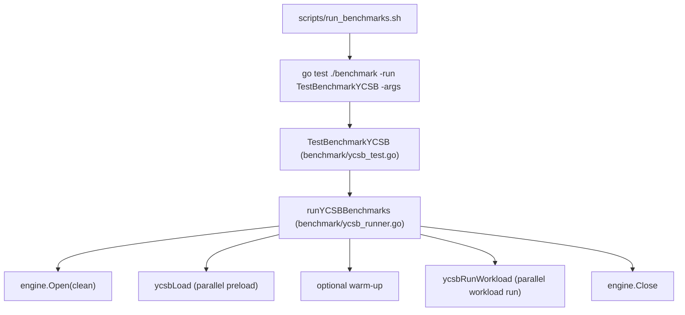

# Benchmarks

This document captures the most recent results from running the default
benchmark script (`scripts/run_benchmarks.sh`).

## YCSB Framework Overview

The benchmark harness uses the YCSB workloads (A/B/C/D/E/F) to exercise NoKV,
Badger, and Pebble by default (RocksDB is optional via build tags) with a fixed total operation count and report both
throughput and latency percentiles. The default `nokv` engine tracks the
project default memtable configuration (`art`); for explicit memtable
comparisons, NoKV can also be split into `nokv-skiplist` and `nokv-art`
variants. The default script runs a load phase to seed data, then executes each
workload and collects:
- Ops/s, average latency, and latency percentiles (P50/P95/P99)
- Operation mix counts (reads, updates, inserts, scans, read-modify-write)
- Value size stats and total data size

## Test Environment

- Machine: MacBook Pro (Apple M3 Pro)
- Memory: 36 GB

## YCSB Architecture

The YCSB harness is organized as a Go test entrypoint plus a small engine
abstraction so every storage engine is driven by the same workload generator,
key distribution, and metrics pipeline.

Flow:

Key components:

- Engine interface: `benchmark/ycsb_engine.go` defines `Read/Insert/Update/Scan`
  and per-engine implementations live in `benchmark/ycsb_engine_*` (including
  `nokv-skiplist` / `nokv-art` for memtable-only comparisons).
- Workload model: `benchmark/ycsb_runner.go` defines YCSB A/B/C/D/E/F mixes,
  request ratios, and key distributions (zipfian/uniform/latest).
- Official-aligned defaults: insert order uses `hashed`, workload E uses
  `maxscanlength` + `uniform` scan length distribution, warm-up is disabled
  by default, and value size defaults to ~1KB.
- Value generator: fixed/uniform/normal/percentile sizing with a shared buffer
  pool to reduce allocations (`valuePool`).
- Concurrency model: each workload runs with `ycsb_conc` goroutines; each op
  records latency samples and operation counts; optional global throttling is
  available via `ycsb_target_ops`.
- Workload isolation: each workload reopens and reloads the engine to avoid
  cross-workload state pollution (compaction debt/history carry-over).
- Results pipeline: summaries are printed to stdout, written as CSV under
  `benchmark_data/ycsb/results`, and a text report is saved under
  `benchmark_results/benchmark_results_*.txt`.

## Latest Full Results (Default Script)

Snapshot source: `benchmark_results/benchmark_results_20260312_020325.txt`  
Generated at: `2026-03-12 02:03:25`  
Profile: workloads `A-F`, engines `NoKV/Badger/Pebble`, `records=1,000,000`,
`ops=1,000,000`, `value_size=1000`, `conc=16`.

| Workload | NoKV (ops/s) | Badger (ops/s) | Pebble (ops/s) | NoKV vs Next Best |
| --- | ---: | ---: | ---: | ---: |
| YCSB-A | 542,280 | 283,656 | 185,218 | 1.91x |
| YCSB-B | 1,381,799 | 538,008 | 222,688 | 2.57x |
| YCSB-C | 879,190 | 607,790 | 266,813 | 1.45x |
| YCSB-D | 1,378,122 | 630,307 | 633,871 | 2.17x |
| YCSB-E | 323,793 | 21,931 | 133,463 | 2.43x |
| YCSB-F | 532,153 | 144,477 | 191,223 | 2.78x |
