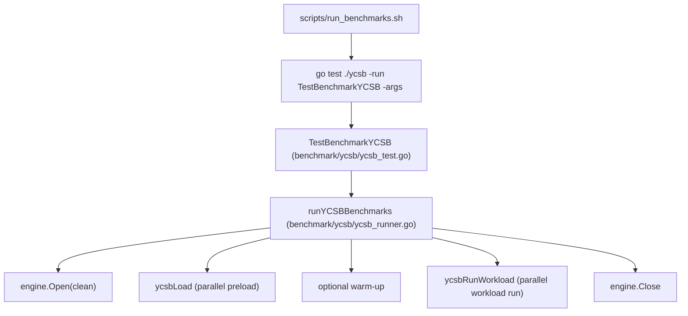

# Benchmarks

This document captures the most recent results from running the default
benchmark script (`scripts/run_benchmarks.sh`).

## YCSB Framework Overview

The benchmark harness uses the YCSB workloads (A/B/C/D/E/F) to exercise NoKV,
Badger, and Pebble by default (RocksDB is optional via build tags) with a fixed total operation count and report both
throughput and latency percentiles. The default `nokv` engine tracks the
project default memtable configuration (`art`); for explicit memtable
comparisons, NoKV can also be split into `nokv-skiplist` and `nokv-art`
variants. The default script runs a load phase to seed data, then executes each
workload and collects:
- Ops/s, average latency, and latency percentiles (P50/P95/P99)
- Operation mix counts (reads, updates, inserts, scans, read-modify-write)
- Value size stats and total data size

## Test Environment

- Machine: MacBook Pro (Apple M3 Pro)
- Memory: 36 GB

## YCSB Architecture

The YCSB harness is organized as a Go test entrypoint plus a small engine
abstraction so every storage engine is driven by the same workload generator,
key distribution, and metrics pipeline.

Flow:



Key components:

- Engine interface: `benchmark/ycsb/ycsb_engine.go` defines `Read/Insert/Update/Scan`
  and per-engine implementations live in `benchmark/ycsb/ycsb_engine_*` (including
  `nokv-skiplist` / `nokv-art` for memtable-only comparisons).
- Engine profiles: each engine is constructed from an explicit benchmark
  profile in `benchmark/ycsb/ycsb_profiles.go`; the harness does not inherit
  `NoKV.NewDefaultOptions()` or `badger.DefaultOptions()` implicitly, which
  keeps benchmark semantics stable across runtime default changes. The default
  profile uses a 512MB total cache budget and splits it explicitly per engine:
  Pebble uses a single 512MB cache, Badger defaults to 256MB block + 256MB
  index, and NoKV defaults to 384MB block + 128MB index.
- Benchmark script defaults now pass `value_threshold=2048` unless overridden
  through `YCSB_VALUE_THRESHOLD`; `ycsb_value_size` remains `1000` by default,
  so the stock CI run still measures inline values unless the value size or
  threshold is changed explicitly.
- Workload model: `benchmark/ycsb/ycsb_runner.go` defines YCSB A/B/C/D/E/F mixes,
  request ratios, and key distributions (zipfian/uniform/latest).
- Official-aligned defaults: insert order uses `hashed`, workload E uses
  `maxscanlength` + `uniform` scan length distribution, warm-up is disabled
  by default, and value size defaults to ~1KB.
- Value generator: fixed/uniform/normal/percentile sizing with a shared buffer
  pool to reduce allocations (`valuePool`).
- Concurrency model: each workload runs with `ycsb_conc` goroutines; each op
  records latency samples and operation counts; optional global throttling is
  available via `ycsb_target_ops`.
- Workload isolation: each workload reopens and reloads the engine to avoid
  cross-workload state pollution (compaction debt/history carry-over).
- Results pipeline: summaries are printed to stdout, written as CSV under
  `benchmark_data/ycsb/results`, and a text report is saved under
  `benchmark_results/benchmark_results_*.txt`.

## Control-Plane Evaluation

The `benchmark/` submodule also owns the repeatable control-plane evaluation
artifacts used by the separated `meta/root` work. The split is deliberate:

- the main module keeps only control-plane implementation code
- `benchmark/controlplane` owns all control-plane benchmarks, helper processes,
  and external-authority baselines
- `benchmark/controlplane/scripts` owns repeatable runners and netem wrappers
- benchmark-only dependencies such as embedded etcd do not leak into the main
  module

Fixed-parameter localhost evaluation:

```bash
./benchmark/controlplane/scripts/run_eval.sh
```

Default parameters:

- in-process benchmark count: `5`
- process-separated benchmark count: `5`
- recovery test count: `5`
- benchmark benchtime: `500ms`

Outputs:

- raw benchmark logs under `benchmark/benchmark_results/control_plane/<stamp>/`
- a paper-friendly markdown summary at `summary.md`
- routing scale-out benchmark logs comparing `1` vs `3` separated coordinators for `GetRegionByKey`

The current control-plane suite therefore distinguishes two classes of paths:

- horizontally replicable service/view paths such as `GetRegionByKey`, which can be served by multiple coordinators reading the same rooted truth
- singleton-duty paths such as `AllocID` / `Tso`, which remain lease-owner-only even after the split

Linux netem wrapper via Docker:

```bash
./benchmark/controlplane/scripts/run_netem_docker.sh
```

Environment overrides:

- `CONTROL_PLANE_NETEM_DELAY` default `1ms`
- `CONTROL_PLANE_NETEM_JITTER` default `0ms`
- `CONTROL_PLANE_NETEM_LOSS` default `0%`
- `CONTROL_PLANE_BENCHTIME` default `500ms`
- `CONTROL_PLANE_INPROC_COUNT` default `5`
- `CONTROL_PLANE_PROCESS_COUNT` default `5`
- `CONTROL_PLANE_RECOVERY_COUNT` default `5`

Current scope limits:

- `run_eval.sh` is a localhost runner
- `run_netem_docker.sh` applies `tc netem` inside a Linux Docker
  container on loopback; it is still a single-host impairment setup, not a
  multi-host cluster benchmark

## Namespace Listing Research Skeleton

The `benchmark/namespace` package is a separate research scaffold for the
hierarchical metadata direction. It is intentionally narrower than the YCSB and
control-plane suites:

- it already exercises the real NoKV engine path for the namespace listing
  prototype
- it fixes an engine-backed namespace workload generator and baseline taxonomy
- it compares:
  - NoKV-backed flat full-path scan
  - NoKV-backed durable parent-child secondary index
  - proof-gated namespace read plane on the same NoKV engine path

The current goal is to stabilize the workload story before any intrusive engine
integration work lands.

Current workload slices include:

- steady-state listing on a hot prefix
- steady-state listing after materialization
- paginated listing
- paginated listing after materialization
- mixed create + list
- skewed hot-prefix create distribution
- delta materialization cost (`deltas/op`, `pages/op`)

Recommended final benchmark matrix for the paper:

- Baselines
  - `BenchmarkNamespaceListFlatScan`
  - `BenchmarkNamespaceListSecondaryIndex`
  - `BenchmarkNamespaceListReadPlaneStorePath`
- Service workloads
  - `BenchmarkNamespaceListReadPlaneStorePathPaginated`
  - `BenchmarkNamespaceListStrictReadPlaneStorePathPaginated`
  - `BenchmarkNamespaceMixedCreateListReadPlaneNoKV`
  - `BenchmarkNamespaceSteadyStateMixedCreatePaginatedListReadPlaneNoKV`
  - `BenchmarkNamespaceSteadyStateMixedCreatePaginatedRepairThenCertifiedNoKV`
- Background write-side costs
  - `BenchmarkNamespaceMaterializeReadPlaneNoKV`
  - `BenchmarkNamespaceHotPageFoldNoKV`
  - `BenchmarkNamespaceHotPageSplitNoKV`

Current prototype shape:

- truth: `M|full_path`
- cold-parent delta: `LD|parent|shard|child`
- read-plane root/page: `LR|parent`, `LP|parent|fence`
- page-local delta: `LDP|parent|page|#seq`
- dirty-page marker: `LDS|parent|page`
- `List` serves only covered intervals
- `RepairAndList` explicitly repairs uncovered state

The namespace listing path is now evaluated only on the real NoKV DB
backing:

- `NoKVStore` mode:
  - real NoKV DB backing
  - uses current `DB.ApplyInternalEntries`, `DB.Get`, and `DB.NewIterator`
  - therefore exercises the current WAL + mutable tier + LSM path

Current measured shape on Apple M3 Pro for the namespace listing prototype:

Current NoKV-backed spot checks:

- steady-state paginated full walk:
  - durable parent-child secondary index: about `231us/op`
  - repairing read plane: about `35.9us/op`
  - strict read plane: about `35.4us/op`
- deep-descendant direct-children:
  - flat scan: about `476us/op`
  - secondary index: about `27.2us/op`
  - read plane: about `1.75us/op`
- cold-start deep-descendant first list:
  - about `1.60ms/op` on a fresh DB / fresh parent state
- mixed create + paginated list:
  - secondary index: about `589us/op`
  - repairing read plane: about `1.63ms/op`
- repair-then-strict:
  - about `1.84ms/op`
- hot-page fold / split:
  - about `318us / 310us`
- verify:
  - about `9.45ms/op`
- full materialize / rebuild:
  - about `504ms / 523ms`

Interpretation:

- the read plane now clearly wins on steady-state paginated full walks as well
  as deep-descendant direct-children listing
- the remaining major weak spot is mixed create + paginated listing, where
  explicit page repair / republish still costs about 3x the durable parent-child
  secondary-index baseline
- the strongest current positive result is now the combination of:
  - very fast steady-state paginated full walks on the proof-gated read plane
  - very fast deep-descendant direct-children reads
  - interval-scoped cold bootstrap in milliseconds rather than half-second
    full rebuilds
  - sub-millisecond hot-page fold / split
- the mainline boundary is now explicit:
  - answerability contract and page-local repair semantics are in place
  - mixed repair/publish cost still needs substantial optimization

These NoKV-backed numbers are now sufficient for the workshop-paper baseline.
They also make the current mainline boundary explicit:

- hot-prefix delta writes are acceptable on the real engine path
- `Materialize` and `Rebuild` remain the heaviest operations on the real engine
  path and are first-class targets for later chunking or scheduling work
- cold bootstrap and page-local repair are now separated cleanly from full
  rebuild cost

## Research Plotting

The `benchmark/plot` subpackage provides publication-oriented plotting helpers
for benchmark outputs. It is intended for paper figures rather than ad-hoc
console visualization:

- consistent academic theme
- colorblind-safe palette
- grouped bar charts for engine/workload comparison
- direct support for `[]BenchmarkResult`
- direct parsing of `benchmark_data/ycsb/results/*.csv`
- vector output (`.svg`, `.pdf`) as well as bitmap output (`.png`)

Minimal example:

```go
package main

import (
    bench "github.com/feichai0017/NoKV/benchmark/ycsb"
    benchplot "github.com/feichai0017/NoKV/benchmark/plot"
)

func render(results []bench.BenchmarkResult) error {
    return benchplot.WriteGroupedBarChartFromResults(results, benchplot.ResultGroupedBarChartConfig{
        Metric: benchplot.MetricP95LatencyUS,
        GroupedBarChartConfig: benchplot.GroupedBarChartConfig{
            Title:  "YCSB P95 Latency",
            Output: "figures/ycsb_p95.svg",
        },
    })
}
```

If the results already exist as CSV:

```go
results, err := benchplot.ReadYCSBResultsCSV("benchmark_data/ycsb/results/ycsb_results_20260416_120000.csv")
if err != nil {
    return err
}
```

Recommended usage for paper figures:

- use `.svg` during drafting for clean vector output
- group by workload or engine, not both at once in overly dense charts
- keep one figure tied to one claim
- prefer throughput, P95/P99 latency, and rebuild/materialize cost over dumping every metric

There is also a small CLI entrypoint for repeatable figure generation:

```bash
go run ./cmd/plotbench \
  -format ycsb \
  -input benchmark_data/ycsb/results/ycsb_results_20260416_120000.csv \
  -metric p95_latency_us \
  -title "YCSB P95 Latency" \
  -output figures/ycsb_p95.svg
```

For namespace / metadata-service figures, use the generic `observations` CSV
format. By default the data columns are:

```text
category,series,value
steady-paginated,secondary-index,231.1
steady-paginated,repairing-read-plane,35.9
steady-paginated,strict-read-plane,35.4
```

Then render with a domain preset:

```bash
go run ./cmd/plotbench \
  -format observations \
  -preset namespace_pagination_modes \
  -input figures/namespace_latency.csv \
  -title "Steady-State Paginated Listing" \
  -output figures/namespace_latency.svg
```

The plotting path is now configuration-driven rather than preset-driven. A
single config CSV can control:

- chart title and axis labels
- figure size
- legend / grid visibility
- category / series ordering
- observation CSV column mapping

Example chart config CSV:

```text
title,Steady-State Paginated Listing
xlabel,Workload Slice
ylabel,Latency (µs)
width_in,6.8
height_in,3.9
show_grid,true
hide_legend,false
category_order,steady-paginated
series_order,secondary-index,repairing-read-plane,strict-read-plane
category_column,mode
series_column,implementation
value_column,latency_us
```

Example observation CSV using custom columns:

```text
mode,implementation,latency_us
steady-paginated,secondary-index,231.1
steady-paginated,repairing-read-plane,35.9
steady-paginated,strict-read-plane,35.4
```

Render with the generic config:

```bash
go run ./cmd/plotbench \
  -format observations \
  -config figures/steady_pagination_config.csv \
  -input figures/steady_pagination.csv \
  -output figures/steady_pagination.svg
```

Flags still override config CSV values when needed, for example:

```bash
go run ./cmd/plotbench \
  -format observations \
  -config figures/steady_pagination_config.csv \
  -input figures/steady_pagination.csv \
  -output figures/steady_pagination.svg \
  -title "Strict Listing Steady-State Comparison" \
  -hide-legend
```

Current metadata-oriented presets:

- `namespace_steady_state`
- `namespace_pagination_modes`
- `namespace_mixed_pagination`
- `namespace_deep_descendants`
- `namespace_repair_cost`
- `metadata_latency`

Run:

```bash
cd benchmark
go test ./namespace -bench . -benchmem
```
