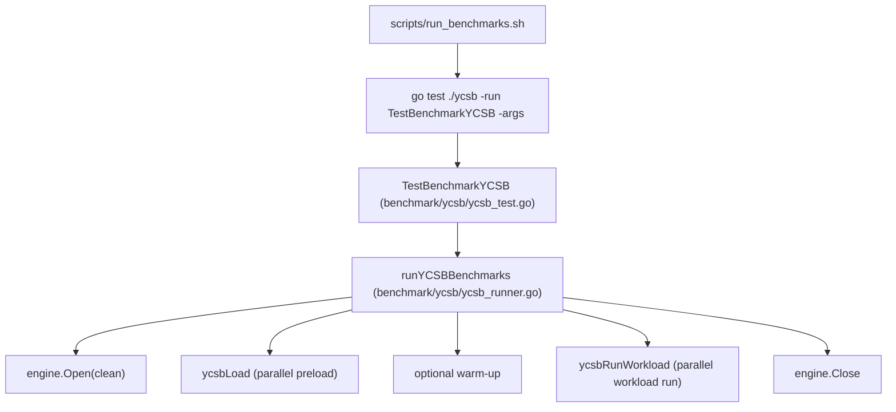

# Benchmarks

This document captures the most recent results from running the default
benchmark script (`scripts/run_benchmarks.sh`).

## YCSB Framework Overview

The benchmark harness uses the YCSB workloads (A/B/C/D/E/F) to exercise NoKV,
Badger, and Pebble by default (RocksDB is optional via build tags) with a fixed total operation count and report both
throughput and latency percentiles. The default `nokv` engine tracks the
project default memtable configuration (`art`); for explicit memtable
comparisons, NoKV can also be split into `nokv-skiplist` and `nokv-art`
variants. The default script runs a load phase to seed data, then executes each
workload and collects:
- Ops/s, average latency, and latency percentiles (P50/P95/P99)
- Operation mix counts (reads, updates, inserts, scans, read-modify-write)
- Value size stats and total data size

## Test Environment

- Machine: MacBook Pro (Apple M3 Pro)
- Memory: 36 GB

## YCSB Architecture

The YCSB harness is organized as a Go test entrypoint plus a small engine
abstraction so every storage engine is driven by the same workload generator,
key distribution, and metrics pipeline.

Flow:



Key components:

- Engine interface: `benchmark/ycsb/ycsb_engine.go` defines `Read/Insert/Update/Scan`
  and per-engine implementations live in `benchmark/ycsb/ycsb_engine_*` (including
  `nokv-skiplist` / `nokv-art` for memtable-only comparisons).
- Engine profiles: each engine is constructed from an explicit benchmark
  profile in `benchmark/ycsb/ycsb_profiles.go`; the harness does not inherit
  `local.NewDefaultOptions()` or `badger.DefaultOptions()` implicitly, which
  keeps benchmark semantics stable across runtime default changes. The default
  profile uses a 512MB total cache budget and splits it explicitly per engine:
  Pebble uses a single 512MB cache, Badger defaults to 256MB block + 256MB
  index, and NoKV defaults to 384MB block + 128MB index.
- Benchmark script defaults now pass `value_threshold=2048` unless overridden
  through `YCSB_VALUE_THRESHOLD`; `ycsb_value_size` remains `1000` by default,
  so the stock CI run still measures inline values unless the value size or
  threshold is changed explicitly.
- Workload model: `benchmark/ycsb/ycsb_runner.go` defines YCSB A/B/C/D/E/F mixes,
  request ratios, and key distributions (zipfian/uniform/latest).
- Official-aligned defaults: insert order uses `hashed`, workload E uses
  `maxscanlength` + `uniform` scan length distribution, warm-up is disabled
  by default, and value size defaults to ~1KB.
- Value generator: fixed/uniform/normal/percentile sizing with a shared buffer
  pool to reduce allocations (`valuePool`).
- Concurrency model: each workload runs with `ycsb_conc` goroutines; each op
  records latency samples and operation counts; optional global throttling is
  available via `ycsb_target_ops`.
- Workload isolation: each workload reopens and reloads the engine to avoid
  cross-workload state pollution (compaction debt/history carry-over).
- Results pipeline: summaries are printed to stdout, written as CSV under
  `data/ycsb/results`, and a text report is saved under
  `results/ycsb/ycsb_results_*.txt`.

## FSMetadata Service Evaluation

The fsmeta benchmark drives the native `nokv-fsmeta` gateway against a running
NoKV cluster. It is a service benchmark for fsmeta's server-side API surface:

- `mixed`: combined fsmeta API workload, including staged publication,
  artifact creation, checkpoint publish, writer sessions, snapshots, watch
  delivery, quota reads, links, unlinks, and directory reads.
- `checkpoint-storm`: dense checkpoint or artifact creation.
- `hotspot-fanin`: many files under one directory plus repeated `ReadDir` /
  `ReadDirPlus`.
- `watch-subtree`: notification latency after namespace mutations.
- `negative-lookup`: repeated missing dentry probes.

Prerequisites:

- a running NoKV Docker Compose cluster, or equivalent coordinator/store/fsmeta
  deployment
- the `nokv-fsmeta` gRPC endpoint reachable from the benchmark process
- the coordinator endpoint reachable for mount bootstrap

Default Docker Compose run from the repository root:

```bash
make fsmeta-bench
```

The helper starts Docker Compose with a local image build, waits for fsmeta and
coordinator ports, then writes a CSV under `benchmark/data/fsmeta/results/`.
Compose enables both `--negative-cache-dir` and `--dirpage-cache-dir` on the
fsmeta gateway. Default scale is the PR-oriented median service run: 12 clients,
16 checkpoint directories x 256 files, 4096 hotspot/watch/negative keys, and a
mixed workload with 8 groups x 64 entries x 8 artifacts. Override scale with environment
variables such as `NOKV_FSMETA_CLIENTS`, `NOKV_FSMETA_GROUPS`,
`NOKV_FSMETA_ENTRIES_PER_GROUP`, `NOKV_FSMETA_ARTIFACTS_PER_ENTRY`, and
`NOKV_FSMETA_WORKLOADS`. The script also waits 20 seconds after ports open so a
fresh Compose cluster can finish Raft leader election and coordinator grant
publication; set `NOKV_FSMETA_STABILIZE_SECONDS=0` for an already-warm cluster.
The underlying script is `scripts/run_fsmeta_benchmarks.sh`; set
`NOKV_FSMETA_PROFILE=long` for the scheduled large-data profile, or set
`NOKV_FSMETA_BENCH_MODE=derived-cache` to run the cache on/off slice with two
temporary fsmeta gateways.
`NOKV_FSMETA_ARTIFACTS_PER_ENTRY` has an effective minimum of 4 because the
mixed workload always creates `prompt.md`, `plan.json`, `state.bin`, and
`checkpoint.tmp` to exercise update, writer-session, and unlink paths.

Direct run from inside the `benchmark/` Go module:

```bash
cd benchmark
NOKV_FSMETA_BENCH=1 go test ./fsmeta -run TestBenchmarkFSMeta -count=1 -v -args \
  -fsmeta_addr 127.0.0.1:8090 \
  -fsmeta_coordinator_addr 127.0.0.1:2390,127.0.0.1:2391,127.0.0.1:2392 \
  -fsmeta_workloads mixed,checkpoint-storm,hotspot-fanin,watch-subtree,negative-lookup \
  -fsmeta_readdirplus=true
```

Native fsmeta now assigns Create inode IDs inside the fsmeta service using the
coordinator `AllocID` authority and a shard-affine allocator.

For derived-cache runs, start `nokv-fsmeta` with:

```bash
nokv-fsmeta \
  --negative-cache-dir /tmp/nokv-fsmeta-negative \
  --dirpage-cache-dir /tmp/nokv-fsmeta-dirpage
```

Then compare:

- `hotspot-fanin` with `-fsmeta_readdirplus=true` for the DirPage cache path.
- `negative-lookup` for repeated missing dentry probes and the NegativeCache path.

For a fixed on/off comparison, run the helper from the repository root after
the coordinator and stores are already up:

```bash
NOKV_FSMETA_COORDINATOR_ADDR=127.0.0.1:2390,127.0.0.1:2391,127.0.0.1:2392 \
  NOKV_FSMETA_BENCH_MODE=derived-cache scripts/run_fsmeta_benchmarks.sh
```

The helper starts two fsmeta gateways against the same cluster:

- cache-off at `127.0.0.1:8090`
- cache-on at `127.0.0.1:8091` with both `--negative-cache-dir` and
  `--dirpage-cache-dir`

It writes two CSV files named `fsmeta_derived_cache_off_*` and
`fsmeta_derived_cache_on_*` under `data/fsmeta/results/`.

The summary CSV is written under `data/fsmeta/results/` unless
`-fsmeta_output` is set. Rows include a `driver` column with the fixed value
`native-fsmeta` to identify the service driver. CI uploads these runtime outputs
as artifacts instead of committing benchmark result packages.

## Research Plotting

The `benchmark/plot` subpackage provides publication-oriented plotting helpers
for benchmark outputs. It is intended for paper figures rather than ad-hoc
console visualization:

- consistent academic theme
- colorblind-safe palette
- grouped bar charts for engine/workload comparison
- direct support for `[]BenchmarkResult`
- direct parsing of `data/ycsb/results/*.csv`
- vector output (`.svg`, `.pdf`) as well as bitmap output (`.png`)

Minimal example:

```go
package main

import (
    bench "github.com/feichai0017/NoKV/benchmark/ycsb"
    benchplot "github.com/feichai0017/NoKV/benchmark/plot"
)

func render(results []bench.BenchmarkResult) error {
    return benchplot.WriteGroupedBarChartFromResults(results, benchplot.ResultGroupedBarChartConfig{
        Metric: benchplot.MetricP95LatencyUS,
        GroupedBarChartConfig: benchplot.GroupedBarChartConfig{
            Title:  "YCSB P95 Latency",
            Output: "figures/ycsb_p95.svg",
        },
    })
}
```

If the results already exist as CSV:

```go
results, err := benchplot.ReadYCSBResultsCSV("data/ycsb/results/ycsb_results_20260416_120000.csv")
if err != nil {
    return err
}
```

Recommended usage for paper figures:

- use `.svg` during drafting for clean vector output
- group by workload or engine, not both at once in overly dense charts
- keep one figure tied to one claim
- prefer throughput, P95/P99 latency, and rebuild/materialize cost over dumping every metric

There is also a small CLI entrypoint for repeatable figure generation:

```bash
go run ./cmd/plotbench \
  -format ycsb \
  -input data/ycsb/results/ycsb_results_20260416_120000.csv \
  -metric p95_latency_us \
  -title "YCSB P95 Latency" \
  -output figures/ycsb_p95.svg
```

For namespace / metadata-service figures, use the generic `observations` CSV
format. By default the data columns are:

```text
category,series,value
steady-paginated,secondary-index,231.1
steady-paginated,repairing-read-plane,35.9
steady-paginated,strict-read-plane,35.4
```

Then render with a domain preset:

```bash
go run ./cmd/plotbench \
  -format observations \
  -preset namespace_pagination_modes \
  -input figures/namespace_latency.csv \
  -title "Steady-State Paginated Listing" \
  -output figures/namespace_latency.svg
```

The plotting path is now configuration-driven rather than preset-driven. A
single config CSV can control:

- chart title and axis labels
- figure size
- legend / grid visibility
- category / series ordering
- observation CSV column mapping

Example chart config CSV:

```text
title,Steady-State Paginated Listing
xlabel,Workload Slice
ylabel,Latency (µs)
width_in,6.8
height_in,3.9
show_grid,true
hide_legend,false
category_order,steady-paginated
series_order,secondary-index,repairing-read-plane,strict-read-plane
category_column,mode
series_column,implementation
value_column,latency_us
```

Example observation CSV using custom columns:

```text
mode,implementation,latency_us
steady-paginated,secondary-index,231.1
steady-paginated,repairing-read-plane,35.9
steady-paginated,strict-read-plane,35.4
```

Render with the generic config:

```bash
go run ./cmd/plotbench \
  -format observations \
  -config figures/steady_pagination_config.csv \
  -input figures/steady_pagination.csv \
  -output figures/steady_pagination.svg
```

Flags still override config CSV values when needed, for example:

```bash
go run ./cmd/plotbench \
  -format observations \
  -config figures/steady_pagination_config.csv \
  -input figures/steady_pagination.csv \
  -output figures/steady_pagination.svg \
  -title "Strict Listing Steady-State Comparison" \
  -hide-legend
```

Current metadata-oriented presets:

- `namespace_steady_state`
- `namespace_pagination_modes`
- `namespace_mixed_pagination`
- `namespace_deep_descendants`
- `namespace_repair_cost`
- `metadata_latency`

Run:

```bash
cd benchmark
go test ./plot ./fsmeta ./fsmeta/workload
```
