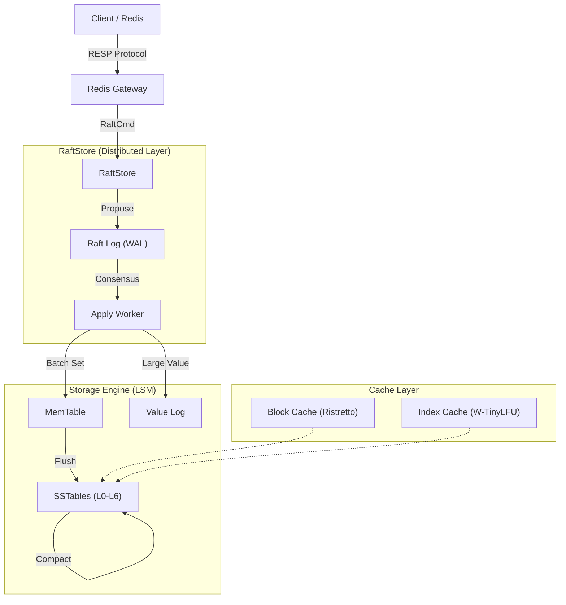

# Overview

<div align="center">
  
  <h1>NoKV</h1>
  <p style="font-size: 1.2em; color: #666;">
    <strong>High-Performance, Cloud-Native Distributed Key-Value Database</strong>
  </p>

  <p>
    <!-- Build / Quality -->
    <a href="https://github.com/feichai0017/NoKV/actions">
      
    </a>
    <a href="https://codecov.io/gh/feichai0017/NoKV">
      
    </a>
    <a href="https://goreportcard.com/report/github.com/feichai0017/NoKV">
      
    </a>
    <a href="https://pkg.go.dev/github.com/feichai0017/NoKV">
      
    </a>
    <a href="https://github.com/avelino/awesome-go#databases-implemented-in-go">
      
    </a>
    <a href="https://dbdb.io/db/nokv">
      
    </a>
  </p>

  <p>
    <!-- Meta -->
    
    
    <a href="https://deepwiki.com/feichai0017/NoKV">
      
    </a>
  </p>

  <p>
    <a href="getting_started.html" style="text-decoration: none;">
      <button style="background-color: #007bff; color: white; border: none; padding: 10px 20px; border-radius: 5px; cursor: pointer; font-size: 1em;">🚀 Quick Start</button>
    </a>
    &nbsp;&nbsp;
    <a href="architecture.html" style="text-decoration: none;">
      <button style="background-color: #6c757d; color: white; border: none; padding: 10px 20px; border-radius: 5px; cursor: pointer; font-size: 1em;">🏗️ Architecture</button>
    </a>
  </p>
</div>

<br>

---

## 🔥 Why NoKV?

NoKV is designed for **modern hardware** and **distributed workloads**. It combines the best of academic research (WiscKey, W-TinyLFU) with industrial-grade engineering (Raft, Percolator).

<div style="display: grid; grid-template-columns: repeat(auto-fit, minmax(250px, 1fr)); gap: 20px; margin-top: 20px;">

  <div style="border: 1px solid #e1e4e8; padding: 20px; border-radius: 8px; box-shadow: 0 2px 4px rgba(0,0,0,0.05); background-color: var(--bg);">
    <h3 style="margin-top: 0;">🏎️ Extreme Performance</h3>
    <p><strong>Lock-light</strong> commit queue and <strong>Batch WAL</strong> writing deliver write throughput that saturates NVMe SSDs.</p>
  </div>

  <div style="border: 1px solid #e1e4e8; padding: 20px; border-radius: 8px; box-shadow: 0 2px 4px rgba(0,0,0,0.05); background-color: var(--bg);">
    <h3 style="margin-top: 0;">🧠 Smart Caching</h3>
    <p>Built-in <strong>W-TinyLFU</strong> Block Cache (via Ristretto) and <strong>HotRing</strong> implementation ensure 99% cache hit rates and adapt to skew access patterns.</p>
  </div>

  <div style="border: 1px solid #e1e4e8; padding: 20px; border-radius: 8px; box-shadow: 0 2px 4px rgba(0,0,0,0.05); background-color: var(--bg);">
    <h3 style="margin-top: 0;">🌐 Distributed Consistency</h3>
    <p><strong>Multi-Raft</strong> replication for high availability. <strong>Percolator</strong> model for cross-row ACID transactions. Snapshot Isolation by default.</p>
  </div>

  <div style="border: 1px solid #e1e4e8; padding: 20px; border-radius: 8px; box-shadow: 0 2px 4px rgba(0,0,0,0.05); background-color: var(--bg);">
    <h3 style="margin-top: 0;">🔌 Redis Compatible</h3>
    <p>Drop-in replacement for Redis. Supports the <strong>RESP protocol</strong> so you can use your existing tools and client libraries.</p>
  </div>

</div>

<br>

## 📊 Performance Benchmark

Latest full baseline (generated on 2026-02-23 with default `make bench` profile: records=1M, ops=1M, conc=16, value_size=256, workloads A-G, engines NoKV/Badger/Pebble):

| Workload | NoKV (ops/s) | Badger (ops/s) | Pebble (ops/s) |
| :--- | ---: | ---: | ---: |
| YCSB-A | 847,660 | 396,314 | 1,282,218 |
| YCSB-B | 1,742,820 | 716,151 | 1,941,330 |
| YCSB-C | 2,070,856 | 826,766 | 847,764 |
| YCSB-D | 1,754,955 | 842,637 | 2,509,809 |
| YCSB-E | 205,489 | 41,508 | 554,557 |
| YCSB-F | 715,946 | 326,343 | 1,123,473 |
| YCSB-G | 413,521 | 399,405 | 583,584 |

<details>
<summary><em>Click to view full benchmark summary</em></summary>

```text
NoKV    YCSB-A 847660   YCSB-B 1742820  YCSB-C 2070856  YCSB-D 1754955  YCSB-E 205489  YCSB-F 715946  YCSB-G 413521
Badger  YCSB-A 396314   YCSB-B 716151   YCSB-C 826766   YCSB-D 842637   YCSB-E 41508   YCSB-F 326343  YCSB-G 399405
Pebble  YCSB-A 1282218  YCSB-B 1941330  YCSB-C 847764   YCSB-D 2509809  YCSB-E 554557  YCSB-F 1123473 YCSB-G 583584
```
</details>

Raw report: [benchmark_results_20260223_195951.txt](https://github.com/feichai0017/NoKV/blob/main/benchmark/benchmark_results/benchmark_results_20260223_195951.txt)

<br>

## 🏗️ Architecture



<div align="center">
  <sub>Built with ❤️ by <a href="https://github.com/feichai0017">feichai0017</a> and contributors.</sub>
</div>
