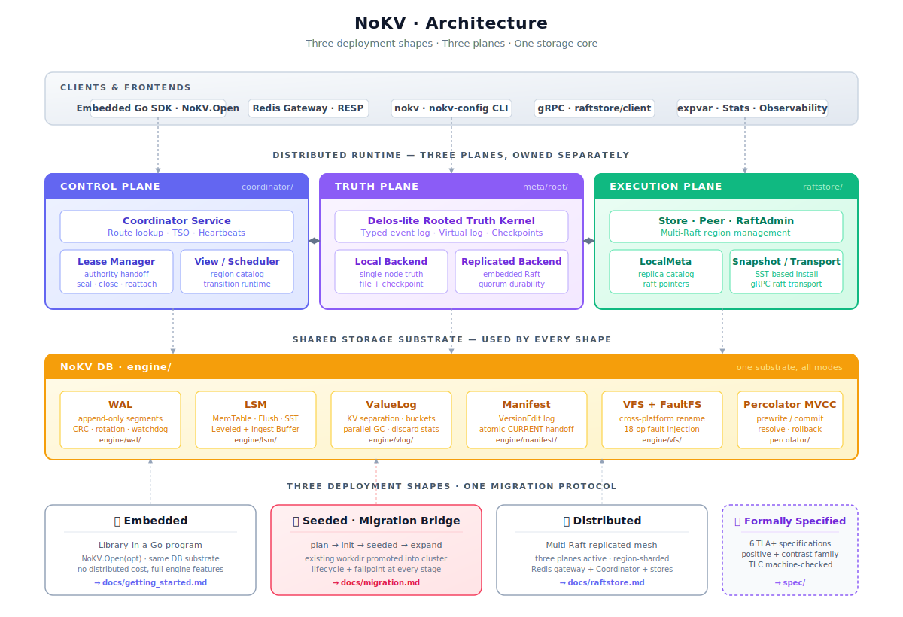

# NoKV — Documentation

<div align="center">
  

  <p><strong>A full-stack, formally-specified, distributed storage platform — built as one coherent system.</strong></p>

  <p>
    <em>Own LSM engine · Own Raft · Own control plane · Own MVCC · Own Redis frontend</em>
  </p>

  <p>
    <a href="https://github.com/feichai0017/NoKV/actions"></a>
    <a href="https://codecov.io/gh/feichai0017/NoKV"></a>
    <a href="https://goreportcard.com/report/github.com/feichai0017/NoKV"></a>
    <a href="https://pkg.go.dev/github.com/feichai0017/NoKV"></a>
    <a href="https://github.com/avelino/awesome-go#databases-implemented-in-go"></a>
    <a href="https://dbdb.io/db/nokv"></a>
  </p>

  <p>
    
    
    <a href="https://deepwiki.com/feichai0017/NoKV"></a>
  </p>
</div>

NoKV is a distributed key-value storage platform written from scratch in Go. Nothing is borrowed from another database — the LSM engine, the Raft implementation, the control plane, the MVCC layer, and the Redis-compatible frontend all live in this repository and share a single storage substrate.

The interesting part isn't the feature list. The interesting part is that **these pieces are built as one system** — embedded mode, seeded migration, and replicated Raft mode all sit on the same `DB` core, and the distinction between execution plane, control plane, and rooted truth is enforced in code, not just in documentation.

> This site is the **technical docs hub**. For a project overview, landing page, and benchmark headline, see the [root README](../README.md).

---

## 🧭 Three Modes, One Core

|  | Embedded | Seeded | Distributed |
|---|---|---|---|
| **Use case** | Library in a Go program | First node of a future cluster | Multi-Raft replicated cluster |
| **Entry point** | `NoKV.Open(opt)` | `migrate init` → `migrate plan` | `scripts/dev/cluster.sh` / `docker compose up` |
| **Data plane** | `DB` substrate | Same `DB`, plus seeded lifecycle state | Same `DB`, plus Raft apply, plus snapshots |
| **Metadata shape** | Manifest only | Manifest + local catalog + seeded mode | Manifest + local catalog + rooted truth (`meta/root`) |
| **Deep dive** | [getting_started.md](getting_started.md) | [migration.md](migration.md) | [raftstore.md](raftstore.md) |

The promotion path `Embedded → Seeded → Distributed` has explicit lifecycle state and failpoint coverage at every stage. You don't dump/reimport data when you grow the cluster — you migrate shape.

---

## 📑 If You Read Only Three Pages

Start here:

1. **[architecture.md](architecture.md)** — shortest path from "what is NoKV" to "which package owns what"
2. **[runtime.md](runtime.md)** — function-level call chains for embedded and distributed read/write paths, with sequence diagrams
3. **[control_and_execution_protocols.md](control_and_execution_protocols.md)** — the contract between the control plane (`coordinator/`), the execution plane (`raftstore/`), and rooted truth (`meta/root/`)

These three together give you the whole system's mental model.

---

## 🗺️ Read By Interest

### Storage engine internals

The single-node substrate — WAL, MemTable, flush, compaction, value log, manifest, VFS.

| Topic | Doc |
|---|---|
| High-level architecture | [architecture.md](architecture.md) |
| WAL discipline and replay | [wal.md](wal.md) |
| MemTable + ART/SkipList | [memtable.md](memtable.md) |
| Flush pipeline | [flush.md](flush.md) |
| Leveled compaction + ingest buffer | [compaction.md](compaction.md) · [ingest_buffer.md](ingest_buffer.md) |
| Value log (KV separation + GC) | [vlog.md](vlog.md) |
| Manifest semantics | [manifest.md](manifest.md) |
| Range filter | [range_filter.md](range_filter.md) |
| Block / row cache | [cache.md](cache.md) |
| VFS abstraction + FaultFS | [vfs.md](vfs.md) · [file.md](file.md) |
| Hot-key observer (HotRing) | [hotring.md](hotring.md) |
| Entry / error model | [entry.md](entry.md) · [errors.md](errors.md) |

### Distributed runtime

Raftstore, coordinator, rooted truth, migration — the distributed layer.

| Topic | Doc |
|---|---|
| Raftstore overview (store/peer/admin) | [raftstore.md](raftstore.md) |
| Coordinator (route / TSO / heartbeats) | [coordinator.md](coordinator.md) |
| **Rooted truth kernel** (`meta/root`) | [rooted_truth.md](rooted_truth.md) |
| **Namespace** (hierarchical listing) | [namespace.md](namespace.md) |
| Control-plane ↔ execution-plane contract | [control_and_execution_protocols.md](control_and_execution_protocols.md) |
| Standalone → distributed migration | [migration.md](migration.md) |
| Recovery model | [recovery.md](recovery.md) |
| Percolator MVCC 2PC | [percolator.md](percolator.md) |
| Runtime call chains | [runtime.md](runtime.md) |

### Operations and tooling

Binaries, scripts, configuration, observability.

| Topic | Doc |
|---|---|
| CLI reference (`nokv`) | [cli.md](cli.md) |
| **ccc-audit** (rooted state + reply-trace audit) | [ccc-audit.md](ccc-audit.md) |
| Redis gateway (`nokv-redis`) | [nokv-redis.md](nokv-redis.md) |
| Configuration | [config.md](config.md) |
| Scripts layout | [scripts.md](scripts.md) |
| Stats / expvar / metrics | [stats.md](stats.md) |
| Testing strategy | [testing.md](testing.md) |

### Research direction

Formal specifications and design decision records.

| Topic | Location |
|---|---|
| TLA+ specifications + contrast family | [`spec/`](../spec) · [spec/README.md](../spec/README.md) |
| Dated design decision records | [notes/README.md](notes/README.md) |

Notable design notes:

- [Why WAL is stdio and vlog/SST are mmap](notes/2026-01-16-mmap-choice.md)
- [Compaction and ingest buffer design](notes/2026-02-01-compaction-and-ingest.md)
- [Value log KV separation + HashKV buckets](notes/2026-02-05-vlog-design-and-gc.md)
- [Arena memory kernel + adaptive index (SkipList ↔ ART)](notes/2026-02-09-memory-kernel-arena-and-adaptive-index.md)
- [MPSC write pipeline with adaptive coalescing](notes/2026-02-09-write-pipeline-mpsc-and-adaptive-batching.md)
- [VFS abstraction + deterministic reliability testing](notes/2026-02-15-vfs-abstraction-and-deterministic-reliability.md)
- [Coordinator ↔ execution layering](notes/2026-03-30-coordinator-and-execution-layering.md)
- [SST-based snapshot install](notes/2026-03-31-sst-snapshot-install.md)
- [Delos-lite rooted-truth roadmap](notes/2026-04-03-delos-lite-metadata-root-roadmap.md)
- [Range filter — from GRF, but not quite](notes/2026-04-05-range-filter-from-grf.md)

---

## 🏗️ Architecture at a Glance

<p align="center">
  
</p>

**Four boundaries that set NoKV apart from typical single-purpose KV prototypes:**

- **One storage core, two deployment shapes.** Embedded and distributed modes sit on the same `DB` substrate.
- **Migration is a protocol, not a hack.** `plan → init → seeded → expand` has explicit lifecycle state and failpoint coverage.
- **Execution plane / control plane split.** `raftstore/` executes writes; `coordinator/` owns routing, TSO, heartbeats; `meta/root/` is the rooted truth both consume. They never share mutable state.
- **Recovery metadata is partitioned.** Manifest (storage), local catalog (Raft), raft durable log, logical region snapshots — each owns a distinct slice of durable state.

---

## ⚡ Quick Start

Everything hangs off one topology file: [`raft_config.example.json`](../raft_config.example.json).

```bash
# 1. Build binaries
make build

# 2. Launch a three-node cluster with Coordinator + Redis gateway
./scripts/dev/cluster.sh --config ./raft_config.example.json

# 3. Point a Redis client at the gateway
redis-cli -p 6380 set hello world
redis-cli -p 6380 get hello

# 4. Inspect live runtime
go run ./cmd/nokv stats --expvar http://127.0.0.1:9100
go run ./cmd/nokv regions --workdir ./artifacts/cluster/store-1 --json
```

Full walkthrough: [getting_started.md](getting_started.md).

---

## 🔗 Jump Points

| | |
|---|---|
| **[CLI surface](cli.md)** | Commands for stats, manifest, regions, vlog, migrate |
| **[Topology config](config.md)** | One JSON file shared by scripts, Docker, and CLI |
| **[Scripts layout](scripts.md)** | Local cluster, bootstrap, ops helpers |
| **[Coordinator](coordinator.md)** | Route / TSO / heartbeat service |
| **[Percolator / MVCC](percolator.md)** | 2PC primitives in distributed mode |
| **[Runtime call chains](runtime.md)** | Function-level sequence diagrams |
| **[Testing](testing.md)** | Failpoints, chaos, restart, migration matrix |
| **[SUMMARY.md](SUMMARY.md)** | Full mdbook table of contents |

---

<div align="center">
  <sub>Built from scratch — no external storage engine, no external Raft library, no external coordinator.</sub>
</div>
