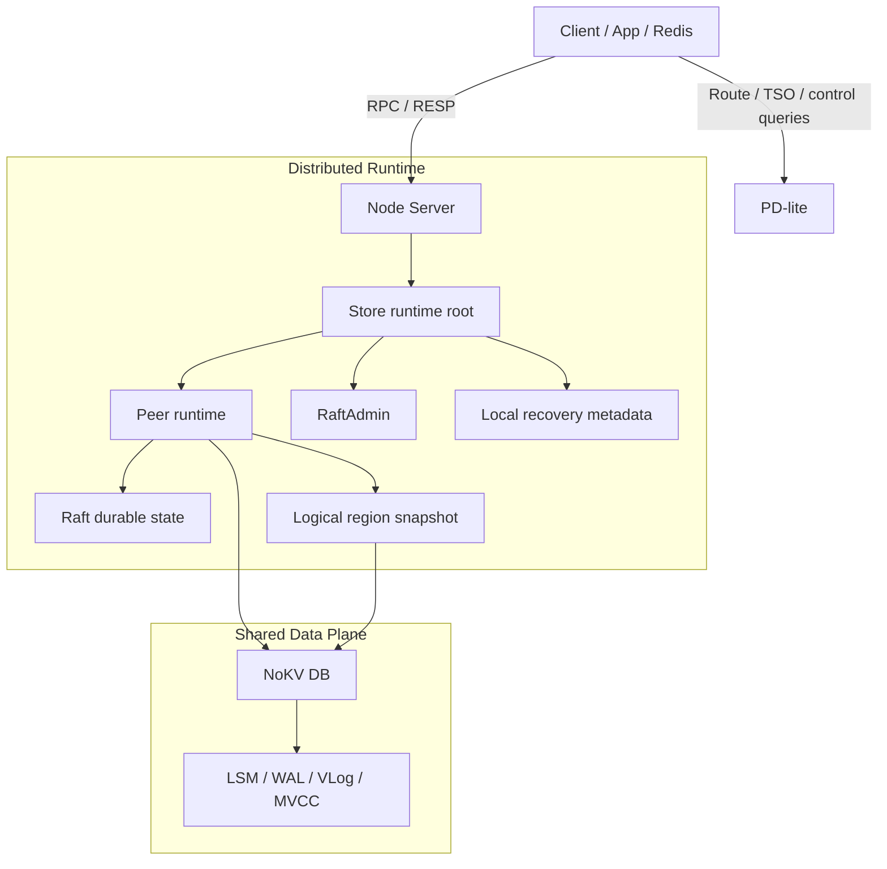

# Overview

  

    

      

        
      

      

        
Distributed KV, Built As One System

        <h1>NoKV</h1>
      

    

  

  

    NoKV is a storage system that starts as a serious standalone engine and grows into
    a multi-Raft distributed key-value database without changing its underlying data
    plane. The interesting part is not just the API surface. It is the bridge:
    WAL, LSM, MVCC, control plane, migration, and replication all live in one coherent
    design.
  

  

    

      <strong>Standalone to Cluster</strong>
      Seed a distributed region from an existing workdir and keep the same storage substrate.
    

    

      <strong>Correctness First</strong>
      Mode gates, logical region snapshots, recovery metadata, and execution/control-plane split.
    

    

      <strong>Tested as a System</strong>
      Migration flow, restart recovery, PD degradation, transport chaos, and publish-boundary failpoints.
    

  

  

    
    
    
    
    
    
  

  

    <a class="cta-button primary" href="getting_started.html">Quick Start</a>
    <a class="cta-button secondary" href="architecture.html">Architecture</a>
    <a class="cta-button secondary" href="migration.html">Migration</a>
  

  

    Built around Go, WAL + LSM storage, Percolator-style MVCC, multi-Raft replication,
    PD-lite control plane, and a formal standalone-to-cluster migration path.
  

What Matters

## Why NoKV

  

    <h3>One data plane, two deployment shapes</h3>
    
NoKV does not fork into separate standalone and distributed engines. The distributed layer grows on top of the same underlying DB workdir.

    <small>That is why migration can be a protocol instead of a dump/import afterthought.</small>
  

  

    <h3>Replication with clear ownership</h3>
    
<code>Store</code> owns the node runtime, <code>Peer</code> owns a region replica runtime, <code>RaftAdmin</code> is the execution plane, and PD stays in the control plane.

    <small>The system avoids mixing local truth, local recovery metadata, and cluster control metadata.</small>
  

  

    <h3>Logical region snapshots</h3>
    
Raft durable snapshot metadata is split from logical region state snapshots, which keeps migration, add-peer install, and recovery semantics clean.

    <small>This is a correctness-first design, not a one-shot performance shortcut.</small>
  

  

    <h3>System-level validation</h3>
    
The project is tested beyond unit semantics: migration flow, restart safety, degraded PD behavior, transport chaos, and context propagation are all exercised.

    <small>The goal is to verify lifecycle and recovery behavior, not just happy-path RPCs.</small>
  

  Benchmark methodology and result snapshots live in <a href="../benchmark/README.md"><code>../benchmark/README.md</code></a>. The docs site keeps architecture and operating guidance separate from benchmark storytelling.

Read This Next

## Documentation Guide

  

    <h3><a href="getting_started.html">Getting Started</a></h3>
    
Run NoKV locally, understand the topology file, and boot your first store or local cluster.

  

  

    <h3><a href="raftstore.html">Raftstore</a></h3>
    
Read the distributed runtime layout: server wiring, store ownership, peer lifecycle, snapshots, and recovery surfaces.

  

  

    <h3><a href="migration.html">Migration</a></h3>
    
Follow the standalone → seeded → cluster path, including logical snapshot export/install and membership rollout.

  

  

    <h3><a href="testing.html">Testing</a></h3>
    
See how deterministic integration, failpoints, restart recovery, and distributed fault matrix coverage are organized.

  

Common Paths

## Jump Points

  <a class="quicklink" href="cli.html">CLI surface</a>
  <a class="quicklink" href="config.html">Topology config</a>
  <a class="quicklink" href="scripts.html">Scripts layout</a>
  <a class="quicklink" href="pd.html">PD-lite</a>
  <a class="quicklink" href="percolator.html">Percolator / MVCC</a>
  <a class="quicklink" href="runtime.html">Runtime call chains</a>

Layer View

## Architecture Sketch

```mermaid
%%{init: {
  "themeVariables": { "fontSize": "18px" },
  "flowchart": { "nodeSpacing": 45, "rankSpacing": 62, "curve": "basis" }
}}%%
graph TD
    Client["Client / App / Redis"] -->|RPC / RESP| Server["Node Server"]
    Client -->|Route / TSO / control queries| PD["PD-lite"]

    subgraph "Distributed Runtime"
        Server --> Store["Store runtime root"]
        Store --> Peer["Peer runtime"]
        Store --> Admin["RaftAdmin"]
        Store --> Meta["Local recovery metadata"]
        Peer --> Raft["Raft durable state"]
        Peer --> Snap["Logical region snapshot"]
    end

    subgraph "Shared Data Plane"
        Peer --> DB["NoKV DB"]
        Snap --> DB
        DB --> LSM["LSM / WAL / VLog / MVCC"]
    end
```

  The central design choice is simple: NoKV is not a separate standalone engine and distributed product glued together later. The distributed system is built over the same storage core, with migration and snapshot semantics made explicit instead of implicit.

