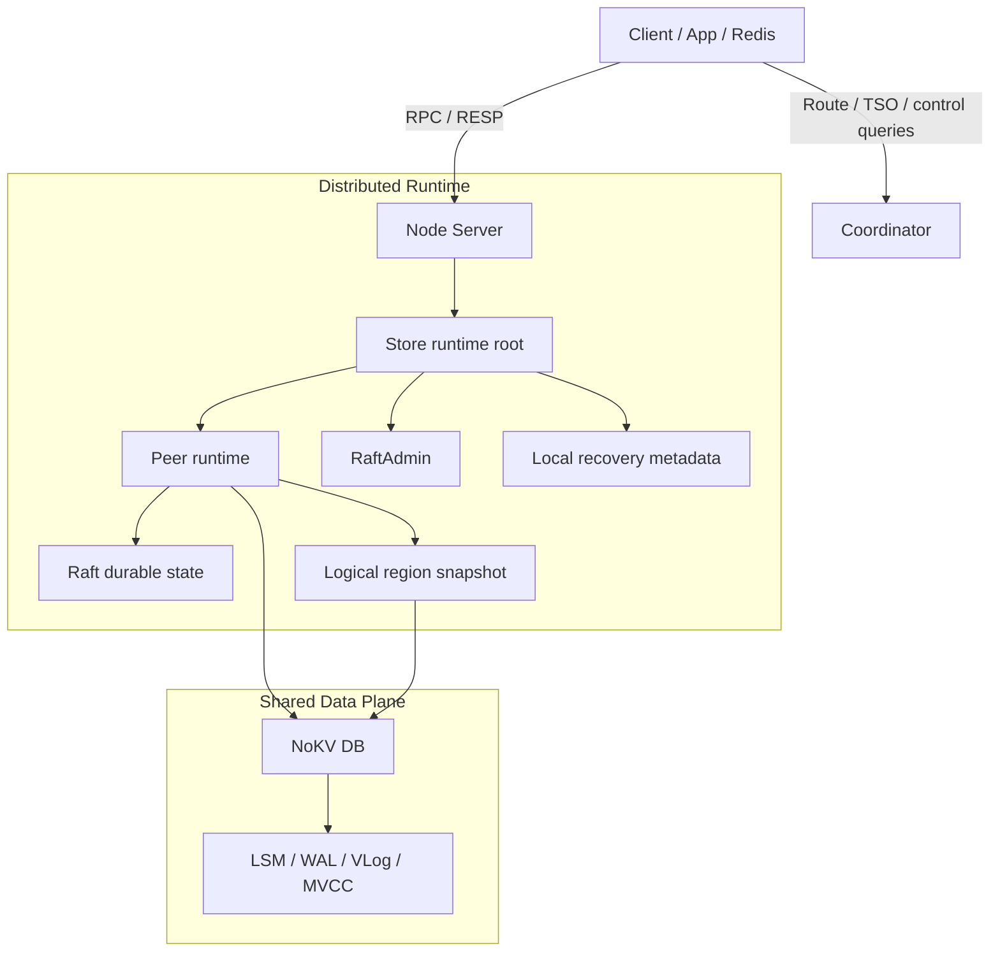

# Overview

<div class="hero">
  <div class="hero-top">
    <div class="hero-brand">
      <div class="hero-logo">
        
      </div>
      <div>
        <p class="hero-kicker">Distributed Storage Research Platform, Built As One System</p>
        <h1>NoKV</h1>
      </div>
    </div>
    <div class="hero-signal-panel">
      <span class="hero-panel-kicker">Launch View</span>
      <div class="hero-panel-grid">
        <div class="hero-panel-metric">
          <strong>Embedded</strong>
          <span>Use <code>NoKV.Open</code> as a serious local engine.</span>
        </div>
        <div class="hero-panel-metric">
          <strong>Seeded</strong>
          <span>Promote an existing workdir into a distributed seed.</span>
        </div>
        <div class="hero-panel-metric">
          <strong>Replicated</strong>
          <span>Roll out peers, move leaders, and verify recovery.</span>
        </div>
      </div>
    </div>
  </div>

  <p class="hero-lead">
    NoKV starts as a serious standalone engine and grows into a multi-Raft distributed
    KV database without swapping out its storage core. That is the hook: WAL, LSM,
    MVCC, migration, replication, and control-plane behavior are treated as one system,
    not a pile of loosely connected features.
  </p>

  <p class="hero-lead">
    The project is also intended to be a maintainable and extensible research platform:
    one repository where engine internals, distributed runtime, control-plane logic,
    experiments, and system papers can evolve together without collapsing into ad-hoc
    prototypes.
  </p>

  <div class="hero-summary">
    <div class="hero-stat">
      <strong>Standalone to Cluster</strong>
      <span>Seed a distributed region from an existing workdir and keep the same storage layer.</span>
    </div>
    <div class="hero-stat">
      <strong>Correctness First</strong>
      <span>Mode gates, logical region snapshots, recovery metadata, and execution/control-plane split.</span>
    </div>
    <div class="hero-stat">
      <strong>Tested as a System</strong>
      <span>Migration flow, restart recovery, Coordinator degradation, transport chaos, and publish-boundary failpoints.</span>
    </div>
    <div class="hero-stat">
      <strong>Built To Evolve</strong>
      <span>Clear package layering, experiment tooling, and architecture docs make the repo usable as a long-lived systems research base.</span>
    </div>
  </div>

  <div class="badge-row">
    <a href="https://github.com/feichai0017/NoKV/actions">
      
    </a>
    <a href="https://codecov.io/gh/feichai0017/NoKV">
      
    </a>
    <a href="https://goreportcard.com/report/github.com/feichai0017/NoKV">
      
    </a>
    <a href="https://pkg.go.dev/github.com/feichai0017/NoKV">
      
    </a>
    <a href="https://dbdb.io/db/nokv">
      
    </a>
    <a href="https://deepwiki.com/feichai0017/NoKV">
      
    </a>
  </div>

  <div class="cta-zone">
    <div class="cta-copy">
      <span class="cta-kicker">Start Here</span>
      <p>Run a local cluster first, then follow the standalone → seeded → cluster path.</p>
    </div>
    <div class="cta-row">
      <a class="cta-button primary" href="getting_started.html">Quick Start</a>
      <a class="cta-button secondary" href="architecture.html">Architecture</a>
      <a class="cta-button secondary" href="migration.html">Migration</a>
    </div>
  </div>

  <p class="hero-footer">
    Built around Go, WAL + LSM storage, Percolator-style MVCC, multi-Raft replication,
    Coordinator control plane, and a formal standalone-to-cluster migration path.
  </p>
</div>

<div class="project-masthead">
  <div class="masthead-panel">
    <span class="masthead-kicker">What You Can Actually Do</span>
    <h3>Use NoKV in three different ways</h3>
    <ul>
      <li>Embed it locally through <code>NoKV.Open</code>.</li>
      <li>Start a multi-node cluster with <code>scripts/dev/cluster.sh</code>.</li>
      <li>Take an existing standalone workdir and migrate it into a replicated region.</li>
    </ul>
  </div>
  <div class="masthead-panel">
    <span class="masthead-kicker">What To Look For</span>
    <h3>What makes this project worth reading</h3>
    <ul>
      <li>One storage layer instead of separate standalone and distributed engines.</li>
      <li>Formal lifecycle and migration protocol instead of dump/import glue.</li>
      <li>System-level verification under restart, degraded Coordinator, chaos, and failpoints.</li>
      <li>A package structure designed to keep the codebase maintainable as a research platform, not just a one-off prototype.</li>
    </ul>
  </div>
</div>

<span class="section-kicker">What Matters</span>

## Why NoKV

<div class="why-layout">
  <div class="why-intro">
    <span class="why-kicker">Three reasons this project is interesting</span>
    <h3>NoKV is not trying to be a feature checklist.</h3>
    <p>It is trying to answer a narrower and harder question well: can one storage core grow from an embedded engine into a distributed multi-Raft KV without turning migration, metadata, and recovery into glue code?</p>
    <ul class="why-points">
      <li>One storage layer across standalone and distributed modes.</li>
      <li>Explicit lifecycle and migration semantics instead of hidden bootstrap magic.</li>
      <li>Verification aimed at restart, degraded control plane, and publish-boundary correctness.</li>
      <li>Code, benchmarks, and documentation are organized so new research directions can be added without re-deriving the whole system.</li>
    </ul>
  </div>

  <div class="feature-grid">
    <div class="feature-card">
      <span class="feature-eyebrow">Storage Story</span>
      <h3>One data plane, two deployment shapes</h3>
      <p>NoKV does not fork into separate standalone and distributed engines. The distributed layer grows on top of the same underlying DB workdir.</p>
      <small>That is why migration can be a protocol instead of a dump/import afterthought.</small>
    </div>
    <div class="feature-card">
      <span class="feature-eyebrow">Runtime Ownership</span>
      <h3>Replication with clear ownership</h3>
      <p><code>Store</code> owns the node runtime, <code>Peer</code> owns a region replica runtime, <code>RaftAdmin</code> is the execution plane, and Coordinator stays in the control plane.</p>
      <small>The system avoids mixing local truth, local recovery metadata, and cluster control metadata.</small>
    </div>
    <div class="feature-card">
      <span class="feature-eyebrow">Migration Primitive</span>
      <h3>Logical region snapshots</h3>
      <p>Raft durable snapshot metadata is split from logical region state snapshots, which keeps migration, add-peer install, and recovery semantics clean.</p>
      <small>This is a correctness-first design, not a one-shot performance shortcut.</small>
    </div>
    <div class="feature-card">
      <span class="feature-eyebrow">Validation Surface</span>
      <h3>System-level validation</h3>
      <p>The project is tested beyond unit semantics: migration flow, restart safety, degraded Coordinator behavior, transport chaos, and context propagation are all exercised.</p>
      <small>The goal is to verify lifecycle and recovery behavior, not just happy-path RPCs.</small>
    </div>
    <div class="feature-card">
      <span class="feature-eyebrow">Research Substrate</span>
      <h3>A codebase meant to keep growing</h3>
      <p>The repository separates engine substrate, distributed runtime, control-plane components, benchmark tooling, and design documentation so new systems ideas can be implemented without turning the tree into a disposable artifact.</p>
      <small>This is a platform for iterative storage research, not only a fixed implementation snapshot.</small>
    </div>
  </div>
</div>

<span class="section-kicker">Platform Goal</span>

## NoKV As A Research Platform

NoKV is intended to serve as a long-lived platform for storage and distributed-systems research.

- `engine/*` holds the single-node storage substrate: WAL, LSM, manifest, value log, file/VFS primitives.
- `raftstore/*`, `meta/*`, and `coordinator/*` hold distributed execution and control-plane components.
- `benchmark/*` holds experiment code and result-generation paths so evaluations stay close to implementation changes.
- The docs tree is part of the platform contract: architecture, migration, recovery, testing, and benchmarking expectations are documented alongside code.

The point is not only to run NoKV as a system today, but to make it practical to:

- test new storage-engine mechanisms,
- evolve metadata and control-plane designs,
- compare distributed execution protocols,
- and publish repeatable systems experiments from the same repository.

<div class="benchmark-note">
  Benchmark methodology and result snapshots live in <a href="../benchmark/README.md"><code>../benchmark/README.md</code></a>. The docs site keeps architecture and operating guidance separate from benchmark storytelling.
</div>

<span class="section-kicker">Fastest Path</span>

## Try NoKV In Five Minutes

<div class="launchpad">
  <div class="launchpad-copy">
    <span class="launchpad-kicker">Fastest Demo Loop</span>
    <h3>Boot a cluster, front it with Redis, inspect the runtime.</h3>
    <p>If you only want one practical path, this is the shortest route from clone to “I can see the system running”. It uses the local cluster helper, the Redis-compatible gateway, and the built-in runtime inspection commands.</p>
    <div class="launchpad-tags">
      <span class="tag-pill">local cluster</span>
      <span class="tag-pill">redis gateway</span>
      <span class="tag-pill">runtime inspect</span>
    </div>
  </div>
  <div class="launchpad-steps">
    <div class="launch-step">
      <strong>01</strong>
      <div>
        <h4>Start the cluster</h4>
        <p>Use the shared topology file and bring up the local Coordinator + store layout.</p>
      </div>
    </div>
    <div class="launch-step">
      <strong>02</strong>
      <div>
        <h4>Expose a familiar interface</h4>
        <p>Run the Redis-compatible gateway so you can talk to NoKV with an off-the-shelf client.</p>
      </div>
    </div>
    <div class="launch-step">
      <strong>03</strong>
      <div>
        <h4>Inspect the system</h4>
        <p>Query stats and region ownership so the demo ends with visibility instead of blind writes.</p>
      </div>
    </div>
  </div>
</div>

```bash
# 1. Start a local cluster from the shared topology file
./scripts/dev/cluster.sh --config ./raft_config.example.json

# 2. In another terminal, front it with the Redis-compatible gateway
go run ./cmd/nokv-redis \
  --addr 127.0.0.1:6380 \
  --raft-config ./raft_config.example.json

# 3. Talk to NoKV with any Redis client
redis-cli -p 6380 set hello world
redis-cli -p 6380 get hello

# 4. Inspect the running cluster
go run ./cmd/nokv stats --expvar http://127.0.0.1:9100
go run ./cmd/nokv regions --workdir ./artifacts/cluster/store-1
```

<span class="section-kicker">Read This Next</span>

## Documentation Guide

If you only read three pages, read these first:

1. <a href="getting_started.html"><strong>Getting Started</strong></a> for the shortest path to a running cluster.
2. <a href="raftstore.html"><strong>Raftstore</strong></a> for runtime ownership and distributed boundaries.
3. <a href="migration.html"><strong>Migration</strong></a> for the standalone → cluster bridge that makes NoKV distinct.

<div class="doc-grid">
  <div class="doc-card">
    <h3><a href="getting_started.html">Getting Started</a></h3>
    <p>Run NoKV locally, understand the topology file, and boot your first store or local cluster.</p>
  </div>
  <div class="doc-card">
    <h3><a href="raftstore.html">Raftstore</a></h3>
    <p>Read the distributed runtime layout: server wiring, store ownership, peer lifecycle, snapshots, and recovery surfaces.</p>
  </div>
  <div class="doc-card">
    <h3><a href="migration.html">Migration</a></h3>
    <p>Follow the standalone → seeded → cluster path, including SST snapshot install and membership rollout.</p>
  </div>
  <div class="doc-card">
    <h3><a href="testing.html">Testing</a></h3>
    <p>See how deterministic integration, failpoints, restart recovery, and distributed fault matrix coverage are organized.</p>
  </div>
</div>

<span class="section-kicker">Choose Your Route</span>

## Read By Interest

<div class="path-grid">
  <div class="path-card">
    <h3>Storage Engine</h3>
    <p>Read this route if you care about WAL discipline, MemTable/flush, manifest semantics, and ValueLog GC.</p>
    <p><a href="architecture.html">Architecture</a> · <a href="wal.html">WAL</a> · <a href="flush.html">Flush</a> · <a href="vlog.html">Value Log</a></p>
  </div>
  <div class="path-card">
    <h3>Distributed Runtime</h3>
    <p>Read this route if Store/Peer ownership, transport, snapshots, and Coordinator are the parts you want to reason about.</p>
    <p><a href="raftstore.html">Raftstore</a> · <a href="coordinator.html">Coordinator</a> · <a href="runtime.html">Runtime</a></p>
  </div>
  <div class="path-card">
    <h3>Migration & Operations</h3>
    <p>Read this route if the bridge from standalone workdir to replicated region is the part you want to demo or operate.</p>
    <p><a href="migration.html">Migration</a> · <a href="scripts.html">Scripts</a> · <a href="cli.html">CLI</a></p>
  </div>
  <div class="path-card">
    <h3>Testing & Validation</h3>
    <p>Read this route if you want to see how NoKV verifies correctness under restart, degraded Coordinator, chaos, and failpoint boundaries.</p>
    <p><a href="testing.html">Testing</a> · <a href="notes/README.html">Notes</a></p>
  </div>
</div>

<span class="section-kicker">Common Paths</span>

## Jump Points

<div class="quicklink-grid">
  <a class="quicklink" href="cli.html">CLI surface</a>
  <a class="quicklink" href="config.html">Topology config</a>
  <a class="quicklink" href="scripts.html">Scripts layout</a>
  <a class="quicklink" href="coordinator.html">Coordinator</a>
  <a class="quicklink" href="percolator.html">Percolator / MVCC</a>
  <a class="quicklink" href="runtime.html">Runtime call chains</a>
</div>

<span class="section-kicker">Layer View</span>

## Architecture Sketch


```mermaid
%%{init: {
  "themeVariables": { "fontSize": "18px" },
  "flowchart": { "nodeSpacing": 45, "rankSpacing": 62, "curve": "basis" }
}}%%
graph TD
    Client["Client / App / Redis"] -->|RPC / RESP| Server["Node Server"]
    Client -->|Route / TSO / control queries| Coordinator["Coordinator"]

    subgraph "Distributed Runtime"
        Server --> Store["Store runtime root"]
        Store --> Peer["Peer runtime"]
        Store --> Admin["RaftAdmin"]
        Store --> Meta["Local recovery metadata"]
        Peer --> Raft["Raft durable state"]
        Peer --> Snap["Logical region snapshot"]
    end

    subgraph "Shared Data Plane"
        Peer --> DB["NoKV DB"]
        Snap --> DB
        DB --> LSM["LSM / WAL / VLog / MVCC"]
    end
```

<div class="arch-callout">
  The central design choice is simple: NoKV is not a separate standalone engine and distributed product glued together later. The distributed system is built over the same storage core, with migration and snapshot semantics made explicit instead of implicit.
</div>
