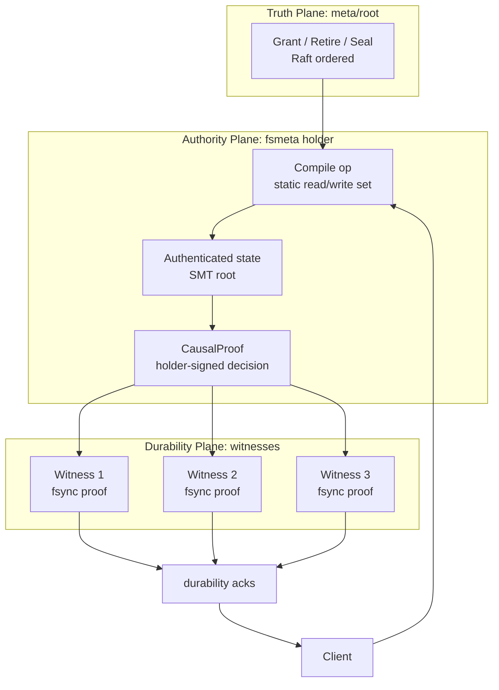

# Apodeixis 研究评审

状态：研究评审草稿，尚未实现。

最后更新：2026-05-11。

## 0. 结论

Apodeixis 值得继续做，但不能按“无共识提交所以更快”来写。这个说法不准确，也挡不住审稿人。

更稳的说法是：

> Apodeixis 把传统 SMR 里绑在一起的三件事拆开：authority transition 仍由 `meta/root` 共识排序；epoch 内的 per-op decision 由 holder 产生可验证 proof；durability 由 witness fsync 复制保证。这样 per-op commit 从一个 cluster-internal log fact 变成 portable cryptographic fact。

这条线的价值不主要在单次写延迟。holder 仍然要等 witness durability ack，正常路径仍然是一轮复制。真正的价值在：

- cross-region / cross-service 可验证提交事实；
- authority scope 横向扩展；
- proof chain 自带审计；
- Raft 从 per-op ordering 退到 epoch grant / retire / seal；
- fsmeta 这类静态 metadata algebra 可以机械判断 fast-path eligibility。

当前最大风险有两个：

1. **commit 边界必须定义清楚。** 一阶段 proof 会产生 timeout ambiguity；两阶段 CommitCertificate 更干净但多一轮。
2. **workload sensitivity 必须实测。** 如果真实 fsmeta trace 里 fast-path eligibility 低于 60%，论文动机会明显变弱。

## 1. 研究问题是否真实

真实。当前 replicated metadata 系统普遍把几类责任绑在同一条 replicated log 上：

- 全序排序；
- leader / holder 互斥；
- 持久化复制；
- 原子提交边界；
- 可见性传播；
- 审计和 replay。

CURP 已经明确指出，传统复制协议把 ordering 和 durability 绑在一起，导致常见写路径要等 2 RTT；它用 commutativity 把未排序请求先复制出去，在可交换窗口里做到 1 RTT。NoKV 的 fsmeta workload 有更强的结构：大多数操作的 read-set / write-set 可以由请求静态推出，authority scope 也能由 mount / bucket / parent / inode 范围表达。

所以问题不是“能不能省掉所有共识”。问题应该改成：

> 对 authority-bounded、静态可编译的 metadata workload，能不能把 per-op ordering 从 replicated log 中移走，只保留 coarse-grained authority consensus？

这个问题成立，而且和 NoKV 已有结构匹配：`meta/root` 已经是 rooted truth，Capsule authority grant 已经在当前分支里有 root/coordinator/fsmeta/runtime 骨架。

## 2. Apodeixis 的最小正确形态



Apodeixis 不能只靠签名。签名只证明“合法 holder 做出了某个 decision”。系统 commit 还需要 durability boundary。

建议把 proof 定义成两层：

```text
CausalProof:
  epoch_ref
  op_id
  old_state_root
  predicate_merkle_proofs
  write_effects
  new_state_root
  causal_predecessors
  holder_signature

DurabilityEvidence:
  witness_id
  epoch_id
  op_id
  proof_digest
  wal_position
  fsync_epoch
  witness_signature_or_authenticated_ack
```

然后 commit predicate 明确写成：

```text
Committed(op) :=
  ValidCausalProof(op)
  AND DurableEnough(op)
  AND EpochNotRetiredBefore(op)
```

其中 `DurableEnough` 有两种可选语义。

### 2.1 一阶段语义

holder 签 `CausalProof`，复制到 f+1 witnesses，收到足够 durability ack 后返回 client。

恢复规则：

```text
replay(op) iff a valid proof survives on any witness
```

优点：

- 只需要一轮 witness 复制；
- 比 Capsule 两阶段 CommitCert 更低延迟；
- 协议结构更简单。

代价：

- holder crash 后，successor 可能 replay 一个 client 没收到 success 的 op；
- client timeout 必须视为 ambiguous；
- `OpID` 幂等重试必须是协议的一部分，不能当实现细节。

这不是错误。Raft 也会出现“server committed but client did not receive reply”的模糊边界。RIFL 的核心动机正是处理这种 retry/re-execution 问题。

### 2.2 两阶段语义

holder 先写 PrepareProof，再写 CommitCertificate。恢复时只 replay CommitCertificate。

恢复规则：

```text
replay(op) iff a valid CommitCertificate survives
```

优点：

- “client-observed success” 和恢复边界更接近；
- dropped prepare 不会进入 state；
- 更容易给审稿人解释。

代价：

- 多一轮或半轮；
- 结构上更像 2PC；
- 跟 Capsule v2 接近，Apodeixis 的独特性会变弱。

### 2.3 推荐路线

研究上保留一阶段 Apodeixis，但必须显式承认 timeout ambiguity，并用 OpID / completion record / retry rendezvous 证明它不破坏 linearizability。

工程上可以先保留当前 Capsule two-phase skeleton，因为它更适合作为安全基线。等 TLA+ 模型跑通一阶段规则后，再决定是否从 Capsule 收敛到 Apodeixis。

## 3. CCF 对比

Microsoft CCF 的 receipt 是最危险的 prior art，也是最有用的参照。

CCF receipt 的定位是：一个 signed proof，证明某个 transaction 在 ledger 的某个位置产生了结果，并可被第三方离线验证。CCF 文档明确说 receipt 可以 endorsement application claims，也可配合 ledger 或其他 receipt 做 audit。

但 CCF 还明确拒绝 early receipt：ledger entry 可能已经本地写出但还没复制提交，如果这时生成 receipt，恶意 primary 可以给一个后来 rollback 的 transaction 发 receipt。CCF 因此要求 receipt 包含 `commit_evidence`；文档说它保证 transaction 已 committed。

Apodeixis 能区分自己的地方：

- CCF 是 BFT/consortium setting，primary 可能恶意；
- Apodeixis 是 CFT，holder 不 Byzantine，但会 crash；
- CCF 的 receipt 绑定 consensus commit；
- Apodeixis 的 proof 绑定 root-issued authority epoch + witness durability；
- CCF 的 commit fact 仍来自 ledger consensus；
- Apodeixis 想把 per-op commit fact 外化成 holder proof + durability evidence。

这一区分能站住，但必须避免夸张：

- 不能说 CCF 的 reject 对 Apodeixis 无关；
- 应该说 CCF reject 的核心教训被接受了：receipt 不能早于 recoverable commit；
- Apodeixis 的 recoverable commit 使用 CFT 下的 witness durability evidence。

一句能写进论文的表述：

> CCF prevents unverifiable early receipts by binding receipts to post-consensus commit evidence. Apodeixis targets a different fault model and authority structure: a root-granted crash-fault holder may issue a decision proof, but the proof is not client-visible success until it is durably witnessed. The receipt boundary is therefore recoverability, not local execution.

## 4. Prior Art 地图

| 系统 / 论文 | 它解决什么 | 和 Apodeixis 的关系 | Apodeixis 必须避开的 claim |
|---|---|---|---|
| CURP | 把 unordered commutative requests 先复制给 witnesses，常见写 1 RTT | 最接近 hot-path 结构；ordering/durability 拆分已经被它讲过 | 不能宣称“首次把 ordering 和 durability 分离” |
| CCF receipts | committed transaction 的可验证 receipt 和 audit | 最接近 cryptographic receipt / audit framing | 不能生成 early receipt，必须绑定 recoverable commit |
| RIFL | client retry 下的 exactly-once / completion record | Apodeixis timeout ambiguity 必须借鉴这套语义 | 不能把 OpID 幂等当工程优化 |
| TAPIR | replication 不提供 consistency，transaction protocol 提供 consistency | 类似“把 consistency 从 replication layer 挪走” | 不能宣称“首次把 consistency 移出 replication” |
| Calvin | 先排序再执行，减少 distributed commit | 相反方向：把 ordering 前置；Apodeixis 把 per-op ordering 局部化/证明化 | 不能把静态 read/write set 当新发现 |
| FuzzyLog | partial-order shared log，用 DAG 替代全局 total order | 和 conflict DAG / causal predecessors 接近 | 不能宣称 partial order log 是新的 |
| Certificate Transparency | Merkle append-only log，第三方可审计 | proof chain / seal audit 的基础材料 | 不能把 Merkle audit 当创新 |
| SUNDR / Depot | untrusted storage 下的 fork consistency / fork-join-causal | 证明“签名 + hash chain + fork detection”是老路线 | Apodeixis 应强调 CFT metadata SMR，不是 untrusted storage |
| HopsFS | 用 NewSQL 数据库扩展文件系统 metadata | 外部 metadata baseline | Apodeixis 不能只比 HDFS/Ceph，要对比数据库化 metadata |
| InfiniFS | directory metadata 解耦、speculative path、client cache | fsmeta 性能 baseline | Apodeixis 的性能 claim 要覆盖 cache/speculative path 后的增益 |
| SwitchFS | 异步 metadata update + programmable switch 维持 POSIX 语义 | 最新 metadata async baseline | Apodeixis 不能只讲 async；要讲 proof/audit/authority |

## 5. Apodeixis 的真实创新边界

### 5.1 站得住的创新

1. **Cryptographic commit fact for CFT metadata**

   把 per-op commit 从“某个 replicated log 里的位置”变成“root 授权 holder 签发、witness durability 证明可恢复”的可携带对象。

2. **Authority-epoch consensus granularity**

   共识只排序 grant / retire / seal，epoch 内的 metadata mutation 不进 per-op consensus log。

3. **Static metadata algebra as admission contract**

   fsmeta operation compiler 明确给出 read predicates、write effects、authority scope、slow reason。不能静态证明的操作留在 Percolator/Raft slow path。

4. **Audit closure**

   CapsuleSeal / Apodeixis seal 是 proof chain 的审计边界。Raft entry 记录 epoch summary，而不是每个 op。

5. **Cross-region verifiability**

   一个 region 产生的 metadata proof 可以被另一个 region 验证，不需要把两个 region 拉进同一个共识组。这里才是天花板。

### 5.2 站不住的创新

下面这些不要写成主要贡献：

- “不需要共识”：不准确。root grant / retire / seal 仍然共识。
- “写延迟 10x”：没有足够依据。正常复制路径仍然 1 RTT + fsync。
- “首次分离 ordering 和 durability”：CURP 已经做了。
- “首次用 Merkle proof 做 receipt”：CCF / CT / SUNDR 都是强 prior art。
- “witness 不投票”：如果 witness ack 进入 commit predicate，它就是 durability attestation；只能说 witness 不判断语义、不排序。

## 6. 协议风险

### F1. State root freshness

Merkle proof 只能证明某个 key/value 属于某个 root。它不能证明这个 root 是 holder 当前 root。

必须有 chain rule：

```text
proof_i.old_root == proof_{i-1}.new_root
```

对并发不冲突操作，则需要 conflict DAG 或 batch root transition 规则。否则第三方只能验证局部 predicate，无法验证 epoch state continuity。

### F2. One-phase replay of unacked operations

如果恢复规则是 “any surviving proof -> replay”，client 未收到 success 的操作可能被 replay。

修正方向：

- 文档显式定义 timeout ambiguity；
- `OpID` 必须由 client 分配且单调；
- holder/successor 必须能返回 previous result；
- operation semantic 必须 idempotent by OpID。

### F3. Strong read 不能只靠 proof

proof 可以验证过去发生过什么，不能证明“我现在读到的是最新”。

strong read 仍需要：

- holder-bound read；
- 或者 read proof 带 active epoch frontier；
- 或者 bounded-stale read 明确降级。

非 holder replica 不能把本地 witness log 拼进 LSM 后声称 strong read。

### F4. Active grant cache 是可用性压力点

gateway / raftstore / witness 都要查 active grant。缓存 stale 时必须 fail closed，这会带来 reject storm。

需要设计：

- active grant subscription lag metric；
- local cache token / root revision；
- stale cache 下的 retry/backoff；
- retire event 的 hard fence。

### F5. Seal backlog

如果 Raft/root temporarily unavailable，proof 还能不能继续服务？

三种策略必须选一种：

1. root/seal unavailable 时 fast path 继续，witness log 可能膨胀；
2. 达到 unsealed byte/op budget 后停 fast path；
3. 按 authority importance 分层，重要 scope fail closed，低风险 scope 继续。

建议 v1 使用硬 budget：

```text
max_unsealed_ops
max_unsealed_bytes
max_unsealed_age_ms
```

超过任一阈值，新 op 走 slow path 或拒绝。

### F6. Witness GC

witness proof 何时删除？

只有在 seal 被 `meta/root` committed，且对应 seal digest 包含 proof digest 后，witness 才能 GC。否则 recovery 可能找不到 unsealed committed proof。

### F7. Workload sensitivity

论文必须报告：

- fast-path eligible ratio；
- slow reason breakdown；
- cross-authority ratio；
- shared quota ratio；
- snapshot/barrier ratio；
- rename cross-parent ratio；
- hot directory conflict ratio。

当前分支已经加了 `capsule_admission.slow_by_reason`，这是第一步，但还需要 trace replay 或 benchmark 输出。

## 7. 建议的形式化模型

先不要做大模型。单 key 就够暴露边界。

### 7.1 状态

```text
Root:
  active_epoch
  retired_epochs

Holder:
  epoch
  alive
  state_value
  next_seq

Witness[i]:
  durable_proofs
  durable_commit_certs

Client:
  issued_ops
  acked_ops
  timed_out_ops

Successor:
  recovered_ops
  state_value
```

### 7.2 动作

```text
AcquireGrant
RetireGrant
CreateProof
WitnessAppend
HolderAckClient
HolderCrash
SuccessorProbe
ReplayProof
ReplayCommitCert
ClientRetry
Seal
```

### 7.3 需要检查的性质

```text
AckedMustRecover:
  every client-acked op eventually appears in successor/applied state

NoForeignEpoch:
  no proof from retired or non-active epoch can be newly accepted

NoDoubleApplyByOpID:
  retry cannot apply the same OpID twice

StateContinuity:
  applied proof chain old_root/new_root is continuous,
  modulo declared conflict-DAG independence

ReadAfterAck:
  a strong read after ack sees the write if it routes to holder or recovered successor
```

### 7.4 两个模型都要跑

- `ApodeixisOnePhase`: replay any valid surviving proof。
- `CapsuleTwoPhase`: replay only CommitCertificate。

如果一阶段模型只能在“timeout ambiguity + idempotent retry”假设下成立，论文就必须显式写这个假设。不能把两阶段的干净语义偷偷借给一阶段。

## 8. Evaluation 设计

### 8.1 correctness

- TLA+ single-key model；
- Jepsen-like history checker；
- fault injection：holder crash before/after witness ack；
- stale grant cache；
- retire race；
- witness GC before/after seal；
- root unavailable while unsealed backlog grows。

### 8.2 performance

不要只报 fsmeta aggregate ops/s。必须分三层：

1. **admission 层**
   - eligible ratio；
   - slow reason；
   - conflict DAG predecessor count；
   - holder acquire/renew cost。

2. **proof/witness 层**
   - proof build latency；
   - witness append latency；
   - fsync batch depth；
   - unsealed backlog；
   - recovery probe time。

3. **end-to-end 层**
   - create/update/rename/link/unlink latency；
   - checkpoint storm；
   - multi-workspace；
   - cross-region verification；
   - audit replay cost。

### 8.3 baselines

必须包含：

- NoKV current Raft/Percolator fsmeta；
- NoKV + Capsule two-phase witness；
- NoKV + Apodeixis one-phase proof；
- CURP-like unordered replication ablation；
- InfiniFS-style path/cache optimized baseline；
- SwitchFS / AsyncFS 作为异步 metadata 相关工作对比；
- HopsFS/NewSQL metadata 作为“数据库化元数据”对比。

## 9. Paper framing

### 9.1 弱 framing

> We make fsmeta writes faster by avoiding per-op consensus.

这个 framing 不够。CURP、SwitchFS、InfiniFS 都会压过来，reviewer 会问为什么不是已有思路的组合。

### 9.2 强 framing

> Replicated metadata systems conventionally treat commit as a fact internal to a consensus log. Apodeixis turns commit into a portable cryptographic fact, while keeping consensus only for authority epoch transitions. This enables cross-region verification, audit closure, and scalable authority-local execution for metadata workloads with static operation algebra.

这条线更强，因为它强调 trust boundary，而不是只强调速度。

### 9.3 论文贡献应该写成

1. **Model**：authority-bounded cryptographic linearizability。
2. **Protocol**：root-granted holder + CausalProof + witness durability + seal closure。
3. **Compiler**：fsmeta operation algebra 和 fast-path eligibility。
4. **Implementation**：NoKV 中的 meta/root、fsmeta holder、witness log、seal、fallback。
5. **Evaluation**：性能、eligibility、fault recovery、cross-region proof verification、audit replay。

## 10. Go / No-Go

继续做，但下一步不能直接扩代码。

必须先完成两个验证：

1. **形式化验证**
   - single-key TLA+；
   - 对比 one-phase / two-phase；
   - 明确 timeout ambiguity 是否可接受。

2. **workload eligibility**
   - benchmark 输出 slow reason；
   - trace replay；
   - 确认 fast-path eligibility 至少 70%。

判断线：

- TLA+ 找到不可修复 safety violation：停。
- eligible ratio < 50%：不要按 fsmeta general paper 写，收缩成特定 workload / audit paper。
- eligible ratio 70%+，且一阶段模型成立：Apodeixis 值得作为主线推进。
- 一阶段模型太难防守，但两阶段模型稳：回到 Capsule，Apodeixis 留作 proof/audit 扩展。

## 参考资料

- [CURP: Exploiting Commutativity For Practical Fast Replication, NSDI 2019](https://www.usenix.org/conference/nsdi19/presentation/park)
- [Microsoft CCF: Verifying Transactions / Commit Evidence](https://microsoft.github.io/CCF/main/use_apps/verify_tx.html)
- [Microsoft CCF: Receipts](https://microsoft.github.io/CCF/main/architecture/receipts.html)
- [RIFL: Implementing Linearizability at Large Scale and Low Latency, SOSP 2015](https://web.stanford.edu/~ouster/cgi-bin/papers/rifl.pdf)
- [Certificate Transparency, RFC 6962](https://www.rfc-editor.org/rfc/rfc6962.html)
- [SUNDR: Secure Untrusted Data Repository, OSDI 2004](https://www.usenix.org/conference/osdi-04/secure-untrusted-data-repository-sundr)
- [Depot: Cloud Storage with Minimal Trust](https://www.cs.utexas.edu/depot/)
- [TAPIR: Building Consistent Transactions with Inconsistent Replication, SOSP 2015](https://sigops.org/s/conferences/sosp/2015/current/2015-Monterey/048-zhang-online.pdf)
- [FuzzyLog: A Partially Ordered Shared Log, OSDI 2018](https://www.usenix.org/conference/osdi18/presentation/lockerman)
- [Scalog: Seamless Reconfiguration and Total Order in a Scalable Shared Log, NSDI 2020](https://www.usenix.org/conference/nsdi20/presentation/ding)
- [HopsFS: Scaling Hierarchical File System Metadata Using NewSQL Databases, FAST 2017](https://www.logicalclocks.com/research/hopsfs-scaling-hierarchical-file-system-metadata-using-newsql-databases-usenix-fast-2017)
- [InfiniFS: An Efficient Metadata Service for Large-Scale Distributed Filesystems, FAST 2022](https://www.usenix.org/conference/fast22/presentation/lv)
- [SwitchFS: Asynchronous Metadata Updates for Distributed Filesystems with In-Network Coordination](https://arxiv.org/abs/2410.08618)
