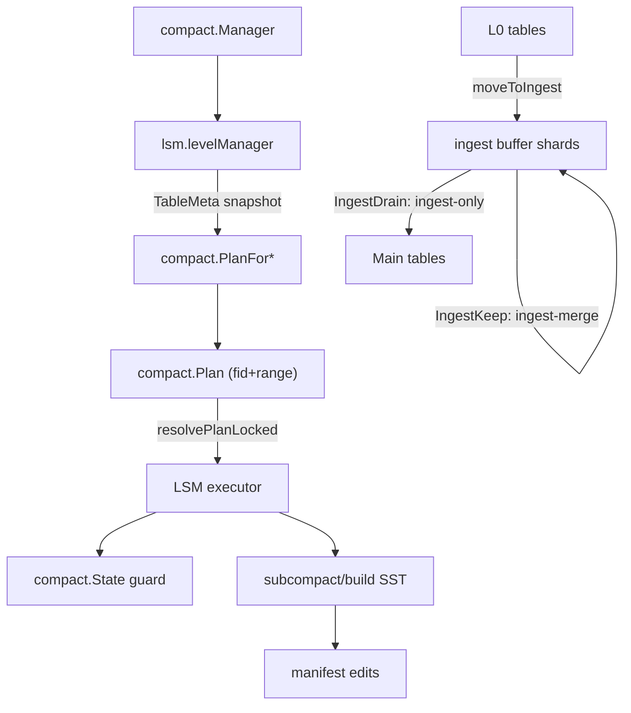

# NoKV Architecture Overview

NoKV delivers a hybrid storage engine that can operate as a standalone embedded KV store or as a TinyKv-compatible distributed service. This document captures the key building blocks, how they interact, and the execution flow from client to disk.

---

## 1. High-Level Layout

```
┌─────────────────────────┐   TinyKv gRPC   ┌─────────────────────────┐
│ raftstore Service       │◀──────────────▶ │ raftstore/client        │
└───────────┬─────────────┘                 │  (Get / Scan / Mutate)  │
            │                               └─────────────────────────┘
            │ ReadCommand / ProposeCommand
            ▼
┌─────────────────────────┐
│ store.Store / peer.Peer │  ← multi-Raft region lifecycle
│  ├ Manifest snapshot    │
│  ├ Router / RegionHooks │
│  └ transport (gRPC)     │
└───────────┬─────────────┘
            │ Apply via kv.Apply
            ▼
┌─────────────────────────┐
│ kv.Apply + percolator   │
│  ├ Get / Scan           │
│  ├ Prewrite / Commit    │
│  └ Latch manager        │
└───────────┬─────────────┘
            │
            ▼
┌─────────────────────────┐
│ Embedded NoKV core      │
│  ├ WAL Manager          │
│  ├ MemTable / Flush     │
│  ├ ValueLog + GC        │
│  └ Manifest / Stats     │
└─────────────────────────┘
```

- **Embedded mode** uses `NoKV.Open` directly: WAL→MemTable→SST durability, ValueLog separation, MVCC semantics, rich stats.
- **Distributed mode** layers `raftstore` on top: multi-Raft regions reuse the same WAL/Manifest, expose metrics, and serve TinyKv RPCs.
- **Clients** obtain leader-aware routing, automatic NotLeader/EpochNotMatch retries, and two-phase commit helpers.

---

## 2. Embedded Engine

### 2.1 WAL & MemTable
- `wal.Manager` appends `[len|payload|crc]` records, rotates segments, and replays logs on crash.
- `MemTable` accumulates writes until full, then enters the flush queue; `flush.Manager` runs `Prepare → Build → Install → Release`, logs edits, and releases WAL segments.
- Writes are handled by a single commit worker that performs value-log append first, then WAL/memtable apply, keeping durability ordering simple and consistent.

### 2.2 ValueLog
- Large values are written to the ValueLog before the WAL append; the resulting `ValuePtr` is stored in WAL/LSM so replay can recover.
- `vlog.Manager` tracks the active head and uses flush discard stats to trigger GC; manifest records new heads and removed segments.

### 2.3 Manifest
- `manifest.Manager` stores SST metadata, WAL checkpoints, ValueLog metadata, and (importantly) Region descriptors used by raftstore.
- `CURRENT` provides crash-safe pointer updates; Region state is replicated through manifest edits.

### 2.4 LSM Compaction & Ingest Buffer
- `compact.Manager` drives compaction cycles; `lsm.levelManager` supplies table metadata and executes the plan.
- Planning is split: `compact.PlanFor*` selects table IDs + key ranges, then LSM resolves IDs back to tables and runs the merge.
- `compact.State` guards overlapping key ranges and tracks in-flight table IDs.
- Ingest shard selection is policy-driven in `compact` (`PickShardOrder` / `PickShardByBacklog`) while the ingest buffer remains in `lsm`.



### 2.5 MVCC
- `txn.go` exposes MVCC transactions with timestamps from `oracle`.
- `percolator` package implements Prewrite/Commit/ResolveLock/CheckTxnStatus; `kv.Apply` simply dispatches Raft commands to these helpers.
- Watermarks (`utils.WaterMark`) gate read snapshots and commit visibility. They are synchronous (no goroutine/channel) and advance with a single mutex + atomics to reduce select/cond wait.

### 2.6 Write Pipeline & Backpressure
- Writes enqueue into a commit queue (`db_write.go`) where requests are coalesced into batches before a commit worker drains them.
- The commit worker always writes the value log first (when needed), then applies WAL/LSM updates; `SyncWrites` adds a WAL fsync step.
- Batch sizing adapts to backlog (`WriteBatchMaxCount/Size`, `WriteBatchWait`) and hot-key pressure can expand batch limits temporarily to drain spikes.
- Backpressure is enforced in two places: LSM throttling toggles `db.blockWrites` when L0 backlog grows, and HotRing can reject hot keys via `WriteHotKeyLimit`.

---

## 3. Replication Layer (raftstore)

| Package | Responsibility |
| --- | --- |
| [`store`](../raftstore/store) | Region catalog, router, RegionMetrics, Region hooks, manifest integration, helpers such as `StartPeer` / `SplitRegion`. |
| [`peer`](../raftstore/peer) | Wraps etcd/raft `RawNode`, handles Ready pipeline, snapshot resend queue, backlog instrumentation. |
| [`engine`](../raftstore/engine) | WALStorage/DiskStorage/MemoryStorage, reusing the DB's WAL while keeping manifest metadata in sync. |
| [`transport`](../raftstore/transport) | gRPC transport for Raft Step messages, connection management, retries/blocks/TLS. Also acts as the host for TinyKv RPC. |
| [`kv`](../raftstore/kv) | TinyKv RPC handler plus `kv.Apply` bridging Raft commands to MVCC logic. |
| [`server`](../raftstore/server) | `ServerConfig` + `New` combine DB, Store, transport, and TinyKv service into a reusable node instance. |

### 3.1 Bootstrap Sequence
1. `raftstore.NewServer` wires DB, store configuration (StoreID, hooks, scheduler), Raft config, and transport address. It registers TinyKv RPC on the shared gRPC server and sets `transport.SetHandler(store.Step)`.
2. CLI (`nokv serve`) or application enumerates `Manifest.RegionSnapshot()` and calls `Store.StartPeer` for every Region containing the local store:
   - `peer.Config` includes Raft params, transport, `kv.NewEntryApplier`, WAL/Manifest handles, Region metadata.
   - Router registration, regionManager bookkeeping, optional `Peer.Bootstrap` with initial peer list, leader campaign.
3. Peers from other stores can be configured through `transport.SetPeer(storeID, addr)`, allowing dynamic updates from a scheduler.

### 3.2 Command Paths
- **ReadCommand** (`KvGet`/`KvScan`): validate Region & leader, flush pending Ready, then run `commandApplier` (i.e. `kv.Apply` in read mode) to fetch data directly from the DB. This yields leader-strong reads without a Raft round trip.
- **ProposeCommand** (write): encode the request, push through Router to the leader peer, replicate via Raft, and apply in `kv.Apply` which maps to MVCC operations.

### 3.3 Transport
- gRPC server handles Step RPCs and TinyKv RPCs on the same endpoint; peers are registered via `SetPeer`.
- Retry policies (`WithRetry`) and TLS credentials are configurable. Tests cover partitions, blocked peers, and slow followers.

---

## 4. TinyKv Service

`raftstore/kv/service.go` exposes pb.TinyKv RPCs:

| RPC | Execution | Result |
| --- | --- | --- |
| `KvGet` | `store.ReadCommand` → `kv.Apply` GET | `pb.GetResponse` / `RegionError` |
| `KvScan` | `store.ReadCommand` → `kv.Apply` SCAN | `pb.ScanResponse` / `RegionError` |
| `KvPrewrite` | `store.ProposeCommand` → `percolator.Prewrite` | `pb.PrewriteResponse` |
| `KvCommit` | `store.ProposeCommand` → `percolator.Commit` | `pb.CommitResponse` |
| `KvResolveLock` | `percolator.ResolveLock` | `pb.ResolveLockResponse` |
| `KvCheckTxnStatus` | `percolator.CheckTxnStatus` | `pb.CheckTxnStatusResponse` |

`nokv serve` is the CLI entry point—open the DB, construct `raftstore.Server`, register peers, start local Raft peers, and display a manifest summary (Regions, key ranges, peers). `scripts/run_local_cluster.sh` builds the CLI, writes a minimal region manifest, launches multiple `nokv serve` processes on localhost, and handles cleanup on Ctrl+C.

---

## 5. Client Workflow

`raftstore/client` offers a leader-aware client with retry logic and convenient helpers:

- **Initialization**: provide `[]StoreEndpoint` + `[]RegionConfig` describing region boundaries and known leaders.
- **Reads**: `Get` and `Scan` pick the leader store for a key range, issue TinyKv RPCs, and retry on NotLeader/EpochNotMatch.
- **Writes**: `Mutate` bundles operations per region and drives Prewrite/Commit (primary first, secondaries after); `Put` and `Delete` are convenience wrappers using the same 2PC path.
- **Timestamps**: clients must supply `startVersion`/`commitVersion`. For distributed demos, reuse the TSO sample under `scripts/tso` to obtain globally increasing values before calling `TwoPhaseCommit`.
- **Bootstrap helpers**: `scripts/run_local_cluster.sh --config raft_config.example.json` builds the binaries, seeds manifests via `nokv-config manifest`, launches the stores declared in the config, and starts the HTTP TSO allocator when the `tso` block is present.

**Example (two regions)**
1. Regions `[a,m)` and `[m,+∞)`, each led by a different store.
2. `Mutate(ctx, primary="alfa", mutations, startTs, commitTs, ttl)` prewrites and commits across the relevant regions.
3. `Get/Scan` retries automatically if the leader changes.
4. See `raftstore/server/server_client_integration_test.go` for a full end-to-end example using real `raftstore.Server` instances.

---

## 6. Failure Handling

- Manifest edits capture Region metadata, WAL checkpoints, and ValueLog pointers. Restart simply reads `CURRENT` and replays edits.
- WAL replay reconstructs memtables and Raft groups; ValueLog recovery trims partial records.
- `Stats.StartStats` resumes metrics sampling immediately after restart, making it easy to verify recovery correctness via `nokv stats`.

---

## 7. Observability & Tooling

- `StatsSnapshot` publishes flush/compaction/WAL/VLog/txn/region metrics. `nokv stats` and the expvar endpoint expose the same data.
- `nokv regions` inspects Manifest-backed Region metadata.
- `nokv serve` advertises Region samples on startup (ID, key range, peers) for quick verification.
- Scripts:
  - `scripts/run_local_cluster.sh` – launch a multi-node TinyKv cluster locally.
  - `scripts/recovery_scenarios.sh` – crash-recovery test harness.
  - `scripts/transport_chaos.sh` – inject network faults and observe transport metrics.

---

## 8. When to Use NoKV

- **Embedded**: call `NoKV.Open`, use the MVCC store locally.
- **Distributed**: deploy `nokv serve` nodes, use `raftstore/client` (or any TinyKv gRPC client) to perform reads, scans, and 2PC writes.
- **Observability-first**: inspection via CLI or expvar is built-in; Region, WAL, Flush, and Raft metrics are accessible without extra instrumentation.

See also [`docs/raftstore.md`](raftstore.md) for deeper internals and [`docs/testing.md`](testing.md) for coverage details.
