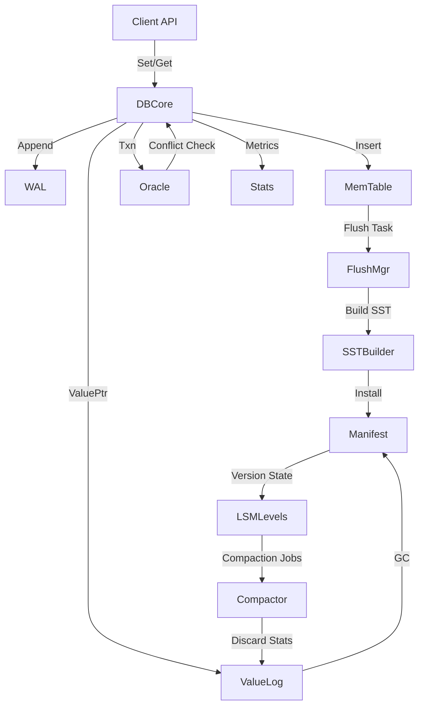

# NoKV Architecture & Design Overview

> 参考架构：RocksDB（LSM + Manifest + CURRENT/WAL）与 BadgerDB（LSM + ValueLog 分离）。

本设计文档旨在为后续的工业化改造提供统一蓝图，涵盖磁盘布局、核心数据路径、恢复流程以及并发与监控策略。文中的模块名称沿用当前仓库结构，便于逐步重构。

---

## 1. 设计目标

- **一致性**：写入必须先持久化到 WAL / ValueLog，SST 仅承载已确认数据。
- **可恢复**：宕机后通过 CURRENT → MANIFEST → WAL/ValueLog 重放，恢复到最后一次成功的写入。
- **高可用**：引入层级化 Compaction 与 ValueLog GC，限制写放大和空间放大。
- **可观测**：暴露 flush/compaction backlog、磁盘使用、事务冲突等指标。
- **可扩展**：模块化设计，后续可添加列族、快照、备份、一致性协议。

---

## 2. 目录与文件布局

| 文件 / 目录                 | 说明                                                                 |
|---------------------------|----------------------------------------------------------------------|
| `CURRENT`                 | 指向当前活跃的 MANIFEST 文件，例如 `MANIFEST-000123`。                     |
| `MANIFEST-<id>`           | 元数据日志（VersionEdit），记录 SST 创建/删除、ValueLog 依赖等信息。           |
| `000001.wal`              | Write-Ahead Log 段文件，顺序写入，每次 DB Open 建立新段。                      |
| `000001.sst`              | SSTable 数据文件，包含数据块、索引、Filter。                               |
| `000001.vlog`             | ValueLog 数据段，大 Value 或 TTL 数据驻留其中。                            |
| `tmp/`                    | Flush / Compaction 临时文件目录，成功后 rename 生效。                      |
| `archive/` (可选)         | 保留旧 WAL / Manifest 快照，便于调试与备份。                               |

---

## 3. 核心模块与职责

### 3.1 DB Core (`db.go`)
- 维护对 LSM、ValueLog、Oracle、Stats 的引用。
- 提供 `Set/Get/Del/NewTransaction/NewIterator` 等对外 API。
- 控制写入管线（批处理、发送到 WAL + MemTable + flush 管线）。
- 管理关闭流程：阻塞新请求 → flush → 停 compaction → 关闭日志。

### 3.2 WAL 子系统
- 由 `wal.Manager` 模块负责，顺序日志记录所有写入（支持批量）。
- 轮转策略：写入量达到上限或 flush 后按段切换；段命名沿用 `00001.wal` 形式。
- 与 MemTable flush 协调：直到对应 SST 落盘并 manifest 更新后才可调用 `RemoveSegment` 删除段文件。
- Crash 恢复：按 `CURRENT` 找到 manifest，再通过 `Replay/ReplaySegment` 顺序重放 WAL 记录。

### 3.3 MemTable / Immutable 表
- 活跃 MemTable 使用 SkipList；达到阈值后被冻结成 Immutable。
- Immutable 被 flush 到 L0，生成新的 SST。
- Flush 管线状态机：
  1. `Freeze`：截断 WAL，记录 flush 任务。
  2. `Build SST`：读 SkipList 生成 TableBuilder → 写临时文件。
  3. `Install`：rename 临时文件，写入 manifest。
  4. `Release`：标记 WAL 可回收。
- 失败策略：保留 WAL + temp 文件，重启后可重试。

### 3.4 SSTable 管理 (`lsm/`)
- L0~Ln 层次结构，采用 size-tiered/leveling 混合策略。
- `Manifest` 记录层级文件列表、最大最小 key、ValueLog 引用。
- `Cache` 预加载 Bloom / Index，减少随机 IO。
- Compaction：根据层级大小、Overlap、冷热点调度。

### 3.5 Manifest 管理 (`file/manifest.go`)
- 仿 RocksDB `VersionEdit`：所有表/日志变动写入 `MANIFEST-xxxx`。
- `CURRENT` 原子切换，保证 crash 后仍指向一致版本。
- 具备回滚/重放能力，manifest 损坏时可回退到上一版本。

### 3.6 ValueLog 子系统 (`vlog.go`)
- 保存大 Value 或带 TTL 数据，记录 `ValuePtr`（Fid, Offset, Len）。
- GC 流程：
  1. 收集 discard stats（来自 compaction 及事务）。
  2. 选择回收候选段（废弃比例达到阈值）。
  3. 顺序扫描存活 entry，写入新段，更新 manifest。
  4. 删除旧文件（需确保无活跃迭代器 / Txn 引用）。
- Crash 恢复：读取 `!NoKV!head` checkpoint，必要时重放全部 ValueLog。

### 3.7 Oracle / 事务 (`txn.go`)
- MVCC 时间戳分配、冲突检测、潜在快照隔离点。
- `WaterMark` 追踪读写上限，配合 discardTs 决定可回收版本。
- 事务 commit 复用 DB 写入流水线，保证 WAL / MemTable / ValueLog 原子性。

### 3.8 统计与监控 (`stats.go`)
- 维护基础计数：写入、删除、活跃 entry、flush/compaction 队列。
- 暴露至 expvar / Prometheus，便于生产环境观测。
- 后续拓展：慢请求日志、压缩比、空间放大等指标。

---

## 4. 数据路径

### 4.1 写路径
1. 对请求按 `MaxBatchCount/MaxBatchSize` 聚合。
2. 进入写入流水线：
   - 按顺序写入 WAL（确保 `fsync` / `fdatasync` 语义）。
   - 更新 MemTable（active skiplist）。
3. 若 value 需分离，先写入 ValueLog，记录 `ValuePtr`。
4. MemTable 达阈值 → 冻结 → flush 管线。

### 4.2 读路径
1. 构建多层迭代器：Txn pending writes → active MemTable → Immutable tables → SST levels → ValueLog（按需）。
2. 判断 tombstone / TTL，过滤内部 key（`!NoKV!` 前缀）。
3. 事务读取使用 `readTs`，过滤版本。

### 4.3 Flush / Compaction
同 3.3/3.4 所述，需具备：
- 背压机制（限制 L0 table 数、flush 并发）。
- Compaction 任务调度器（优先 L0→L1，再逐层）。
- 失败重试、暂停/恢复能力。

### 4.4 ValueLog GC
- 每个 ValueLog 段维护活跃引用计数。
- GC 期间若遇到活跃迭代器/事务，延后删除。
- GC 生成的新段需写 manifest；旧段删除后更新 discard stats。

### 4.5 Crash Recovery
1. 读取 `CURRENT` 找到 manifest。
2. 重放 manifest 构造 Version state。
3. 扫描 WAL：重放所有 entry → 恢复 MemTable。
4. 若 ValueLog `head` 落后，按 checkpoint 继续 replay。
5. 修复未完成的 flush/compaction：检查临时文件、补写 manifest。

### 4.6 关闭流程
1. 阻塞新写（`blockWrites`）。
2. Flush 活跃 MemTable / ValueLog buffer。
3. 停止 compaction、GC、统计后台任务。
4. 顺序关闭 WAL、SST cache、Manifest、ValueLog。
5. 更新 CURRENT、写关闭标记（可选），防止脏退出。

---

## 5. 并发与资源管理

- **引用计数**：MemTable、SST、ValueLog 段、迭代器需统一引用管理。
- **锁粒度**：WAL 使用独立互斥，Manifest 更新串行化；Compaction 使用细粒度读写锁。
- **后台任务协调**：Flush / Compaction / ValueLog GC 使用共享 `Throttle` 控制并发，支持动态限速。
- **错误处理**：避免直接 Panic，返回错误或触发重试/降级。

---

## 6. 监控与工具

- Metrics：写入 TPS、flush backlog、compaction 延迟、value log GC 比例等。
- 日志：关键阶段打 info/error，支持 trace 调试。
- 运维工具：
  - `nokv manifest dump`
  - `nokv sst inspect`
  - `nokv vlog gc --dry-run`
  - `nokv repair`（快速校验与修复）。

---

## 7. 开发阶段拆分

1. **WAL 重构**：顺序写 + 生命周期管理 + 回放测试。
2. **Flush 管线**：MemTable 状态机、临时文件、manifest 集成。
3. **Manifest/Version**：CURRENT、VersionEdit、回滚。
4. **ValueLog 重构**：读写流程、GC、discard stats。
5. **Compaction 框架**：调度器、backpressure、指标。
6. **事务/迭代器完善**：引用计数、一致性测试。
7. **完整恢复/压力测试**：崩溃模拟、并发混合 workload。

每阶段需保证 `go test ./...` 通过，新增针对性单测及集成测试。

---

## 8. 架构示意

---

## 9. 与 RocksDB / Badger 的对比要点

| 主题              | RocksDB                                 | Badger                                  | NoKV 设计方向                                               |
|------------------|-----------------------------------------|-----------------------------------------|------------------------------------------------------------|
| WAL              | 顺序写、底层 Env 抽象                   | 默认不使用（Managed mode）              | 采用顺序写 + 清晰 flush 管线，为 crash recovery 服务                 |
| Manifest         | VersionEdit + CURRENT                   | 暂存到 value log / table manifest       | 引入 VersionEdit，CURRENT 原子指向最新 manifest                 |
| ValueLog         | 无（数据直接 LSM）                      | 大 Value 存储在 vlog，GC 基于 discard stats | 结合 LSM + ValueLog 分离，减少写放大，GC 与 compaction 协调           |
| Compaction       | leveled / universal 多策略              | 二级 LSM，重点在 value log               | 支持 leveled，添加 backpressure，与 ValueLog GC 协同             |
| Iterator/Txn     | Snapshot + Sequence Number               | MVCC 事务（managed/unmanaged）           | 沿用 Oracle + MVCC，补齐 iterator seek、引用计数                  |
| Observability    | 丰富的 metrics / logging / tools         | Badger CLI / metrics                     | 增强统计模块、提供 CLI 工具、暴露指标                           |

---

## 10. 后续工作

- 完成设计文档评审，确定模块边界与数据格式。
- 在 `docs/` 内继续添加详细子文档（WAL、Manifest、Compaction 等）。
- 按阶段拆分开发任务，建立功能分支与合并策略。
- 定义测试矩阵（功能 / 恢复 / 性能 / 压力），引入 CI Pipeline。

---

如需进一步扩展，可在文末补充开放问题（例如：多列族支持、冷热分层、远程备份、Raft 集成等），帮助后续规划。该设计将作为 NoKV 向工业级存储引擎迈进的蓝图。欢迎 review 后提出改进建议。 
