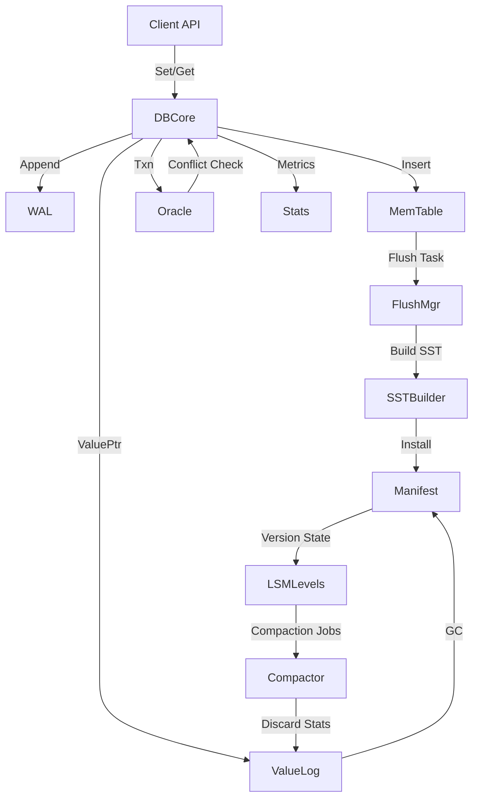

# NoKV Architecture & Design Overview

> 参考架构：RocksDB（LSM + Manifest + CURRENT/WAL）与 BadgerDB（LSM + ValueLog 分离）。

本设计文档旨在为后续的工业化改造提供统一蓝图，涵盖磁盘布局、核心数据路径、恢复流程以及并发与监控策略。文中的模块名称沿用当前仓库结构，便于逐步重构。

---

## 1. 设计目标

- **一致性**：写入必须先持久化到 WAL / ValueLog，SST 仅承载已确认数据。
- **可恢复**：宕机后通过 CURRENT → MANIFEST → WAL/ValueLog 重放，恢复到最后一次成功的写入。
- **高可用**：引入层级化 Compaction 与 ValueLog GC，限制写放大和空间放大。
- **可观测**：暴露 flush/compaction backlog、磁盘使用、事务冲突等指标。
- **可扩展**：模块化设计，后续可添加列族、快照、备份、一致性协议。

---

## 2. 目录与文件布局

| 文件 / 目录                 | 说明                                                                 |
|---------------------------|----------------------------------------------------------------------|
| `CURRENT`                 | 指向当前活跃的 MANIFEST 文件，例如 `MANIFEST-000123`。                     |
| `MANIFEST-<id>`           | 元数据日志（VersionEdit），记录 SST 创建/删除、ValueLog 依赖等信息。           |
| `000001.wal`              | Write-Ahead Log 段文件，顺序写入，每次 DB Open 建立新段。                      |
| `000001.sst`              | SSTable 数据文件，包含数据块、索引、Filter。                               |
| `000001.vlog`             | ValueLog 数据段，大 Value 或 TTL 数据驻留其中。                            |
| `tmp/`                    | Flush / Compaction 临时文件目录，成功后 rename 生效。                      |
| `archive/` (可选)         | 保留旧 WAL / Manifest 快照，便于调试与备份。                               |

---

## 3. 核心模块与职责

### 3.1 DB Core (`db.go`)
- 维护对 LSM、ValueLog、Oracle、Stats 的引用。
- 提供 `Set/Get/Del/NewTransaction/NewIterator` 等对外 API。
- 控制写入管线（批处理、发送到 WAL + MemTable + flush 管线）。
- 管理关闭流程：阻塞新请求 → flush → 停 compaction → 关闭日志。

### 3.2 WAL 子系统 (`wal/manager.go`)
- 由独立的 `wal.Manager` 统一管理段文件：`Append`、`Sync`、`Rotate`、`Replay` 均已实现并配套单测。
- 段命名固定为 `%05d.wal`，位于 `options.WorkDir/wal/`；达到阈值或 flush 完成后可调用 `Rotate`。
- Flush 任务在完成安装后，通过 manager 的 API 标记并删除旧段（与 Manifest 记录联合保障持久性）。
- Crash 恢复：Open 时按 `CURRENT` → manifest → `wal.Manager.Replay` 顺序重放，重建 MemTable。

### 3.3 MemTable / Flush 管线 (`lsm/flush`)
- 活跃 MemTable 使用 SkipList；达到阈值后被冻结成 Immutable。
- `flush.Manager` 已落地四阶段状态机：`Prepare → Build → Install → Release`，持久化 flush 元数据并与 manifest/wal 协作。
- Flush 失败会保留临时文件与任务描述，重启后可恢复执行；成功后触发 WAL 段释放。
- 后续任务：在安装阶段补充更多观测点（时延、队列长度），并与 compaction 做调度协调。

### 3.4 SSTable 管理 (`lsm/`)
- L0~Ln 层次结构，采用 size-tiered/leveling 混合策略。
- `Manifest` 记录层级文件列表、最大最小 key、ValueLog 引用。
- `Cache` 预加载 Bloom / Index，减少随机 IO。
- Compaction：根据层级大小、Overlap、冷热点调度。

### 3.5 Manifest 管理 (`manifest/manager.go`)
- 采用 VersionEdit + CURRENT 的结构，所有 SST/WAL/ValueLog 事件通过 `manifest.Manager.LogEdit` 记录。
- Open 时读取 CURRENT → MANIFEST 构造 Version，并在必要时重写 manifest 以控制体积。
- ValueLog GC 过程中产生的 head 更新与段删除同样持久化在 Manifest（`LogValueLogHead`/`LogValueLogDelete`），重启即可恢复到最近一次 GC 状态。

### 3.6 ValueLog 子系统 (`vlog/manager.go` + `vlog.go`)
- ValueLog 现由 `vlog.Manager` 统一管理段的 Append/Rotate/Read/Remove，写入格式复用 WAL 编码。
- GC 重构完成：通过 WAL 解码顺序扫描旧段、重写有效 entry、批量写回并删除原文件；迭代器/事务引用计数全流程可用。
- Crash 恢复：Open 时由 manager 读取现有段和写入 offset，再结合 `!NoKV!head` 与 manifest state 恢复写指针；与 3.5 配合可以在崩溃后复原 head 与删除记录。

### 3.7 Oracle / 事务 (`txn.go`)
- MVCC 时间戳分配、冲突检测、潜在快照隔离点。
- `WaterMark` 追踪读写上限，配合 discardTs 决定可回收版本。
- 事务 commit 复用 DB 写入流水线，保证 WAL / MemTable / ValueLog 原子性。
- 事务迭代器基于 `readTs` 构建 LSM 快照，并合并自身 pending writes，支持多版本遍历与一致快照视图。

### 3.8 统计与监控 (`stats.go`)
- 周期采集 LSM/ValueLog backlog、运行状态，并通过 `expvar` 暴露。
- 当前指标：写入计数、flush/compaction backlog、`NoKV.Compaction.*`、`NoKV.ValueLog.*` 与 `NoKV.Txns.*` 系列；离线巡检可使用 `cmd/nokv stats`。
- 引入 `hotring` 热点追踪器：在事务/DB 读路径中记录 key 访问频次，并在 Stats/CLI 中输出 Top-N 热点，为缓存、限流和调度策略提供决策依据。
- 后续拓展：慢请求日志、压缩比、空间放大、命令行工具导出（如 `nokv stats/manifest`）。

---

## 4. 数据路径

### 4.1 写路径
1. 对请求按 `MaxBatchCount/MaxBatchSize` 聚合。
2. 进入写入流水线：
   - 按顺序写入 WAL（确保 `fsync` / `fdatasync` 语义）。
   - 更新 MemTable（active skiplist）。
3. 若 value 需分离，先写入 ValueLog，记录 `ValuePtr`。
4. MemTable 达阈值 → 冻结 → flush 管线。

@@ -139,80 +138,73 @@
- Metrics：写入 TPS、flush backlog、compaction 延迟、value log GC 比例等。
- 当前通过 `expvar` 与 `cmd/nokv stats` 导出的关键指标：
  - `NoKV.Compaction.RunsTotal / LastDurationMs`
  - `NoKV.ValueLog.GcRuns / SegmentsRemoved / HeadUpdates`
  - `NoKV.Txns.{Active,Started,Committed,Conflicts}`
- Hot Ring 热点追踪：读路径会将 key 访问频次上报至 hotring，`StatsSnapshot` 与 `nokv stats` 输出 Top-N 热点，为缓存、限流与调度提供依据。
- 恢复测试阶段可通过 `RECOVERY_TRACE_METRICS` 收集额外指标（GC 清理、manifest rewrite、WAL replay 等），并由 `scripts/recovery_scenarios.sh` 自动归档日志。
- 日志：关键阶段打 info/error，支持 trace 调试。
- 运维工具：
  - `nokv stats` / `nokv manifest` / `nokv vlog`
  - `nokv sst inspect`
  - `nokv vlog gc --dry-run`
  - `nokv repair`（快速校验与修复）。

---

## 7. 开发与优化规划

### 测试与验证

- **单元 + 集成测试**：`GOCACHE=$PWD/.gocache GOMODCACHE=$PWD/.gomodcache go test ./...`
- **恢复矩阵**：`RECOVERY_TRACE_METRICS=1 ./scripts/recovery_scenarios.sh`
- **性能基准**：`go test ./benchmark -run TestBenchmarkResults -count=1`（启用 `benchmark_rocksdb` 标签可对比 RocksDB）
- **测试计划文档**：详见 [docs/testing.md](testing.md)

### 吞吐优化现状

**写路径流水线**
- `db.doWrites` 将前端请求聚合为批次，引入定时器上限（`WriteBatchDelay`）与计数/字节阈值，统一发送到流水线。
- `processValueLogBatches` 与 `applyBatches` 形成双通道并行：ValueLog 写入异步落盘后再进入 LSM 应用阶段，WAL/ValueLog/LSM 分工明确。
- `applyThrottle` 与 `lsm.throttleWrites` 在 L0 backlog 超限时动态开启写限流，缓解 flush/compaction 压力。
- MemTable arena 根据 `MemTableSize` 自动扩展（`arenaSizeFor`），保障高峰期的聚合能力。

**后台调度与限流**
- `lsm/compaction_manager.go` 按优先级调度任务，并在 backlog 变化时触发写限流开关，避免 L0 积压。
- flush 管线的 `Manager` 记录任务状态，失败自动重试并与 Manifest/WAL 协同释放旧段。

**读路径与缓存策略**
- `lsm/cache.go` 引入热/冷分段缓存：热区使用 LRU，冷区使用 CLOCK，提高热点块命中率。
- Bloom Filter 在首次加载后存入 `bloomCache`，结合 `MayContainKey` 提前过滤 miss。
- `iteratorPool` 复用迭代器上下文，事务与 DB 迭代器均共享池化资源。
- `db.recordRead` 通过 `hotring.HotRing` 记录热点 key，指标由 `Stats`/`nokv stats` 暴露，便于预热缓存或调度策略。

**ValueLog 管线**
- ValueLog 写入与 GC 由 `vlog.Manager` 承担，引用计数确保迭代器/事务安全，GC 结果即时更新 Manifest，重启即可恢复。

**后续可选优化**
- 压缩算法、IO 栈参数与更多 compaction 策略仍可按场景继续演进，但当前单机路径已具备批量写、并行日志、读缓存与限流等主干能力。

---

## 8. 架构示意

---

## 9. 与 RocksDB / Badger 的对比要点

| 主题              | RocksDB                                 | Badger                                  | NoKV 设计方向                                               |
|------------------|-----------------------------------------|-----------------------------------------|------------------------------------------------------------|
| WAL              | 顺序写、底层 Env 抽象                   | 默认不使用（Managed mode）              | 采用顺序写 + 清晰 flush 管线，为 crash recovery 服务                 |
| Manifest         | VersionEdit + CURRENT                   | 暂存到 value log / table manifest       | 引入 VersionEdit，CURRENT 原子指向最新 manifest                 |
| ValueLog         | 无（数据直接 LSM）                      | 大 Value 存储在 vlog，GC 基于 discard stats | 结合 LSM + ValueLog 分离，减少写放大，GC 与 compaction 协调           |
| Compaction       | leveled / universal 多策略              | 二级 LSM，重点在 value log               | 支持 leveled，添加 backpressure，与 ValueLog GC 协同             |
| Iterator/Txn     | Snapshot + Sequence Number               | MVCC 事务（managed/unmanaged）           | 沿用 Oracle + MVCC，补齐 iterator seek、引用计数                  |
| Observability    | 丰富的 metrics / logging / tools         | Badger CLI / metrics                     | 增强统计模块、提供 CLI 工具、暴露指标                           |

---

## 10. 后续工作

- 完成设计文档评审，确定模块边界与数据格式。
- 在 `docs/` 内继续添加详细子文档（WAL、Manifest、Compaction 等）。
- 按阶段拆分开发任务，建立功能分支与合并策略。
- 定义测试矩阵（功能 / 恢复 / 性能 / 压力），引入 CI Pipeline。

---

如需进一步扩展，可在文末补充开放问题（例如：多列族支持、冷热分层、远程备份、Raft 集成等），帮助后续规划。该设计将作为 NoKV 向工业级存储引擎迈进的蓝图。欢迎 review 后提出改进建议。 
