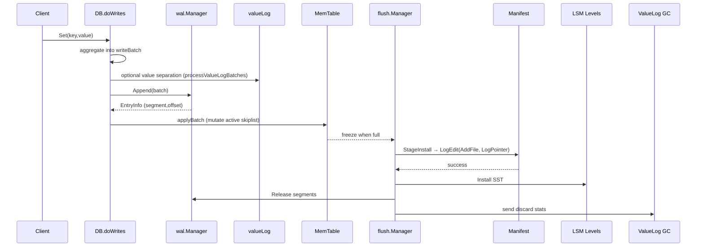
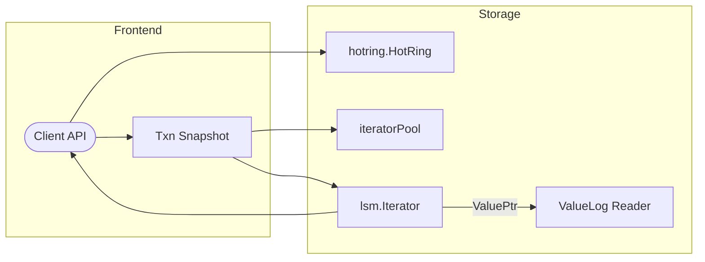

# NoKV Architecture & Design Deep Dive

> NoKV follows the same broad lineage as **RocksDB** (LSM tree + manifest/WAL orchestration) and **BadgerDB** (value separation via vlog), but the implementation is 100% Go and tailored for embeddability, MVCC transactions, and strong observability.

---

## 1. Package Map

| Package / File | Key Responsibilities | Notable Types & Functions | Related Tests |
| --- | --- | --- | --- |
| [`db.go`](../db.go) | Entry point that wires WAL, LSM, ValueLog, HotRing, Stats, Oracle. | `DB.doWrites`, `DB.initVLog`, `DB.prefetchLoop`, `DB.Close`. | `db_test.go`, `db_recovery_test.go`, `txn_test.go` |
| [`wal/`](../wal) | Append-only log segments with CRC, rotation, replay. | `wal.Manager`, `Append`, `Replay`, `VerifyDir`. | `wal/manager_test.go` |
| [`lsm/`](../lsm) | MemTable, flush pipeline, levelled files, compaction scheduler (see [compaction.md](compaction.md)). | `lsm.LSM`, `lsm/flush.Manager`, `lsm.compactionManager`. | `lsm/lsm_test.go`, `lsm/compact_test.go`, `lsm/compaction_cache_test.go` |
| [`manifest/`](../manifest) | Versioned metadata (files, WAL checkpoints, vlog head) stored in `MANIFEST-*`. | `manifest.Manager`, `manifest.Edit`, `manifest.Version`. | `manifest/manager_test.go` |
| [`vlog/`](../vlog) + [`vlog.go`](../vlog.go) | Value-log segments, head tracking, GC, discard stats. | `vlog.Manager`, `valueLog.write`, `valueLog.doRunGC`. | `vlog/vlog_test.go`, `vlog/gc_test.go` |
| [`txn.go`](../txn.go) | MVCC timestamps, conflict detection, managed transactions, iterator snapshots. | `oracle`, `Txn`, `Txn.ReadTs`, `Txn.Commit`. | `txn_test.go`, `txn_iterator_test.go` |
| [`stats.go`](../stats.go) | Periodic snapshot of backlog, throughput, hot keys via `expvar`. | `Stats`, `Stats.collect`, `StatsSnapshot`. | `stats_test.go`, CLI golden tests |
| [`cmd/nokv`](../cmd/nokv) | CLI inspection (`stats`, `manifest`, `vlog`). | `rootCmd`, `statsCmd.run`, `manifestCmd.run`. | `cmd/nokv/main_test.go` |

The packages are deliberately thin and communicate through clear data structures (e.g. `utils.Entry`, `utils.ValuePtr`), enabling targeted testing and easier reasoning during recovery.

---

## 2. Storage Layout

```text
WorkDir/
├── CURRENT                # points to MANIFEST-xxxxx
├── MANIFEST-000123        # VersionEdit log
├── wal/000001.wal         # WAL segments (default 64 MiB)
├── vlog/000001.vlog       # ValueLog segments for large/value-separated payloads
├── 000001.sst             # SSTables produced by flush/compaction
├── tmp/                   # staging files for flush, compaction, manifest rewrite
└── archive/               # optional retention area for diagnostics
```

- **CURRENT** is atomically swapped (`CURRENT.tmp → CURRENT`) whenever the manifest is rewritten, mirroring RocksDB's safety guarantees.
- WAL segments and vlog segments rotate independently, yet both checkpoints are persisted through `manifest.EditLogPointer` and `manifest.EditValueLogHead` so recovery knows where to resume.

---

## 3. End-to-End Write Flow



1. **Batching** – `DB.doWrites` drains `writeCh` and aggregates requests based on `Options.WriteBatch*` thresholds.
2. **Value separation** – `processValueLogBatches` writes large payloads to vlog segments (Badger-style) and embeds `ValuePtr` metadata into WAL/LSM entries.
3. **Durability** – `wal.Manager.Append` writes `[length|payload|crc]` tuples; rotation occurs when `segmentSize` would be exceeded.
4. **MemTable apply** – `applyBatches` mutates the active skiplist, and immutable tables are handed to `lsm.flush.Manager`.
5. **Flush pipeline** – the manager enforces `Prepare → Build → Install → Release` stages with metrics for queueing and build latency.
6. **Manifest + WAL checkpoint** – `manifest.Manager.LogEdit` persists the new SST plus WAL pointer. Only after success do we rename temp SST files and release WAL segments.
7. **Discard stats → ValueLog** – flush completion pushes discard statistics back to `valueLog` so GC can evict obsolete vlog segments.

Compared with RocksDB:
- NoKV reuses the canonical WAL→MemTable→SST path but coordinates ValueLog pointers like Badger to keep hot keys in LSM while parking large values on sequential vlog segments.


1. **Batching** – `DB.doWrites` drains `writeCh` and aggregates requests based on `Options.WriteBatch*` thresholds.
2. **Value separation** – `processValueLogBatches` writes large payloads to vlog segments (Badger-style) and embeds `ValuePtr` metadata into WAL/LSM entries.
3. **Durability** – `wal.Manager.Append` writes `[length|payload|crc]` tuples; rotation occurs when `segmentSize` would be exceeded.
4. **MemTable apply** – `applyBatches` mutates the active skiplist, and immutable tables are handed to `lsm.flush.Manager`.
5. **Flush pipeline** – the manager enforces `Prepare → Build → Install → Release` stages with metrics for queueing and build latency.
6. **Manifest + WAL checkpoint** – `manifest.Manager.LogEdit` persists the new SST plus WAL pointer. Only after success do we rename temp SST files and release WAL segments.
7. **Discard stats → ValueLog** – flush completion pushes discard statistics back to `valueLog` so GC can evict obsolete vlog segments.

## 4. Read Path & Iterators



- `DB.NewTransaction` obtains a read timestamp (`oracle.newReadTs`) and builds an iterator merging memtables + table iterators; pending writes live in the transaction structure.
- When entries carry a `ValuePtr`, `valueLog.get` streams the value directly from the vlog segment, allowing SSTs to stay compact.
- `hotring.HotRing` tracks read frequency and emits Top-N hot keys in `StatsSnapshot` and `nokv stats`, making it easier to prefetch or throttle at the application layer.
- Iterator pooling keeps allocation costs low, inspired by Badger's reusable iterators.

---

## 5. Background Loops

| Component | Source | Purpose | Notable Metrics |
| --- | --- | --- | --- |
| Flush Manager | `lsm/flush.Manager` | Coordinates immutable memtables; exposes queue length and stage latency. | `Flush.Queue`, `Flush.BuildNs`, `Flush.Completed` |
| Compaction Manager | `lsm.compactionManager` | Prioritises L0 size, ingest buffer backlog, and level fanout (details in [compaction.md](compaction.md)). | `NoKV.Compaction.RunsTotal`, `LastDurationMs` |
| ValueLog GC | `valueLog.doRunGC` + `vlog.Manager` | Rewrites live entries into new vlog segments based on discard stats. | `NoKV.ValueLog.GcRuns`, `SegmentsRemoved`, `HeadUpdates` |
| Prefetch Loop | `DB.prefetchLoop` | Uses HotRing signals to schedule asynchronous reads into `prefetched` cache. | `Stats.HotKeys` with timestamps |
| Stats Sampler | `Stats.StartStats` | Polls flush, compaction, WAL, transaction metrics and publishes via `expvar`. | `NoKV.Txns.*`, `NoKV.Flush.*`, etc. |

Badger similarly exposes value log GC and LSM compactions, but NoKV emphasises structured metrics for CLI/expvar users without external tooling.

---

## 6. Crash Recovery Pipeline

1. **Directory checks** – `DB.runRecoveryChecks` verifies manifest, WAL, and vlog directory invariants.
2. **Manifest replay** – `manifest.Open` reads `CURRENT`, applies each `manifest.Edit` (`AddFile`, `DeleteFile`, `LogPointer`, `ValueLogHead/Delete/Update`). Missing SSTs detected here are pruned (`manifest.CleanObsolete` in tests mirrors RocksDB's file descriptor check).
3. **WAL replay** – `wal.Manager.Replay` streams segment entries; truncated tails stop replay gracefully, similar to RocksDB's tolerance for torn writes.
4. **ValueLog head rebuild** – `valueLog.recover` enumerates segments, honors manifest head metadata, and updates the active file ID/offset. Orphaned segments flagged via `manifest.EditDeleteValueLog` are removed.
5. **Pending flush tasks** – `lsm/flush.Manager` metrics reveal leftover immutables; replayed WAL entries repopulate the memtable.
6. **Statistics bootstrap** – `Stats` scheduler is restarted so CLI snapshots stay accurate immediately after restart.

`db_recovery_test.go` intentionally injects faults at each stage (missing SSTs, stale vlog files, partial manifest rewrites) to guarantee the process is idempotent.

---

## 7. Observability & Tooling

- **Expvar endpoint** – `Stats.collect` publishes counters and gauges such as `NoKV.ValueLog.GcRuns`, `NoKV.Txns.Active`, `NoKV.Flush.Queue`.
- **CLI (`cmd/nokv`)** – `nokv stats/manifest/vlog --json` consumes the same snapshots for offline inspection, mirroring `ldb` from RocksDB but returning structured JSON for automation.
- **Recovery traces** – enabling `RECOVERY_TRACE_METRICS` prints structured key/value logs during replay and GC, aiding CI triage.
- **Hot key surfacing** – `StatsSnapshot.Hot.Keys` lists keys with hit counts; great for verifying cache prefetch from the CLI.

---

## 8. Design Comparison

| Feature | RocksDB | BadgerDB | NoKV |
| --- | --- | --- | --- |
| Language / Runtime | C++ with custom env | Go | Go (no CGO dependencies) |
| Log strategy | WriteBatch into WAL + MemTable | ValueLog holds values, LSM holds keys | Hybrid: WAL + MemTable + ValueLog (large values) |
| Manifest | VersionEdit + CURRENT | Value log relies on vlog directory metadata | `manifest.Manager` mirrors RocksDB semantics and also tracks vlog head & deletions |
| Transactions | Optional WriteBatch, no MVCC by default | Managed transactions, optimistic concurrency | MVCC snapshots via `oracle`, conflict tracking, iterator merge |
| Hot key analytics | External perf counters | Basic metrics | Built-in `hotring` with CLI export |
| Tooling | `ldb`, `sst_dump` | `badger` CLI | `nokv` CLI (stats/manifest/vlog) + expvar |
| Observability | PerfContext, event listeners | Metrics (Prometheus) | Structured expvar + recovery traces |
| GC | Compaction-driven | Value log GC + discard stats | LSM compaction + vlog GC using discard stats from flush manager |

NoKV positions itself between the two: it adopts RocksDB's manifest/WAL discipline and Badger's value separation, while contributing additional observability and MVCC semantics without CGO dependencies.

---

## 9. Subsystem Deep Dives

For detailed walkthroughs of individual modules, refer to:

* [Memtable design](memtable.md) – skiplist arena sizing, WAL coupling, and recovery.
* [Compaction & cache strategy](compaction.md) – ingest buffers, priority scoring, and cache telemetry.
* [Transactions & MVCC](txn.md) – oracle timestamps, conflict detection, and commit flow.
* [Value log design](vlog.md) – updated manager semantics, discard stats, and GC.
* [Cache & bloom filters](cache.md) – hot/cold block caches and observability counters.
* [HotRing overview](hotring.md) – hot key tracking and throttling.
* [Stats & observability](stats.md) – expvar pipeline and CLI integration.
* [File abstractions](file.md) – mmap helpers underpinning WAL/SST/vlog layers.

---

## 9. Example Scenarios

### 9.1 Batched write with crash mid-flush
1. Client issues 1,000 `Set` calls; `DB.doWrites` batches them into 64-entry chunks.
2. WAL append succeeds and the memtable crosses the flush threshold.
3. `flush.Manager` enters `StageBuild`, writes `000012.sst.tmp`, but the process crashes before install.
4. On restart, `manifest.Manager` sees no `AddFile` edit for `000012` and `FlushManager` re-enqueues the immutable memtable.
5. WAL replay reproduces the 1,000 entries; flush restarts, manifest receives the edit, WAL segments rotate, discard stats notify ValueLog GC.

### 9.2 Transactional read-modify-write
1. `Txn := db.NewTransaction(true)` reserves a write timestamp via `oracle.nextTxnTs` and snapshots current read ts.
2. `Txn.Get` merges in-flight writes and LSM iterators. If a value pointer is encountered, it streams from vlog.
3. `Txn.Set` buffers the mutation and marks the key for conflict detection.
4. `Txn.Commit` reuses the DB write pipeline; conflicts detected through `oracle` watermark raise `ErrConflict` before WAL append, keeping WAL free of aborted transactions (contrary to RocksDB's WriteBatch semantics).

---

## 10. Extensibility Outlook

- **Raft / replication** – WAL manager already exposes segment metadata; integrating raft logs would primarily require shipping WAL entries and manifest edits across nodes, akin to RocksDB's raft-enabled forks.
- **Column families** – manifest edits and flush manager structures are ready to carry additional column family identifiers.
- **Backup / snapshot** – exposing `manifest.Version` as a serialisable checkpoint mirrors RocksDB's `Checkpoint` API and can coexist with vlog archival.

---

## 11. Distributed KV TODO Roadmap

This roadmap follows the TinyKV phases and expands each into concrete, testable work items for NoKV.

### TinyKV Progress Snapshot (updated 2025-10-18)

| TinyKV Milestone | Deliverable (per TinyKV docs) | NoKV Status | Notes |
| --- | --- | --- | --- |
| Project 1 — Standalone RawKV | Basic raw kv API backed by RocksDB/LSM, WAL replay, snapshot-able state | ✅ Complete | NoKV’s LSM+WAL stack, manifest, value log, and recovery pipeline map directly to this phase with native Go implementation and extensive tests (`db_test.go`, `db_recovery_test.go`). |
| Project 2 — Transaction KV | MVCC, CF separation (`default`/`write`/`lock`), conflict detection, txn API | ✅ Complete | MVCC oracle, CF-aware pipeline, managed transactions, and CLI/metrics parity match TinyKV Project2 expectations (`txn.go`, `txn_test.go`). |
| Project 3A/3B — Raft Core & Raft KV | Raft log replication, persistent storage, Ready handling, snapshot sending | ⚙️ In progress | Raft peers复用 WAL/manifest（`raftstore`），snapshot resend 队列与限流测试已就绪；新增 gRPC transport 支持跨进程消息流转，仍在完善 typed WAL record 及进一步的日志压缩钩子。 |
| Project 3C — Multi-Raft & Scheduling | Region metadata, peer lifecycle, conf change, raftstore <-> scheduler bridge | ⏳ Not started | Manifest lacks region catalogues; only single-group scaffolding (`GroupID`) exists with no PD-equivalent scheduler yet. |
| Project 4 — Distributed Txn / 2PC | Per-region MVCC, lock resolution, scheduler cooperation, external API | ⏳ Not started | MVCC is single-node; no raft-proposed transactional RPCs or lock tables yet. |

Legend: ✅ complete ⚙️ actively being built ⏳ planned / not started.

### Phase 0 — Column Families & Raw KV Surface
- **Done**: Extend `utils.Entry`, write pipeline, and WAL paths with a `columnFamily` tag while keeping default CF compatibility.
- **Done**: Define CF identifiers (`default`, `lock`, `write`) and helper routines analogous to TinyKV's `KeyWithCF`.
- **Done**: Update `DB.Set/Get/Del/NewIterator` to accept CF-aware options and add mixed-CF coverage in unit tests.
- Document CF key layout in `docs/cli.md` / `docs/testing.md`; add CLI flag for CF stats if useful.

### Phase 1 — Raft Core (TinyKV Project2A)
- **Done**: Introduced `raft/` package wrapping etcd/raft's `RawNode`, `MemoryStorage`, and single-node election/proposal tests.
- Implement ticking (`tickElection`, `tickHeartbeat`) and configurable timeouts; integrate with existing `utils.WaterMark` for proposal tracking.
- Add unit tests mirroring TinyKV labs (single-node commit, leader election, log replication corner cases).

### Phase 2 — Raft KV Integration (TinyKV Project2B)
- **Done**: `raftstore` peers默认通过 `walStorage` 复用 DB 的 WAL + manifest，Ready entries/HardState/Snapshot 与普通写入共享持久化路径；重启恢复和三节点复制已在测试中覆盖。
- **Done**: Snapshot resend 队列与 `LogRaftTruncate` 的段编号桥接（2025-10-18）确保截断信息写回 manifest，`lsm.canRemoveWalSegment` 结合该段位阻止误 GC。
- **Done**: `raftstore` 重构为 `peer/` (FSM + lifecycle)、`engine/` (WAL/Disk storage)、`transport/` (内存/GRPC 传输) 等子包，结构对齐 TinyKV 的 `peer`/`peerstorage`/`transport` 角色，根包仅负责兼容性导出。
- **Done**: 新增 `GRPCTransport` 实现，基于 gRPC 的跨进程 Raft 消息收发支持网络分区测试，并替换旧的 `net/rpc` 实现。
- **Done**: 桥接 raft apply（批量、冲突处理）与 `utils.WaterMark` 回压策略，新增 `Peer.WaitApplied` 与限流逻辑，覆盖慢 follower / failover 集成测试。
- **In progress**: `wal.Manager` 支持 typed record，manifest 记录 `EditRaftPointer`，仍需补充崩溃注入、慢 follower backlog 与 snapshot resend 的自动化用例。
- 实现消息传输接口（现阶段在内存 mock），为后续 RPC 化做准备。

### Phase 3 — Log GC & Snapshots (TinyKV Project2C)
- **Done**: `manifest.LogRaftTruncate` 现持久化 index/term+segment+offset，WAL GC 依赖 `SegmentIndex` / `TruncatedOffset` 判断；`raftstore/engine/wal_storage_test.go` 覆盖最新逻辑，并通过 `MaybeCompact` 同步更新。
- **Next**: 实现手动 / 自动 snapshot 导出，落地 apply 中断恢复流程，并复用 manifest 指针重试。
- **Next**: 扩充慢 follower / snapshot 恢复测试，验证截断段位与实际 WAL GC 成功联动。

### Phase 4 — Multi-Raft & Region Management (TinyKV Project3A/3B)
- Model `RegionMeta`, peer lifecycle, and peer state machine; maintain region ranges inside manifest or dedicated metadata store.
- Implement conf change handling (add/remove peers) and leadership transfer atop raft core; guard with epoch/version checks.
- Support split flow: detect split triggers, stage new region metadata, create raft peers, and atomically update manifests/SST ownership.
- Provide test harness for region splits, membership churn, and log application ordering.

### Phase 5 — Cluster Scheduler (TinyKV Project3C)
- Introduce scheduler service tracking store stats, region heartbeats, and pending tasks.
- Implement balance/peer-move operators, heartbeat processing, and failure detection; reuse existing metrics/CLI for visibility.
- Add simulation tests to validate scheduling decisions under skewed load, down stores, and region hot spots.

### Phase 6 — Distributed MVCC & 2PC (TinyKV Project4)
- Extend MVCC layer to operate across regions: lock table persistence (`lock` CF), write records (`write` CF), and data (`default` CF).
- Implement handlers for `KvGet`, `KvPrewrite`, `KvCommit`, `KvScan`, `KvCheckTxnStatus`, `KvBatchRollback`, `KvResolveLock` through raft proposals.
- Wire primary/secondary lock resolution, TTL management, and latch manager; add integration tests mirroring TinyKV txn suites.

### Phase 7 — Observability, Tooling & Docs
- Expose raft/region/txn metrics via `Stats` and CLI (`nokv raft`, `nokv regions`); integrate with recovery traces.
- Document deployment guidance (`docs/distributed.md`), update testing matrix, and describe operational runbooks (snapshots, log GC, scheduler tuning).
- Provide reproducible scenarios (scripts or benchmarks) to validate leader transfer, failover, and transaction conflict handling end-to-end.

### Cross-Cutting Work
- Build a deterministic multi-node test harness (in-process transport, chaos injections).
- Ensure `go test ./...` covers new packages and add CI workflows executing TinyKV-style acceptance criteria.
- Maintain backward compatibility for single-node embedding by gating distributed components behind configuration flags.

For deeper implementation details, continue with module-specific documents:
- [WAL subsystem](wal.md)
- [Flush pipeline](flush.md)
- [ValueLog manager](vlog.md)
- [Manifest semantics](manifest.md)
- [Crash recovery plan](recovery.md)
- [Testing matrix](testing.md)
- [CLI reference](cli.md)
