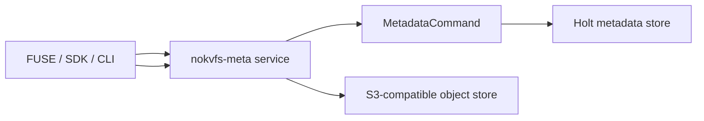

<!--
Copyright 2024-2026 The NoKV Authors.
SPDX-License-Identifier: Apache-2.0
-->

# Architecture

NoKV-FS is a Rust-first filesystem for AI training and agent workspaces. The
repository is intentionally product-shaped: metadata semantics, object body
storage, clients, FUSE, docs, and examples live at the repository root instead
of behind a nested workspace.

The implemented tree is the local metadata slice. The product target, including
distributed metadata shards, CSI, Python/fsspec, and node-local cache, is
recorded in [Product Design](./product-design.md).

## Layers

```text
Application surface
  nokvfs-client    Rust SDK
  nokvfs-cli       nokv-fs CLI
  nokvfs-fuse      low-level FUSE frontend
  nokvfs-python    planned Python/fsspec bindings
  nokvfs-csi       planned Kubernetes CSI integration

Metadata layer
  nokvfs-types     mount, inode, dentry, body descriptor, watch event types
  nokvfs-protocol  metadata RPC wire DTOs
  nokvfs-meta      schema, MetadataCommand, Holt store, in-process metad
  nokvfs-server    long-running local metad process and health/control plane

Body storage layer
  nokvfs-object    S3-compatible object storage, including RustFS
```

## Write Path


```mermaid
flowchart LR
    App["AI training / agent client"] --> API["NoKV-FS metad"]
    App["FUSE / SDK / CLI"] --> API["nokvfs-meta service"]
    API --> Command["MetadataCommand"]
    Command --> Holt["Holt metadata store"]
    API --> Object["S3-compatible object store"]
```

For artifact publication, object bytes are uploaded first. The metadata commit
then publishes the dentry, inode projection, and body descriptor atomically.
Failed metadata publish leaves staged objects for later garbage collection.

`nokvfs-server` runs the same local `nokvfs-meta` service in a long-lived
process. It owns health, readiness, stats, manual GC endpoints, and the first
inode-level metadata RPC. The RPC is intentionally low-level: clients send
inode/name operations such as `lookup_plus`, `read_dir_plus`, `create_dir`,
`remove_file`, `rename_replace`, and `snapshot_subtree`. Path resolution stays
in SDK/FUSE clients. The Rust SDK has a remote metadata client for namespace
operations and a remote file client that uploads object blocks directly, asks
`metad` to atomically publish the body manifest, fetches body read plans, and
reads object ranges directly from the configured object store. Remote FUSE is
still future work.

## FUSE Path

The current FUSE frontend is inode-first. It maps kernel `lookup`, `getattr`,
`readdir`, `open`, and `read` calls to `metad` inode APIs and object-store range
reads. It does not resolve paths through the Rust SDK and does not own metadata
semantics. Live mounts register observed directory scopes with the metadata
watch log and translate typed watch events into FUSE `inval_entry` and
`inval_inode` notifications. Snapshot mounts are read-only and do not start the
invalidation worker.

## Metadata Layout

The canonical model is inode/dentry, described in
[Metadata Schema](./metadata-schema.md):

```text
inode_current:
  mount_id | inode_id -> inode attributes

dentry_current:
  mount_id | parent_inode | name -> dentry + inode projection

chunk_manifest_current:
  mount_id | inode_id | generation | u64::MAX -> body summary
  mount_id | inode_id | generation | chunk_index -> block manifest

history:
  family | user_key_len | user_key | inverted_commit_version -> old value
```

Path indexes are derived accelerators for artifact and checkpoint fast paths;
they are not namespace truth.

## Object Storage

NoKV-FS stores file bodies outside the metadata service. File bytes are split
into immutable object blocks and published through metadata manifests. The first
production body backend is S3-compatible storage. RustFS, MinIO, Ceph RGW, and
AWS S3 all use the same object-store boundary. See
[Object Layout](./object-layout.md).

## Distributed Direction

The planned distributed layer is not a generic KV database. It should replicate
metadata commands over mount or shard scoped Raft groups, with Holt as the
state machine storage engine and object bodies remaining in external storage.

Holt is the metadata engine inside each shard. NoKV-FS `metad` owns filesystem
semantics such as inode/dentry updates, watch/snapshot policy, publish rules,
and object GC decisions.
