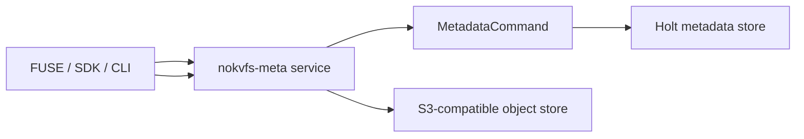

<!--
Copyright 2024-2026 The NoKV Authors.
SPDX-License-Identifier: Apache-2.0
-->

# Architecture

NoKV is a Rust-first filesystem for AI training and agent workspaces. The
repository is intentionally product-shaped: metadata semantics, object body
storage, clients, FUSE, docs, and examples live at the repository root instead
of behind a nested workspace.

The implemented tree is the single-node metadata service slice. The product
target, including distributed metadata shards, CSI, Python/fsspec, and
node-local cache, is recorded in [Product Design](./product-design.md).

## Layers

```text
Application surface
  nokvfs-client    Rust SDK
  nokvfs-cli       nokv-fs CLI
  nokvfs-fuse      low-level FUSE frontend
  nokvfs-python    planned Python/fsspec bindings
  nokvfs-csi       planned Kubernetes CSI integration

Metadata layer
  nokvfs-types     mount, inode, dentry, body descriptor, watch event types
  nokvfs-protocol  metadata RPC wire DTOs
  nokvfs-meta      schema, MetadataCommand, Holt store, service core
  nokvfs-server    long-running metad process, RPC, health, and control plane

Body storage layer
  nokvfs-object    S3-compatible object storage, including RustFS
```

## Write Path


```mermaid
flowchart LR
    App["AI training / agent client"] --> API["NoKV metad"]
    App["FUSE / SDK / CLI"] --> API["nokvfs-meta service"]
    API --> Command["MetadataCommand"]
    Command --> Holt["Holt metadata store"]
    API --> Object["S3-compatible object store"]
```

For artifact publication, object bytes are uploaded first. The metadata commit
then publishes the dentry, inode projection, and body descriptor atomically.
Failed metadata publish leaves staged objects for later garbage collection.

`nokvfs-server` runs the same local `nokvfs-meta` service in a long-lived
process. It owns health, readiness, stats, manual GC endpoints, and the first
metadata RPC. The SDK hot path uses a length-prefixed framed RPC on the same
port; HTTP stays limited to health, stats, and manual GC control. The RPC
supports both inode/name operations and path-oriented SDK operations, so
server-side path resolution can avoid multi-round-trip nested creates. It also
supports ordered non-atomic batches: each subrequest has its own result/error,
but the batch removes per-operation network round trips for SDK workloads. The
Rust SDK has a metadata client for namespace operations and an object-backed
file client that uploads object blocks directly, asks `metad` to atomically publish
the body manifest, fetches body read plans, and reads object ranges directly
from the configured object store. The server stats endpoint reports
metadata-store write attribution counters so benchmark runs can distinguish
current writes, history writes, watch writes, and dedupe writes. A FUSE client
over the metadata server is still future work.

## FUSE Path

The current FUSE frontend is inode-first. It maps kernel `lookup`, `getattr`,
`readdir`, `open`, and `read` calls to `metad` inode APIs and object-store range
reads. It does not resolve paths through the Rust SDK and does not own metadata
semantics. Live mounts register observed directory scopes with the metadata
watch log and translate typed watch events into FUSE `inval_entry` and
`inval_inode` notifications. Snapshot mounts are read-only and do not start the
invalidation worker.

## Metadata Layout

The canonical model is inode/dentry, described in
[Metadata Schema](./metadata-schema.md):

```text
inode_current:
  mount_id | inode_id -> inode attributes

dentry_current:
  mount_id | parent_inode | name -> dentry + inode projection

chunk_manifest_current:
  mount_id | inode_id | generation | u64::MAX -> body summary
  mount_id | inode_id | generation | chunk_index -> block manifest

history:
  family | user_key_len | user_key | inverted_commit_version -> old value
```

Path indexes are derived accelerators for artifact and checkpoint fast paths;
they are not namespace truth.

## Object Storage

NoKV stores file bodies outside the metadata service. File bytes are split
into immutable object blocks and published through metadata manifests. The first
production body backend is S3-compatible storage. RustFS, MinIO, Ceph RGW, and
AWS S3 all use the same object-store boundary. See
[Object Layout](./object-layout.md).

## Distributed Direction

The planned distributed layer is not a generic KV database. It should replicate
metadata commands over mount or shard scoped Raft groups, with Holt as the
state machine storage engine and object bodies remaining in external storage.

Holt is the metadata engine inside each shard. NoKV `metad` owns filesystem
semantics such as inode/dentry updates, watch/snapshot policy, publish rules,
and object GC decisions.

`nokv-fs serve` now defaults to a single-voter OpenRaft metadata group. The
local OpenRaft log is stored under the configured metadata directory, and each
application log entry contains a batch of semantic `MetadataCommand`s. It is not
a raw KV mutation, Percolator transaction, or old raftstore command. The
OpenRaft state machine applies committed batches through the storage-neutral
metadata store trait, so filesystem semantics stay in `nokvfs-meta` while log
ordering and recovery stay in `nokvfs-cluster`.

The older `--metadata-log` shared-log path remains as a temporary regression and
migration path while OpenRaft multi-node transport is being completed. When that
option is omitted, the production server path is OpenRaft-backed. During this
transition, `--metadata-log-sync data|none` still controls local log sync policy:
use `data` when the local log is the durability boundary, and `none` only for
local performance experiments or when a higher-level replicated log already owns
durability.

The OpenRaft v1 target remains one metadata group per mount. Cross-mount atomic
operations are not part of the contract. Multi-node HA will add voters and
learners through OpenRaft membership, with storage-neutral transport DTOs for
vote, append entries, and snapshot installation. Learners will bootstrap from
the latest checkpoint artifact and then replay the retained OpenRaft tail.
Checkpoint images are stored in the configured object backend and verified by
digest before installation.
