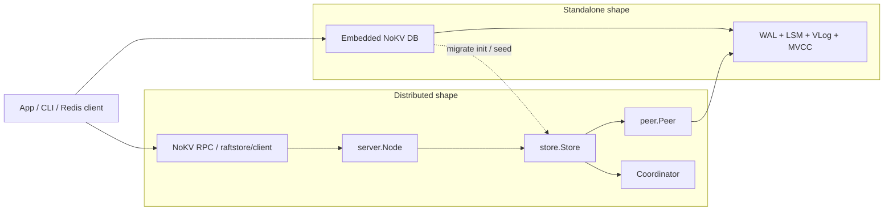
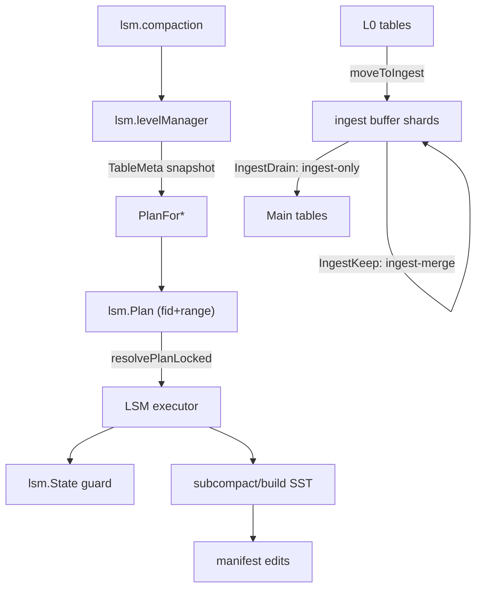

# NoKV Architecture Overview

NoKV delivers a hybrid storage engine that can operate as a standalone embedded KV store or as a distributed NoKV service. The distributed RPC surface follows a TinyKV/TiKV-style region + MVCC design, but the service identity and deployment model are NoKV's own. This document captures the key building blocks, how they interact, and the execution flow from client to disk.

> Read this page if you want the shortest route from “what is NoKV” to “which package owns which part of the system”.

This architecture is also meant to support NoKV as a **maintainable and extensible distributed storage research platform**. The point is not only to describe how the current system runs, but to make the package boundaries, lifecycle ownership, and experiment surfaces explicit enough that new storage-engine, metadata, control-plane, and distributed-runtime ideas can be added without rebuilding the repository around each new topic.

At a high level, the codebase is organized around four long-lived layers:

- **Root facade and runtime surface** – the top-level `DB` APIs and thin system entrypoints.
- **Single-node engine substrate** – `engine/*` owns WAL, LSM, manifest, value log, file, and VFS mechanics.
- **Distributed execution and control plane** – `raftstore/*`, `meta/*`, and `coordinator/*` host replicated execution, rooted metadata, and cluster control logic.
- **Experiment and evidence layer** – `benchmark/*`, scripts, and docs keep evaluation and design claims attached to the implementation.

## Reader Map

- If you care about the embedded engine, focus on sections 2 and 5.
- If you care about distributed runtime ownership, focus on sections 3, 4, and 5.
- If you care about migration and recovery, read this page together with [`migration.md`](migration.md) and [`recovery.md`](recovery.md).

---

## 1. High-Level Layout

```
┌─────────────────────────┐   NoKV gRPC     ┌─────────────────────────┐
│ raftstore Service       │◀──────────────▶ │ raftstore/client        │
└───────────┬─────────────┘                 │  (Get / Scan / Mutate)  │
            │                               └─────────────────────────┘
            │ ReadCommand / ProposeCommand
            ▼
┌─────────────────────────┐
│ store.Store / peer.Peer │  ← multi-Raft region lifecycle
│  ├ Local peer catalog   │
│  ├ Router / region catalog │
│  └ transport (gRPC)     │
└───────────┬─────────────┘
            │ Apply via kv.Apply
            ▼
┌─────────────────────────┐
│ kv.Apply + percolator   │
│  ├ Get / Scan           │
│  ├ Prewrite / Commit    │
│  └ Latch manager        │
└───────────┬─────────────┘
            │
            ▼
┌─────────────────────────┐
│ Embedded NoKV core      │
│  ├ WAL Manager          │
│  ├ MemTable / Flush     │
│  ├ ValueLog + GC        │
│  └ Manifest / Stats     │
└─────────────────────────┘
```

- **Embedded mode** uses `NoKV.Open` directly: WAL→MemTable→SST durability, ValueLog separation, non-transactional APIs with internal version ordering, and rich stats.
- **Distributed mode** layers `raftstore` on top: multi-Raft regions reuse the same WAL, keep store-local recovery metadata separate from storage manifest state, expose metrics, and serve NoKV RPCs.
- **Control plane split**: `raft_config` provides bootstrap topology; Coordinator provides runtime routing/TSO/control-plane state in cluster mode.
- **Clients** obtain leader-aware routing, automatic NotLeader/EpochNotMatch retries, and two-phase commit helpers.

### Same system, two shapes


```mermaid
flowchart LR
    App["App / CLI / Redis client"]
    App --> Embedded["Embedded NoKV DB"]
    App --> RPC["NoKV RPC / raftstore/client"]

    subgraph "Standalone shape"
        Embedded --> Core["WAL + LSM + VLog + MVCC"]
    end

    subgraph "Distributed shape"
        RPC --> Server["server.Node"]
        Server --> Store["store.Store"]
        Store --> Peer["peer.Peer"]
        Peer --> Core
        Store --> Coordinator["Coordinator"]
    end

    Embedded -. migrate init / seed .-> Store
```

### Detailed Runtime Paths

For function-level call chains with sequence diagrams (embedded write/read,
iterator scan, distributed read/write via Raft apply), see
[`docs/runtime.md`](runtime.md).

---

## 2. Embedded Engine

### Code entry points

If you want to inspect the embedded side first, start here:

```go
opt := NoKV.NewDefaultOptions()
opt.WorkDir = "./workdir"

db, err := NoKV.Open(opt)
if err != nil {
    panic(err)
}
defer db.Close()

_ = db.Set([]byte("hello"), []byte("world"))
entry, _ := db.Get([]byte("hello"))
fmt.Println(string(entry.Value))
```

Then read:

- `db.go`
- `engine/lsm/`
- `engine/wal/`
- `vlog.go`

### 2.1 WAL & MemTable
- `wal.Manager` appends `[len|type|payload|crc]` records (typed WAL), rotates segments, and replays logs on crash.
- `MemTable` accumulates writes until full, then enters the flush queue; the concrete flush runtime runs `Enqueue → Build → Install → Release`, logs edits, and releases WAL segments.
- Writes are handled by a single commit worker that performs value-log append first, then WAL/memtable apply, keeping durability ordering simple and consistent.

### 2.2 ValueLog
- Large values are written to the ValueLog before the WAL append; the resulting `ValuePtr` is stored in WAL/LSM so replay can recover.
- `vlog.Manager` tracks the active head and uses flush discard stats to trigger GC; manifest records new heads and removed segments.

### 2.3 Manifest
- `manifest.Manager` stores only storage-engine metadata: SST metadata, WAL checkpoints, and ValueLog metadata. Store-local raft replay pointers live in `raftstore/localmeta`.
- `CURRENT` provides crash-safe pointer updates for storage-engine metadata. Region descriptors are no longer stored in the storage manifest.

### 2.4 LSM Compaction & Ingest Buffer
- `lsm.compaction` drives compaction cycles; `lsm.levelManager` supplies table metadata and executes the plan.
- Planning is split inside `lsm`: `PlanFor*` selects table IDs + key ranges, then LSM resolves IDs back to tables and runs the merge.
- `lsm.State` guards overlapping key ranges and tracks in-flight table IDs.
- Ingest shard selection is policy-driven in `lsm` (`PickShardOrder` / `PickShardByBacklog`) while the ingest buffer remains in `lsm`.


```mermaid
flowchart TD
  Manager["lsm.compaction"] --> LSM["lsm.levelManager"]
  LSM -->|TableMeta snapshot| Planner["PlanFor*"]
  Planner --> Plan["lsm.Plan (fid+range)"]
  Plan -->|resolvePlanLocked| Exec["LSM executor"]
  Exec --> State["lsm.State guard"]
  Exec --> Build["subcompact/build SST"]
  Build --> Manifest["manifest edits"]
  L0["L0 tables"] -->|moveToIngest| Ingest["ingest buffer shards"]
  Ingest -->|IngestDrain: ingest-only| Main["Main tables"]
  Ingest -->|IngestKeep: ingest-merge| Ingest
```

### 2.5 Distributed Transaction Path
- `percolator` implements Prewrite/Commit/ResolveLock/CheckTxnStatus; `kv.Apply` dispatches raft commands to these helpers.
- MVCC timestamps come from the distributed client/Coordinator TSO flow, not from an embedded standalone transaction API.
- Watermarks (`utils.WaterMark`) are used in durability/visibility coordination; they have no background goroutine and advance via mutex + atomics.

### 2.6 Write Pipeline & Backpressure
- Writes enqueue into a commit queue inside `db.go` where requests are coalesced into batches before a commit worker drains them.
- The commit worker always writes the value log first (when needed), then applies WAL/LSM updates; `SyncWrites` adds a WAL fsync step.
- Batch sizing adapts to backlog through `WriteBatchMaxCount`, `WriteBatchMaxSize`, and `WriteBatchWait`.
- Backpressure is enforced in two places: LSM throttling toggles `db.blockWrites` when L0 backlog grows, and HotRing can reject hot keys via `WriteHotKeyLimit`.

### 2.7 Ref-Count Lifecycle Contracts

NoKV uses fail-fast reference counting for internal pooled/owned objects. `DecrRef` underflow is treated as a lifecycle bug and panics.

| Object | Owned by | Borrowed by | Release rule |
| --- | --- | --- | --- |
| `kv.Entry` (pooled) | internal write/read pipelines | codec iterator, memtable/lsm internal reads, request batches | Must call `DecrRef` exactly once per borrow. |
| `kv.Entry` (detached public result) | caller | none | Returned by `DB.Get`; **must not** call `DecrRef`. |
| `kv.Entry` (borrowed internal result) | caller | yes (`DecrRef`) | Returned by `DB.GetInternalEntry`; caller must release exactly once. |
| `request` | commit queue/worker | waiter path (`Wait`) | `IncrRef` on enqueue; `Wait` does one `DecrRef`; zero returns request to pool and releases entries. |
| `table` | level/main+ingest lists, block cache | table iterators, prefetch workers | Removed tables are decremented once after manifest+in-memory swap; zero deletes SST. |
| `Skiplist` / `ART` index | memtable | iterators | Iterator creation increments index ref; iterator `Close` decrements; double-close is idempotent. |

---

## 3. Replication Layer (raftstore)

### Code entry points

If you want to inspect the distributed side first, start here:

```go
srv, err := server.NewNode(server.Config{
    Storage: server.Storage{MVCC: db, Raft: db.RaftLog()},
    Store: store.Config{StoreID: 1},
    Raft: myraft.Config{ElectionTick: 10, HeartbeatTick: 2, PreVote: true},
    TransportAddr: "127.0.0.1:20160",
})
if err != nil {
    panic(err)
}
defer srv.Close()
```

Then read:

- `raftstore/server/node.go`
- `raftstore/store/store.go`
- `raftstore/peer/peer.go`
- `raftstore/engine/wal_storage.go`
- `raftstore/localmeta/store.go`

| Package | Responsibility |
| --- | --- |
| [`store`](../raftstore/store) | Region catalog/runtime root, router, RegionMetrics, scheduler + command runtimes, helpers such as `StartPeer` / `SplitRegion`. |
| [`peer`](../raftstore/peer) | Wraps etcd/raft `RawNode`, handles Ready pipeline, snapshot resend queue, backlog instrumentation. |
| [`engine`](../raftstore/engine) | WALStorage/DiskStorage/MemoryStorage, reusing the DB's WAL while keeping store-local raft replay metadata in sync. |
| [`transport`](../raftstore/transport) | gRPC transport for Raft Step messages, connection management, retries/blocks/TLS. Also acts as the host for NoKV RPC. |
| [`kv`](../raftstore/kv) | NoKV RPC handler plus `kv.Apply` bridging Raft commands to MVCC logic. |
| [`server`](../raftstore/server) | `Config` + `NewNode` combine DB, Store, transport, and NoKV service into a reusable node instance. |

### 3.1 Bootstrap Sequence
1. `server.NewNode` wires DB, store configuration (StoreID, hooks, scheduler), Raft config, and transport address. It registers NoKV RPC on the shared gRPC server and sets `transport.SetHandler(store.Step)`.
2. CLI (`nokv serve`) or application enumerates the local peer catalog and calls `Store.StartPeer` for every Region containing the local store:
   - `peer.Config` includes Raft params, transport, `kv.NewEntryApplier`, peer storage, and Region metadata.
   - Router registration, regionManager bookkeeping, optional `Peer.Bootstrap` with initial peer list, leader campaign.
3. Peers from other stores can be configured through `transport.SetPeer(peerID, addr)` (raft peer ID). In cluster mode, runtime routing/control-plane decisions come from Coordinator.

### 3.2 Command Paths
- **ReadCommand** (`KvGet`/`KvScan`): validate Region & leader, execute Raft ReadIndex (`LinearizableRead`) and `WaitApplied`, then run `commandApplier` (i.e. `kv.Apply` in read mode) to fetch data from the DB. This yields leader-strong reads with an explicit Raft linearizability barrier.
- **ProposeCommand** (write): encode the request, push through Router to the leader peer, replicate via Raft, and apply in `kv.Apply` which maps to MVCC operations.

### 3.3 Transport
- gRPC server handles Step RPCs and NoKV RPCs on the same endpoint; peers are registered via `SetPeer`.
- Retry policies (`WithRetry`) and TLS credentials are configurable. Tests cover partitions, blocked peers, and slow followers.

---

## 4. NoKV Service

`raftstore/kv/service.go` exposes pb.NoKV RPCs:

| RPC | Execution | Result |
| --- | --- | --- |
| `KvGet` | `store.ReadCommand` → `kv.Apply` GET | `pb.GetResponse` / `RegionError` |
| `KvScan` | `store.ReadCommand` → `kv.Apply` SCAN | `pb.ScanResponse` / `RegionError` |
| `KvPrewrite` | `store.ProposeCommand` → `percolator.Prewrite` | `pb.PrewriteResponse` |
| `KvCommit` | `store.ProposeCommand` → `percolator.Commit` | `pb.CommitResponse` |
| `KvResolveLock` | `percolator.ResolveLock` | `pb.ResolveLockResponse` |
| `KvCheckTxnStatus` | `percolator.CheckTxnStatus` | `pb.CheckTxnStatusResponse` |

`nokv serve` is the CLI entry point—open the DB, construct `server.Node`, register peers, start local Raft peers, and display a local peer catalog summary (Regions, key ranges, peers). `scripts/dev/cluster.sh` builds the CLI, writes a minimal local peer catalog, launches multiple `nokv serve` processes on localhost, and handles cleanup on Ctrl+C.

The RPC request/response shape is intentionally close to TinyKV/TiKV so the MVCC and region semantics remain familiar, but the service name exposed on the wire is `pb.NoKV`.

---

## 5. Client Workflow

`raftstore/client` offers a leader-aware client with retry logic and convenient helpers:

- **Initialization**: provide `[]StoreEndpoint` + `RegionResolver` (`GetRegionByKey`) so runtime routing is Coordinator-driven.
- **Reads**: `Get` and `Scan` pick the leader store for a key range, issue NoKV RPCs, and retry on NotLeader/EpochNotMatch.
- **Writes**: `Mutate` bundles operations per region and drives Prewrite/Commit (primary first, secondaries after); `Put` and `Delete` are convenience wrappers using the same 2PC path.
- **Timestamps**: clients must supply `startVersion`/`commitVersion`. For distributed demos, use Coordinator (`nokv coordinator`) to obtain globally increasing values before calling `TwoPhaseCommit`.
- **Bootstrap helpers**: `scripts/dev/cluster.sh --config raft_config.example.json` builds the binaries, seeds local peer catalogs via `nokv-config catalog`, launches Coordinator, and starts the stores declared in the config.

**Example (two regions)**
1. Regions `[a,m)` and `[m,+∞)`, each led by a different store.
2. `Mutate(ctx, primary="alfa", mutations, startTs, commitTs, ttl)` prewrites and commits across the relevant regions.
3. `Get/Scan` retries automatically if the leader changes.
4. See `raftstore/server/node_test.go` for a full end-to-end example using real `server.Node` instances.

---

## 6. Failure Handling

- Manifest edits capture only storage metadata, WAL checkpoints, and ValueLog pointers. Store-local region recovery state and raft replay pointers are loaded from `raftstore/localmeta`.
- WAL replay reconstructs memtables and Raft groups; ValueLog recovery trims partial records.
- `Stats.StartStats` resumes metrics sampling immediately after restart, making it easy to verify recovery correctness via `nokv stats`.

---

## 7. Observability & Tooling

- `StatsSnapshot` publishes flush/compaction/WAL/VLog/raft/region/hot/cache metrics. `nokv stats` and the expvar endpoint expose the same data.
- `nokv regions` inspects the local peer catalog.
- `nokv serve` advertises Region samples on startup (ID, key range, peers) for quick verification.
- Inspect scheduler/control-plane state via Coordinator APIs/metrics.
- Scripts:
  - `scripts/dev/cluster.sh` – launch a multi-node NoKV cluster locally.
  - `RECOVERY_TRACE_METRICS=1 go test ./... -run 'TestRecovery(RemovesStaleValueLogSegment|CleansMissingSSTFromManifest|ManifestRewriteCrash|SlowFollowerSnapshotBacklog|SnapshotExportRoundTrip|WALReplayRestoresData)' -count=1 -v` – crash-recovery validation.
  - `CHAOS_TRACE_METRICS=1 go test -run 'TestGRPCTransport(HandlesPartition|MetricsWatchdog|MetricsBlockedPeers)' -count=1 -v ./raftstore/transport` – inject network faults and observe transport metrics.

---

## 8. When to Use NoKV

- **Embedded**: call `NoKV.Open`, use the local non-transactional DB APIs.
- **Distributed**: deploy `nokv serve` nodes, use `raftstore/client` (or any NoKV gRPC client) to perform reads, scans, and 2PC writes.
- **Observability-first**: inspection via CLI or expvar is built-in; Region, WAL, Flush, and Raft metrics are accessible without extra instrumentation.

See also [`docs/raftstore.md`](raftstore.md) for deeper internals, [`docs/coordinator.md`](coordinator.md) for control-plane details, and [`docs/testing.md`](testing.md) for coverage details.
