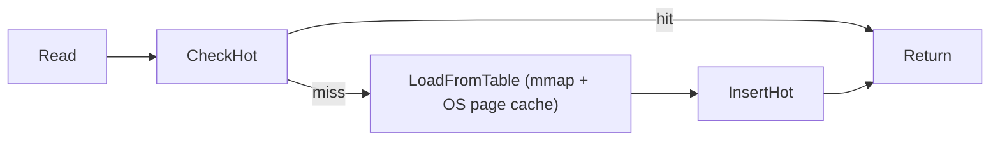

# Cache & Bloom Filters

NoKV's LSM tier layers a multi-level block cache with bloom filter caching to accelerate lookups. The implementation is in [`lsm/cache.go`](../lsm/cache.go).

---

## 1. Components

| Component | Purpose | Source |
| --- | --- | --- |
| `cache.indexs` + `indexHot` | Table index cache (`fid` → `*pb.TableIndex`) reused across reopen + small CLOCK hot tier fed by HotRing hits. | [`utils/cache`](../utils/cache) |
| `blockCache` | Ristretto-based block cache (L0/L1 only) with per-table direct slots; hot block tier (small CLOCK) keeps hotspot blocks resident. | [`lsm/cache.go`](../lsm/cache.go) |
| `bloomCache` + `hot` | LRU cache of bloom filter bitsets per SST plus small CLOCK hot tier to protect frequent filters. | [`lsm/cache.go`](../lsm/cache.go) |
| `cacheMetrics` | Atomic hit/miss counters for L0/L1 blocks and blooms. | [`lsm/cache.go#L30-L110`](../lsm/cache.go#L30-L110) |

Badger uses a similar block cache split (`Pinner`/`Cache`) while RocksDB exposes block cache(s) via the `BlockBasedTableOptions`. NoKV keeps it Go-native and GC-friendly.

---

### 1.1 Index Cache & Handles

* SSTable metadata stays with the `table` struct, while decoded protobuf indexes are stored in `cache.indexs`. Lookups first hit the cache before falling back to disk.
* SST handles are reopened on demand for lower levels. L0/L1 tables keep their file descriptors pinned, while deeper levels close them once no iterator is using the table.

---

## 2. Block Cache Strategy

```text
User-space block cache (L0/L1, parsed blocks, Ristretto LFU-ish)
Small hot tier (CLOCK) for hotspot blocks
Deeper levels rely on OS page cache + mmap readahead
```

* `Options.BlockCacheSize` sets capacity in **blocks** (cost=1 per block). Entries keep parsed blocks (data slice + offsets/baseKey/checksum), so hits avoid re-parsing.
* Hot tier: requests marked `hot` (prefetch/hotspot reads) promote blocks into the small CLOCK hot set derived from the main capacity, making them harder to evict under long-tail traffic.
* Per-table direct slots (`table.cacheSlots[idx]`) give a lock-free fast path. Misses fall back to the shared Ristretto cache (approx LFU with admission).
* Evictions clear the table slot via `OnEvict`; user-space cache only tracks L0/L1 blocks. Deeper levels depend on the OS page cache.
* Access patterns: `getBlock` also updates hit/miss metrics for L0/L1; deeper levels bypass the cache and do not affect metrics.



By default only L0 and L1 blocks are cached (`level > 1` short-circuits), reflecting the higher re-use for top levels.

---

## 3. Bloom Cache

* `bloomCache` stores the raw filter bitset (`utils.Filter`) per table ID. Entries are deep-copied (`SafeCopy`) to avoid sharing memory with mmaps.
* Main tier is LRU with a tiny CLOCK hot set to protect frequently hit filters from being washed out by scans.
* Capacity is controlled by `Options.BloomCacheSize`; the hot CLOCK tier auto-scales from a few dozen up to a few hundred entries.
* Bloom hits/misses are recorded via `cacheMetrics.recordBloom`, feeding into `StatsSnapshot.BloomHitRate`.

---

## 4. Metrics & Observability

`cache.metricsSnapshot()` produces:

```go
type CacheMetrics struct {
    L0Hits, L0Misses uint64
    L1Hits, L1Misses uint64
    BloomHits, BloomMisses uint64
    IndexHits, IndexMisses uint64
}
```

`Stats.Snapshot` converts these into hit rates. Monitor them alongside the block cache sizes to decide when to scale memory.

---

## 5. Hot Integration (HotRing)

* Hot detection: HotRing counts on read/write paths raise a `hot` flag once thresholds are met; only hot keys trigger prefetch.
* Cache promotion: hot hits/prefetch promote blocks into the CLOCK hot tier and promote indexes/Blooms into their CLOCK tiers; cold data stays in the main cache to avoid pollution.
* Compaction coupling: HotRing top-k feeds compaction scoring; levels/ingest shards covering hot ranges get higher scores to trim overlap sooner.
* Tuning: Hot thresholds come from HotRing options (window/decay configurable); hot tier capacities are small and derived from existing cache sizes.

---

## 6. Interaction with Value Log

* Keys stored as value pointers (large values) still populate block cache entries for the key/index block. The value payload is read directly from the vlog (`valueLog.read`), so block cache hit rates remain meaningful.
* Discard stats from flushes can demote cached blocks via `cache.dropBlock`, ensuring obsolete SST data leaves the cache quickly.

---

## 7. Comparison

| Feature | RocksDB | BadgerDB | NoKV |
| --- | --- | --- | --- |
| Hot/cold tiers | Configurable multiple caches | Single cache | Ristretto (hot) + OS page cache (cold) |
| Bloom cache | Enabled per table, no explicit cache | Optional | Dedicated LRU storing filters |
| Metrics | Block cache stats via `GetAggregatedIntProperty` | Limited | `NoKV.Stats.Cache.*` hit rates |

---

## 8. Operational Tips

* If bloom hit rate falls below ~60%, consider increasing bits-per-key or Bloom cache size.
* Track `nokv stats --json` cache metrics over time; drops often indicate iterator misuse or working-set shifts.

More on SST layout lives in [`docs/manifest.md`](manifest.md) and [`docs/architecture.md`](architecture.md#4-read-path--iterators).
