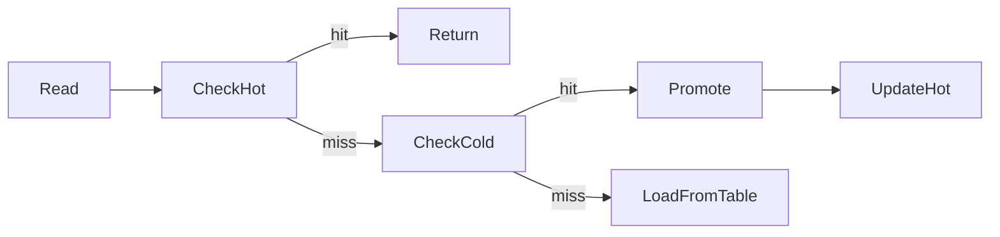

# Cache & Bloom Filters

NoKV's LSM tier layers a multi-level block cache with bloom filter caching to accelerate lookups. The implementation is in [`lsm/cache.go`](../lsm/cache.go).

---

## 1. Components

| Component | Purpose | Source |
| --- | --- | --- |
| `cache.indexs` | Short-lived table metadata cache (`fid` → `*table`). | [`coreCache.Cache`](../utils/cache) wrapper |
| `blockCache` | Two-tier block cache (hot LRU + cold CLOCK). | [`lsm/cache.go#L168-L266`](../lsm/cache.go#L168-L266) |
| `bloomCache` | LRU cache of bloom filter bitsets per SST. | [`lsm/cache.go#L296-L356`](../lsm/cache.go#L296-L356) |
| `cacheMetrics` | Atomic hit/miss counters for L0/L1 blocks and blooms. | [`lsm/cache.go#L30-L110`](../lsm/cache.go#L30-L110) |

Badger uses a similar block cache split (`Pinner`/`Cache`) while RocksDB exposes block cache(s) via the `BlockBasedTableOptions`. NoKV keeps it Go-native and GC-friendly.

---

## 2. Block Cache Strategy

```text
Hot tier (LRU)  -> small, latency-critical blocks (L0/L1)
Cold tier (CLOCK) -> larger backing store for demoted blocks
```

* `Options.BlockCacheSize` sets the combined capacity (in blocks). `Options.BlockCacheHotFraction` decides the fraction devoted to the hot tier.
* **Hot tier** – Doubly linked list managed with `container/list`. Promotion happens on every hit; eviction demotes blocks into the cold tier where possible.
* **Cold tier** – CLOCK algorithm implemented via a ring buffer (`clockCache`). It tracks reference bits and approximates LRU without heavy locking.
* All operations guard internal state with `blockCache.mu`, while metrics record the level (L0 or L1) and hit/miss outcome.



By default only L0 and L1 blocks are cached (`level > 1` short-circuits), reflecting the higher re-use for top levels.

---

## 3. Bloom Cache

* `bloomCache` stores the raw filter bitset (`utils.Filter`) per table ID. Entries are deep-copied (`SafeCopy`) to avoid sharing memory with mmaps.
* LRU eviction ensures the newest filters stay resident; older ones are dropped to keep memory bounded (`Options.BloomCacheSize`).
* Bloom hits/misses are recorded via `cacheMetrics.recordBloom`, feeding into `StatsSnapshot.BloomHitRate`.

---

## 4. Metrics & Observability

`cache.metricsSnapshot()` produces:

```go
type CacheMetrics struct {
    L0Hits, L0Misses uint64
    L1Hits, L1Misses uint64
    BloomHits, BloomMisses uint64
}
```

`Stats.Snapshot` converts these into hit rates. Monitor them alongside the block cache sizes to decide when to scale memory.

---

## 5. Interaction with Value Log

* Keys stored as value pointers (large values) still populate block cache entries for the key/index block. The value payload is read directly from the vlog (`valueLog.read`), so block cache hit rates remain meaningful.
* Discard stats from flushes can demote cached blocks via `cache.dropBlock`, ensuring obsolete SST data leaves the cache quickly.

---

## 6. Comparison

| Feature | RocksDB | BadgerDB | NoKV |
| --- | --- | --- | --- |
| Hot/cold tiers | Configurable multiple caches | Single cache | Built-in hot LRU + cold CLOCK |
| Bloom cache | Enabled per table, no explicit cache | Optional | Dedicated LRU storing filters |
| Metrics | Block cache stats via `GetAggregatedIntProperty` | Limited | `NoKV.Stats.Cache.*` hit rates |

---

## 7. Operational Tips

* Keep `BlockCacheHotFraction` between 0.1 and 0.3 for latency-sensitive workloads—too small and promotion churn increases.
* If bloom hit rate is low (<60%), consider increasing filter bits per key (see `table` builder options) or raising bloom cache size.
* Use `nokv stats --json` to track cache hit trends across releases; regressions often point to iterator misuse or working-set shifts.

More on SST layout lives in [`docs/manifest.md`](manifest.md) and [`docs/architecture.md`](architecture.md#4-read-path--iterators).
