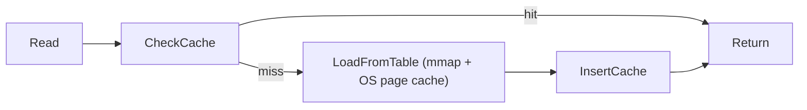

# Cache & Bloom Filters

NoKV's LSM tier layers a multi-level block cache with decoded index caching to accelerate lookups. Bloom filters remain embedded in SST indexes and are probed directly from `pb.TableIndex`. The implementation is in [`engine/lsm/cache.go`](../engine/lsm/cache.go).

---

## 1. Components

| Component | Purpose | Source |
| --- | --- | --- |
| `cache.indexes` | Byte-budgeted W-TinyLFU cache for decoded table indexes (`fid` → `*pb.TableIndex`). | [`utils/cache`](../utils/cache) |
| `blockCache` | Ristretto-based block cache (L0/L1 only) with per-table direct slots. | [`engine/lsm/cache.go`](../engine/lsm/cache.go) |
| `cacheMetrics` | Atomic hit/miss counters for L0/L1 blocks and indexes. | [`engine/lsm/cache.go#L30-L110`](../engine/lsm/cache.go#L30-L110) |

Badger exposes separate block/index cache budgets while Pebble uses a unified cache budget. NoKV keeps block and index caches explicit; bloom filters piggyback on the decoded table index already held by each live SST.

---

### 1.1 Index Cache & Handles

* SSTable metadata stays with the `table` struct, while decoded protobuf indexes are stored in `cache.indexes`. Lookups first hit the cache before falling back to disk.
* SST handles are reopened on demand for lower levels. L0/L1 tables keep their file descriptors pinned, while deeper levels close them once no iterator is using the table.

---

## 2. Block Cache Strategy

```text
User-space block cache (L0/L1, parsed blocks, Ristretto LFU-ish)
Deeper levels rely on OS page cache + mmap readahead
```

* `Options.BlockCacheBytes` sets the block-cache budget in bytes. Entries are admitted with an estimated block footprint, so larger blocks naturally consume more of the budget.
* Per-table direct slots (`table.cacheSlots[idx]`) give a lock-free fast path. Misses fall back to the shared Ristretto cache (approx LFU with admission).
* Evictions clear the table slot via `OnEvict`; user-space cache only tracks L0/L1 blocks. Deeper levels depend on the OS page cache.
* Access patterns: `getBlock` also updates hit/miss metrics for L0/L1; deeper levels bypass the cache and do not affect metrics.


```mermaid
flowchart LR
  Read --> CheckCache
  CheckCache -->|hit| Return
  CheckCache -->|miss| LoadFromTable["LoadFromTable (mmap + OS page cache)"]
  LoadFromTable --> InsertCache
  InsertCache --> Return
```

By default only L0 and L1 blocks are cached (`level > 1` short-circuits), reflecting the higher re-use for top levels.

---

## 3. Bloom Filters

* Bloom filters are stored inside `pb.TableIndex` and probed directly from the decoded index already held by `table.idx`.
* There is no separate bloom-filter cache layer; this avoids a redundant hot-path mutex/LRU hop on every point lookup.
* `indexCache` keeps the existing W-TinyLFU admission path and budgets decoded `pb.TableIndex` payloads using the protobuf-encoded size (`proto.Size`).

---

## 4. Metrics & Observability

`cache.metricsSnapshot()` produces:

```go
type CacheMetrics struct {
    L0Hits, L0Misses uint64
    L1Hits, L1Misses uint64
    IndexHits, IndexMisses uint64
}
```

`Stats.Snapshot` converts these into hit rates. Monitor them alongside the block cache sizes to decide when to scale memory.

---

## 5. Thermos Integration

Thermos is no longer part of cache warmup or read-path prefetch. Cache behavior is now independent of Thermos and driven only by:

* iterator/table prefetch settings
* block/index cache budgets
* normal read traffic

The only remaining Thermos integration is optional write throttling.

---

## 6. Interaction with Value Log

* Keys stored as value pointers (large values) still populate block cache entries for the key/index block. The value payload is read directly from the vlog (`valueLog.read`), so block cache hit rates remain meaningful.
* Discard stats from flushes can demote cached blocks via `cache.dropBlock`, ensuring obsolete SST data leaves the cache quickly.

---

## 7. Comparison

| Feature | RocksDB | BadgerDB | NoKV |
| --- | --- | --- | --- |
| Block cache policy | Configurable multiple caches | Single cache | Ristretto for L0/L1 + OS page cache for deeper levels |
| Bloom filter storage | Per table | Per table | Embedded in decoded table indexes |
| Metrics | Block cache stats via `GetAggregatedIntProperty` | Limited | `NoKV.Stats.cache.*` hit rates |

---

## 8. Operational Tips

* If point-read false positives become expensive, tune bloom bits-per-key at SST build time rather than adding another filter cache layer.
* Track `nokv stats --json` cache metrics over time; drops often indicate iterator misuse or working-set shifts.
* Benchmark tooling accepts cache sizes in MB and converts them into these byte-budget fields before opening the engine.

More on SST layout lives in [`docs/manifest.md`](manifest.md) and [`docs/architecture.md`](architecture.md#2-embedded-engine).
