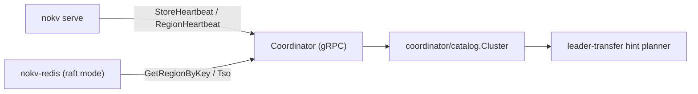

# Coordinator

`Coordinator` is NoKV's control-plane service for distributed mode.
It exposes a gRPC API (`pb.Coordinator`) and is started by:

```bash
go run ./cmd/nokv coordinator --addr 127.0.0.1:2379
```

---

## 1. Responsibilities

Coordinator currently owns:

- **Routing**: `GetRegionByKey`
- **Heartbeats**: `StoreHeartbeat`, `RegionHeartbeat`
- **Region removal**: `RemoveRegion`
- **ID service**: `AllocID`
- **TSO**: `Tso`

Runtime clients (for example `cmd/nokv-redis` raft backend) use Coordinator as the
routing source of truth, but Coordinator is not the durable owner of cluster topology
truth. Durable truth lives in `meta/root`.

---

## 2. Runtime Architecture



Core implementation units:

- `coordinator/catalog`: in-memory cluster metadata model.
- `coordinator/idalloc`: monotonic ID allocator used by Coordinator.
- `coordinator/rootview`: persistence abstraction (`Store`) backed by the metadata root.
- `coordinator/server`: gRPC service + RPC validation/error mapping.
- `coordinator/client`: client wrapper used by store/gateway.
- `coordinator/adapter`: scheduler sink that forwards heartbeats into Coordinator.

For the next-stage protocol direction on both the control plane and the paired
execution plane, see `docs/control_and_execution_protocols.md`.

### Control-Plane Protocol Status

Coordinator now uses a **minimal formal control-plane protocol v1** for its key
route and transition surfaces.

Already in active use:

- route-read `Freshness`
- rooted token serving metadata
- rooted lag exposure
- `DegradedMode`
- `CatchUpState`
- `TransitionID`
- publish-time lifecycle assessment on `PublishRootEvent`

This means Coordinator no longer exposes only best-effort implementation
behavior. It now returns explicit protocol state that callers, tests, and docs
can rely on.

The current protocol is intentionally minimal. It does not yet expose the full
future runtime/operator model such as stalled transitions or richer catch-up
actions.

### Minimal Succession vocabulary

The rooted handoff protocol is smaller than some of the implementation type
names suggest. At the doc / operator level, keep just these words:

- `Lease` — the currently active authority record
- `Seal` — the retired predecessor era plus the frontier it already
  consumed
- `Handover` — the rooted handoff record for the current successor
- `Era` — the monotonic authority era
- `Witness` — the operator-visible proof bundle that explains whether the
  current handoff state is safe

The four guarantees discussed by the docs and runtime metrics are:

- `Primacy` — at most one authority era is active
- `Inheritance` — the successor must cover the predecessor's published work
- `Silence` — a sealed predecessor must not keep serving
- `Finality` — a handoff must not remain permanently half-finished

Implementation names remain more explicit:

| Doc term | Implementation term |
|---|---|
| `Lease` | `Tenure` |
| `Seal` | `Legacy` |
| `Handover` | `Handover` |
| `Era` | `Era` / `era` |
| `Witness` | `HandoverWitness` / continuation witness fields |
| `Frontiers` | `MandateFrontiers` / `frontiers` / `consumed_frontiers` |

This split is deliberate: docs describe the protocol in the smallest stable
vocabulary, while code keeps the more explicit type names that make mutation
boundaries obvious.

---

## 3. Deployment Model

NoKV ships exactly one distributed topology plus the standalone engine shape.

### `standalone`

- no `coordinator`
- no `meta/root`
- no control-plane process
- all truth remains inside the single storage process

This is the default local engine shape. Standalone is not a degraded control
plane deployment; it simply has no control plane.

### `separated meta-root + coordinator`

- three independent `nokv meta-root` processes own durable rooted truth
  (replicated raft quorum, the only backend NoKV ships)
- one or more `nokv coordinator` processes connect through the remote
  metadata-root gRPC API
- `Tenure` gates singleton Coordinator duties: `AllocID`, `Tso`,
  and scheduler operation planning
- route reads still come from Coordinator's rebuildable in-memory view and
  expose `Freshness`, `RootToken`, `CatchUpState`, and `DegradedMode`

Keep the same logical split inside every deployment:

- `meta/root/*`: durable rooted truth (replicated + gRPC service)
- `coordinator/view` + `coordinator/catalog`: rebuildable routing/scheduling state
- `coordinator/rootview`: remote view of meta-root consumed by coordinator/server
- `coordinator/server`: gRPC API surface

Product assumptions:

- exactly three meta-root replicas
- meta-root is the only place durable rooted truth lives
- coordinators are stateless relative to rooted truth; only the
  `Tenure` differentiates active vs standby
- no dynamic metadata-root membership
- no production-grade dynamic coordinator membership manager

Separated deployment design and tradeoffs are discussed in
`docs/notes/2026-04-12-coordinator-meta-separation.md`.

---

## 4. Persistence (`--workdir`)

`--workdir` is required for every formal Coordinator deployment that hosts rooted truth.

### `separated meta-root + coordinator`

Each `meta-root` process has its own rooted workdir and raft transport address.
The `coordinator` process does not host rooted truth; it only connects to the
remote root endpoints through `--root-peer nodeID=grpc_addr`.

Each meta-root workdir persists two layers of state:

1. rooted truth state
   - `root.events.wal`
   - `root.checkpoint.binpb`
2. replicated protocol state
   - `root.raft.bin`
   - contains raft hard state, raft snapshot, and retained raft entries

Each meta-root node must have an isolated workdir. Workdirs are not shared.

Persistence ownership:

1. `meta-root` workdirs own durable rooted truth and replicated metadata-root
   raft state.
2. `coordinator` runtime view is rebuildable from remote `meta/root`.
3. allocator fences and `Tenure` are rooted events, not local
   coordinator files.

`--coordinator-id` must be a stable configured identity. It is used for lease
ownership and operator debugging; it should not be generated randomly on each
restart.

### Rooted bootstrap flow

The Coordinator storage layer rebuilds its region snapshot and allocator checkpoints by
replaying rooted truth:

- **region descriptor publish/tombstone** events rebuild the route catalog
- **allocator fences** rebuild:
  - `id_current`
  - `ts_current`

`id_current` and `ts_current` are durable allocator fences, not necessarily the
last values served. With allocator window preallocation they may be ahead of the
last returned ID or timestamp; restart recovery intentionally resumes after the
fence and skips unused values.

Startup flow:

1. Open rooted `coordinator/rootview` against the 3 meta-root `--root-peer` endpoints.
2. Reconstruct a rooted Coordinator snapshot (`regions` + allocator fences).
3. Compute starts as `max(cli_start, fence+1)`.
4. Materialize the rooted region snapshot into `coordinator/catalog.Cluster`.

Coordinator periodically refreshes rooted state via the meta-root tail stream
and rebuilds the service-side view. This avoids allocator rollback and keeps
all durable truth inside meta-root.

### Region Truth Hierarchy

NoKV intentionally keeps three region views with different authority:

- **Coordinator region catalog**: cluster routing truth. Clients and stores must treat
  Coordinator as the authoritative key-to-region source at the service boundary, but
  Coordinator rebuilds this view from rooted metadata truth plus heartbeats.
- **`raftstore/localmeta` local catalog**: store-local recovery truth. It exists so
  one store can restart hosted peers and replay raft WAL checkpoints even if
  Coordinator is temporarily unavailable.
- **`Store.regions` runtime catalog**: in-memory cache/view rebuilt from local
  metadata at startup and then advanced by peer lifecycle plus raft apply.

These layers are not interchangeable. Local metadata is recovery state, not
cluster routing authority.

---

## 5. Config Integration

`raft_config.json` supports Coordinator endpoint + workdir defaults:

```json
"coordinator": {
  "addr": "127.0.0.1:2379",
  "docker_addr": "nokv-coordinator:2379",
  "work_dir": "./artifacts/cluster/coordinator",
  "docker_work_dir": "/var/lib/nokv-coordinator"
}
```

Resolution rules:

- CLI override wins.
- Otherwise read from config by scope (`host` / `docker`).

Helpers:

- `config.ResolveCoordinatorAddr(scope)`
- `config.ResolveCoordinatorWorkDir(scope)`
- `nokv-config coordinator --field addr|workdir --scope host|docker`

Replicated-root transport settings are currently CLI-driven, not config-file
driven.

---

## 6. Routing Source Convergence

NoKV now uses **Coordinator-first routing**:

- `raftstore/client` resolves regions with `GetRegionByKey`.
- `raft_config` regions are bootstrap/deployment metadata.
- Runtime route truth comes from Coordinator heartbeats + Coordinator region catalog.

This avoids dual sources drifting over time (config vs Coordinator).

---

## 7. Serve Mode Semantics

`nokv serve` is now Coordinator-only:

- `--coordinator-addr` is required.
- Runtime routing/scheduling control-plane state is sourced from Coordinator.

For restart and recovery, `nokv serve` intentionally separates runtime truth from
deployment metadata:

- hosted region/peer truth comes from `raftstore/localmeta`
- raft durable progress comes from the store workdir (`WAL`, raft log, local metadata)
- `raft_config.json` is used only to resolve static addresses (`Coordinator`,
  `store listen`, `store transport`)

This means:

- bootstrap-time `config.regions` are not replayed during restart
- runtime split/merge/peer-change results continue to come back from local recovery state
- `--store-addr` is an exceptional static address override, not the normal restart path
- `--store-id` must match the durable workdir identity when the workdir was already used

The recommended restart shape is therefore:

```bash
nokv serve \
  --config ./raft_config.example.json \
  --scope host \
  --store-id 1 \
  --workdir ./artifacts/cluster/store-1
```

`serve` will:

1. load the local peer catalog from the store workdir
2. derive the current remote peer set from local metadata
3. use config `stores` only to map `storeID -> addr`

If static transport overrides are needed, prefer stable store identities:

```bash
nokv serve \
  --config ./raft_config.example.json \
  --scope host \
  --store-id 1 \
  --workdir ./artifacts/cluster/store-1 \
  --store-addr 2=10.0.0.12:20160
```

Related CLI behavior:

- Inspect control-plane state through Coordinator APIs/metrics.
- `nokv coordinator --metrics-addr <host:port>` exposes native expvar on `/debug/vars`.
- `nokv serve --metrics-addr <host:port>` exposes store/runtime expvar on `/debug/vars`.

---

## 8. Service Semantics

`Coordinator` intentionally separates rooted truth leadership from the outer gRPC
service surface.

In `3 coordinator + replicated meta`:

- all three `coordinator` processes may listen and serve RPC
- only the rooted leader may commit truth writes
- followers refresh rooted state and serve read/view traffic

In separated mode:

- `meta-root` leadership determines which root endpoint accepts truth writes
- `Tenure` determines which Coordinator may serve singleton duties
- non-holder Coordinators may still serve route reads if their rooted view
  satisfies the caller's freshness contract

### Leader-only writes

These RPCs require rooted leadership:

- `RegionHeartbeat`
- `PublishRootEvent`
- `RemoveRegion`
- `AllocID`
- `Tso`

Followers return `FailedPrecondition` with `coordinator not leader` semantics, and
clients are expected to retry against another Coordinator endpoint.

In separated mode, `AllocID`, `Tso`, and scheduler operation planning also
require the local Coordinator to hold `Tenure`.

### Any-node reads

These RPCs may be served by any Coordinator node:

- `GetRegionByKey`
- `StoreHeartbeat` handling and store-view inspection

Follower reads are driven by a rooted watch-first tail subscription, with
explicit refresh/reload as fallback into `coordinator/catalog.Cluster`. They are expected
to be shortly stale rather than linearly consistent.

For `GetRegionByKey`, that follower-service behavior is now explicit in the
protocol surface:

- callers can request `Freshness`
- responses include rooted token metadata
- responses disclose `DegradedMode` and `CatchUpState`
- bounded-freshness reads may be rejected if rooted lag exceeds the requested
  limit

### Client behavior

`coordinator/client` accepts multiple Coordinator addresses. Write RPCs retry across Coordinator nodes and
converge on the rooted leader. Read RPCs may use any available Coordinator endpoint.

---

## 9. Deployment Example

NoKV ships exactly one topology: a 3-peer replicated meta-root cluster plus
one or more coordinator processes that talk to it over gRPC.

Start three metadata-root peers (peer map is identical on all three; only
`-addr`, `-workdir`, `-node-id`, `-transport-addr` differ):

```bash
go run ./cmd/nokv meta-root \
  -addr 127.0.0.1:2380 \
  -workdir ./artifacts/cluster/meta-root-1 \
  -node-id 1 \
  -transport-addr 127.0.0.1:3380 \
  -peer 1=127.0.0.1:3380 \
  -peer 2=127.0.0.1:3381 \
  -peer 3=127.0.0.1:3382
```

Start one coordinator (add more by giving each a distinct `-coordinator-id`
and `-addr`; they share the same `-root-peer` set):

```bash
go run ./cmd/nokv coordinator \
  -addr 127.0.0.1:2379 \
  -coordinator-id c1 \
  -root-peer 1=127.0.0.1:2380 \
  -root-peer 2=127.0.0.1:2381 \
  -root-peer 3=127.0.0.1:2382
```

Current product assumptions:

- exactly three meta-root replicas
- meta-root is the only place durable rooted truth lives
- coordinators are stateless relative to rooted truth; only the
  `Tenure` differentiates active vs standby
- no dynamic metadata-root membership

For local bootstrap, use:

```bash
./scripts/dev/cluster.sh --config ./raft_config.example.json
```

---

## 10. Comparison: TinyKV / TiKV

### TinyKV (teaching stack)

- Uses a scheduler server (`tinyscheduler`) as separate process.
- Control plane integrates embedded etcd for metadata persistence.
- Educational architecture, minimal production hardening.

### TiKV (production stack)

- Coordinator is an independent, highly available cluster.
- Coordinator internally uses etcd Raft for durable metadata + leader election.
- Rich scheduling and balancing policies, rolling updates, robust ops tooling.

### NoKV Coordinator (current)

- Standalone mode has no Coordinator and no metadata-root service.
- Distributed mode has three control-plane deployments:
- `single coordinator + local meta`
- `3 coordinator + replicated meta`
- `separated meta-root + remote coordinator`
- In co-located deployments, each `coordinator` process hosts a same-process
  rooted backend and rebuilds its service-side view from rooted truth.
- In separated deployment, `meta-root` is the durable truth service and
  `coordinator` is a remote rooted view/service layer.
- Coordinator persistence is intentionally limited to rooted control-plane truth:
  - region descriptor publish/tombstone events
  - allocator durability (`AllocID`, `TSO`)
  - `Tenure` ownership for separated singleton duties
- Coordinator is not the durable owner of a store's local raft/region truth. Store
  restart truth remains in `raftstore/localmeta`, while Coordinator keeps routing and
  scheduling state rebuilt from `meta/root`.

---

## 11. Current Limitations / Next Steps

- `single coordinator + local meta` remains the simpler and more mature deployment.
- `3 coordinator + replicated meta` is now a formal product mode, but still has a
  deliberately small HA surface:
  - fixed three replicas
  - no dynamic metadata membership
  - follower convergence uses watch-first tailing with refresh/reload fallback
- `separated meta-root + remote coordinator` is implemented but experimental:
  - use it for control-plane research and failure-domain experiments
  - do not treat it as the default production path yet
  - failure/recovery E2E tests and succession benchmarks still need to be
    expanded before stronger claims are made
- Scheduler policy is intentionally small (leader transfer focused).
- No advanced placement constraints yet.

These are deliberate scope limits for a fast-moving experimental platform that
keeps the rooted truth surface small.
