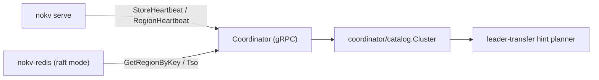

# Coordinator

`Coordinator` is NoKV's control-plane service for distributed mode.  
It exposes a gRPC API (`pb.Coordinator`) and is started by:

```bash
go run ./cmd/nokv coordinator --addr 127.0.0.1:2379
```

---

## 1. Responsibilities

Coordinator currently owns:

- **Routing**: `GetRegionByKey`
- **Heartbeats**: `StoreHeartbeat`, `RegionHeartbeat`
- **Region removal**: `RemoveRegion`
- **ID service**: `AllocID`
- **TSO**: `Tso`

Runtime clients (for example `cmd/nokv-redis` raft backend) use Coordinator as the
routing source of truth, but Coordinator is not the durable owner of cluster topology
truth. Durable truth lives in `meta/root`.

---

## 2. Runtime Architecture



Core implementation units:

- `coordinator/catalog`: in-memory cluster metadata model.
- `coordinator/idalloc`: monotonic ID allocator used by Coordinator.
- `coordinator/storage`: persistence abstraction (`Store`) backed by the metadata root.
- `coordinator/server`: gRPC service + RPC validation/error mapping.
- `coordinator/client`: client wrapper used by store/gateway.
- `coordinator/adapter`: scheduler sink that forwards heartbeats into Coordinator.

For the next-stage protocol direction on freshness, rooted catch-up,
transition lifecycle, and degraded semantics, see
[`docs/control_plane_protocol.md`](control_plane_protocol.md).

### Control-Plane Protocol Status

Coordinator now uses a **minimal formal control-plane protocol v1** for its key
route and transition surfaces.

Already in active use:

- route-read `Freshness`
- rooted token serving metadata
- rooted lag exposure
- `DegradedMode`
- `CatchUpState`
- `TransitionID`
- minimal `TransitionPhase`
- publish-time lifecycle assessment on `PublishRootEvent`

This means Coordinator no longer exposes only best-effort implementation
behavior. It now returns explicit protocol state that callers, tests, and docs
can rely on.

The current protocol is intentionally minimal. It does not yet expose the full
future runtime/operator model such as stalled transitions or richer catch-up
actions.

---

## 3. Mode Model

NoKV currently has only two supported product modes:

### `standalone`

- no `coordinator`
- no `meta/root`
- no control-plane process
- all truth remains inside the single storage process

This is the default local engine shape. Standalone is not a degraded control
plane deployment; it simply has no control plane.

### `distributed`

`distributed` has two formal control-plane deployments:

1. `single coordinator + local meta`
2. `3 coordinator + replicated meta`

Both deployments keep the same logical split:

- `meta/root/*`: durable rooted truth
- `coordinator/view` + `coordinator/catalog`: rebuildable routing/scheduling state
- `coordinator/server`: gRPC API surface

The difference is only the rooted backend:

- `single coordinator + local meta`
  - one `coordinator` process
  - one same-process `meta/root/backend/local`
  - single-node durable truth
- `3 coordinator + replicated meta`
  - three `coordinator` processes
  - each process hosts one same-process `meta/root/backend/replicated`
  - fixed three-replica rooted truth
  - one rooted leader accepts truth writes, followers refresh rooted state and serve read/view traffic

No other product control-plane mode is supported. In particular:

- there is no separate `meta` cluster
- there is no `coordinator` cluster larger than three members
- there is no dynamic metadata membership today

---

## 4. Persistence (`--workdir`)

`--workdir` is required for every formal Coordinator deployment that hosts rooted truth.

### `single coordinator + local meta`

The rooted backend stores:

- `root.events.wal`
- `root.checkpoint.binpb`

### `3 coordinator + replicated meta`

Each Coordinator node has its own workdir and persists two layers of state:

1. rooted truth state
   - `root.events.wal`
   - `root.checkpoint.binpb`
2. replicated protocol state
   - `root.raft.bin`
   - contains raft hard state, raft snapshot, and retained raft entries

Each node must have an isolated workdir. Workdirs are not shared.

### Rooted bootstrap flow

The Coordinator storage layer rebuilds its region snapshot and allocator checkpoints by
replaying rooted truth:

- **region descriptor publish/tombstone** events rebuild the route catalog
- **allocator fences** rebuild:
  - `id_current`
  - `ts_current`

Startup flow:

1. Open rooted `coordinator/storage` from `--workdir`.
2. Reconstruct a rooted Coordinator snapshot (`regions` + allocator fences).
3. Compute starts as `max(cli_start, fence+1)`.
4. Materialize the rooted region snapshot into `coordinator/catalog.Cluster`.

For replicated mode, followers periodically refresh rooted state and rebuild the
service-side view. This avoids allocator rollback and removes the old parallel
`PD_STATE.json` truth table.

### Region Truth Hierarchy

NoKV intentionally keeps three region views with different authority:

- **Coordinator region catalog**: cluster routing truth. Clients and stores must treat
  Coordinator as the authoritative key-to-region source at the service boundary, but
  Coordinator rebuilds this view from rooted metadata truth plus heartbeats.
- **`raftstore/localmeta` local catalog**: store-local recovery truth. It exists so
  one store can restart hosted peers and replay raft WAL checkpoints even if
  Coordinator is temporarily unavailable.
- **`Store.regions` runtime catalog**: in-memory cache/view rebuilt from local
  metadata at startup and then advanced by peer lifecycle plus raft apply.

These layers are not interchangeable. Local metadata is recovery state, not
cluster routing authority.

---

## 5. Config Integration

`raft_config.json` supports Coordinator endpoint + workdir defaults:

```json
"coordinator": {
  "addr": "127.0.0.1:2379",
  "docker_addr": "nokv-coordinator:2379",
  "work_dir": "./artifacts/cluster/coordinator",
  "docker_work_dir": "/var/lib/nokv-coordinator"
}
```

Resolution rules:

- CLI override wins.
- Otherwise read from config by scope (`host` / `docker`).

Helpers:

- `config.ResolveCoordinatorAddr(scope)`
- `config.ResolveCoordinatorWorkDir(scope)`
- `nokv-config coordinator --field addr|workdir --scope host|docker`

Replicated-root transport settings are currently CLI-driven, not config-file
driven.

---

## 6. Routing Source Convergence

NoKV now uses **Coordinator-first routing**:

- `raftstore/client` resolves regions with `GetRegionByKey`.
- `raft_config` regions are bootstrap/deployment metadata.
- Runtime route truth comes from Coordinator heartbeats + Coordinator region catalog.

This avoids dual sources drifting over time (config vs Coordinator).

---

## 7. Serve Mode Semantics

`nokv serve` is now Coordinator-only:

- `--coordinator-addr` is required.
- Runtime routing/scheduling control-plane state is sourced from Coordinator.

For restart and recovery, `nokv serve` intentionally separates runtime truth from
deployment metadata:

- hosted region/peer truth comes from `raftstore/localmeta`
- raft durable progress comes from the store workdir (`WAL`, raft log, local metadata)
- `raft_config.json` is used only to resolve static addresses (`Coordinator`,
  `store listen`, `store transport`)

This means:

- bootstrap-time `config.regions` are not replayed during restart
- runtime split/merge/peer-change results continue to come back from local recovery state
- `--peer` is an optional override, not the normal restart path

The recommended restart shape is therefore:

```bash
nokv serve \
  --config ./raft_config.example.json \
  --scope host \
  --store-id 1 \
  --workdir ./artifacts/cluster/store-1
```

`serve` will:

1. load the local peer catalog from the store workdir
2. derive the current remote peer set from local metadata
3. use config `stores` only to map `storeID -> addr`

Related CLI behavior:

- Inspect control-plane state through Coordinator APIs/metrics.
- `nokv coordinator --metrics-addr <host:port>` exposes native expvar on `/debug/vars`.
- `nokv serve --metrics-addr <host:port>` exposes store/runtime expvar on `/debug/vars`.

---

## 8. Service Semantics

`Coordinator` intentionally separates rooted truth leadership from the outer gRPC
service surface.

In `3 coordinator + replicated meta`:

- all three `coordinator` processes may listen and serve RPC
- only the rooted leader may commit truth writes
- followers refresh rooted state and serve read/view traffic

### Leader-only writes

These RPCs require rooted leadership:

- `RegionHeartbeat`
- `PublishRootEvent`
- `RemoveRegion`
- `AllocID`
- `Tso`

Followers return `FailedPrecondition` with `coordinator not leader` semantics, and
clients are expected to retry against another Coordinator endpoint.

### Any-node reads

These RPCs may be served by any Coordinator node:

- `GetRegionByKey`
- `StoreHeartbeat` handling and store-view inspection

Follower reads are driven by a rooted watch-first tail subscription, with
explicit refresh/reload as fallback into `coordinator/catalog.Cluster`. They are expected
to be shortly stale rather than linearly consistent.

For `GetRegionByKey`, that follower-service behavior is now explicit in the
protocol surface:

- callers can request `Freshness`
- responses include rooted token metadata
- responses disclose `DegradedMode` and `CatchUpState`
- bounded-freshness reads may be rejected if rooted lag exceeds the requested
  limit

### Client behavior

`coordinator/client` accepts multiple Coordinator addresses. Write RPCs retry across Coordinator nodes and
converge on the rooted leader. Read RPCs may use any available Coordinator endpoint.

---

## 9. Deployment Examples

### `single coordinator + local meta`

```bash
go run ./cmd/nokv coordinator \
  -addr 127.0.0.1:2379 \
  -workdir ./artifacts/coordinator
```

### `3 coordinator + replicated meta`

Node 1:

```bash
go run ./cmd/nokv coordinator \
  -addr 127.0.0.1:2379 \
  -workdir ./artifacts/coordinator1 \
  -root-mode replicated \
  -root-node-id 1 \
  -root-transport-addr 127.0.0.1:2471 \
  -root-peer 1=127.0.0.1:2471 \
  -root-peer 2=127.0.0.1:2472 \
  -root-peer 3=127.0.0.1:2473
```

Node 2 and node 3 use the same peer map, but change:

- `-addr`
- `-workdir`
- `-root-node-id`
- `-root-transport-addr`

Current product assumptions:

- exactly three rooted replicas
- one workdir per Coordinator node
- one transport address per Coordinator node
- no dynamic membership

---

## 10. Comparison: TinyKV / TiKV

### TinyKV (teaching stack)

- Uses a scheduler server (`tinyscheduler`) as separate process.
- Control plane integrates embedded etcd for metadata persistence.
- Educational architecture, minimal production hardening.

### TiKV (production stack)

- Coordinator is an independent, highly available cluster.
- Coordinator internally uses etcd Raft for durable metadata + leader election.
- Rich scheduling and balancing policies, rolling updates, robust ops tooling.

### NoKV Coordinator (current)

- Standalone mode has no Coordinator and no metadata-root service.
- Distributed mode has two formal control-plane deployments:
- `single coordinator + local meta`
- `3 coordinator + replicated meta`
- In both deployments, each `coordinator` process hosts a same-process rooted backend
  and rebuilds its service-side view from rooted truth.
- Coordinator persistence is intentionally limited to rooted control-plane truth:
  - region descriptor publish/tombstone events
  - allocator durability (`AllocID`, `TSO`)
- Coordinator is not the durable owner of a store's local raft/region truth. Store
  restart truth remains in `raftstore/localmeta`, while Coordinator keeps routing and
  scheduling state rebuilt from `meta/root`.

---

## 11. Current Limitations / Next Steps

- `single coordinator + local meta` remains the simpler and more mature deployment.
- `3 coordinator + replicated meta` is now a formal product mode, but still has a
  deliberately small HA surface:
  - fixed three replicas
  - no dynamic metadata membership
  - follower convergence uses watch-first tailing with refresh/reload fallback
- Scheduler policy is intentionally small (leader transfer focused).
- No advanced placement constraints yet.

These are deliberate scope limits for a fast-moving experimental platform that
keeps the rooted truth surface small.
