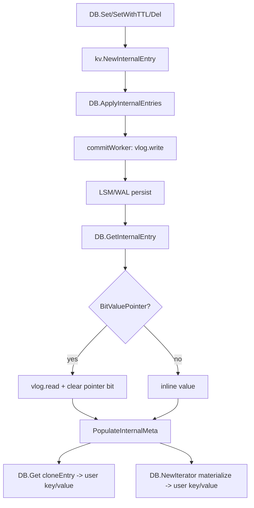

# Entry Lifecycle, Encoding, and Field Semantics

`kv.Entry` is the core record container that flows through user APIs, commit batching,
WAL/value-log codecs, memtable indexes, SST blocks, and iterators.

This document explains:

1. How key/value bytes are encoded.
2. What `Entry.Key` / `Entry.Value` mean at each stage.
3. Which fields are authoritative vs derived.
4. How `PopulateInternalMeta` keeps internal fields consistent.
5. Borrowed-vs-detached ownership rules.

---

## 1. Structure Overview

Source: [`kv/entry.go`](../kv/entry.go), [`kv/key.go`](../kv/key.go), [`kv/value.go`](../kv/value.go)

```go
type Entry struct {
    Key       []byte
    Value     []byte
    ExpiresAt uint64
    CF        ColumnFamily
    Meta      byte
    Version   uint64
    Offset    uint32
    Hlen      int
    ValThreshold int64
    ref int32
}
```

Important interpretation:

* `Key` is the canonical source of truth for internal records.
* `CF` and `Version` are cached/derived fields for convenience.
* `Value` can represent either:
  * inline value bytes, or
  * encoded `ValuePtr` bytes (`Meta` has `BitValuePointer`).

---

## 2. Encoding Layers

### 2.1 Internal Key Encoding

Source: [`kv/key.go`](../kv/key.go)

`InternalKey(cf, userKey, ts)` layout:

* 4-byte CF header: `0xFF 'C' 'F' <cf-byte>`
* raw user key bytes
* 8-byte big-endian descending timestamp (`MaxUint64 - ts`)

Helpers:

* `SplitInternalKey(internal) -> (cf, userKey, ts, ok)`
* `SplitBaseKey(base) -> (cf, userKey, ok)`
* `Timestamp(key)` / `InternalToBaseKey(internal)` / `BaseKey(cf, userKey)` / `SameBaseKey(a, b)`

### 2.2 ValueStruct Encoding

Source: [`kv/value.go`](../kv/value.go)

`ValueStruct` layout:

* `Meta` (1B)
* `ExpiresAt` (uvarint)
* `Value` (raw bytes)

`ValueStruct` does not store `Version`; version is always taken from internal key.

### 2.3 Entry Record Encoding (WAL / Vlog record payload)

Source: [`kv/entry_codec.go`](../kv/entry_codec.go)

Entry codec layout:

* header (uvarints: keyLen/valueLen/meta/expiresAt)
* key bytes
* value bytes
* crc32

`DecodeEntryFrom` now calls `PopulateInternalMeta()` after key decode so internal
records get consistent `CF/Version` immediately.

---

## 3. Stage-by-Stage Meaning of `Key` and `Value`

### 3.1 User write (`DB.Set`, `DB.SetBatch`, `DB.SetWithTTL`, `DB.Del`, `DB.DeleteRange`, `DB.ApplyInternalEntries`)

Source: [`db.go`](../db.go)

* `Set`/`SetBatch`/`SetWithTTL`/`Del`/`DeleteRange` use `NewInternalEntry(...)`:
  * `Key`: encoded internal key.
  * `Value`: user value bytes.
* `ApplyInternalEntries` validates internal key, then writes back parsed `CF/Version`
  from key before entering write pipeline.

### 3.2 Commit worker: vlog then LSM apply

Source: [`db_write.go`](../db_write.go), [`vlog.go`](../vlog.go)

* Before `LSM.SetBatch`, large values are replaced by `ValuePtr.Encode()` bytes and
  `BitValuePointer` is set.
* Small values stay inline.
* `Key` remains internal key throughout.

### 3.3 WAL replay / vlog iteration decode

Source: [`kv/entry_codec.go`](../kv/entry_codec.go), [`lsm/memtable.go`](../lsm/memtable.go)

* Decoded records carry internal key bytes in `Key`.
* `Value` is record payload bytes (inline value or pointer bytes).
* `CF/Version` are derived from key via `PopulateInternalMeta`.

### 3.4 Memtable index lookup

Source: [`lsm/memtable.go`](../lsm/memtable.go), [`utils/skiplist.go`](../utils/skiplist.go), [`utils/art.go`](../utils/art.go)

* `memIndex.Search(...)` returns `(matchedInternalKey, ValueStruct)`.
* `memTable.Get` assembles pooled `Entry` from this and calls `PopulateInternalMeta`.
* For miss, `Key=nil` and zero value struct (sentinel, not a valid record).

### 3.5 SST / iterator decode

Source: [`lsm/builder.go`](../lsm/builder.go), [`lsm/table.go`](../lsm/table.go)

* Block iterator reconstructs internal key + value struct.
* It calls `PopulateInternalMeta` before exposing item entry.
* `table.Search` clones key/value and re-populates internal metadata.

### 3.6 Internal read API (`GetInternalEntry`)

Source: [`db.go`](../db.go)

* `loadBorrowedEntry` fetches from LSM.
* If `BitValuePointer` is set:
  * decode pointer from `Value`
  * read real bytes from vlog
  * replace `Value` with actual value bytes
  * clear `BitValuePointer`
* Return entry with internal key still in `Key`, and `CF/Version` re-populated.

### 3.7 Public read API (`Get`, public iterator)

Source: [`db.go`](../db.go), [`iterator.go`](../iterator.go)

* Public APIs convert internal key to user key for external consumers.
* Returned entry is detached copy (`DB.Get`) or iterator materialized object.

### 3.8 Runtime State Flow Diagram



---

## 4. Field Validity Matrix

| Context | `Key` | `Value` | `CF/Version` | Ownership |
| --- | --- | --- | --- | --- |
| Internal write path | Internal key | Inline value or ptr-bytes (large values) | Valid (set at build/validate time) | Borrowed/pooled |
| Decoded WAL/vlog record | Internal key | Encoded record payload value bytes | Valid after `PopulateInternalMeta` | Borrowed/pooled |
| `GetInternalEntry` return | Internal key | Real value bytes (pointer resolved) | Valid (re-populated before return) | Borrowed/pooled |
| `DB.Get` return | User key | Real value bytes | Valid for external semantics | Detached copy |
| Memtable miss sentinel | `nil` | `nil` | `CFDefault/0` | Borrowed/pooled sentinel |

Rule of thumb:

* Internal code should treat `Key` as authoritative.
* `CF/Version` should be expected to match `SplitInternalKey(Key)` after
  `PopulateInternalMeta`.

---

## 5. `PopulateInternalMeta` Semantics

Source: [`kv/entry.go`](../kv/entry.go)

```go
func (e *Entry) PopulateInternalMeta() bool
```

Behavior:

1. Parse `e.Key` as internal key.
2. If parse succeeds:
   * `e.CF = parsedCF`
   * `e.Version = parsedTS`
   * return `true`
3. If parse fails:
   * reset cache fields to safe defaults (`CFDefault`, `Version=0`)
   * return `false`

Why it exists:

* pooled entries can carry stale cached fields if not reset carefully;
* parse-once helper gives a single normalization point at codec/index/read boundaries;
* keeps key-derived metadata (`CF/Version`) authoritative and consistent.

---

## 6. Ownership and Refcount States

Source: [`kv/entry.go`](../kv/entry.go), [`docs/architecture.md`](architecture.md)

### Borrowed entry (internal)

Returned by:

* `DecodeEntryFrom`
* `memTable.Get`
* `LSM.Get` internals
* `DB.GetInternalEntry`

Contract:

* caller must call `DecrRef()` exactly once.
* double release panics (underflow guard).

### Detached entry (public)

Returned by:

* `DB.Get` (via clone)

Contract:

* do **not** call `DecrRef()`.

---

## 7. Contributor Rules

1. Any new internal decode boundary should either:
   * call `PopulateInternalMeta`, or
   * immediately parse key with `SplitInternalKey` and set fields consistently.
2. Do not reintroduce value-side version caches.
3. Keep internal APIs internal-key-first; only external APIs should expose user keys.
4. Preserve borrowed/detached ownership contracts in comments and tests.
