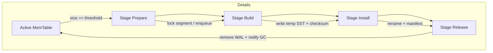

# MemTable Flush Pipeline Design

## 1. 目标

1. **可靠性**：冻结后的 MemTable 必须原子地写入 SST，在失败或崩溃时能够重试或修复。
2. **可恢复性**：“准备 → 构建 → 安装 → 释放” 各阶段可被崩溃恢复逻辑识别并继续执行。
3. **可观测性**：提供 flush 队列、阶段状态、耗时等指标以支持调试与调优。

## 2. 状态机



崩溃恢复时读取 `manifest` 和 flush 元信息：
1. 若任务停留在 PREPARE/BUILD：重新构建并尝试完成 BUILD。
2. 若处于 INSTALL，检查是否已经 `rename` 成功；若 manifest 记录缺失则重试安装；若已记录则完成 release。

## 3. FlushManager 接口

```go
type Task struct {
    SegmentID uint32
    Mem       *memTable
    Stage     Stage   // prepare/build/install/release
    TempFile  string
    SSTName   string
    Err       error
}

type Manager interface {
    Submit(task Task) error
    Next() (Task, bool)
    Update(task Task) error
    Recover() error
    Stats() Metrics
    Close() error
}
```

实现建议：
- `Submit` 在 PREPARE 阶段调用，记录任务与 WAL 段引用（build flush queue + manifest edit staging）。
- `Next` 由后台 worker 调用，获取待 BUILD 的任务。
- `Update` 在各阶段结束时更新状态：
  - `Update(BuildComplete)`：保存临时文件路径。
  - `Update(InstallComplete)`：写 manifest 并设置 `SSTName`。
  - `Update(Release)`：调用 `wal.RemoveSegment`，清理任务。
- `Recover` 重启时读取 flush 元信息（可写入单独 `flush_manifest` 文件或 manifest VersionEdit 中），恢复未完成任务。

## 4. 与 WAL / Manifest 的协同

- PREPARE 阶段不移除 WAL 段，仅记录 segmentID。
- INSTALL 阶段写 manifest，包含 `AddFile`（新 SST）与 `LogPointer`（WAL segment boundary）。
- RELEASE 阶段 manifest 更新成功后才允许 `wal.RemoveSegment`。
- manifest 必须记录 flush task 的完成点（SegmentID + SST 信息），以便恢复。

## 5. 测试矩阵

1. 正常 flush：单个 MemTable → SST → manifest → WAL 删除。
2. flush 过程中崩溃：
   - BUILD 前崩溃：重启后继续 flush，WAL 仍保留。
   - BUILD 中崩溃：临时文件可能存在；恢复后需要清理并重建。
   - INSTALL 前崩溃：临时文件存在但未 rename；恢复后重新 INSTALL。
   - INSTALL 后崩溃：SST 已存在但 manifest 未更新；需要幂等处理。
3. 并发 flush：多个 MemTable 同时 flush，验证 flush 队列顺序和 WAL 删除。
4. Manifest 同步：模拟 manifest写失败或 rename失败，确保 flush 可回滚或重试。

## 6. 后续扩展

- Backpressure：根据 L0 表数量 / flush 队列长度对前台写入施加压力。
- Metrics：flush latency、队列长度、WAL 剩余段数。
- 集成 ValueLog：释放阶段同步 discard stats，驱动 ValueLog GC。

## 7. 下一步实施计划

1. 在 `docs/` 中补充 manifest/flush 交互详细说明。
2. 实现 `FlushManager` 骨架与内存任务队列，配套单元测试（无实际 SST 写入）。
3. 将 LSM 中现有 flush 流程改为使用 `FlushManager`，逐步接入 SST builder、manifest。
4. 完成崩溃恢复、WAL 段回收和并发 flush 相关测试。

Flush 管线完成后，可继续推进 Manifest VersionEdit 重构（阶段 3）。 
