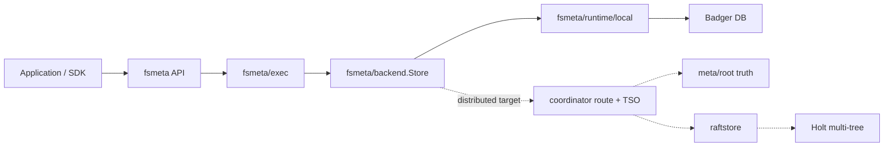

<!--
Copyright 2024-2026 The NoKV Authors.
SPDX-License-Identifier: Apache-2.0
-->

# Architecture

NoKV is being kept deliberately narrow: **fsmeta first, distributed metadata
execution second, replaceable storage engines below that**.

## Layers

```text
Layer 1: fsmeta
  model/      inode, dentry, session, quota, snapshot, watch domain types
  layout/     ordered namespace keys and value codecs
  backend/    metadata command backend contract
  exec/       semantic compiler and executor
  runtime/    concrete runtime bindings

Layer 2: distributed metadata control and execution
  meta/root      rooted topology, authority, lifecycle, grant, and seal truth
  coordinator    rebuildable routing, TSO, discovery, and root-event serving
  raftstore   Rust/OpenRaft/Holt data-plane target

Layer 3: concrete persistence
  Badger directly inside fsmeta/runtime/local for local demos
  Holt multi-tree inside raftstore for the distributed target
```

The old Go `local`, `storage`, `txn`, `raftstore`, and `experimental` package
trees are no longer mainline architecture. They were removed so new work cannot
accidentally depend on the previous storage-engine or transaction-engine-heavy
shape.

## Write Path



`fsmeta/backend.Store` is the key boundary. It exposes timestamped reads,
scans, and `MetadataCommand` commits. A command carries predicates, mutations,
and watch projection keys under one metadata commit boundary. It does not
expose Badger, Holt, Raft, protobuf, migration, or SST concepts.

## Local Runtime

`fsmeta/runtime/local` is a one-process implementation of the fsmeta backend
contract. It stores versioned fsmeta records directly in Badger and is intended
for demos, tests, small agent workspaces, and product iteration.

The local path is not a generic KV database. It is a local implementation of
the fsmeta metadata contract.

## Distributed Runtime Target

The distributed target keeps Go for the control plane and Rust for the data
plane:

- `meta/root` is rooted truth.
- `coordinator` is a rebuildable serving and scheduling view over root truth.
- `raftstore` owns replicated data-plane execution, OpenRaft isolation,
  Raft log persistence, Holt state-machine storage, snapshots, and apply
  notifications.

The target shape is mount-scoped metadata execution, not a general-purpose
distributed KV first. fsmeta compiles namespace operations into metadata
commands; the distributed data plane applies those commands atomically at a
committed Raft frontier and streams apply-ordered watch events back to fsmeta.

## Holt Placement

Holt is not imported by Go fsmeta code. It belongs under `raftstore`, where
Rust can use Holt multi-tree storage directly for the replicated state machine.
If a future local Rust backend is needed, it should be added as a runtime
adapter, not by leaking Holt-specific types into `fsmeta/model`, `layout`,
`backend`, or `exec`.
