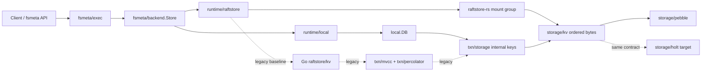

<!--
Copyright 2024-2026 The NoKV Authors.
SPDX-License-Identifier: Apache-2.0
-->

# NoKV Architecture Overview

NoKV is organized as a three-layer metadata system:

1. `fsmeta` owns inode, dentry, workspace namespace, watch, snapshot, session,
   quota, and artifact-style metadata semantics.
2. The distributed execution layer (`meta/root`, `coordinator`, `raftstore-rs`)
   owns rooted authority, routing, mount-scoped Raft execution, and recovery
   facts. The legacy Go `raftstore` + Percolator path remains only as the old
   baseline while the Rust path is being cut over.
3. `storage/*` owns ordered key/value persistence. Pebble is the default
   implementation in this repo. Holt is the owned backend target that should
   plug in at the same `storage/kv` boundary.

Pebble and Holt replace only the physical ordered-KV substrate. NoKV keeps its
own fsmeta inode/dentry model, semantic compiler, and distributed control
plane above the storage backend.

## Package Layout

```text
fsmeta/
  model/          # inode/dentry/session/quota/snapshot domain model
  layout/         # ordered namespace key layout and value codecs
  backend/        # minimal MVCC metadata backend contract
  exec/           # semantic execution and compiler
  runtime/local/  # embedded fsmeta runtime
  runtime/raftstore/

txn/
  storage/        # legacy/local MVCC internal keys and timestamp encoding
  mvcc/           # legacy/local MVCC read/write planning
  percolator/     # legacy 2PC baseline, not the Rust fsmeta mainline
  latch/

raftstore/
  kv/             # legacy Go StoreKV apply bridge
  store/          # peer lifecycle and routing inside one store process
  peer/           # raft peer runtime
  snapshot/       # internal MVCC-entry snapshot payloads for peer bootstrap

raftstore-rs/
  crates/         # Rust mount-scoped fsmeta Raft data plane

storage/
  kv/             # ordered KV contract
  pebble/         # default Pebble backend
  holt/           # future adapter over third_party/holt
  memory/         # tests
  wal/file/vfs/   # low-level runtime support

third_party/
  holt/           # pinned external Holt source checkout
```

`storage/holt` is the expected placement for the Holt adapter once it is wired
into this repository. The Rust source is pinned as `third_party/holt`; Go
runtime code should only depend on the adapter package. The adapter should
implement `storage/kv.Store`; it should not import fsmeta, raftstore,
coordinator, root, protobuf, or MVCC packages.

`engine/*`, operator-facing `raftstore/migrate`, and SST import/export are not
mainline packages. This version does not provide online migration from old
self-managed LSM workdirs into Pebble or Holt workdirs.

## Write Path



The important boundary is between `fsmeta/backend` and `storage/kv`:

- `fsmeta/backend` is an MVCC metadata contract with timestamps, predicates,
  mutations, scans, and atomic mutation semantics.
- `storage/kv` is ordered bytes: get, put, delete, range delete, iterator,
  batch, snapshot, sync, close, and small stats.

Keeping both contracts separate lets NoKV swap the physical engine without
changing fsmeta semantics. The distributed fsmeta mainline should use
mount-scoped Raft commands rather than the legacy Percolator hot path.

## Storage Backend Contract

The storage backend must provide:

- ordered point reads and range iteration;
- atomic batch apply through `ApplyBatch`;
- range delete;
- point-in-time snapshot reads;
- explicit `Sync`, `Close`, and small backend-neutral stats.

The backend must not own:

- MVCC timestamp ordering or column-family semantics;
- fsmeta inode/dentry layout;
- raftstore region routing;
- root/coordinator authority facts;
- migration, SST ingest/export, or product-level backup semantics.

That rule is what lets Pebble and Holt be interchangeable under NoKV's metadata
execution model. Higher layers do not prove whether a mutation group can be
atomic on a particular shard; they submit one storage batch and rely on the selected
backend to make it visible all-or-nothing.

## Local Runtime

`local.DB` is the embedded database facade. It opens a storage backend and
preserves NoKV's internal-key layout:

- column families are encoded into the storage key;
- MVCC timestamps keep the existing inverted ordering;
- `local.DB` exposes internal-entry iterators for MVCC, raftlog, and raftstore
  snapshot code;
- control/raft WAL utilities remain under `storage/wal`; they are not the
  physical Pebble or Holt WAL.

The local fsmeta runtime (`fsmeta/runtime/local`) uses the same
`fsmeta/backend` contract as the raftstore runtime. It is the default path for
demos, local agent-workspace deployments, and storage backend experimentation.

## Distributed Runtime

The distributed path keeps these responsibilities separate:

- `meta/root` is rooted truth for topology, authority, grants, seals, and
  lifecycle facts.
- `coordinator` is a rebuildable serving plane for routing, store discovery,
  mount admission, and admin scheduling.
- `raftstore-rs` is the target replicated data plane: one Raft group per mount
  by default, applying compiled fsmeta predicates and mutations.
- `fsmeta/runtime/raftstore` adapts fsmeta execution to the distributed data
  plane. It owns routing and endpoint wiring; the data plane must not import
  fsmeta semantic packages.
- Go `raftstore` plus `txn/percolator` is the legacy baseline and should not
  receive new distributed fsmeta features after the Rust path passes the gates.

`raftstore/snapshot` is an internal MVCC-entry snapshot format for raft peer
bootstrap and raft snapshot apply. It is not a generic migration feature and it
does not expose concrete storage-engine table files.

## Experimental Systems

`experimental/*` is the boundary for research mechanisms. Peras, Thermos, and
future experiments can attach to neutral fsmeta or raftstore extension points,
but stable fsmeta, txn, raftstore, and storage packages should not import
experimental packages directly unless the code contract explicitly allows the
adapter.
