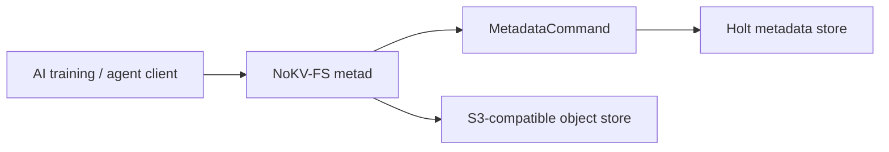

<!--
Copyright 2024-2026 The NoKV Authors.
SPDX-License-Identifier: Apache-2.0
-->

# Architecture

NoKV-FS is being rebuilt as a Rust-first filesystem for AI training and agent
workspaces. The repository no longer carries the legacy metadata/control-plane
mainline; the product center is the Rust `nokv-fs` workspace.

## Layers

```text
Layer 1: namespace model
  model       mount, inode, dentry, body descriptor, watch event types
  layout      Holt-friendly ordered keys and durable value codecs

Layer 2: metadata execution
  metastore   storage-neutral MetadataCommand contract
  metad       in-process filesystem metadata service

Layer 3: storage bindings
  holtstore   Holt-backed metadata store
  object      local and S3-compatible object storage

Planned:
  client      Rust SDK
  fuse        FUSE low-level frontend
  server      long-running metad process
  raftgroup   distributed Holt metadata shards
```

## Write Path



For artifact publication, object bytes are uploaded first. The metadata commit
then publishes the dentry, inode projection, and body descriptor atomically.
Failed metadata publish leaves staged objects for later garbage collection.

## Metadata Layout

The canonical model is inode/dentry:

```text
inode_current:
  mount_id | inode_id -> inode attributes

dentry_current:
  mount_id | parent_inode | name -> dentry + inode projection

chunk_manifest_current:
  mount_id | inode_id | generation | chunk_index -> body descriptor

history:
  family | user_key_len | user_key | inverted_commit_version -> old value
```

Path indexes are derived accelerators for artifact and checkpoint fast paths;
they are not namespace truth.

## Object Storage

NoKV-FS stores file bodies outside the metadata service. The first production
body backend is S3-compatible storage. RustFS, MinIO, Ceph RGW, and AWS S3 all
use the same `S3ObjectStore` configuration surface.

## Distributed Direction

The planned distributed layer is not a generic KV database. It should replicate
metadata commands over mount or shard scoped Raft groups, with Holt as the
state machine storage engine and object bodies remaining in external storage.
