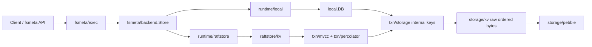

<!--
Copyright 2024-2026 The NoKV Authors.
SPDX-License-Identifier: Apache-2.0
-->

# NoKV Architecture Overview

NoKV is being kept on a three-layer metadata architecture:

1. `fsmeta` owns inode, dentry, workspace namespace, watch, snapshot, session,
   quota, and artifact-style metadata semantics.
2. The distributed execution layer (`raftstore`, `txn`, `coordinator`,
   `meta/root`) owns replicated execution, MVCC transactions, routing, TSO,
   rooted topology, authority, and recovery facts.
3. `storage/*` owns raw ordered key/value persistence. The default
   implementation is Pebble through `storage/pebble`.

Pebble replaces the physical ordered-KV/LSM substrate only. NoKV keeps its own
MVCC internal-key encoding (`txn/storage`), transaction protocol (`txn/mvcc`,
`txn/percolator`), raft execution, and fsmeta inode/dentry model.

## Package Layout

```text
fsmeta/
  model/          # inode/dentry/session/quota/snapshot domain model
  layout/         # ordered namespace key layout and value codecs
  backend/        # minimal MVCC metadata backend contract
  exec/           # semantic execution and compiler
  runtime/local/  # embedded fsmeta runtime
  runtime/raftstore/

txn/
  storage/        # MVCC internal keys, column families, entries, timestamps
  mvcc/           # MVCC read/write planning
  percolator/     # 2PC transaction protocol
  latch/

raftstore/
  kv/             # StoreKV apply bridge to MVCC/percolator/prepared install
  store/          # peer lifecycle and routing inside one store process
  peer/           # raft peer runtime
  snapshot/       # internal MVCC-entry snapshot payloads for peer bootstrap

storage/
  kv/             # raw ordered KV contract
  pebble/         # default Pebble backend
  memory/         # tests
  wal/file/vfs/   # low-level runtime support
```

`engine/*`, operator-facing `raftstore/migrate`, and the old SST migration fast
path are no longer mainline packages. This version does not support online
migration from old self-managed LSM workdirs into Pebble workdirs.

## Write Path



The important boundary is between `fsmeta/backend` and `storage/kv`:

- `fsmeta/backend` is an MVCC metadata contract with timestamps, predicates,
  mutations, scans, and atomic mutation semantics.
- `storage/kv` is raw ordered bytes: get, put, delete, range delete, iterator,
  batch, snapshot, sync, close, and small stats.

Keeping both contracts separate lets NoKV swap the physical engine without
changing fsmeta semantics or distributed transaction behavior.

## Local Runtime

`local.DB` is the embedded database facade. It now opens a Pebble-backed raw
store at `<workdir>/pebble`, while preserving NoKV's existing internal-key
layout:

- column families are encoded into the raw key
- MVCC timestamps keep the existing inverted ordering
- `local.DB` still exposes NoKV internal-entry iterators for MVCC, raftlog, and
  raftstore snapshot code
- control/raft WAL utilities remain under `storage/wal`; they are not the
  physical Pebble WAL

The local fsmeta runtime (`fsmeta/runtime/local`) uses the same `fsmeta/backend`
contract as the raftstore runtime. It is the default path for demos and
single-node agent-workspace deployments.

## Distributed Runtime

The distributed path keeps these responsibilities separate:

- `meta/root` is rooted truth for topology, authority, grants, seals, and
  lifecycle facts.
- `coordinator` is a rebuildable serving plane for routing, TSO, and store
  discovery.
- `raftstore` hosts replicated region execution and applies StoreKV commands.
- `txn/*` owns MVCC and transaction semantics.
- `fsmeta/runtime/raftstore` adapts fsmeta execution to StoreKV/MVCC. Raftstore
  itself must not understand inode/dentry semantics.

`raftstore/snapshot` is now an internal MVCC-entry snapshot format for raft peer
bootstrap and raft snapshot apply. It is not a generic migration feature and it
does not expose storage-engine SST details.

## Experimental Systems

`experimental/*` is the boundary for research mechanisms. Peras, Thermos, and
future experiments can attach to neutral fsmeta or raftstore extension points,
but stable fsmeta, txn, raftstore, and storage packages should not import
experimental packages directly unless the code contract explicitly allows the
adapter.
