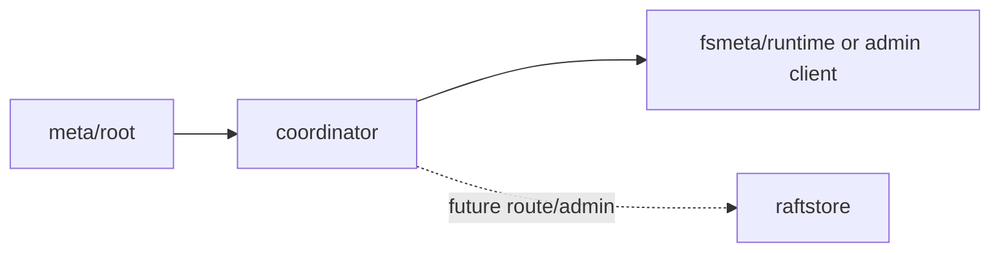

<!--
Copyright 2024-2026 The NoKV Authors.
SPDX-License-Identifier: Apache-2.0
-->

# Coordinator

`coordinator` is a rebuildable serving view over `meta/root`. It is not the
source of truth.

Current responsibilities:

- allocate timestamps and IDs for fsmeta/distributed runtimes;
- rebuild routing and lifecycle views from rooted events;
- publish root events from data-plane or admin outcomes;
- expose gRPC APIs used by clients and future distributed runtime adapters.

The coordinator must not store high-frequency inode/dentry data and must not
reinterpret fsmeta operations. fsmeta semantics stay in `fsmeta/exec`; durable
authority facts stay in `meta/root`; replicated data-plane execution is the
target responsibility of `raftstore`.

## Control Plane Shape

After startup, coordinator state should be recoverable from root truth plus
data-plane heartbeats. Any persistent coordinator-local state must be treated as
a cache or checkpoint, not as authoritative cluster truth.
