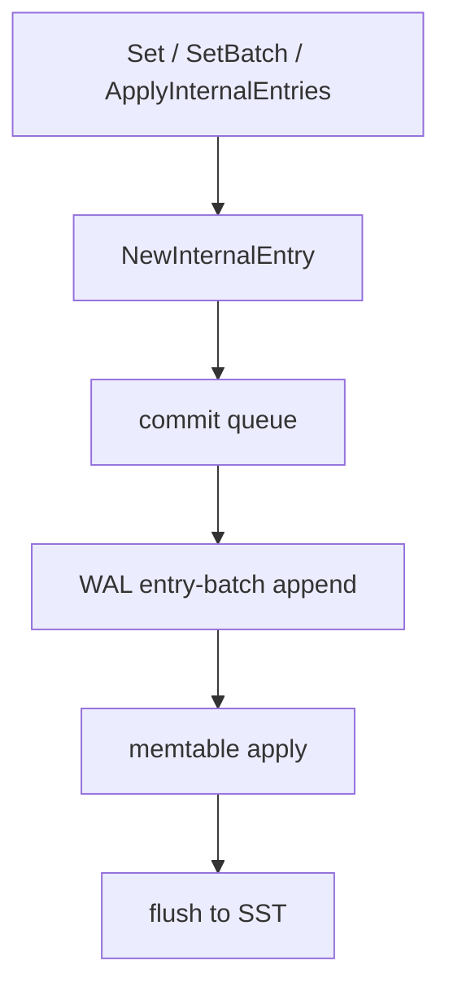
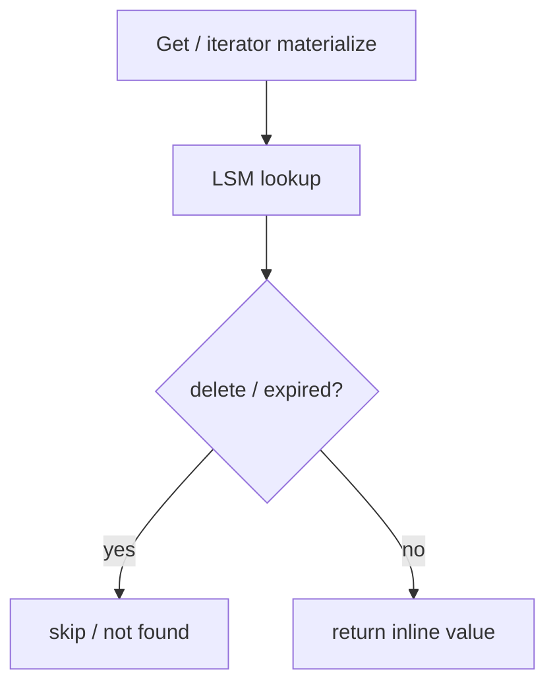

<!--
Copyright 2024-2026 The NoKV Authors.
SPDX-License-Identifier: Apache-2.0
-->

# Entry Model

NoKV uses `kv.Entry` as the shared in-memory record type for WAL payloads,
memtable indexes, SST blocks, compaction, and iterator materialization.

---

## 1. Internal Key Shape

User-facing keys are converted into internal MVCC keys:

```text
<column-family><user-key><descending timestamp>
```

Helpers:

- `kv.BaseKey(cf, userKey)` builds the column-family-prefixed key.
- `kv.InternalKey(cf, userKey, ts)` appends the MVCC timestamp.
- `kv.SplitInternalKey` recovers `(cf, userKey, ts)`.

---

## 2. Value Shape

Values are stored inline. The encoded value payload contains:

```text
Meta | ExpiresAt | Value bytes
```

`BitDelete`, `BitRangeDelete`, and expiry timestamps participate in visibility
filtering. NoKV stores user values inline; there is no value-log pointer format
in the current entry model.

---

## 3. Write Path



Durability order is strict: append the WAL record first, then index the same
entries in the memtable. A WAL error leaves the memtable unchanged.

---

## 4. Read Path



Borrowed internal entries must be released with `DecrRef`. Public `Get` results
are detached copies and must not be released by the caller.

---

## 5. Refcount Rules

| Producer | Ownership | Rule |
| --- | --- | --- |
| `kv.NewEntry` / `kv.NewInternalEntry` | Caller owns one ref | Call `DecrRef` after submit or use |
| `LSM.Get` | Borrowed pooled entry | Caller must call `DecrRef` |
| `DB.GetInternalEntry` | Borrowed internal entry | Caller must call `DecrRef` |
| `DB.Get` | Detached public copy | Caller must not call `DecrRef` |
| Iterator `Item.Entry()` | Iterator-owned view | Valid until iterator advances/closes |
