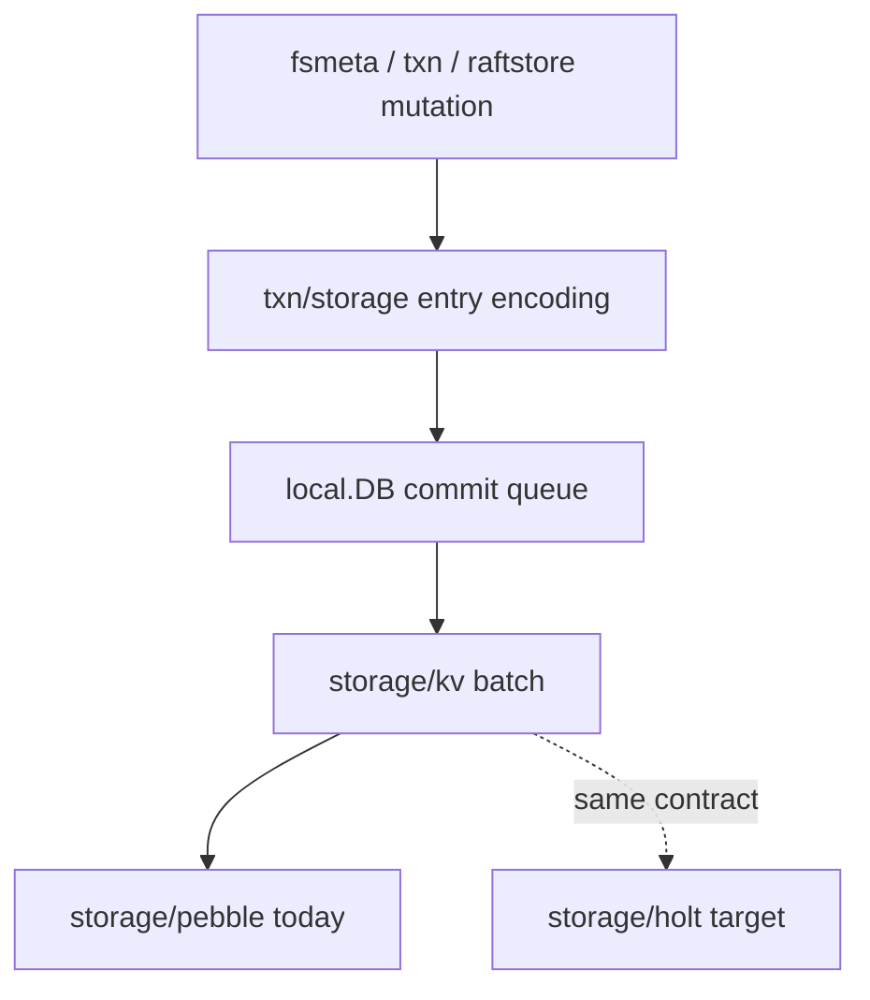
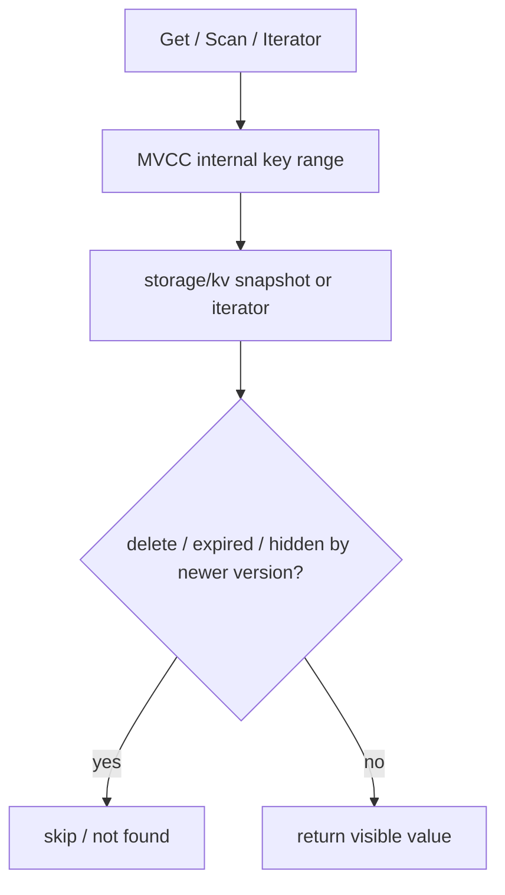

<!--
Copyright 2024-2026 The NoKV Authors.
SPDX-License-Identifier: Apache-2.0
-->

# Entry And Internal Key Model

NoKV keeps MVCC entry encoding above the physical storage backend. Pebble and
Holt see ordered byte keys and byte values; they do not interpret fsmeta,
raftstore, or transaction semantics.

## Internal Key Shape

User-facing keys are converted into internal MVCC keys:

```text
<column-family><user-key><descending timestamp>
```

Helpers live in `txn/storage`:

- `BaseKey(cf, userKey)` builds the column-family-prefixed key.
- `InternalKey(cf, userKey, ts)` appends the MVCC timestamp.
- `SplitInternalKey` recovers `(cf, userKey, ts)`.

This shape is intentionally backend-neutral. Pebble stores it as one ordered key
space. Holt may later map the same logical domains to multiple internal trees,
but that routing must remain hidden behind `storage/kv.Store`.

## Value Shape

Values are stored inline in NoKV's MVCC entry format:

```text
Meta | ExpiresAt | Value bytes
```

Delete markers, range-delete markers, and expiry timestamps participate in
visibility filtering above the storage backend. There is no product-level value-log
pointer format in the current mainline.

## Write Path



Durability, ordering, and storage batch atomicity come from the selected backend
plus NoKV's MVCC/transaction protocol above it. The backend owns its own WAL,
memtable, flush, and compaction internals.

## Read Path



Borrowed internal entries must be released with `DecrRef`. Public `Get`
results are detached copies and must not be released by the caller.

## Refcount Rules

| Producer | Ownership | Rule |
| --- | --- | --- |
| `NewEntry` / `NewInternalEntry` | Caller owns one ref | Call `DecrRef` after submit or use. |
| `DB.GetInternalEntry` | Borrowed internal entry | Caller must call `DecrRef`. |
| `DB.Get` | Detached public copy | Caller must not call `DecrRef`. |
| Iterator `Item.Entry()` | Iterator-owned view | Valid until iterator advances or closes. |
