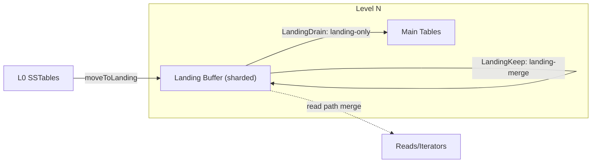

# Landing Buffer Architecture

The landing buffer is a per-level landing area for SSTables—typically promoted from L0—designed to **absorb bursts, reduce overlap, and unlock parallel compaction** without touching the main level tables immediately. It combines fixed sharding, adaptive scheduling, and optional `LandingKeep` (landing-merge) passes to keep write amplification and contention low.

## Design Highlights
- **Sharded by key prefix**: landing tables are routed into fixed shards (top bits of the first byte). Sharding cuts cross-range overlap and enables safe parallel drain.
- **Snapshot-friendly reads**: landing tables are read under the level `RLock`, and iterators hold table refs so mmap-backed data stays valid without additional snapshots.
- **Two landing paths**:
  - *Landing-only compaction*: drain landing → main level (or next level) with optional multi-shard parallelism guarded by `LandingMode`.
  - *Landing-merge*: compact landing tables back into landing (stay in-place) to drop superseded versions before promoting, reducing downstream write amplification.
- **LandingMode enum**: plans carry a `LandingMode` with `LandingNone`, `LandingDrain`, and `LandingKeep`. `LandingDrain` corresponds to landing-only (drain into main tables), while `LandingKeep` corresponds to landing-merge (compact within landing).
- **Adaptive scheduling**:
  - Shard selection is driven by `PickShardOrder` / `PickShardByBacklog` using per-shard size, age, and density.
  - Shard parallelism scales with backlog score (based on shard size/target file size) bounded by `LandingShardParallelism`.
  - Batch size scales with shard backlog to drain faster under pressure.
  - Landing-merge triggers when backlog score exceeds `LandingBacklogMergeScore` (default 2.0), with dynamic lowering under extreme backlog/age.
- **Observability**: expvar/stats expose `LandingDrain` vs `LandingKeep` counts, duration, and tables processed, plus landing size/value density per level/shard.

## Configuration
- `LandingShardParallelism`: max shards to compact in parallel (default `max(NumCompactors/2, 2)`, auto-scaled by backlog).
- `LandingCompactBatchSize`: base batch size per landing compaction (auto-boosted by shard backlog).
- `LandingBacklogMergeScore`: backlog score threshold to trigger `LandingKeep`/landing-merge (default 2.0).

## Benefits
- **Lower write amplification**: bursty L0 SSTables land in the landing buffer first; `LandingKeep`/landing-merge prunes duplicates before full compaction.
- **Reduced contention**: sharding + `State` allow parallel landing drain with minimal overlap.
- **Predictable reads**: landing is part of the read snapshot, so moving tables in/out does not change read semantics.
- **Tunable and observable**: knobs for parallelism and merge aggressiveness, with per-path metrics to guide tuning.

## Future Work
- Deeper adaptive policies (IO/latency-aware), richer shard-level metrics, and more exhaustive parallel/restart testing under fault injection.
