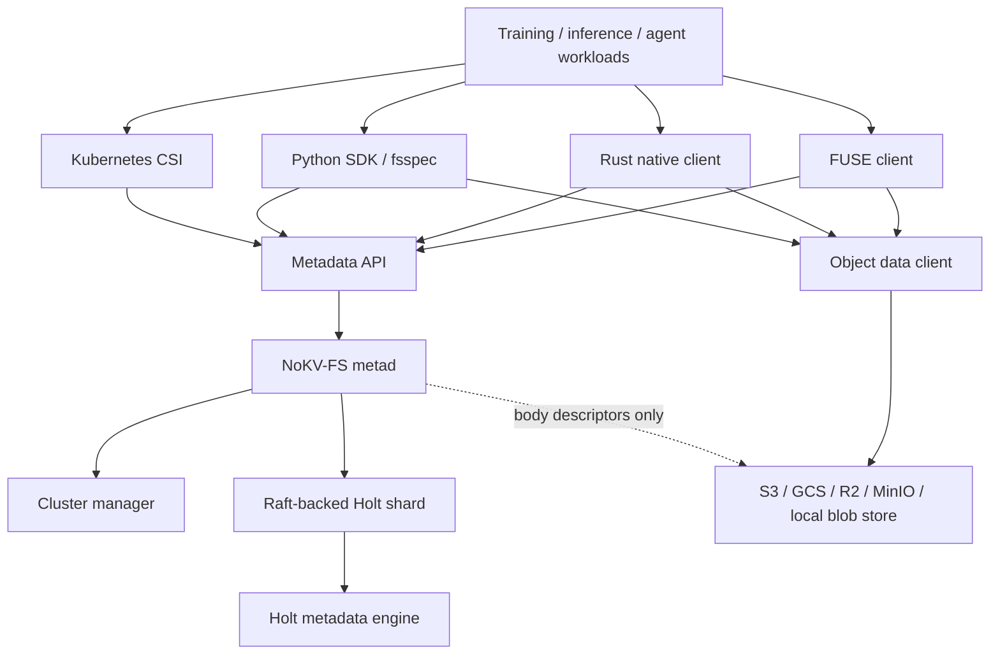

<!--
Copyright 2024-2026 The NoKV Authors.
SPDX-License-Identifier: Apache-2.0
-->

# NoKV-FS Design

NoKV-FS is the target product shape for NoKV: a Rust-native,
metadata-first filesystem for AI training, inference, and agent workspaces.

The system provides a filesystem namespace, metadata transactions, snapshots,
watch streams, artifact publication, and checkpoint lifecycle management. File
bytes are stored outside the metadata service in object storage or another blob
store. Holt is the metadata storage engine; NoKV-FS is the metadata service and
client system built on top of it.

This page is a target architecture document. It complements the current
[Architecture](./architecture) guide, which describes the repository's present
package layout.

## Product Boundary

NoKV-FS is not a general-purpose distributed KV store. It is a metadata service
for file-shaped AI workloads:

- AI training datasets with many files, manifests, and repeated directory
  scans.
- Checkpoint and artifact publication where the body is written first and the
  namespace commit must be atomic.
- Agent workspaces where subtrees need scoped views, read-only snapshots,
  typed watch events, and lifecycle-driven garbage collection.
- DFS metadata frontends that need inode/dentry semantics but want to place
  data in an external object or blob store.

The mainline product boundary is:

```text
NoKV-FS owns:
  namespace metadata
  inode and dentry semantics
  metadata transactions
  session and write lifecycle
  snapshot and watch semantics
  body descriptors and object GC intent
  metadata shard routing and replication

NoKV-FS does not own:
  object-store durability
  object-store replication
  model checkpoint tensor format
  full POSIX device semantics
  a general-purpose transactional KV API
```

## Design Principles

### Metadata First

The metadata service is the product center. The file body path must not force
every read or write through the metadata leader. Metadata operations choose
where a file body lives and publish compact body descriptors; clients then read
and write object data directly.

### Inode And Dentry Are The Truth

NoKV-FS keeps a filesystem-native model:

```text
inode:
  stable object identity and attributes

dentry:
  parent inode + name -> child inode
```

Path indexes are optional derived acceleration structures. They are not the
canonical truth because path-only metadata makes subtree rename, hard links,
snapshots, and atomic directory operations expensive or ambiguous.

### FUSE Is Compatibility, Native SDK Is Performance

The access layer has multiple frontends:

- FUSE for POSIX compatibility and low-friction adoption.
- Rust SDK for high-performance native clients.
- Python SDK / fsspec for PyTorch, Ray, and data pipelines.
- CSI for Kubernetes mounting.
- gRPC for control-plane integration and service-to-service use.

FUSE must not become the performance ceiling. Training and inference workloads
that need small random reads, high queue depth, or zero-copy data paths should
use the native client or Python SDK.

### Holt Is The Metadata Engine

Holt is an embedded storage engine for path-shaped and prefix-heavy metadata.
It should not absorb NoKV-FS service responsibilities. The separation is:

```text
NoKV-FS metad:
  filesystem semantics
  metadata transactions
  shard routing
  replication
  watch/snapshot/GC policy

Holt:
  persistent ART
  prefix and range iteration
  atomic batch
  WAL and checkpoint
  local shard state
```

## High-Level Architecture



The manager owns cluster membership, shard placement, route epochs, and mount
lifecycle. Metadata shards own replicated namespace state. Clients cache routes
and retry on stale route, not-leader, or epoch mismatch.

## Component Model

### Client Layer

The client layer owns user-facing IO behavior and cache policy. It talks to the
metadata service for namespace operations and talks directly to object storage
for file bytes.

Required client components:

- `nokv-fuse`: low-level FUSE client using inode IDs, not path-only callbacks.
- `nokv-client`: Rust native client with async metadata and object IO.
- `nokv-python`: Python binding and fsspec integration.
- `nokv-csi`: Kubernetes CSI driver.
- local cache: metadata cache, entry cache, negative lookup cache, and object
  block cache.

Cache invalidation is driven by typed watch events:

```text
Create(parent, name, inode, version)
Remove(parent, name, inode, version)
Rename(old_parent, old_name, new_parent, new_name, inode, version)
UpdateAttr(inode, version)
PublishArtifact(inode, body_generation, version)
```

### Metadata API

The metadata API is filesystem-native. It should expose a small stable surface:

```text
Lookup(parent_inode, name)
GetAttr(inode)
BatchGetAttr(inodes)
ReadDirPlus(parent_inode, cursor, limit)
CreateFile(parent_inode, name, attr, body_descriptor?)
CreateDir(parent_inode, name, attr)
Rename(old_parent, old_name, new_parent, new_name)
RenameReplace(old_parent, old_name, new_parent, new_name)
RemoveFile(parent_inode, name)
RemoveEmptyDir(parent_inode, name)
OpenWriteSession(inode)
CommitWriteSession(session, body_manifest)
SnapshotSubtree(root_inode)
CreateView(root_inode, access_rules)
WatchSubtree(root_inode, cursor)
PublishArtifact(path_or_parent, body_descriptor, replace)
```

The API should not expose raw Holt trees or raw object-store keys as the
semantic contract.

### Metadata Service

`metad` owns namespace semantics and metadata transaction construction:

```text
metadata request
  -> route and epoch check
  -> compile semantic metadata command
  -> submit to shard leader
  -> apply atomically in Holt
  -> return commit version and watch frontier
```

The metadata command contains:

- request id for idempotence;
- mount id and shard epoch;
- read version;
- command kind;
- typed predicates;
- typed mutations;
- watch projection;
- object GC intent;
- optional snapshot or retention pin.

The service must be able to prove that predicate failure does not partially
apply mutations.

### Distributed Holt Shards

Each metadata shard is a replicated state machine:

```text
Raft log entry
  -> one or more metadata commands
  -> Holt atomic batch
  -> apply state
  -> watch log
  -> response vector
```

The first version can use one shard per mount. Later versions can split by
directory subtree, workspace channel, or artifact namespace when a mount becomes
hot.

Shard state includes:

- current metadata family trees;
- optional history tree for active snapshot/watch retention;
- command dedupe records;
- apply frontier;
- watch log;
- snapshot pins;
- object GC intent records.

## Metadata Layout

NoKV-FS uses family-local Holt trees instead of one flat keyspace. This lets
Holt use prefix/range iteration directly for the common metadata operations.

```text
mount_current
  key: mount_id
  val: MountRecord

inode_current
  key: mount_id | inode_id
  val: InodeRecord

dentry_current
  key: mount_id | parent_inode | name
  val: DentryRecord + AttrProjection

parent_current
  key: mount_id | child_inode | parent_inode | name
  val: ParentLinkRecord

chunk_manifest
  key: mount_id | inode_id | generation | chunk_index
  val: BodyChunkRef

session_current
  key: mount_id | session_id
  val: WriteSessionRecord

path_index_current
  key: mount_id | workspace_scope | normalized_path
  val: DerivedPathRecord

watch_log
  key: mount_id | watch_scope | apply_index | event_id
  val: TypedWatchEvent

snapshot_pin
  key: mount_id | snapshot_id
  val: SnapshotPin

command_dedupe
  key: request_id
  val: CommitResultSummary

history
  key: family | user_key | inverted_commit_version
  val: previous value
```

Latest reads use current trees. Snapshot reads use current trees when possible
and fall back to history only when the requested version predates the current
record. History is written only when an active snapshot or watch retention pin
requires old versions.

## File Data Model

NoKV-FS stores file bytes in an external object or blob store. Metadata stores
compact descriptors:

```text
BodyDescriptor:
  producer
  digest_uri
  size
  content_type
  object_ref
  generation
  encryption_info?
  compression_info?

BodyManifest:
  inode
  generation
  file_size
  chunk_size
  chunks[]

ChunkRef:
  chunk_index
  object_key
  offset
  length
  digest
```

The common write path is:

```text
client uploads objects
  -> client receives object refs
  -> client submits PublishArtifact / CommitWriteSession
  -> metad atomically publishes dentry/inode/body manifest
  -> old body refs become GC candidates
```

This avoids a metadata-server data bottleneck and lets the client use
object-store multipart upload, direct reads, prefetch, and local cache.

## Consistency Model

NoKV-FS should define three visible levels:

```text
metadata-visible:
  committed in the metadata shard and visible to namespace reads

object-durable:
  body descriptor points to objects that the selected object store has accepted

published:
  namespace commit and body descriptor are both visible under the mount epoch
```

Metadata operations are linearized at the metadata shard commit index. Object
bytes have the durability and consistency of the configured object store.
NoKV-FS does not claim stronger object durability than the object store
provides.

For atomic artifact publication, the only user-visible commit point is the
metadata publish operation. Before publish, uploaded objects are staged and may
be garbage-collected if the publish fails.

## Watch, Snapshot, And GC

Watch and snapshot are first-class metadata features.

Watch requirements:

- Events are typed, not raw key deltas.
- Watch cursors resume from a retained apply frontier.
- Expired cursors return a typed cursor-expired error.
- Watch retention pins history until every active cursor has advanced or
  expired.

Snapshot requirements:

- A snapshot captures a subtree root and read version.
- Snapshot views are read-only by default.
- Snapshot pins keep required history and watch state alive.
- Snapshot retirement releases retention pins and enables GC.

Object GC requirements:

- Namespace remove/replace returns old body descriptors.
- GC intent is durable before body refs are forgotten.
- Mark-and-sweep can rebuild live body refs by scanning namespace manifests.
- Object deletion is retryable and outside the metadata commit critical path.

## Sharding And Placement

Version 1 can use one metadata shard per mount. This is simple and safe but not
the final high-throughput shape.

The scaling path is:

```text
v1:
  one Raft/Holt shard per mount

v2:
  split large mounts by directory subtree or workspace channel

v3:
  dedicated hot-path shards for artifact path index, watch log, and body GC

v4:
  placement-aware file layout where directories carry data placement policy
```

Splits must preserve inode/dentry semantics. Path index shards are derived and
can be rebuilt; inode and dentry shards are authoritative and need rooted
placement epochs.

## Performance Strategy

The primary metadata performance goals are:

- Keep CreateFile, Lookup, GetAttr, BatchGetAttr, ReadDirPlus, RenameReplace,
  RemoveFile, and RemoveEmptyDir on a compact hot path.
- Avoid unconditional history writes when no snapshot/watch retention pin is
  active.
- Use dentry projection so ReadDirPlus does not need one inode read per entry
  on the common path.
- Batch multiple metadata commands into one Raft log entry.
- Apply one log entry as one Holt atomic batch.
- Keep object IO off the metadata leader.
- Use typed watch events for cache invalidation instead of polling.
- Let native clients bypass FUSE for high-throughput data reads.

Key metrics:

```text
metadata ops/sec by operation
metadata p50/p95/p99 latency
Raft proposal commands per entry
Holt current writes per op
Holt history writes per op
ReadDirPlus projection hit rate
directory scan keys visited / returned
watch replay lag
snapshot retention bytes
object GC backlog
client metadata cache hit rate
object cache hit rate
```

## Failure Model

NoKV-FS should assume:

- A metadata shard leader can crash after accepting a request.
- A follower can lag or restart.
- A client can upload objects and crash before publishing metadata.
- A client can publish metadata and crash before deleting old objects.
- A route cache can be stale.
- A watch cursor can fall behind retention.
- An object store delete can fail after namespace removal succeeds.

Required safety rules:

- Metadata predicates and mutations apply atomically or not at all.
- Duplicate request ids return the original commit result or reject mismatched
  command bodies.
- Stale routes and stale epochs must not commit writes.
- Object refs must not be forgotten until either they are still reachable from
  namespace metadata or durable GC intent exists.
- Snapshot and watch retention must prevent history GC below active frontiers.

## Repository Direction

The Rust-native target should eventually move most product logic into Rust:

```text
crates/model
crates/layout
crates/metastore
crates/holtstore
crates/metad
crates/manager
crates/client
crates/fuse
crates/object
crates/cache
crates/python
```

The current Go `fsmeta`, `meta/root`, and `coordinator` code can remain as the
bridge during migration, but the target product should avoid permanent
cross-language hot paths. If Go remains in the system, it should be limited to
control-plane compatibility or transitional tooling.

## Implementation Milestones

### Milestone 1: Rust Single-Node NoKV-FS

- Rust metadata model and layout.
- Holt-backed metastore.
- Object-store adapter.
- FUSE low-level client.
- Rust SDK.
- Basic ops: lookup, getattr, batch getattr, readdirplus, create, rename,
  remove, rmdir, snapshot, watch, publish artifact.

### Milestone 2: AI Artifact And Checkpoint Semantics

- BodyDescriptor and BodyManifest.
- Staged publish.
- Atomic replace.
- Read-only snapshot mount.
- Scoped view.
- Durable GC intent and retry worker.
- Python fsspec prototype.

### Milestone 3: Distributed Metadata

- Manager and route epochs.
- Raft-backed Holt shards.
- One shard per mount.
- Metadata command batching.
- Watch replay and snapshot retention across restart.
- Client route cache and retry.

### Milestone 4: Scale-Out Metadata

- Subtree or workspace-channel sharding.
- Derived path index.
- ReadDirPlus projection hardening.
- Hot directory mitigation.
- Cache invalidation via typed watch events.

### Milestone 5: AI Training Performance Path

- Native async data client.
- Object prefetch and block cache.
- Large dataset listing benchmarks.
- Checkpoint publish benchmarks.
- FUSE vs native-client comparison.
- CSI packaging.

## Related Systems

[JuiceFS](https://juicefs.com/docs/community/architecture/) proves the
client/object-store/metadata-engine separation is a practical filesystem
architecture. Its internals also show why inode-based low-level FUSE fits a
metadata engine that already models inode and dentry trees.

[3FS](https://github.com/deepseek-ai/3FS) proves that AI training benefits from
a real file interface, stateless metadata services, a transactional metadata
store, and a native client path for performance-critical data IO.

NoKV-FS follows the same broad separation, but narrows the product around
Holt-native metadata service design, AI artifact/checkpoint lifecycle, and
agent workspace semantics.

## Non-Goals

- Reimplementing object storage durability.
- Competing with all-flash RDMA storage systems on raw data bandwidth in the
  first version.
- Exposing a generic KV database product.
- Requiring all applications to use FUSE.
- Supporting every POSIX edge case before the AI metadata hot path is stable.
