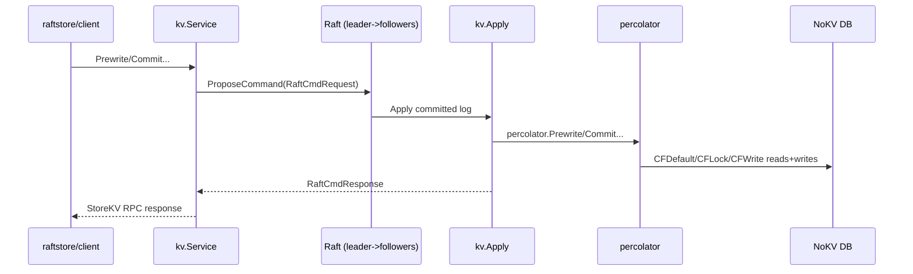
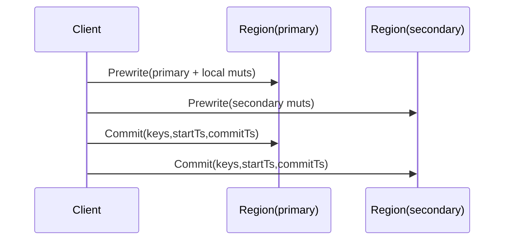

<!--
Copyright 2024-2026 The NoKV Authors.
SPDX-License-Identifier: Apache-2.0
-->

# Percolator Distributed Transaction Design

This document explains NoKV's legacy distributed transaction path implemented by
`txn/percolator/` and executed through the Go `raftstore`. The Rust fsmeta
mainline is moving to mount-scoped Raft commands, where a mount group's Raft log
serializes compiled fsmeta predicates and mutations without Percolator locks.

The scope here is the current code path:

- `Prewrite`
- `Commit`
- `BatchRollback`
- `ResolveLock`
- `CheckTxnStatus`
- `TxnHeartBeat`
- MVCC read visibility (`Get`/`Scan` StoreKV RPCs through `percolator.Reader`)

---

## 1. Where It Runs

Percolator logic is executed on the Raft apply path:

1. Client sends StoreKV RPC (`Prewrite`, `Commit`, ...).
2. `raftstore/kv/service.go` wraps it into a `RaftCmdRequest`.
3. Store proposes command through Raft.
4. On apply, `raftstore/kv/apply.go` dispatches to `percolator.*`.

Key files:

- [`txn/percolator/txn.go`](https://github.com/feichai0017/NoKV/blob/main/txn/percolator/txn.go)
- [`txn/percolator/reader.go`](https://github.com/feichai0017/NoKV/blob/main/txn/percolator/reader.go)
- [`txn/mvcc/codec.go`](https://github.com/feichai0017/NoKV/blob/main/txn/mvcc/codec.go)
- [`txn/latch/latch.go`](https://github.com/feichai0017/NoKV/blob/main/txn/latch/latch.go)
- [`raftstore/kv/apply.go`](https://github.com/feichai0017/NoKV/blob/main/raftstore/kv/apply.go)
- [`raftstore/client/client.go`](https://github.com/feichai0017/NoKV/blob/main/raftstore/client/client.go)

### 1.1 RPC to Percolator Function Mapping

| StoreKV RPC | `kv.Apply` branch | Percolator function |
| --- | --- | --- |
| `Prewrite` | `CMD_PREWRITE` | `Prewrite` |
| `Commit` | `CMD_COMMIT` | `Commit` |
| `BatchRollback` | `CMD_BATCH_ROLLBACK` | `BatchRollback` |
| `ResolveLock` | `CMD_RESOLVE_LOCK` | `ResolveLock` |
| `CheckTxnStatus` | `CMD_CHECK_TXN_STATUS` | `CheckTxnStatus` |
| `TxnHeartBeat` | `CMD_TXN_HEART_BEAT` | `TxnHeartBeat` |
| `Get` | `CMD_GET` | `Reader.GetLock` + `Reader.GetValue` |
| `Scan` | `CMD_SCAN` | `Reader.GetLock` + CFWrite iteration + `GetInternalEntry` |

---

## 2. MVCC Data Model

NoKV uses three MVCC column families:

- `CFDefault`: stores user values at `start_ts`
- `CFLock`: stores lock metadata at fixed `lockColumnTs = MaxUint64`
- `CFWrite`: stores commit records at `commit_ts`

### 2.1 Lock Record

`txn/mvcc.Lock` (encoded by `mvcc.EncodeLock`):

- `Primary`
- `Ts` (start timestamp)
- `StartTime` (physical Unix millisecond lock creation time)
- `TTL` (milliseconds from `StartTime`)
- `Kind` (`Put/Delete/Lock`)
- `MinCommitTs`

### 2.2 Write Record

`txn/mvcc.Write` (encoded by `mvcc.EncodeWrite`):

- `Kind`
- `StartTs`
- `ShortValue` (codec supports it; current commit path does not populate it)

---

## 3. Concurrency Control: Latches

Before mutating keys, percolator acquires striped latches:

- `latch.Manager` hashes keys to stripe mutexes.
- Stripes are deduplicated and acquired in sorted order to avoid deadlocks.
- Guard releases in reverse order.

In `raftstore/kv`, latches are passed explicitly:

- `NewEntryApplier` creates one `latch.NewManager(512)` and reuses it.
- `Apply` / `NewApplier` accept an injected manager; `nil` falls back to `latch.NewManager(512)`.

This serializes conflicting apply operations on overlapping keys in one node.

---

## 4. Two-Phase Commit Flow

Client side (`raftstore/client.Client.TwoPhaseCommit`):

1. Group mutations by region.
2. Prewrite primary region.
3. Prewrite secondary regions.
4. Commit primary region.
5. Commit secondary regions.

---

## 5. Write-Side Operations

### 5.1 Prewrite

`Prewrite` runs mutation-by-mutation:

1. Check existing lock on key:
   - if lock exists with different `Ts` -> `KeyError.Locked`
2. Check latest committed write:
   - if `commit_ts >= req.start_version` -> `WriteConflict`
3. Apply data intent:
   - `Put`: write value into `CFDefault` at `start_ts`
   - `Delete`/`Lock`: delete default value at `start_ts` (if exists)
4. Write lock into `CFLock` at `lockColumnTs`

### 5.2 Commit

For each key:

1. Read lock
2. If no lock:
   - if write with same `start_ts` exists -> idempotent success
   - else -> abort (`lock not found`)
3. If lock `Ts != start_version` -> `KeyError.Locked`
4. `commitKey`:
   - if `min_commit_ts > commit_version` -> `CommitTsExpired`
   - if write with same `start_ts` already exists:
     - rollback write -> abort
     - write with different commit ts -> treat success, clean lock
     - same commit ts -> success
   - else write `CFWrite[key@commit_ts] = {kind,start_ts}`
   - remove lock from `CFLock`

### 5.3 BatchRollback

For each key:

1. If already has write at `start_ts`:
   - rollback marker already exists -> success
   - non-rollback write exists -> success (already committed)
2. Remove lock (if any)
3. Remove default value at `start_ts` (if any)
4. Write rollback marker to `CFWrite` at `start_ts`

### 5.4 ResolveLock

- `commit_version == 0` -> rollback matching locks
- `commit_version > 0` -> commit matching locks
- Returns number of resolved keys

---

## 6. Transaction Liveness and Status

`CheckTxnStatus` targets the primary key and decides whether txn is alive, committed, or should be rolled back.
For RPC callers, `kv.Service` stamps `current_time` with the store's physical
clock before proposing the raft command when the caller leaves it unset. The
replicated command still carries a concrete timestamp, so apply remains
deterministic across replicas.

Decision order:

1. Read lock on primary
2. If lock exists but `lock.ts != req.lock_ts` -> `KeyError.Locked`
3. If lock exists and TTL expired (`current_time >= lock.start_time + ttl`):
   - rollback primary
   - action = `TTLExpireRollback`
4. If lock exists and caller pushes timestamp:
   - `min_commit_ts = max(min_commit_ts, caller_start_ts+1)`
   - action = `MinCommitTsPushed`
5. If no lock, check write by `start_ts`:
   - committed write -> return `commit_version`
   - rollback write -> action `LockNotExistRollback`
6. If no lock and no write, and `rollback_if_not_exist` is true:
   - write rollback marker
   - action `LockNotExistRollback`

`TxnHeartBeat` is the owner-side liveness path for long transactions:

1. It targets only the primary lock.
2. It rejects missing primary key/start version/current time/TTL extension at
   the Percolator command boundary. RPC and store callers can omit
   `current_time`; the store fills it before raft proposal.
3. It never resurrects expired locks. If the primary is already expired, it
   rolls back the primary and returns `TxnHeartBeatTTLExpireRollback`.
4. For a live primary lock, it extends the physical deadline by setting
   `ttl = max(ttl, current_time - start_time + ttl_extension)`.
5. If the primary is already committed, it reports `commit_version`; if the
   primary lock is absent with no commit record, it writes a rollback marker to
   fence late commits.

---

## 7. Read Path Semantics (MVCC Visibility)

`Get` and `Scan` StoreKV RPCs read through `percolator.Reader`:

1. Check lock first:
   - if lock exists and `read_ts >= lock.ts`, return locked error
2. Find visible write in `CFWrite`:
   - latest `commit_ts <= read_ts`
3. Interpret write kind:
   - `Delete`/`Rollback` => not found
   - `Put` => read value from `CFDefault` at `start_ts`

Notes:

- StoreKV `Scan` currently rejects reverse scan.
- `scanWrites` uses internal iterator over `CFWrite`.

---

## 8. Error and Idempotency Behavior

| Operation | Idempotency/Conflict behavior |
| --- | --- |
| Prewrite | Rejects lock conflicts and write conflicts; returns per-key `KeyError` list. |
| Commit | Idempotent for already committed keys with same `start_ts`; stale/missing lock may abort. |
| BatchRollback | Safe to repeat; rollback marker prevents duplicate side effects. |
| ResolveLock | Safe to retry per key set; resolves only matching `start_ts` locks. |
| CheckTxnStatus | May push `min_commit_ts`, rollback expired primary lock, or return committed version. |

---

## 9. Current Operational Boundaries

- Percolator execution is tied to StoreKV RPC + Raft apply path, with the command shape still following the TinyKV/TiKV MVCC model.
- Latch scope is process-local when one store shares a single `latch.Manager`;
  region correctness still comes from Raft ordering.
- `Write.ShortValue` and `Write.ExpiresAt` are codec fields; current commit path
  stores primary value bytes in `CFDefault` and reads from there when short value
  is not present.

---

## 10. Validation and Tests

Primary coverage:

- [`txn/percolator/txn_test.go`](https://github.com/feichai0017/NoKV/blob/main/txn/percolator/txn_test.go)
- [`raftstore/kv/service_test.go`](https://github.com/feichai0017/NoKV/blob/main/raftstore/kv/service_test.go)
- [`raftstore/client/client_test.go`](https://github.com/feichai0017/NoKV/blob/main/raftstore/client/client_test.go)
- [`raftstore/server/node_test.go`](https://github.com/feichai0017/NoKV/blob/main/raftstore/server/node_test.go)

These tests cover 2PC happy path, lock conflicts, status checks, resolve/rollback behavior, and client region-aware retries.
