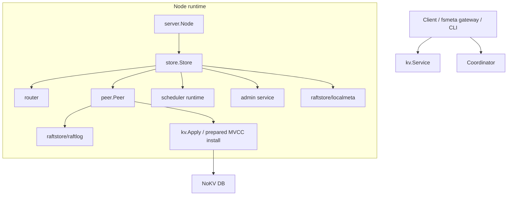
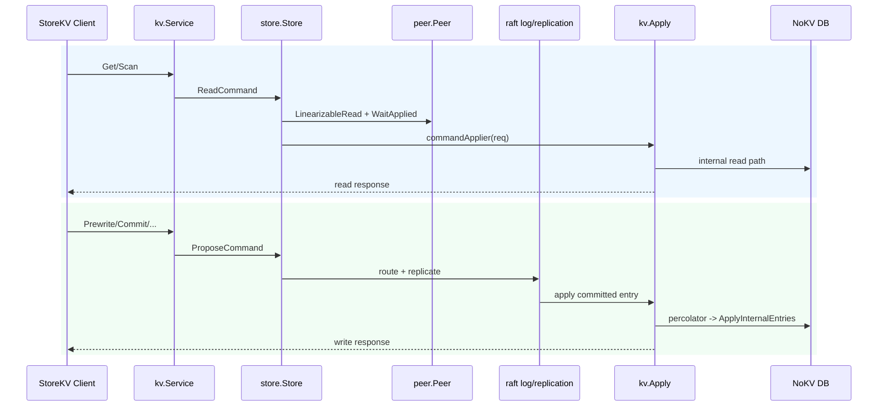

<!--
Copyright 2024-2026 The NoKV Authors.
SPDX-License-Identifier: Apache-2.0
-->

# RaftStore Deep Dive

`raftstore` powers NoKV's distributed mode by layering multi-Raft replication
on top of the selected ordered-KV backend. Its RPC surface is exposed as
the `NoKV` gRPC service, while the command model still tracks the TinyKV/TiKV
region + MVCC design. This note explains the major packages, the boot and
command paths, how transport and storage interact, and the supporting tooling
for observability and testing.

> Read this page if you want to answer one question precisely: which package owns which responsibility once NoKV leaves standalone mode and becomes a cluster.

For the protocol line that now minimally formalizes `raftstore` request
admission, transition execution, publish boundaries, and restart state, read
`docs/guide/control_and_execution_protocols.md` together with this file.

## Reader Map

- Start with section 1 if you want package ownership.
- Jump to section 3 if you want request execution.
- Jump to section 8 if you care about split/merge and control-plane behavior.
- Read this together with [`coordinator.md`](coordinator.md) and
  [`architecture.md`](architecture.md) if your focus is lifecycle rather than
  just request flow.

---

## 1. Package Structure

| Package | Responsibility |
| --- | --- |
| [`store`](https://github.com/feichai0017/NoKV/blob/main/raftstore/store) | Orchestrates peer set, command pipeline, region manager, scheduler/heartbeat loops; exposes helpers such as `StartPeer`, `ProposeCommand`, `SplitRegion`. |
| [`peer`](https://github.com/feichai0017/NoKV/blob/main/raftstore/peer) | Wraps etcd/raft `RawNode`, drives Ready processing (persist to WAL, send messages, apply entries), tracks snapshot resend/backlog. |
| [`raftlog`](https://github.com/feichai0017/NoKV/blob/main/raftstore/raftlog) | WALStorage/DiskStorage/MemoryStorage across all Raft groups, leveraging the NoKV WAL while tracking store-local raft replay metadata. |
| [`meta`](https://github.com/feichai0017/NoKV/blob/main/raftstore/localmeta) | Store-local durable metadata: peer catalog for restart and raft WAL replay checkpoints for replay/GC. |
| [`transport`](https://github.com/feichai0017/NoKV/blob/main/raftstore/transport) | gRPC transport with retry/TLS/backpressure; exposes the raft Step RPC and can host additional services (StoreKV). |
| [`kv`](https://github.com/feichai0017/NoKV/blob/main/raftstore/kv) | StoreKV RPC implementation, bridging Raft commands to MVCC operations. It still carries the legacy experimental Peras install path until that path moves behind a generic install boundary. |
| [`server`](https://github.com/feichai0017/NoKV/blob/main/raftstore/server) | `Config` + `NewNode` that bind storage, Store, transport, and the shared KV/admin RPC surfaces into a reusable node primitive. |

### Runtime ownership sketch



---

## 2. Boot Sequence

1. **Construct Server**
   ```go
   srv, _ := server.NewNode(server.Config{
       Storage: server.Storage{
           MVCC:     db,
           Raft:     raftlog.NewDBLog(db),
           Snapshot: snapshot.NewDBStore(db),
       },
       Store: store.Config{StoreID: 1},
       Raft: myraft.Config{ElectionTick: 10, HeartbeatTick: 2, PreVote: true},
       TransportAddr: "127.0.0.1:20160",
   })
   ```
   - A gRPC transport is created, the StoreKV service is registered, and `transport.SetHandler(store.Step)` wires raft Step handling.
   - `store.Store` loads the local peer catalog from `raftstore/localmeta` to rebuild the Region catalog (router + metrics).

2. **Start local peers**
   - CLI (`nokv serve`) loads the local peer catalog and calls `Store.StartPeer` for every region that includes the local store.
   - Each `peer.Config` carries raft parameters, the transport reference, `kv.NewEntryApplier`, peer storage, and Region metadata.
   - `StartPeer` registers the peer through the peer-set/routing layer and may bootstrap or campaign for leadership.

3. **Peer connectivity**
   - `transport.SetPeer(peerID, addr)` defines outbound raft connections; the CLI resolves those peer endpoints from local metadata plus stable `storeID -> addr` mapping.
   - Additional services can reuse the same gRPC server through `transport.WithServerRegistrar`.

### Minimal mental model

- `Server` is the node wiring root.
- `Store` is the runtime owner for what this node hosts.
- `Peer` is one region replica’s state machine and raft runtime.
- `Meta` is a local recovery mirror, not cluster truth.
- `Coordinator` is control plane, not a writer of local truth.

---

## 3. Command Execution

### Read (strong leader read)
1. `kv.Service.Get` builds `pb.RaftCmdRequest` and invokes `Store.ReadCommand`.
2. `validateCommand` ensures the region exists, epoch matches, and the local peer is leader; a RegionError is returned otherwise.
3. `peer.LinearizableRead` obtains a safe read index, then `peer.WaitApplied` waits until local apply index reaches it.
4. `commandApplier` (i.e. `kv.Apply`) runs GET/SCAN against the DB using MVCC readers to honor locks and version visibility.

### Write (via Propose)
1. Write RPCs (Prewrite/Commit/…) call `Store.ProposeCommand`, encoding the command and routing to the leader peer.
2. The leader appends the encoded request to raft, replicates, and once committed the command pipeline hands data to `kv.Apply`, which maps Prewrite/Commit/ResolveLock to `percolator` and `InstallPreparedMVCCEntries` to the generic prepared-entry installer. Experimental Peras install lowers segment payloads into the same prepared-entry installer.
3. `raftstore/raftlog` persists raft entries/state snapshots and updates `raftstore/localmeta` raft pointers. This keeps raft log GC and raft truncation aligned without exposing storage backend internals.
4. Raft apply only accepts command-encoded payloads (`RaftCmdRequest`). Legacy legacy key/value payloads are rejected as unsupported.

### Command flow diagram



---

## 4. Transport

- gRPC transport listens on `TransportAddr`, serving both raft Step RPC and StoreKV RPC.
- `SetPeer` updates the mapping of remote store IDs to addresses; `BlockPeer` can be used by tests or chaos tooling.
- Configurable retry/backoff/timeout options mirror production requirements. Tests cover message loss, blocked peers, and partitions.

---

## 5. Storage Backend

- `raftstore/raftlog` persists each raft group's entries, HardState, and snapshots.
- `raftstore/localmeta` persists the store-local raft replay pointer used by WAL GC and replay.
- StoreKV state is materialized through NoKV MVCC into the selected `storage/kv`
  backend. Pebble is the default local backend; Holt should plug in below the
  same storage backend contract.

---

## 6. StoreKV RPC Integration

| RPC | Execution Path | Notes |
| --- | --- | --- |
| `Get` / `Scan` | `ReadCommand` → `LinearizableRead(ReadIndex)` + `WaitApplied` → `kv.Apply` (read mode) | Leader-only strong read with Raft linearizability barrier.
| `Prewrite` / `Commit` / `BatchRollback` / `ResolveLock` / `CheckTxnStatus` | `ProposeCommand` → command pipeline → raft log → `kv.Apply` | Pipeline matches proposals with apply results; MVCC latch manager prevents write conflicts.
| `InstallPreparedMVCCEntries` | `ProposeCommand` → command pipeline → raft log → prepared-entry install branch | Installs caller-prepared MVCC entries without decoding fsmeta or Peras semantics. |

`PerasWitnessSegments` and `PerasWitnessProbe` are legacy StoreKV sidecar RPCs backed by the configured witness node. They provide segment evidence for Peras recovery; they are not a second Raft quorum and do not replace replicated install. The cleanup plan moves these RPCs behind an experimental service boundary.

The `cmd/nokv serve` command uses `server.Node` internally and prints a local peer catalog summary (key ranges, peers) so operators can verify the node’s recovery view at startup.

---

## 7. Client Interaction (`raftstore/client`)

- Region-aware routing with NotLeader/EpochNotMatch retry.
- `Mutate` splits mutations by region and performs two-phase commit (primary first). `Put` / `Delete` are convenience wrappers.
- `Scan` transparently walks region boundaries.
- End-to-end coverage lives in `raftstore/server/node_test.go`, which launches real nodes, uses the client to write and delete keys, and verifies the results.

---

## 8. Control Plane & Region Operations

### 8.1 Topology & Routing
- Topology is sourced from `raft_config.example.json` (via `config.LoadFile`) and
  reused by scripts and Docker Compose as bootstrap metadata.
- Runtime routing is Coordinator-first: `raftstore/client` resolves Regions by key through
  `GetRegionByKey` and caches route entries for retries.
- `raft_config` regions are treated as bootstrap/deployment metadata and are not
  the runtime source of truth once Coordinator is available.
- Coordinator is the only control-plane source of truth for runtime scheduling/routing.

### Why the layering matters

The design rule is:

- `RaftAdmin` executes membership operations against the current leader store.
- `Coordinator` decides and observes at the cluster level.
- `Store/Peer` own local truth and apply.

That split is what keeps scheduling from becoming a second, parallel truth
path.

### 8.2 Split / Merge
- **Split**: leaders call `Store.ProposeSplit`, which writes a split
  `AdminCommand` into the parent region's raft log. On apply,
  `Store.SplitRegion` updates the parent range/epoch and starts the child peer.
- **Merge**: leaders call `Store.ProposeMerge`, writing a merge `AdminCommand`.
  On apply, the target region range/epoch is expanded and the source peer is
  stopped/removed from the store-local catalog.
- These operations are explicit/manual and are not auto-triggered by
  size/traffic heuristics.

---

## 9. Observability

- `store.RegionMetrics()` feeds into `StatsSnapshot`, making region counts and backlog visible via expvar and `nokv stats`.
- `nokv regions` shows the local peer catalog used for store recovery: ID, range, peers, state. It is a store-local recovery view, not cluster routing authority.
- `CHAOS_TRACE_METRICS=1 go test -run 'TestGRPCTransport(HandlesPartition|MetricsWatchdog|MetricsBlockedPeers)' -count=1 -v ./raftstore/transport` exercises transport metrics under faults; `scripts/dev/cluster.sh` spins up multi-node clusters for manual inspection.

### Store internals at a glance

| Component | File | Responsibility |
| --- | --- | --- |
| Store facade | [`store.go`](https://github.com/feichai0017/NoKV/blob/main/raftstore/store/store.go) | Store construction/wiring and shared component ownership (router, region manager, command pipeline, scheduler runtime). |
| Peer lifecycle | [`peer_lifecycle.go`](https://github.com/feichai0017/NoKV/blob/main/raftstore/store/peer_lifecycle.go) | Start/stop peers, router registration, lifecycle hooks, and store shutdown sequencing. |
| Command ops | [`command_ops.go`](https://github.com/feichai0017/NoKV/blob/main/raftstore/store/command_ops.go) | Region/epoch/key-range validation and read/propose request handling. |
| Admin ops | [`admin_ops.go`](https://github.com/feichai0017/NoKV/blob/main/raftstore/store/admin_ops.go) | Split/merge proposal handling and applied admin command side effects. |
| Membership ops | [`membership_ops.go`](https://github.com/feichai0017/NoKV/blob/main/raftstore/store/membership_ops.go) | Conf-change proposal helpers and local region metadata updates after membership changes. |
| Region catalog | [`region_catalog.go`](https://github.com/feichai0017/NoKV/blob/main/raftstore/store/region_catalog.go) | Public region catalog accessors and region metadata lifecycle operations. |
| Router | [`router.go`](https://github.com/feichai0017/NoKV/blob/main/raftstore/store/router.go) | Tracks active peers and dispatches requests/messages to the owning peer. |
| Command pipeline | [`command_pipeline.go`](https://github.com/feichai0017/NoKV/blob/main/raftstore/store/command_pipeline.go) | Assigns request IDs, records proposals, matches apply results, returns responses/errors to callers. |
| Region manager | [`region_manager.go`](https://github.com/feichai0017/NoKV/blob/main/raftstore/store/region_manager.go) | Validates state transitions, persists local peer catalog updates, updates peer metadata, publishes scheduler-visible region state. |
| Scheduler runtime | [`scheduler_runtime.go`](https://github.com/feichai0017/NoKV/blob/main/raftstore/store/scheduler_runtime.go) | Periodically publishes region/store heartbeats, enforces cooldown & burst limits, and applies scheduling actions. |

---

## 10. Region Truth and Persistence Roles

NoKV intentionally keeps three different region views, and they do not have
equal authority:

1. **Store-local region truth**
   - Advanced only through raft apply paths and bootstrap/restart loading.
   - Owned by [`region_manager.go`](https://github.com/feichai0017/NoKV/blob/main/raftstore/store/region_manager.go) via:
     - `applyRegionMeta`
     - `applyRegionState`
     - `applyRegionRemoval`
     - `loadBootstrapSnapshot`
   - This is the runtime source of truth for what a store currently hosts.

2. **Store-local persistent mirror**
   - Owned by [`raftstore/localmeta`](https://github.com/feichai0017/NoKV/blob/main/raftstore/localmeta).
   - Persists:
     - local region catalog entries for restart
     - local raft WAL replay checkpoints
   - This mirror exists for local recovery only. It is not cluster routing
     authority and must not be treated as consensus truth outside the store.

3. **Coordinator control-plane view**
   - Owned by Coordinator and persisted through [`coordinator/rootview`](https://github.com/feichai0017/NoKV/blob/main/coordinator/rootview).
   - Built from region/store heartbeats and allocator durability checkpoints.
   - Used for:
     - route lookup
     - scheduler decisions
     - allocator durability
   - Coordinator is not allowed to overwrite local raftstore truth directly.

The resulting rule is simple:

- `raft apply/bootstrap` advances local truth
- `raftstore/localmeta` mirrors that truth for restart
- `Coordinator` observes and schedules from heartbeats

This separation is what prevents parallel truth sources from creeping back into
the design.

---

## 11. MVCC Maintenance

Replicated MVCC maintenance is a store-local background worker started by
`nokv serve` when `--mvcc-gc-maintenance-interval` is positive and the required
safe-point sources are configured. The worker resolves expired locks, applies
MVCC write/default tombstones, and cleans orphan default records through Raft
commands; it does not use a local direct-apply path in cluster mode.

MVCC maintenance is **per-region atomic**, not cross-region atomic. A single
pass may commit tombstones in one region and fail in another because of a
region split, leader change, timeout, or range error. This is intentional:
maintenance tombstones are idempotent, already-applied tombstones are skipped
by later scans, and the next pass converges on the remaining regions.

The safe point comes from Coordinator TSO minus `--mvcc-gc-safe-point-lag`.
`nokv serve` can reuse the last successful TSO for a bounded
`--mvcc-gc-tso-cache-ttl` window during short Coordinator outages. When that
cache expires, the source returns zero and the worker skips destructive GC
rather than risking an unsafe safe point.

## 12. Current Boundaries and Guarantees

- Reads served through `ReadCommand` are leader-strong and pass a Raft
  linearizability barrier (`LinearizableRead` + `WaitApplied`).
- Mutating StoreKV RPC commands are serialized through Raft log replication and apply.
- Command payload format on apply path is strict `RaftCmdRequest` encoding.
- Region metadata (range/epoch/peers) is validated before both read and write
  command execution.
- The store now records explicit execution-plane admission outcomes for read,
  write, and topology entry points.
- Topology transitions now record explicit local execution outcome plus publish
  boundary state (`planned published`, `terminal pending`, `terminal published`,
  `terminal failed`).
- Terminal publish failure is retained as visible retry state rather than being
  silently dropped.
- Restart posture is now exposed explicitly from local durable recovery state
  (`raftstore/localmeta` + raft replay pointers).
- `raftstore/admin` now exposes execution-plane diagnostics through
  `ExecutionStatus` for last admission, topology lifecycle, and restart
  posture.
- `nokv execution --addr <store-admin-addr>` now queries that diagnostics
  surface directly from the CLI, with optional `--region` and `--transition`
  filters on topology output.
- `store.RegionMetrics` + `StatsSnapshot` provide runtime visibility for region
  count, backlog, and scheduling health.
