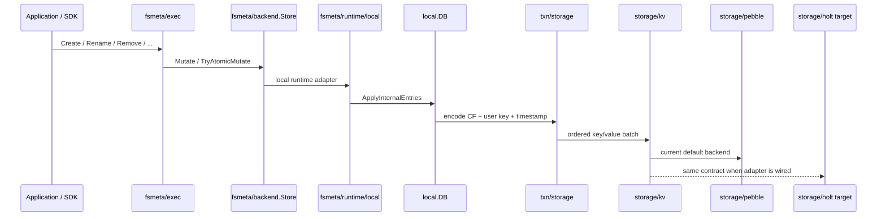
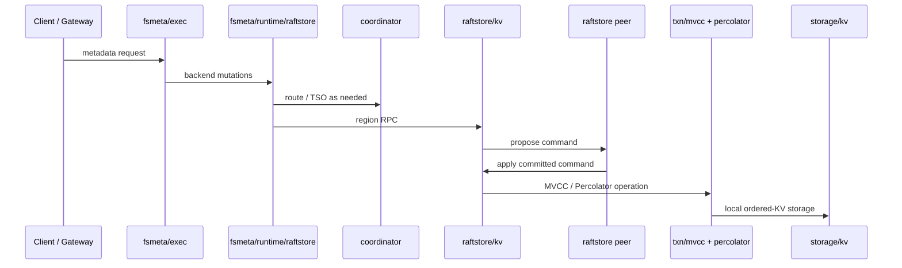

<!--
Copyright 2024-2026 The NoKV Authors.
SPDX-License-Identifier: Apache-2.0
-->

# Runtime Call Chains

This page documents the current runtime paths after the storage backend
refactor. NoKV no longer has a product path centered on a self-managed Go LSM.
The physical ordered-KV backend is replaceable: Pebble is the default backend
in this repo, and Holt is the owned backend target at the same `storage/kv`
boundary.

## 1. Local fsmeta Write Path



The fsmeta executor sees only `fsmeta/backend.Store`. It does not know whether
the storage backend is Pebble, Holt, memory, or a future ordered engine.

## 2. Distributed fsmeta Write Path



The distributed path adds rooted routing, TSO, Raft replication, and MVCC
transaction coordination. It still stores the final bytes through the same
storage backend contract on each store.

## 3. Internal Key Shape

NoKV keeps MVCC and column-family semantics above the storage engine:

```text
<column-family><user-key><descending timestamp>
```

`txn/storage` owns this encoding. Pebble and Holt receive opaque ordered bytes.
They must preserve byte ordering and snapshot consistency, but they must not
interpret fsmeta, MVCC, raftstore, or protobuf semantics.

## 4. Storage Backend Requirements

`storage/kv.Store` is the physical boundary:

- `Get`, `Put`, `Delete`, `DeleteRange`;
- ordered forward/reverse iterators with bounds;
- atomic batch apply through `ApplyBatch`;
- point-in-time snapshots;
- `Sync`, `Close`, and backend-neutral stats.

Pebble implements this today. Holt is pinned under `third_party/holt`; the
future Go adapter should live under `storage/holt` and implement the same
interface, either as one ordered tree or as a multi-tree adapter hidden
behind the same Go contract.

## 5. Entry Ownership

NoKV still uses internal entries inside `local`, `txn`, `raftstore`, and
snapshot code. Ownership rules are independent from the physical backend:

| Source | Returned entry type | Rule |
| --- | --- | --- |
| `DB.Get` | Detached public copy | Caller must not call `DecrRef`. |
| `DB.GetInternalEntry` | Borrowed internal entry | Caller calls `DecrRef` once. |
| Internal iterators | Iterator-owned view | Valid until iterator advances or closes. |
| Temporary MVCC apply entries | Caller-owned internal entries | Release after submit/apply. |

## 6. What Was Removed

The old mainline storage-engine path owned WAL, memtable, flush, compaction,
manifest, range filters, and SST migration. Those concerns now belong to the
physical backend implementation. For Pebble they live inside Pebble. For Holt
they should live inside Holt. NoKV's mainline owns metadata semantics, MVCC
encoding, distributed execution, and the storage backend contract.
