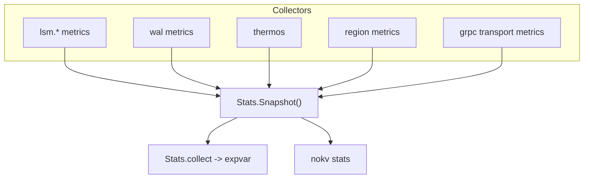

# Stats & Observability Pipeline

NoKV exposes runtime health through:

- `StatsSnapshot` (structured in-process snapshot)
- `expvar` (`/debug/vars`)
- `nokv stats` CLI (plain text or JSON)

The implementation lives in [`stats.go`](https://github.com/feichai0017/NoKV/blob/main/stats.go), and collection runs continuously once DB is open.

---

## 1. Architecture



Two-layer design:

- `metrics` layer: only collects counters/gauges/snapshots.
- `stats` layer: aggregates cross-module data and exports.

---

## 2. Snapshot Schema

`StatsSnapshot` is now domain-grouped (not flat):

- `entries`
- `flush.*`
- `compaction.*`
- `wal.*`
- `raft.*`
- `write.*`
- `region.*`
- `hot.*`
- `cache.*`
- `lsm.*`
- `transport.*`

Representative fields:

- `flush.pending`, `flush.queue_length`, `flush.last_wait_ms`
- `compaction.backlog`, `compaction.max_score`, `compaction.value_weight`
- `wal.active_segment`, `wal.segment_count`, `wal.typed_record_ratio`
- `raft.group_count`, `raft.lagging_groups`, `raft.max_lag_segments`
- `write.queue_depth`, `write.avg_request_wait_ms`, `write.hot_key_limited`
- `region.total`, `region.running`, `region.removing`, `region.tombstone`
- `hot.write_keys`, `hot.write_ring`
- `cache.block_l0_hit_rate`, `cache.bloom_hit_rate`, `cache.iterator_reused`
- `lsm.levels`, `lsm.value_bytes_total`, `lsm.mmap.*`, `lsm.prefetch.*`

---

## 3. expvar Export

`Stats.collect` exports a single structured object:

- `NoKV.Local.Stats`

All domains (`flush`, `compaction`, `wal`, `raft`, `write`, `region`, `hot`, `cache`, `lsm`, `transport`) are nested under this object.

Legacy scalar compatibility keys are removed. Consumers should read fields from `NoKV.Local.Stats` directly.

`nokv-fsmeta --metrics-addr` also exposes fsmeta-specific expvar groups:

- `nokv_fsmeta_executor`
- `nokv_fsmeta_watch`
- `nokv_fsmeta_quota`
- `nokv_fsmeta_mount`
- `nokv_fsmeta_peras`
- `nokv_fsmeta_sessions`

---

## 4. CLI & JSON

- `nokv stats --workdir <dir>`: offline snapshot from local DB
- `nokv stats --expvar <host:port>`: snapshot from running process `/debug/vars`
- `nokv stats --json`: machine-readable nested JSON

Example:

```json
{
  "entries": 1048576,
  "flush": {
    "pending": 2,
    "queue_length": 2
  },
  "wal": {
    "active_segment": 3,
    "segment_count": 4
  },
  "hot": {
    "write_keys": [
      {"key": "user:123", "count": 42}
    ]
  }
}
```

---

## 5. Operational Guidance

- `flush.queue_length` + `compaction.backlog` both rising:
  flush/compaction under-provisioned.
- `wal.segment_count` rising while `raft.max_lag_segments` stays high:
  at least one raft group is retaining old WAL segments; inspect raft lag and snapshot progress.
- `write.throttle_active=true` frequently:
  L0 pressure likely high; inspect `cache.block_l0_hit_rate` and compaction.
- `write.hot_key_limited` increasing:
  hot key write throttling is active.
- `raft.lag_warning=true`:
  at least one group exceeds lag threshold.

---

## 6. Comparison

| Engine | Built-in observability |
| --- | --- |
| RocksDB | Rich metrics/perf context, often needs additional tooling/parsing |
| Badger | Optional metrics integrations |
| NoKV | Native expvar + structured snapshot + CLI with offline/online modes |
