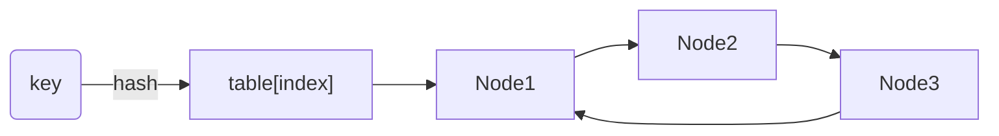

# HotRing – Hot Key Tracking

`hotring` is NoKV's built-in hot-key tracker. It samples read/write access frequency per key and exposes the hottest entries to the stats subsystem and CLI. The implementation resides in [`hotring/`](../hotring).

---

## 1. Motivation

* **Cache hints** – `DB.prefetchLoop` (see [`db.go`](../db.go)) consumes hot keys to schedule asynchronous reads into the block cache.
* **Operational insight** – `StatsSnapshot.HotKeys` and `nokv stats --json` surface the hottest keys, aiding debugging of traffic hotspots.
* **Throttling** – `HotRing.TouchAndClamp` enables simple rate caps: once a key crosses a threshold, callers can back off or log alerts.

Compared with RocksDB (which exposes block access stats via `perf_context`) and Badger (which lacks built-in hot-key reporting), NoKV offers a lightweight but concurrent-friendly tracker out of the box.

---

## 2. Data Structure

```text
HotRing
  tables[] -> per-bucket circular linked list (Node)
  hashFn   -> hash(key) -> uint32
  hashMask -> selects bucket (power of two size)
```

* Each bucket stores a circular linked list of [`Node`](../hotring/node.go) sorted by `(tag, key)`, where `tag` is derived from the upper bits of the hash. This keeps insertion/search O(bucket_length).
* `defaultTableBits = 12` → 4096 buckets by default (`NewHotRing`). The mask ensures cheap modulo operations.
* Nodes keep a `count` (int32) updated atomically and a `next` pointer stored via `unsafe.Pointer` to avoid extra allocations.



---

## 3. Core Operations

| Method | Behaviour | Notes |
| --- | --- | --- |
| [`Touch`](../hotring/hotring.go) | Insert or increment key's counter. | Creates node on miss, resets counter to 0 then increments. |
| [`Frequency`](../hotring/hotring.go) | Read-only counter lookup. | No side effects; uses `RLock`. |
| [`TouchAndClamp`](../hotring/hotring.go) | Increment unless `count >= limit`, returning `(count, limited)`. | Useful for throttling heavy keys. |
| [`TopN`](../hotring/hotring.go) | Snapshot hottest keys sorted by count desc. | Clones slice to avoid exposing internal pointers. |
| [`KeysAbove`](../hotring/hotring.go) | Return all keys with counters ≥ threshold. | Supports targeted throttling.

The internal helpers [`searchLocked`](../hotring/hotring.go#L214-L259) and [`insertLocked`](../hotring/hotring.go#L261-L306) enforce bucket ordering and deduplicate keys.

Concurrency is handled via a global `RWMutex`; buckets are small enough that the coarse lock keeps overhead modest. The per-node counters use `atomic.AddInt32` so concurrent touches within the same bucket remain safe.

---

## 4. Integration Points

* **DB reads** – `Txn.Get` and iterators call `db.recordRead`, which in turn invokes `HotRing.Touch` for every successful lookup. Writes can also touch the ring if configured (see `Options.TrackWrites` in `db.go`).
* **Stats** – [`StatsSnapshot`](../stats.go#L41-L87) copies `hot.TopN` into `HotKeys`. `expvar` publishes the same view under `NoKV.Stats.HotKeys` for automation.
* **Caching** – `lsm/cache` can promote blocks referenced by frequently touched keys, keeping the hot tier warm.

---

## 5. Comparisons

| Engine | Approach |
| --- | --- |
| RocksDB | External – `TRACE` / `perf_context` requires manual sampling. |
| Badger | None built-in. |
| NoKV | In-process ring with expvar/CLI export and throttling helpers. |

The HotRing emphasises simplicity: no approximate counting sketches, just per-bucket rings adequate for hundreds of thousands of keys while keeping allocations minimal.

---

## 6. Operational Tips

* `Options.HotRingTopK` controls how many keys show up in stats; default 16. Increase it when investigating workloads with broad hot sets.
* Combine `TouchAndClamp` with request middleware to detect abusive tenants: when `limited` is true, log the key and latency impact.
* Resetting the ring is as simple as instantiating a new `HotRing`—useful for benchmarks that require clean counters between phases.

For end-to-end examples see [`docs/stats.md`](stats.md#hot-key-export) and the CLI walkthrough in [`docs/cli.md`](cli.md#hot-key-output).

---

## 7. Write-Path Throttling

`Options.WriteHotKeyLimit` wires HotRing into the write path. When set to a positive integer, every call to `DB.Set*` or transactional `Txn.Set*` invokes `HotRing.TouchAndClamp` with the limit. Once a key (optionally scoped by column family via `cfHotKey`) reaches the limit, the write is rejected with `ErrHotKeyWriteThrottle`. This keeps pathological tenants or hot shards from overwhelming a single Raft group without adding heavyweight rate-limiters to the client stack.

Operational hints:

* `StatsSnapshot.HotWriteLimited` and the CLI line `Write.HotKeyThrottled` expose how many writes were rejected since the process started.
* Applications should surface `ErrHotKeyWriteThrottle` to callers (e.g. HTTP 429) so clients can back off.
* Prefetching continues to run independently—only writes are rejected; reads still register hotness so the cache layer knows what to prefetch.
* Set the limit conservatively (e.g. a few dozen) and pair it with richer `HotRing` analytics (top-K stats, expvar export) to identify outliers before tuning.
