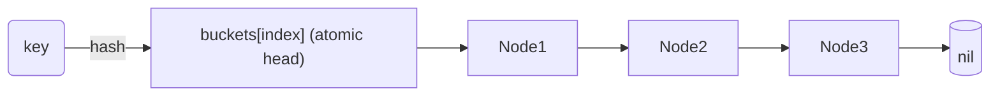

# HotRing – Hot Key Tracking

`hotring` is NoKV's hot-key tracker. It samples read/write access frequency per key and exposes the hottest entries to the stats subsystem and CLI. The implementation lives in the standalone module [`github.com/feichai0017/hotring`](https://github.com/feichai0017/hotring).

---

## 1. Motivation

* **Cache hints** – `DB.prefetchLoop` (see [`db.go`](../db.go)) consumes hot keys to schedule asynchronous reads into the block cache.
* **Operational insight** – `StatsSnapshot.HotKeys` and `nokv stats --json` surface the hottest keys, aiding debugging of traffic hotspots.
* **Throttling** – `HotRing.TouchAndClamp` enables simple rate caps: once a key crosses a threshold, callers can back off or log alerts.

Compared with RocksDB (which exposes block access stats via `perf_context`) and Badger (which lacks built-in hot-key reporting), NoKV offers a lightweight but concurrent-friendly tracker out of the box.

---

## 2. Data Structure

```text
HotRing
  buckets[] -> per-bucket lock-free linked list (Node)
  hashFn   -> hash(key) -> uint32
  hashMask -> selects bucket (power of two size)
```

* Each bucket stores a sorted linked list of [`Node`](https://github.com/feichai0017/hotring/blob/main/node.go) ordered by `(tag, key)`, where `tag` is derived from the upper bits of the hash. Head pointers are `atomic.Pointer[Node]`, so readers walk the list without taking locks; writers use CAS to splice nodes while preserving order.
* `defaultTableBits = 12` → 4096 buckets by default (`NewHotRing`). The mask ensures cheap modulo operations.
* Nodes keep a `count` (int32) updated atomically and a `next` pointer stored via `unsafe.Pointer`. Sliding-window state is guarded by a tiny per-node spin lock instead of a process-wide mutex.



---

## 3. Core Operations

| Method | Behaviour | Notes |
| --- | --- | --- |
| [`Touch`](https://github.com/feichai0017/hotring/blob/main/hotring.go) | Insert or increment key's counter. | CAS-splices a new node if missing, then increments (window-aware when enabled). |
| [`Frequency`](https://github.com/feichai0017/hotring/blob/main/hotring.go) | Read-only counter lookup. | Lock-free lookup; uses sliding-window totals when configured. |
| [`TouchAndClamp`](https://github.com/feichai0017/hotring/blob/main/hotring.go) | Increment unless `count >= limit`, returning `(count, limited)`. | Throttling follows sliding-window totals so hot bursts clamp quickly. |
| [`TopN`](https://github.com/feichai0017/hotring/blob/main/hotring.go) | Snapshot hottest keys sorted by count desc. | Walks buckets without locks, then sorts a copy. |
| [`KeysAbove`](https://github.com/feichai0017/hotring/blob/main/hotring.go) | Return all keys with counters ≥ threshold. | Handy for targeted throttling or debugging hot shards.

Bucket ordering is preserved by `findOrInsert`, which CASes either the bucket head or the predecessor’s `next` pointer to splice new nodes. Reads never take locks; only per-node sliding-window updates spin briefly to avoid data races.

---

## 4. Integration Points

* **DB reads** – `Txn.Get` and iterators call `db.recordRead`, which invokes `HotRing.Touch` on a **read-only ring** for every successful lookup.
* **Write throttling & hot batching** – writes are tracked by a **write-only ring**. When `Options.WriteHotKeyLimit > 0`, writes use `TouchAndClamp` to enforce throttling; when throttling is disabled but `HotWriteBurstThreshold > 0`, writes still `Touch` so hot batching can trigger.
* **Stats** – [`StatsSnapshot`](../stats.go#L41-L87) publishes read hot keys (`HotKeys`) and write hot keys (`HotWriteKeys`). `expvar` exposes both under `NoKV.Stats.HotKeys` and `NoKV.Stats.HotWriteKeys`.
* **Caching** – `lsm/cache` can promote blocks referenced by frequently touched keys, keeping the hot tier warm.
* **Value log routing** – a dedicated HotRing instance powers **vlog hot/cold bucket routing**. It tracks *write* hotness only (no read signal) to avoid polluting bucket selection. Hot keys are routed to hot buckets (`ValueLogHotBucketCount`) once `ValueLogHotKeyThreshold` is reached; cold keys go to the cold range.

---

## 5. Comparisons

| Engine | Approach |
| --- | --- |
| RocksDB | External – `TRACE` / `perf_context` requires manual sampling. |
| Badger | None built-in. |
| NoKV | In-process ring with expvar/CLI export and throttling helpers. |

The HotRing emphasises simplicity: lock-free bucket lists with atomic counters (plus optional per-node window tracking), avoiding sketches while staying light enough for hundreds of thousands of hot keys.

---

## 6. Operational Tips

* `Options.HotRingTopK` controls how many keys show up in stats; default 16. Increase it when investigating workloads with broad hot sets.
* Combine `TouchAndClamp` with request middleware to detect abusive tenants: when `limited` is true, log the key and latency impact.
* Resetting the ring is as simple as instantiating a new `HotRing`—useful for benchmarks that require clean counters between phases.

For end-to-end examples see [`docs/stats.md`](stats.md#hot-key-export) and the CLI walkthrough in [`docs/cli.md`](cli.md#hot-key-output).

---

## 6.1 Default Configuration

Global HotRing defaults (`NewDefaultOptions`):

| Option | Default value | Notes |
| --- | --- | --- |
| `HotRingEnabled` | `true` | Master switch for DB hot tracking. |
| `HotRingBits` | `12` | 4096 buckets. |
| `HotRingTopK` | `16` | Top-K hot keys for stats/CLI. |
| `HotRingDecayInterval` | `0` | Decay disabled by default. |
| `HotRingDecayShift` | `0` | Decay disabled by default. |
| `HotRingWindowSlots` | `8` | Sliding window enabled. |
| `HotRingWindowSlotDuration` | `250ms` | ~2s window. |
| `HotRingRotationInterval` | `30m` | Dual-ring rotation enabled. |
| `HotRingNodeCap` | `250,000` | Strict cap per ring. |
| `HotRingNodeSampleBits` | `0` | Strict cap (no sampling). |

Value-log override defaults (`ValueLogHotRing*`):

| Option | Default value | Notes |
| --- | --- | --- |
| `ValueLogHotRingOverride` | `true` | Use dedicated VLog settings. |
| `ValueLogHotRingBits` | `12` | 4096 buckets. |
| `ValueLogHotRingRotationInterval` | `10m` | Faster rotation for write-hotness. |
| `ValueLogHotRingNodeCap` | `200,000` | Strict cap per ring. |
| `ValueLogHotRingNodeSampleBits` | `0` | Strict cap (no sampling). |
| `ValueLogHotRingDecayInterval` | `0` | Decay disabled (window handles recency). |
| `ValueLogHotRingDecayShift` | `0` | Decay disabled. |
| `ValueLogHotRingWindowSlots` | `6` | ~600ms window. |
| `ValueLogHotRingWindowSlotDuration` | `100ms` | Shorter write-hotness window. |

When `ValueLogHotRingOverride=false`, the value-log ring inherits the global HotRing
settings. When override is enabled, **zeros disable features** (except `bits=0`,
which falls back to the ring default).

---

## 7. Write-Path Throttling

`Options.WriteHotKeyLimit` wires the write-only HotRing into the write path. When set to a positive integer, every call to `DB.Set*` or transactional `Txn.Set*` invokes `HotRing.TouchAndClamp` with the limit. Once a key (optionally scoped by column family via `cfHotKey`) reaches the limit, the write is rejected with `utils.ErrHotKeyWriteThrottle`. If throttling is disabled but `HotWriteBurstThreshold > 0`, the write ring still tracks frequency to enable hot write batching. This keeps pathological tenants or hot shards from overwhelming a single Raft group without adding heavyweight rate-limiters to the client stack.

Operational hints:

* `StatsSnapshot.HotWriteLimited` and the CLI line `Write.HotKeyThrottled` expose how many writes were rejected since the process started.
* Applications should surface `utils.ErrHotKeyWriteThrottle` to callers (e.g. HTTP 429) so clients can back off.
* Prefetching continues to run independently—only writes are rejected; reads still register hotness so the cache layer knows what to prefetch.
* Set the limit conservatively (e.g. a few dozen) and pair it with richer `HotRing` analytics (top-K stats, expvar export) to identify outliers before tuning.

---

## 8. Time-Based Decay & Sliding Window

HotRing now exposes two complementary controls so “old” hotspots fade away automatically:

1. **Periodic decay (`Options.HotRingDecayInterval` + `HotRingDecayShift`)**  
   Every `interval` the global counters are right-shifted (`count >>= shift`). This keeps `TopN` and stats output focused on recent traffic even if writes stop abruptly.
2. **Sliding window (`Options.HotRingWindowSlots` + `HotRingWindowSlotDuration`)**  
   Per-key windows split time into `slots`, each lasting `slotDuration`. `Touch` only accumulates inside the current slot; once the window slides past, the stale contribution is dropped. `TouchAndClamp` and `Frequency` use the sliding-window total, so write throttling reflects short-term pressure instead of lifetime counts.

Disable either mechanism by setting the interval/durations to zero. Typical starting points:

| Option | Default value | Effect |
| --- | --- | --- |
| `HotRingDecayInterval` | `0` | Decay disabled by default. |
| `HotRingDecayShift` | `0` | Decay disabled by default. |
| `HotRingWindowSlots` | `8` | Keep ~8 buckets of recency data. |
| `HotRingWindowSlotDuration` | `250ms` | Roughly 2s window for throttling. |

With both enabled, the decay loop keeps background stats tidy while the sliding window powers precise, short-term throttling logic.

Note: in NoKV, configuration normalization treats the sliding window as higher
priority. If a window is enabled, decay is automatically disabled to avoid
redundant background work.

---

## 9. Bounding Growth (Node Cap & Rotation)

HotRing does not automatically evict keys. To keep memory predictable in high-cardinality
workloads, use a **node cap** (with optional sampling) and/or **ring rotation**.

### Node cap + sampling

* `Options.HotRingNodeCap` sets a per-ring upper bound on tracked keys.
* `Options.HotRingNodeSampleBits` controls stable sampling once the cap is hit:
  * `0` = strict cap (no new keys after the cap).
  * `N` = allow roughly `1/2^N` of new keys (soft cap).
  * When `HotRingNodeCap = 0`, sampling is disabled.

### Dual-ring rotation

* `Options.HotRingRotationInterval` enables dual-ring rotation:
  * **active** ring receives new touches
  * **warm** ring keeps the previous generation to avoid sudden drops
* Merge semantics:
  * `Frequency` / `TouchAndClamp` → `max(active, warm)`
  * `TopN` / `KeysAbove` → `sum(active, warm)`

**Memory note:** rotation keeps two rings, so the upper bound is roughly
`2 × HotRingNodeCap`. If you have a fixed budget, halve the per-ring cap.

Suggested starting points:

| Option | Effect |
| --- | --- |
| `HotRingNodeCap` | Hard cap per ring (0 disables). |
| `HotRingNodeSampleBits` | Soft cap sampling rate. |
| `HotRingRotationInterval` | Rotation period (0 disables). |

---

## 10. Value Log Overrides

NoKV maintains a **value-log HotRing** dedicated to hot/cold routing. By
default this override is enabled so the write-only ring can use faster rotation
and a shorter window. You can disable it to inherit the global HotRing config:

* `Options.ValueLogHotRingOverride = false` (inherit global settings)
* Or keep it enabled and tune `ValueLogHotRing*` fields explicitly.

When override is enabled, **the value-log ring uses the override values verbatim**;
zeros disable a feature (for example, rotation). If override is disabled, it
inherits the global `HotRing*` configuration.
