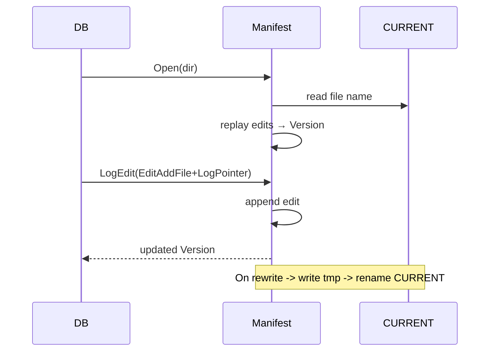

# Manifest & Version Management

The manifest keeps the source of truth for SST files, WAL checkpoints, and ValueLog heads. NoKV's implementation (`manifest/manager.go`, `manifest/codec.go`, `manifest/types.go`) borrows RocksDB's `VersionEdit + CURRENT` pattern while adding metadata required for value separation.

---

## 1. File Layout

```text
WorkDir/
  CURRENT             # stores the active MANIFEST file name
  MANIFEST-000001     # log of manifest edits
  MANIFEST-000002     # newer file after rewrite
```

- `CURRENT` is atomically swapped via `CURRENT.tmp` → `CURRENT` rename.
- Each `MANIFEST-*` contains a series of binary edits prefixed by the magic string `"NoKV"` (encoding lives in `manifest/codec.go`).
- During `manifest.Open`, `loadCurrent` opens the file referenced by CURRENT; if missing, `createNew` bootstraps an empty manifest.

---

## 2. Edit Types

```go
type EditType uint8
const (
    EditAddFile EditType = iota
    EditDeleteFile
    EditLogPointer
    EditValueLogHead
    EditDeleteValueLog
    EditUpdateValueLog
    EditRaftPointer
    EditRegion
)
```

Each edit serialises one logical action:
- `EditAddFile` / `EditDeleteFile` – manage SST metadata (`FileMeta`: level, fileID, size, key bounds, timestamps).
- `EditLogPointer` – persists the latest WAL segment + offset checkpoint, analogous to RocksDB's `log_number` and `prev_log_number` fields.
- `EditValueLogHead` – records the head pointer for vlog append, ensuring recovery resumes from the correct file/offset.
- `EditDeleteValueLog` – marks a vlog segment logically deleted (GC has reclaimed it).
- `EditUpdateValueLog` – updates metadata for an existing vlog file (used when GC rewrites a segment).
- `EditRaftPointer` – persists raft-group WAL progress (segment, offset, applied/truncated index & term, etc.).
- `EditRegion` – persists Region metadata (key range, epoch, peers, lifecycle state).

`manifest.Manager.apply` interprets each edit and updates the in-memory `Version` structure, which is consumed by LSM initialisation and value log recovery.

---

## 3. Version Structure

```go
type Version struct {
    Levels       map[int][]FileMeta
    LogSegment   uint32
    LogOffset    uint64
    ValueLogs    map[uint32]ValueLogMeta
    ValueLogHead ValueLogMeta
    RaftPointers map[uint64]RaftLogPointer
    Regions      map[uint64]RegionMeta
}
```

- `Levels` mirrors the LSM tree levels; during recovery `lsm.LSM` loads files per level.
- `LogSegment`/`LogOffset` ensure WAL replay starts exactly where persistent state ended.
- `ValueLogs` holds metadata for every known vlog file; `ValueLogHead` caches the active head for quick access.

Compared with RocksDB: RocksDB's manifest stores blob file metadata when `BlobDB` is enabled. NoKV integrates vlog metadata natively to avoid a separate blob manifest.

---

## 4. Lifecycle



- **Open/Rebuild** – `replay` reads all edits, applying them sequentially (`bufio.Reader` ensures streaming). If any edit fails to decode, recovery aborts so operators can inspect the manifest, similar to RocksDB's strictness.
- **LogEdit** – obtains the mutex, appends the encoded edit, flushes, and updates the in-memory `Version` before returning.
- **Rewrite** – when the manifest grows beyond `Options.ManifestRewriteThreshold`, the manager writes a new `MANIFEST-xxxxxx` containing a full snapshot of the current `Version`, fsyncs it, updates `CURRENT`, and removes the old file. This mirrors RocksDB's `max_manifest_file_size` behavior while keeping recovery simple.
- **Close** – flushes and closes the underlying file handle; the version stays available for introspection via `Manager.Version()` (used by CLI).

---

## 5. Interaction with Other Modules

| Module | Manifest usage |
| --- | --- |
| `lsm` | `installLevel0Table` logs `EditAddFile` + `EditLogPointer` to checkpoint WAL progress. Compaction deletes old files via `EditDeleteFile`. |
| `wal` | Manifest's log pointer tells WAL replay where to resume. |
| `vlog` | `valueLog.rewrite` writes `EditUpdateValueLog` / `EditDeleteValueLog` after GC, ensuring stale segments are not reopened. |
| `CLI` | `nokv manifest` reads `manifest.Manager.Version()` and prints levels, vlog head, and deletion status. |

Badger keeps a separate `value.log` directory without manifest-level bookkeeping; NoKV's integrated manifest avoids scanning the filesystem during recovery.

---

## 6. Recovery Scenarios

1. **Missing SST file** – if `MANIFEST` references `000123.sst` but the file is absent, `db_test.go::TestRecoveryCleansMissingSSTFromManifest` verifies that recovery removes the edit, mimicking RocksDB's lost table handling.
2. **ValueLog deletion** – `TestRecoveryRemovesStaleValueLogSegment` ensures `EditDeleteValueLog` entries trigger file removal during recovery.
3. **Manifest rewrite crash** – `TestRecoveryManifestRewriteCrash` simulates a crash after writing the new manifest but before updating `CURRENT`; recovery still points to the old manifest and resumes safely, exactly like RocksDB's two-phase rewrite.
4. **Stale WAL pointer** – WAL replay respects `LogSegment/Offset`; tests cover truncated WALs to confirm idempotency.

---

## 7. CLI Output

`nokv manifest --workdir <dir> --json` prints:
- `log_pointer.segment` / `log_pointer.offset` checkpoint.
- Per-level file counts, IDs, and byte totals (`levels[*]`).
- `value_log_heads` metadata (bucketed heads).
- `value_logs` list with `valid` status (mirroring RocksDB's blob file dump).

This structured output enables automated validation in CI and ad-hoc audits.

---

## 8. Extensibility

- **Column families** – add a column family identifier to `FileMeta` and extend edits accordingly, as RocksDB does.
- **Snapshots** – persistent snapshots can be derived from manifest versions (keep a copy of the current Version and WAL pointer).
- **Remote manifests** – similar to RocksDB's remote compaction, storing manifests in object storage is straightforward because edits are append-only.

For end-to-end recovery context, see [recovery.md](recovery.md) and the [architecture overview](architecture.md).
