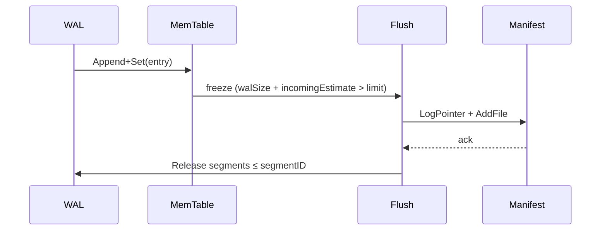

# Memtable Design & Lifecycle

NoKV's write path mirrors RocksDB: every write lands in the **WAL** and an in-memory **memtable** backed by a selectable in-memory index (skiplist or ART). The implementation lives in [`lsm/memtable.go`](../lsm/memtable.go) and ties directly into the flush manager (`lsm/flush`).

---

## 1. Structure

```go
type memTable struct {
    lsm        *LSM
    segmentID  uint32       // WAL segment backing this memtable
    index      memIndex
    maxVersion uint64
    walSize    int64
}
```

The memtable index is an interface that can be backed by either a skiplist or ART:

```go
type memIndex interface {
    Add(*kv.Entry)
    Search([]byte) kv.ValueStruct
    NewIterator(*utils.Options) utils.Iterator
    MemSize() int64
    IncrRef()
    DecrRef()
}
```

* **Memtable engine** – `Options.MemTableEngine` selects `skiplist` (default) or `art` via `newMemIndex`. Skiplist favors simpler writes; ART favors tighter memory and ordered scans.
* **Arena sizing** – both `utils.NewSkiplist` and `utils.NewART` use `arenaSizeFor` to derive arena capacity from `Options.MemTableSize`.
* **WAL coupling** – every `Set` uses `kv.EncodeEntry` to materialise the payload to the active WAL segment before inserting into the chosen index. `walSize` tracks how much of the segment is consumed so flush can release it later.
* **Segment ID** – `LSM.NewMemtable` atomically increments `levels.maxFID`, switches the WAL to a new segment (`wal.Manager.SwitchSegment`), and tags the memtable with that FID. This matches RocksDB's `logfile_number` field.
* **ART specifics** – ART stores prefix-compressed inner nodes (Node4/16/48/256), uses copy-on-write payload/node clones with CAS installs for writes, and keeps reads lock-free on immutable snapshots.

---

## 2. Lifecycle



1. **Active → Immutable** – when `mt.walSize + estimate` exceeds `Options.MemTableSize`, the memtable is rotated and pushed onto the flush queue. The new active memtable triggers another WAL segment switch.
2. **Flush** – the flush manager drains immutable memtables, builds SSTables, logs manifest edits, and releases the WAL segment ID recorded in `memTable.segmentID` once the SST is durably installed.
3. **Recovery** – `LSM.recovery` scans WAL files, reopens memtables per segment (most recent becomes active), and deletes segments ≤ the manifest's log pointer. Entries are replayed via `wal.Manager.ReplaySegment` into fresh indexes, rebuilding `maxVersion` for the oracle.

Badger follows the same pattern, while RocksDB often uses skiplist-backed arenas with reference counting—NoKV reuses Badger's arena allocator for simplicity.

---

## 3. Read Semantics

* `memTable.Get` looks up the chosen index and returns a borrowed, ref-counted `*kv.Entry` from the internal pool. Internal callers must release it with `DecrRef` when done. MVCC versions stay encoded in the key suffix (`KeyWithTs`), so iterators naturally merge across memtables and SSTables.
* `MemTable.IncrRef/DecrRef` delegate to the index, allowing iterators to hold references while the flush manager processes immutable tables—mirroring RocksDB's `MemTable::Ref/Unref` lifecycle.
* WAL-backed values that exceed the value threshold are stored as pointers; the memtable stores the encoded pointer, and the transaction/iterator logic reads from the vlog on demand.
* Public read APIs (`DB.Get`, `DB.GetCF`, `DB.GetVersionedEntry`, `Txn.Get`) return detached entries. Callers must not call `DecrRef` on those entries.

---

## 4. Integration with Other Subsystems

| Subsystem | Interaction |
| --- | --- |
| Transactions | `Txn.commitAndSend` writes entries into the active memtable after WAL append; pending writes bypass the memtable until commit so per-txn isolation is preserved. |
| Manifest | Flush completion logs `EditLogPointer(segmentID)` so restart can discard WAL files already persisted into SSTs. |
| Stats | `Stats.Snapshot` pulls `FlushPending/Active/Queue` counters via [`lsm.FlushMetrics`](../lsm/lsm.go#L120-L128), exposing how many immutables are waiting. |
| Value Log | `lsm.flush` emits discard stats keyed by `segmentID`, letting the value log GC know when entries become obsolete. |

---

## 5. Comparison

| Aspect | RocksDB | BadgerDB | NoKV |
| --- | --- | --- | --- |
| Data structure | Skiplist + arena | Skiplist + arena | Skiplist or ART + arena |
| WAL linkage | `logfile_number` per memtable | Segment ID stored in vlog entries | `segmentID` on `memTable`, logged via manifest |
| Recovery | Memtable replays from WAL, referencing `MANIFEST` | Replays WAL segments | Replays WAL segments, prunes ≤ manifest log pointer |
| Flush trigger | Size/entries/time | Size-based | WAL-size budget (`walSize`) with explicit queue metrics |

---

## 6. Operational Notes

* Tuning `Options.MemTableSize` affects WAL segment count and flush latency. Larger memtables reduce flush churn but increase crash recovery time.
* Monitor `NoKV.Stats.flush.*` fields to catch stalled immutables—an ever-growing queue often indicates slow SST builds or manifest contention.
* Because memtables carry WAL segment IDs, deleting WAL files manually can lead to recovery failures; always rely on the engine's manifest-driven cleanup.

See [`docs/flush.md`](flush.md) for the end-to-end flush scheduler and `[docs/architecture.md](architecture.md#3-end-to-end-write-flow)` for where memtables sit in the write pipeline.
