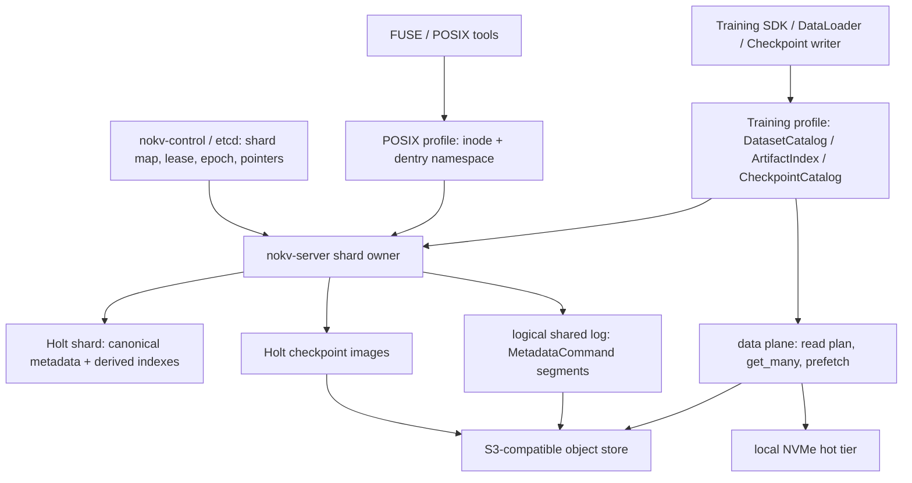

<!--
Copyright 2024-2026 The NoKV Authors.
SPDX-License-Identifier: Apache-2.0
-->

# AI-Native Metadata HA And Fast Path

NoKV's distributed target is an AI-training filesystem first. POSIX remains a
compatibility surface, but the hot path is shaped around checkpoint publish,
dataset shard reads, artifact lookup, and stable training snapshots.

This design keeps two views over the same namespace:

```text
canonical namespace
  inode + dentry + generation + body manifest

AI fast path
  full-path catalog -> inode + generation + read plan / checkpoint version
```

The canonical namespace stays authoritative. Full-path catalogs are derived
accelerators maintained by metadata commands and rebuilt from inode/dentry state
when needed.

## Goals

- Keep metadata writes local to a single Holt shard owner on the hot path.
- Use a small control plane for shard ownership, not for every metadata
  operation.
- Make checkpoint and artifact publish atomic by generation, not by POSIX rename
  convention.
- Make dataset reads use shard catalogs, batch opens, range plans, and NVMe hot
  hits instead of per-sample POSIX lookup.
- Keep local NVMe placement out of metadata truth.
- Provide production metadata HA through owner leases, epoch fencing, checkpoints,
  and a logical shared log.

## Non-Goals

- Full POSIX coverage as the product center.
- Cross-shard rename or distributed multi-directory transactions in v1.
- Consensus-replicated metadata logs for every operation.
- Recording local NVMe cache slots, node paths, or placement state in metadata.
- Uploading Holt's internal WAL format as the cluster recovery protocol.

## Layering



## Package Boundaries

- `nokv-types` owns storage-neutral ids, namespace records, and small DTO shapes
  that do not depend on Holt, object providers, or FUSE.
- `nokv-protocol` owns wire DTOs for metadata RPC.
- `nokv-meta` owns schema, `MetadataCommand`, derived AI catalog records, Holt
  binding, replay, and metadata recovery logic.
- `nokv-object` owns object PUT/GET/range, local hot tier, and batch data reads.
- `nokv-client` owns Training profile APIs and client-side route/read-plan
  caches.
- `nokv-server` owns process startup, shard-owner lifecycle, background workers,
  and framed RPC service.
- `nokv-control` owns shard map, owner leases, shard epochs, routing metadata,
  checkpoint/log pointers, and failover coordination.

## Metadata Model

Canonical records remain:

```text
inode_current:
  mount_id | inode_id -> inode attributes

dentry_current:
  mount_id | parent_inode | name -> dentry + inode projection

chunk_manifest_current:
  mount_id | inode_id | generation | u64::MAX -> body summary
  mount_id | inode_id | generation | chunk_index -> block manifest
```

AI fast-path records are derived from canonical records:

```text
artifact_index:
  normalized_full_path -> inode, generation, body_digest, size, manifest_ref

dataset_catalog:
  dataset_path, snapshot_version -> shard list, shard read-plan hints, shuffle seed

checkpoint_catalog:
  run_id, step -> latest pointer, rank shards, tensor/range index, snapshot pin
```

The existing `PathIndex` family is the storage home for the first version of
these derived indexes. New record families are added only when the durable shape
requires different retention or scan semantics.

## Training Profile API

Training callers should use storage operations that match the workload instead
of forcing POSIX calls onto the hot path:

```text
batch_open(paths) -> Vec<ReadPlan>
open_dataset_snapshot(path) -> DatasetView
list_dataset_shards(view, prefix) -> Vec<ShardRef>
publish_checkpoint(run, step, rank_shards) -> CheckpointVersion
resolve_checkpoint(run, step, target_parallelism) -> Vec<RangeReadPlan>
```

The guarantees are:

- immutable generation reads;
- atomic publish of complete checkpoint/artifact versions;
- stable snapshot views for training epochs;
- batch/range read plans suitable for local NVMe and object fallback;
- no cross-shard rename in the training hot path.

## Write Path

Default safe publish:

```text
1. client/data agent uploads immutable object blocks
2. shard owner validates lease epoch
3. shard owner builds one MetadataCommand
4. command updates inode/dentry/chunk manifest and derived AI catalogs
5. production mode appends the command to the shared log
6. Holt applies the command locally
7. client receives ACK
```

Object bytes are durable before metadata visibility. A crash before metadata
publish leaves orphan objects for GC, never a namespace pointer to missing data.

## Read Path

Training reads avoid repeated path traversal:

```text
1. client resolves full-path catalog or dataset catalog
2. metad returns inode, generation, and immutable block read plan
3. data path issues batched get_many/range reads
4. local NVMe hot tier is checked first
5. object storage is the durable fallback
6. hot misses can refill NVMe in the background
```

The metadata manifest records durable object keys and digests. It must not record
local NVMe paths, cache slots, or node placement.

## Control Plane

The control plane stores small cluster state:

```rust
ShardRecord {
    shard_id,
    owner,
    epoch,
    lease_id,
    state,
    checkpoint_ref,
    log_ref,
    durable_lsn,
}
```

It does not store inode/dentry records, chunk manifests, object reference GC
state, or local cache placement.

### etcd Ownership Backend

The production control-plane shape uses two etcd key classes:

```text
durable shard record
  /nokv/control/shards/{hex(shard_id)}

ephemeral owner session
  /nokv/control/sessions/{hex(shard_id)}/{epoch}/{lease_id}
```

The durable shard record is not attached to an etcd lease. It must survive owner
loss because it carries the latest owner epoch, checkpoint pointer, shared-log
pointer, and durable LSN. The owner session key is attached to an etcd lease and
expires when the shard owner stops renewing.

Ownership changes use etcd transactions:

- fresh acquire compares the shard record revision and creates a new session key;
- failover compares the previous shard epoch and requires the previous session
  key to be absent before bumping the epoch;
- renew validates the durable record and session key, then sends lease
  keepalive;
- mark-serving and release compare the shard record revision and session lease.

`nokv-control` now has an optional `etcd` feature with `EtcdControlStore`.
`nokv-server` and the `nokv` CLI can open this backend through
`ServerControlOptions` and `--control-backend etcd`. The local multi-process
gate is `scripts/run-metadata-ha-smoke.sh`: it starts RustFS and etcd, kills the
first owner, then starts a failover owner at epoch 2. Multi-machine chaos testing
is still a production gate, not a default local test.

## Metadata HA

Production HA uses single-owner Holt shards plus external recovery state:

```text
checkpoint image
  full Holt shard image at checkpoint_lsn

logical shared log
  ordered MetadataCommand records after checkpoint_lsn

control plane
  owner, epoch, lease, durable_lsn, checkpoint/log pointers
```

The shared log records logical `MetadataCommand` entries, not Holt's private WAL
format:

```rust
MetadataLogEntry {
    shard_id,
    epoch,
    lsn,
    request_id,
    command,
    result,
    prev_digest: [u8; 32],
    digest: [u8; 32],
}
```

Segments are the object-storage unit for that logical log:

```rust
MetadataLogSegment {
    shard_id,
    first_epoch,
    last_epoch,
    first_lsn,
    last_lsn,
    prev_digest,
    last_digest,
    entries,
    digest,
}
```

The segment codec validates command payloads, entry digests, in-segment LSN
continuity, and checkpoint-after replay continuity. `nokv-meta` can archive an
encoded segment to object storage and read it back with decode validation.
Recovery can install the latest checkpoint image and replay verified logical log
segments through the metadata service commit boundary, preserving the owner
epoch fence. `nokv-server` can publish a `nokv-control::LogRef` for the current
shard owner after a segment is archived. Controlled servers can enable a sync
shared-log mode that archives a logical segment and publishes the latest
`LogRef` before returning a successful metadata RPC ACK. Independent metadata
batches archive successful commands as one ordered segment, reducing object PUT
amplification for training-style batch create/open flows. The current sync mode
archives after Holt local apply; moving append ahead of Holt apply requires a
future Holt prepare/apply split.

### Durability Modes

| Mode | ACK condition | RPO | Use |
| --- | --- | ---: | --- |
| `local-only` | Holt local commit | Node loss can lose metadata | Single-node development |
| `async-archive` | Holt commit; log archived in background | Seconds or milliseconds | Early HA and performance testing |
| `sync-shared-log` | Holt apply, log segment archive, and pointer publish before RPC ACK | 0 for acknowledged metadata | Production |

### Failover

```text
1. owner lease expires
2. control plane bumps shard epoch
3. standby acquires the shard
4. standby restores the latest checkpoint image
5. standby replays log segments through durable_lsn
6. standby starts serving with the new epoch
7. old owner cannot append or commit with the stale epoch
```

The current server smokes cover two paths. The in-process controlled owner
publishes a checkpoint ref, commits another metadata write into the shared log,
a failover owner restores the checkpoint, replays the post-checkpoint segment,
marks the shard serving with the bumped epoch, and accepts a new write. The
env-gated etcd unit smoke verifies the production configuration path by letting
an etcd owner session expire and then acquiring the shard at the next epoch
through `Server::open`. The local multi-process script exercises the deployable
CLI path against RustFS plus etcd with a real owner process death, then re-reads
replayed data after the post-failover write so allocator high-water regressions
cannot pass unnoticed. It also emits `HA_SMOKE_METRICS` JSON with
`failover_observed_ms`, `lease_wait_ms`, `owner_b_startup_ms`, replayed inode,
post-failover inode, and checkpoint commit version, so HA validation can move
from pass/fail smoke into measured RTO rows. With
`NOKV_HA_STALE_OWNER_CHAOS=1`, the same script pauses owner A with `SIGSTOP`,
lets owner B acquire epoch 2 on a second bind, resumes owner A, and verifies the
resumed epoch-1 owner observes the new control-plane epoch and rejects a stale
write. That covers local process-stall fencing; real multi-machine partition
tests remain separate hardening work.

## POSIX Compatibility

POSIX profile stays useful for tools, FUSE, debugging, and compatibility gates.
Training profile does not promise full POSIX behavior.

| Semantics | Training profile |
| --- | --- |
| hardlink | optional compatibility surface |
| precise atime | disabled or approximate |
| cross-shard rename | `EXDEV` |
| multi-directory atomic transaction | out of hot path |
| checkpoint visibility | native version publish |
| stable epoch/dataset view | snapshot pin |
| batch/range read | first-class API |

## Implementation Phases

1. Document the architecture and progress tracker.
2. Rename the existing path index semantics in docs as the first AI catalog
   foundation.
3. Add Training profile protocol/client APIs for batch open, dataset snapshot,
   checkpoint version publish, and checkpoint resolution.
4. Add `nokv-control` with in-memory store, server shard-owner guard, automatic
   lease renewal, an optional etcd-backed store/session backend, and server/CLI
   config wiring.
5. Add shard epoch fencing at the metadata commit boundary. The service-local
   fence is implemented for single and independent-batch commits; server owner
   lifecycle now installs and renews `nokv-control` lease epochs into that
   fence.
6. Add logical shared-log segment encoding, checkpoint-after replay validation,
   object-store segment archive, grouped independent-batch segment archive,
   `LogRef` publication, and restore-time command apply.
7. Add failover smoke tests over checkpoint restore, log replay, new epoch, and
   start-serving. The in-process controlled server smoke and env-gated real
   etcd session-expiry smoke are implemented. `scripts/run-metadata-ha-smoke.sh`
   adds the local multi-process RustFS+etcd gate; multi-machine failover timing
   and chaos gates are still pending.
8. Move sync shared-log append before Holt apply once the metadata engine exposes
   a prepare/apply split; add async segment flush policy and durability-mode
   benchmark rows.
9. Add benchmark rows for fast-path reads, durability modes, failover, and
   cold/warm NVMe behavior. The `metadata-durability-batch` workload now emits
   comparable `local-only` and `sync-shared-log` phases for batch metadata
   creates; RustFS/JuiceFS result rows and failover timing still need to be
   recorded.
