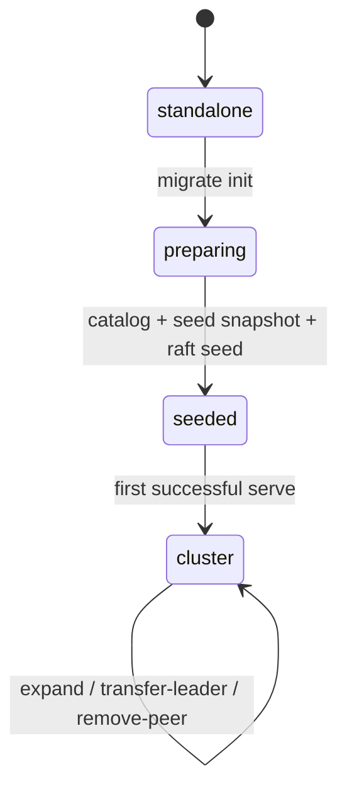

# From Standalone to Cluster

<p class="chapter-lead">
NoKV does not treat standalone and distributed mode as two separate products glued together later. The migration path promotes an existing standalone workdir into a distributed seed, then expands that seed into a replicated multi-Raft region without swapping out the storage core.
</p>

<div class="mini-toc">
  <p class="mini-toc-title">On This Page</p>
  <ul class="mini-toc-list">
    <li><a href="#why-this-feature-matters">Why This Feature Matters</a></li>
    <li><a href="#the-minimal-operator-flow">The Minimal Operator Flow</a></li>
    <li><a href="#what-actually-happens">What Actually Happens</a></li>
    <li><a href="#failure-semantics">Failure Semantics</a></li>
    <li><a href="#what-comes-next">What Comes Next</a></li>
  </ul>
</div>

> Read this page if the most interesting question in NoKV is not “how fast is it” but “how an existing standalone engine becomes a distributed system without switching data planes”.

## Why This Feature Matters

Most systems make you choose early:

- start with an embedded engine, then migrate to a different distributed database later
- start distributed from day one, even when the workload is still small
- accept dump/import style migration as an operational tax

NoKV is aiming at a different story:

1. Start with a serious standalone engine.
2. Keep the same workdir and the same storage substrate as data grows.
3. Promote that workdir into a distributed seed explicitly.
4. Expand the seed into a replicated cluster through normal raftstore mechanisms.

That is the core value of this feature. The goal is not “add one more migration command”. The goal is to make standalone and distributed shapes feel like one system with one data plane.

## What Is Shipping Now

The current migration design is intentionally conservative:

- offline only
- one-shot bootstrap
- no dual-write cutover
- no background auto-repair
- no automatic split or rebalance during promotion
- one full-range seed region for the initial upgrade

That scope is deliberate. The first version is trying to make the protocol explicit, recoverable, and testable before chasing more automation.

## The Core Contract

The migration path must preserve these invariants:

1. Standalone writes stop before migration starts.
2. The migrated workdir must not silently reopen as a normal standalone directory.
3. Bootstrap is the only allowed non-apply path that creates the initial region truth for the promoted directory.
4. Engine manifest stays storage-engine metadata only.
5. Store-local region truth stays in `raftstore/meta`.
6. PD does not create local truth during bootstrap.

Those invariants are what make the feature defensible. Without them, “standalone to cluster” collapses into ad hoc tooling.

## The Minimal Operator Flow


### Happy-path CLI

```bash
# 1. Inspect a standalone workdir
go run ./cmd/nokv migrate plan --workdir ./data/store-1

# 2. Promote it into a single-store seed
go run ./cmd/nokv migrate init \
  --workdir ./data/store-1 \
  --store 1 \
  --region 1 \
  --peer 101

# 3. Start the promoted workdir in distributed mode
go run ./cmd/nokv serve \
  --workdir ./data/store-1 \
  --store-id 1 \
  --pd-addr 127.0.0.1:2379

# 4. Expand the seed into more replicas
go run ./cmd/nokv migrate expand \
  --addr 127.0.0.1:20170 \
  --region 1 \
  --target 2:201@127.0.0.1:20171 \
  --target 3:301@127.0.0.1:20172
```

### Local operator wrapper

For local demos and operator workflows, the happy path is wrapped by:

- `scripts/ops/migrate-cluster.sh`

That wrapper intentionally delegates state transitions to the formal migration CLI instead of inventing a second control path.
It now prints stage banners, shows the local migration status after promotion, and writes final migration reports under:

- `artifacts/migration/summary.txt`
- `artifacts/migration/summary.json`

For local inspection and automation, the CLI also exposes:

- `nokv migrate status --workdir ...`
- `nokv migrate report --workdir ...`
- `nokv migrate status --workdir ... --addr <leader-admin> --region <region>`
- `nokv migrate report --workdir ... --addr <leader-admin> --region <region>`

When `--addr` is set, the report includes a cluster-aware runtime view:

- current leader peer
- current leader store
- whether the local store is hosted
- current membership size
- membership peer list
- applied index / term on that store

## Lifecycle States



### Workdir modes

The promoted workdir exposes an explicit mode contract:

- `standalone`
- `preparing`
- `seeded`
- `cluster`

Minimal persisted state looks like this:

```json
{
  "mode": "seeded",
  "store_id": 1,
  "region_id": 1,
  "peer_id": 101
}
```

### Semantics

- `standalone`
  - regular standalone engine directory
- `preparing`
  - migration is in progress; ordinary standalone open must refuse service
- `seeded`
  - the standalone workdir has been promoted into a valid single-store cluster seed
- `cluster`
  - the workdir is now operating through the distributed runtime

That mode gate is one of the most important engineering choices in the feature. It prevents a half-migrated directory from being silently treated as a normal local database.

### Local promotion checkpoint

During `migrate init`, NoKV now persists a lightweight local checkpoint alongside the mode file.
That checkpoint records which milestone of the standalone-to-seed promotion has already completed, for example:

- `mode-preparing-written`
- `local-catalog-persisted`
- `seed-snapshot-exported`
- `raft-seed-initialized`
- `seeded-finalized`

`nokv migrate status` and `nokv migrate report` surface this checkpoint together with a `resume_hint`, so interrupted promotion is no longer just “stuck in preparing” without context.

When `nokv migrate expand`, `nokv migrate transfer-leader`, or `nokv migrate remove-peer` is invoked with `--workdir`, the same checkpoint file is also updated with operator progress:

- which target store/peer is currently being rolled out
- how many targets have already completed hosting
- which leader transfer or peer removal step just completed
- what migration command should be retried next after an interruption

### Post-step validation

Migration commands now also validate the state they just created instead of trusting only the immediate RPC return:

- `migrate init` verifies the local catalog, seed snapshot manifest, and local raft pointer all agree on the promoted seed region
- `migrate expand` verifies leader membership and target hosted state agree on the new peer
- `migrate transfer-leader` verifies the elected leader and target runtime converge on the requested peer
- `migrate remove-peer` verifies leader metadata and target runtime both stop advertising the removed peer

## What Actually Happens

The migration path is easier to reason about if you separate the steps by ownership.

### 1. `plan`: preflight only

`nokv migrate plan` is read-only. It checks:

- the standalone workdir is readable
- recovery state is coherent enough to promote
- the directory is not already seeded or clustered
- there is no conflicting local peer catalog
- the directory is not already poisoned by an incompatible state

No mutation happens here.

### 2. `init`: promote the workdir into a seed

`nokv migrate init` performs the actual promotion.

At a high level it does this:

1. write mode = `preparing`
2. persist a full-range local `RegionMeta` in `raftstore/meta`
3. export one full-range SST seed artifact from the standalone DB
4. synthesize the initial raft durable state for a single local voter
5. persist the local raft replay pointer
6. write mode = `seeded`

### 3. `serve`: reuse the normal distributed startup path

After `init`, the promoted directory is not started through a special bootstrap runtime. It is opened through normal distributed startup:

- open the same DB workdir
- load local recovery metadata from `raftstore/meta`
- open group-local raft durable state
- start one local peer
- serve distributed traffic through the regular raftstore path

That is what keeps the feature architecturally honest.

### 4. `expand`: reuse normal replication mechanisms

Once the seed is healthy, normal distributed mechanisms take over:

1. start empty target stores
2. call `nokv migrate expand` against the current leader
3. leader exports one SST snapshot payload
4. target installs the snapshot on an empty peer
5. leader publishes the new membership
6. wait until the target store reports the peer as hosted

The current implementation keeps rollout explicit and sequential:

- repeated `--target <store>:<peer>[@addr]`
- explicit `transfer-leader`
- explicit `remove-peer`
- no automatic split or rebalance in the promotion phase

## Snapshot Semantics

This feature matters because migration is not implemented as a file dump or a second storage engine.

### Current snapshot path

Today NoKV's migration path uses an SST region snapshot primitive:

- source side exports one region-scoped external SST artifact
- payloads are bundled into a transport-safe snapshot package
- target side imports the artifact through the external SST install path

This is a correctness-first choice.

### Why that choice is reasonable right now

It keeps the first migration contract simple enough to validate:

- region-scoped
- explicit manifest and checksum
- install-before-publish boundaries
- retry and restart semantics that are testable

### What this is not trying to be yet

The current path is not pretending to be:

- zero-copy table transfer
- SST ingest-based install
- online rebalance for already sharded data

Those are later upgrades, not prerequisites for the first credible promotion path.

## Why Full-Range Seed First

The first promotion step intentionally creates one full-range seed region:

- `StartKey = nil`
- `EndKey = nil`

That means the migration feature does **not** need to solve split and rebalance as part of the first upgrade.

This is a good tradeoff.

The first hard problem is not “how to repartition existing data automatically”. The first hard problem is “how to make one existing standalone directory become a valid distributed region with explicit lifecycle and recovery semantics”.

Once that is solid, later split and rebalance work can build on top of a stable seed region instead of being entangled with promotion itself.

## Failure Semantics

The migration flow must fail loudly and remain recoverable.

### During `plan`

- read-only errors are returned directly

### During `init`

If any step after `preparing` fails:

- keep mode as `preparing`
- reject ordinary standalone startup
- require explicit operator action:
  - rerun `init`, or
  - use a future rollback or repair path

This is intentionally strict. Half-migrated state must not quietly behave like a normal standalone database.

### During `expand`

Expansion should not be treated as “best effort copy”. It should remain observable and explicit:

- leader publication must become visible
- target install must become hosted
- interruption before publish must not leave a partially hosted peer
- restart after install must converge without ghost peers

That is why the current test matrix includes:

- snapshot interruption before publish
- restarted follower recovery
- removed-peer restart
- repeated transport flap during membership changes
- PD outage after startup

## Test and Validation Story

This feature only counts if it is validated as a lifecycle, not just as a command list.

The current validation story spans:

- `raftstore/migrate/*_test.go`
  - migration orchestration and timeout behavior
- `raftstore/admin/service_test.go`
  - admin execution surfaces for snapshot export/install
- `raftstore/store/peer_lifecycle_test.go`
  - install and publish semantics on the target side
- `raftstore/integration/migration_flow_test.go`
  - standalone → seed → cluster happy path
- `raftstore/integration/restart_recovery_test.go`
  - restart, dehost, and follow-up membership behavior
- `raftstore/integration/snapshot_interruption_test.go`
  - install interrupted before publish
- `raftstore/integration/pd_degraded_test.go`
  - control-plane degradation after startup

That is the right level of seriousness for the feature. Migration is one of the easiest places for a system to look good in a demo and fail under recovery.

## Current Scope and Non-goals

The first version is intentionally narrow.

### In scope now

- offline standalone → seed promotion
- one full-range seed region
- explicit `plan/init/status/expand/remove-peer/transfer-leader`
- SST region snapshot export/install
- recovery-aware mode gating

### Not in scope yet

- online cutover
- dual-write
- automatic split/rebalance during promotion
- automatic cluster-wide orchestration
- SST-based snapshot/install as the default path

Keeping the scope narrow is part of what makes the feature credible.

## What Comes Next

The next round of work should not reinvent the protocol. It should productize and sharpen it.

### Near-term productization

1. richer cluster-aware migration status once the seed has booted
2. structured machine-readable reports that can be consumed by demos and automation
3. stronger stage-by-stage operator output in `scripts/ops/migrate-cluster.sh`
4. clearer recovery guidance for `preparing`, interrupted install, and partial rollout

### Next engineering upgrade

The most important technical upgrade after that is:

- **SST-based snapshot/install for promotion and peer rollout**

But that should be treated as an upgrade to the existing migration contract, not a replacement for the contract itself.

### Long-term direction

Once standalone → full-range seed → replicated region is solid and easy to operate, later work can move on to:

- more automated orchestration
- region split after promotion
- richer rebalance flows
- larger-scale rollout behavior

## The Feature in One Sentence

NoKV starts with a standalone workdir, promotes that workdir into a distributed seed, and expands it into a replicated cluster without replacing the storage core underneath.
