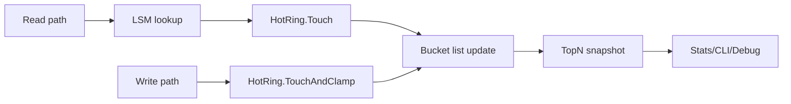

# 2026-01-16 hotring design

这条记录和之前的 mmap choice 一样，是一份偏叙述的 note，用来讲 HotRing 的设计动机、交互流程以及我对它的理解。它不是一个“理论最优”的结构，但它足够轻、足够快，也足够实用。

## 设计动机

在 LSM 系统里，热点通常不是均匀分布的，一小撮 key 会持续放大缓存抖动、读放大和写冲突。HotRing 的定位就是把这种热点快速“变成可见”，让我们能在监控、限流、调优时快速找到真正的热源，而不是只看到一堆模糊的全局指标。

## 交互逻辑

HotRing 并不改变读写路径，只是以旁路的方式记录访问频次。读请求成功命中后调用 Touch，写请求在启用了 WriteHotKeyLimit 时调用 TouchAndClamp。统计系统定期拉取 TopN，CLI 可以直接显示热点。



## 示例代码

```go
ring := hotring.NewHotRing(12, nil)
ring.EnableSlidingWindow(8, 250*time.Millisecond)
ring.EnableDecay(time.Second, 1)

ring.Touch("user:42")
count, limited := ring.TouchAndClamp("user:42", 128)
if limited {
    // 可以记录告警，或触发写入限流
    _ = count
}

hot := ring.TopN(16)
_ = hot
```

## 结构直觉与实现选择

HotRing 的内部是“固定桶 + 有序链表”。key 先哈希到桶，然后在桶内按 tag + key 排序。读路径无锁，写路径使用 CAS 插入节点，避免全局锁带来的抖动。它没有引入复杂的近似结构，而是尽量保持数据结构简单，让它能长期存在于读写路径上而不成为负担。

时间语义方面它提供了两种手段：滑动窗口让突发热点迅速出现，衰减机制让历史热点自然淡出，这两者叠加后，结果更符合“实际热度”的直觉。

## 个人心得

HotRing 最有意思的点不是“聪明”，而是“够用且稳定”。它把热点从不可见变成可见，又不会因为自己太复杂而制造新的热点。很多时候工程上真正需要的是“一个很快能工作的热键探测器”，而不是一个理论上更漂亮、但成本更高的结构。
